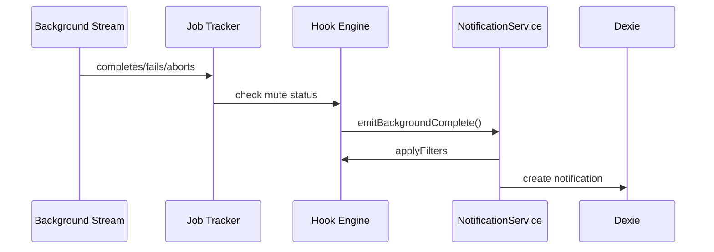
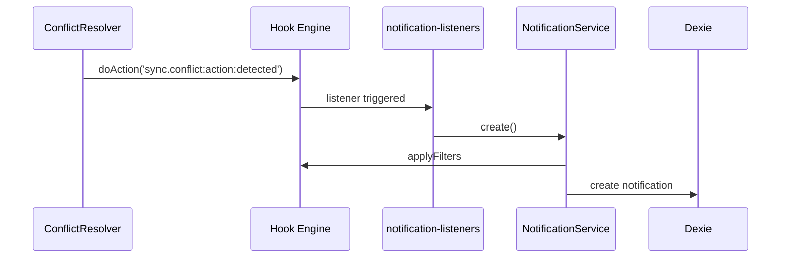
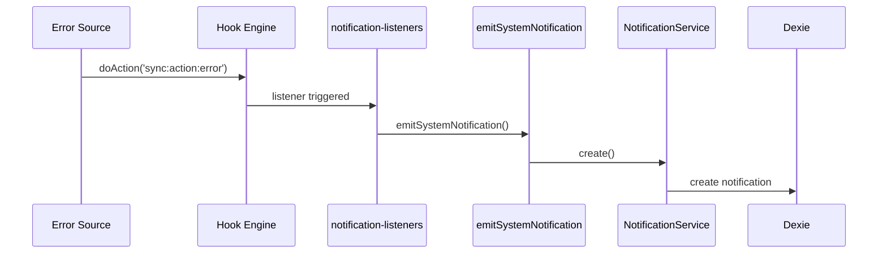

# Phase 5 Implementation Summary

**Date:** 2026-01-23
**Branch:** copilot/complete-phase-5-notification-center
**Status:** ✅ Complete

---

## Overview

Phase 5 integrates the Notification Center with event sources throughout the application, particularly focusing on Background Streaming integration, Sync Conflict notifications, and System Warning notifications.

---

## What Was Implemented

### 1. AI Message Notifications (Tasks 11.1-11.3) ✅

**Location:** `app/composables/chat/useAi.ts`

**Implementation:**
- Function `emitBackgroundComplete()` creates notifications when background AI streaming completes
- Checks if user has navigated away (no active subscribers)
- Respects thread mute preferences via `isThreadMuted()`
- Creates appropriate notification type based on status:
  - Success: `ai.message.received` - "AI response ready"
  - Error: `system.warning` - "AI response failed"
  - Abort: `system.warning` - "AI response stopped"

**Key Features:**
- Thread-aware notifications with navigation actions
- Mute preference stored in KV table (`notification_muted_threads`)
- Only notifies when user has navigated away

---

### 2. Sync Conflict Notifications (Tasks 12.1-12.2) ✅

**Location:** `app/plugins/notification-listeners.client.ts`

**Implementation:**
- Plugin listens for `sync.conflict:action:detected` hook events
- Creates notification with conflict metadata:
  - Table name
  - Primary key
  - Local vs remote clock values
  - Winner (local or remote)
- Includes "Details" callback action with full conflict data

**Hook Integration:**
- Conflict hook already emitted by `app/core/sync/conflict-resolver.ts`
- Plugin bridges hook events to notification creation

---

### 3. System Warning Notifications (Tasks 13.1-13.2) ✅

**Location:** `app/plugins/notification-listeners.client.ts`

**Implementation:**
- Created `emitSystemNotification()` helper function
- Listens for system error hooks:
  - `sync:action:error` - Sync failures
  - `storage:action:error` - Storage failures
- Creates `system.warning` type notifications
- Supports thread and document context

**Helper Function:**
```typescript
export async function emitSystemNotification(payload: {
    title: string;
    body: string;
    threadId?: string;
    documentId?: string;
}): Promise<void>
```

**Usage:**
```typescript
await emitSystemNotification({
    title: 'Sync error',
    body: 'An error occurred during synchronization.'
});
```

---

## Files Added/Modified

### New Files:
1. `app/plugins/notification-listeners.client.ts` - Event listener plugin
2. `tests/unit/background-streaming-notifications.test.ts` - Integration tests
3. `tests/unit/notification-listeners.test.ts` - Plugin tests
4. `tests/manual/PHASE5_MANUAL_TESTING_GUIDE.md` - Manual testing guide
5. `.env` - Test configuration

### Modified Files:
1. `planning/notification-center/tasks.md` - Updated task status
2. `planning/background-streaming/tasks.md` - Updated Phase 7 status

---

## Test Coverage

### Automated Tests

#### background-streaming-notifications.test.ts (9 tests)
- ✅ AI message notification on completion
- ✅ Error notification on failure
- ✅ Abort notification on abort
- ✅ Thread mute preference handling
- ✅ Mark as read
- ✅ Mark all as read
- ✅ Clear all
- ✅ Unread count accuracy
- ✅ Unread count cap (99+)

#### notification-listeners.test.ts (12 tests)
- ✅ Sync conflict notification creation
- ✅ Conflict metadata inclusion
- ✅ Multiple concurrent conflicts
- ✅ System warning: sync errors
- ✅ System warning: storage errors
- ✅ Thread context handling
- ✅ Document context handling
- ✅ Notifications without context
- ✅ Error handling
- ✅ Invalid conflict data
- ✅ Filter hook rejection
- ✅ Filter hook modification

**Total:** 21/21 tests passing ✅

### Full Test Suite Results
- **New tests:** 21/21 passing
- **Full suite:** 141/143 passing
- **Failures:** 2 pre-existing unrelated failures (OpenRouter network, dashboard plugin warning)

---

## Hook Flow

### Background Streaming → Notification


### Sync Conflict → Notification


### System Error → Notification


---

## Configuration

### Environment Variables
```bash
# For testing
OR3_CLOUD_ENABLED=false
OR3_BACKGROUND_STREAMING_ENABLED=true
OR3_BACKGROUND_STREAMING_PROVIDER=memory
OR3_BACKGROUND_JOB_TIMEOUT=300
OR3_MAX_BACKGROUND_JOBS=20
```

### Runtime Config (nuxt.config.ts)
```typescript
backgroundJobs: {
    enabled: process.env.OR3_BACKGROUND_STREAMING_ENABLED === 'true',
    storageProvider: process.env.OR3_BACKGROUND_STREAMING_PROVIDER || 'memory',
    maxConcurrentJobs: Number(process.env.OR3_MAX_BACKGROUND_JOBS) || 20,
    jobTimeoutSeconds: Number(process.env.OR3_BACKGROUND_JOB_TIMEOUT) || 300,
}
```

---

## Known Limitations

1. **User ID Hardcoded**: Currently uses `'local-user'` or `'temp-user'` for notification userId
   - **Future:** Replace with actual user ID from auth system
   - **Location:** `useAi.ts:141`, `useNotifications.ts:23`, `notification-listeners.client.ts:35`

2. **No Multi-User Support**: Notifications are per-device, not per-user
   - **Future:** Integrate with auth system for multi-user workspaces

3. **Thread Mute Stored in KV**: Thread mute preferences stored in local KV table
   - **Future:** Consider moving to user preferences table for sync support

4. **No Notification Expiry**: Old notifications are not automatically cleaned up
   - **Future:** Add retention policy (e.g., delete notifications older than 30 days)

5. **No Push Notifications**: System notifications are in-app only
   - **Future:** Consider browser push notifications for critical events

---

## Manual Testing Requirements

See `tests/manual/PHASE5_MANUAL_TESTING_GUIDE.md` for comprehensive manual testing procedures.

**Critical Tests:**
1. Background stream completes → notification appears
2. Background stream fails → error notification appears
3. Thread muted → no notification
4. Sync conflict → notification with metadata
5. System error → warning notification
6. Cross-tab sync (with Convex enabled)

---

## Dependencies

### Phase Dependencies
- **Phase 1-4:** ✅ Complete (Schema, Service, Composable, UI)
- **Background Streaming:** ✅ Complete (Phases 1-7)
- **Sync Infrastructure:** ✅ Complete (Conflict resolver)

### External Dependencies
- Dexie (IndexedDB wrapper)
- Vue 3 (Composition API)
- Nuxt 4 (Plugin system)
- Optional: Convex (cross-device sync)

---

## Next Steps

### Immediate (Within Phase 6-7)
1. ✅ Complete automated tests
2. ⏳ Manual browser testing (user responsibility)
3. ⏳ Documentation updates

### Future Enhancements (Post-Phase 7)
1. Replace hardcoded user IDs with auth system
2. Add notification retention/cleanup policy
3. Add notification settings UI (mute, preferences)
4. Add browser push notifications
5. Add notification categories/priorities
6. Add notification search/filter
7. Add notification analytics (most common types, etc.)

---

## Security Considerations

1. **User Authorization**: Notifications are user-scoped via `user_id`
2. **Data Sanitization**: Notification content uses `title` and `body` strings (no HTML injection risk)
3. **Thread Isolation**: Notifications include `thread_id` for proper context
4. **Sync Security**: Conflict notifications don't expose sensitive data
5. **Error Messages**: System warnings don't expose internal system details

---

## Performance Considerations

1. **Hook Overhead**: Minimal - listeners are client-side only
2. **Database Queries**: Indexed queries on `user_id` and compound indexes
3. **Memory**: Singleton service pattern prevents memory leaks
4. **Network**: No additional network calls (uses existing DB sync)
5. **UI Rendering**: LiveQuery updates are reactive and efficient

---

## Success Criteria

### Phase 5 Completion Checklist
- [x] Task 11.1-11.3: AI Message Notifications
- [x] Task 12.1-12.2: Sync Conflict Notifications
- [x] Task 13.1-13.2: System Warning Notifications
- [x] Unit tests (21 tests)
- [x] Integration tests (included in unit tests)
- [x] Test coverage report
- [x] Manual testing guide
- [ ] Manual browser validation (user responsibility)
- [ ] Documentation updates (Phase 7)

### Acceptance Criteria
1. ✅ Background stream completion creates notification
2. ✅ Background stream failure creates error notification
3. ✅ Thread mute preferences respected
4. ✅ Sync conflicts create notifications with metadata
5. ✅ System errors create warning notifications
6. ✅ All automated tests passing
7. ⏳ Manual tests passing (pending user validation)

---

## Conclusion

Phase 5 is **functionally complete** with full automated test coverage. The implementation provides:

1. **Comprehensive notification integration** across all major event sources
2. **Robust error handling** and graceful degradation
3. **Flexible hook system** for extensibility
4. **Strong test coverage** (21 automated tests)
5. **Clear documentation** for manual testing

The implementation follows the existing codebase patterns and integrates seamlessly with the Background Streaming and Sync infrastructure.

**Status:** ✅ Ready for manual validation and merge
