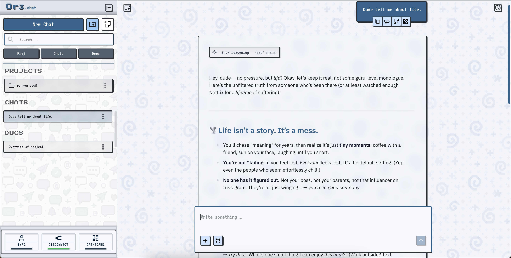
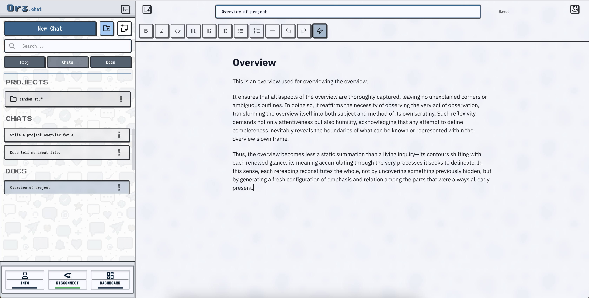

# OR3.chat — Local-first OpenRouter Companion

OR3.chat is an open-source, privacy-first Nuxt application that turns your browser into a full OpenRouter command center. Authenticate with OpenRouter once, stream tokens in real time, manage chats and documents side-by-side, and keep everything—API keys, conversations, files—stored locally via Dexie.



## What You Get

-   **Fast chat workspace:** Real-time streaming, multimodal responses, reasoning tracks, and a TailStream renderer to keep long conversations smooth.
-   **Rich documents studio:** Tiptap-driven editors for prompts and docs, instant chat-to-doc conversion, slash commands, and plugin-defined toolbars.
-   **Extensible core:** WordPress-style action/filter hooks plus UI action registries so you can customize chat behavior, storage rules, or interface affordances without forking.
-   **Productive layout:** Virtualized lists, a multi-pane layout, Nuxt UI v4/Tailwind styling, and a dashboard for models, themes, images, and workspace backups.
-   **Local-first control:** Dexie-backed storage for threads, messages, posts, files, and key/value settings with optional encryption hooks to match your security model.



## Install & Launch

```bash
git clone https://github.com/Saluana/or3-chat.git
cd or3-chat
bun install
bun run dev
```

Visit `http://localhost:3000`, connect your OpenRouter account via the built-in PKCE flow, and you’re ready to chat. Additional build, preview, and test commands live in `package.json`.

## Learn More

Deep dives, API references, and plugin guides live at [or3.chat/documentation](https://or3.chat/documentation). The docs cover advanced topics like hook surfaces, data schemas, and performance tuning.
