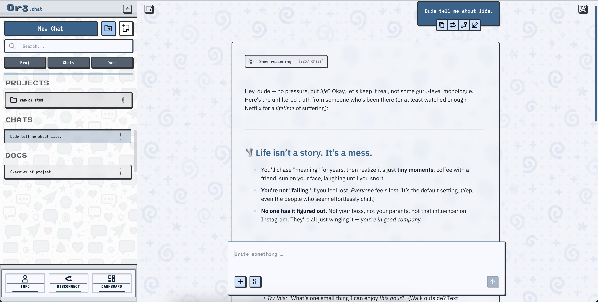
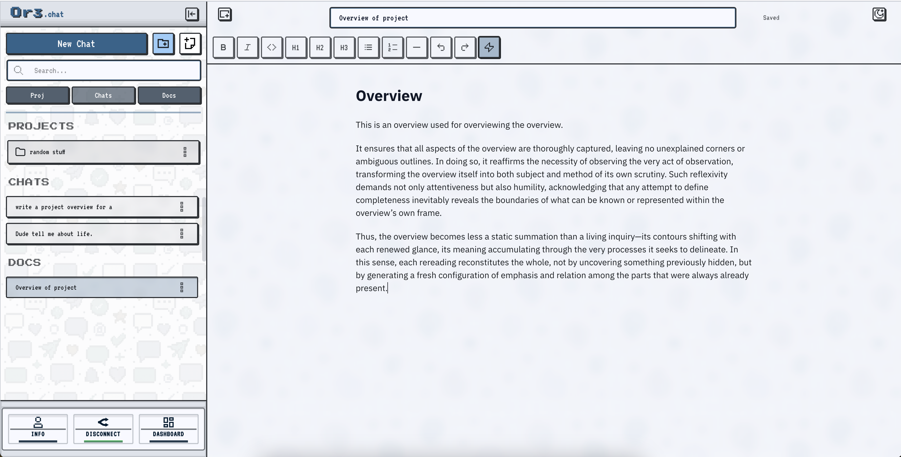

<p align="center">
  
</p>

<h1 align="center">OR3.chat</h1>

<p align="center">
  <strong>Open-source, local-first AI chat that you actually own.</strong><br/>
  Use any model on OpenRouter. Keep your data on your machine. Deploy to the cloud when you're ready.
</p>

<p align="center">
  <a href="https://or3.chat">Website</a> · <a href="https://or3.chat/documentation">Docs</a> · <a href="https://github.com/Saluana/or3-chat/issues">Issues</a> · <a href="#-quick-start">Quick Start</a>
</p>

---

## Table of Contents

- [What is OR3?](#-what-is-or3)
- [Core Features](#-core-features)
- [Quick Start](#-quick-start)
- [Static vs Cloud — Which Do I Pick?](#%EF%B8%8F-static-vs-cloud--which-do-i-pick)
- [Static Mode (Default)](#-static-mode-default)
- [Cloud Mode](#%EF%B8%8F-cloud-mode)
- [Plugins](#-plugins)
- [Themes](#-themes)
- [Configuration Reference](#%EF%B8%8F-configuration-reference)
- [Documentation](#-documentation)
- [Contributing](#-contributing)
- [License](#-license)

---

## 🤔 What is OR3?

OR3.chat is a free, open-source AI chat app built with [Nuxt](https://nuxt.com). It connects to [OpenRouter](https://openrouter.ai) so you can talk to hundreds of AI models — GPT-4o, Claude, Gemini, Llama, Mistral, and more — all from one place.

**The big idea:** you bring your own API key, and your data stays on your device by default. No middleman. No subscriptions. No tracking. Just you and the models you choose.

OR3 runs in two modes:

1. **Static** — a pure browser app. Zero servers, zero sign-ups. Everything lives in your browser's IndexedDB.
2. **Cloud** — add authentication, cross-device sync, file storage, and team workspaces by running OR3 on a server.

You start with static. When you need more, the managed `@or3/cloud` operator
sets up the supported cloud profile for you.



---

## ✨ Core Features

### Chat

- **Real-time streaming** with token-by-token display
- **Multi-model access** via OpenRouter (hundreds of models)
- **Reasoning tracks** — see the model's chain-of-thought when supported
- **File attachments** — send images and documents alongside your messages
- **Branching & retry** — fork conversations or regenerate any response
- **Background streaming** — optional cloud capability that keeps AI generating if you navigate away

### Documents

- **Rich text editor** powered by TipTap with slash commands
- **System prompts** — write, save, and reuse custom instructions
- **Chat-to-doc** — turn any conversation into an editable document
- **@mentions** — reference documents or past chats inline

### Workspace

- **Multi-pane layout** — open chats and docs side-by-side (up to 4 panes)
- **Projects** — organize threads and documents into groups
- **Dashboard** — manage models, themes, backups, images, and settings
- **Full-text search** — find anything across threads, docs, and projects instantly

### Privacy & Control

- **Local-first storage** — Dexie (IndexedDB) keeps everything on your machine
- **No telemetry** — OR3 does not phone home
- **Your API key** — connect via OpenRouter OAuth (PKCE) or paste a key. It never leaves your browser in static mode
- **Open source** — GPL-3.0 licensed. Read every line, fork it, make it yours



---

## 🚀 Quick Start

The supported installation path is the small `@or3/cloud` operator package. It
uses the version-matched OR3 container and keeps the application data in a
managed Docker volume.

For a private local instance:

```bash
npx @or3/cloud init --local
```

For a public VPS behind Caddy:

```bash
npx @or3/cloud init --public --domain chat.example.com
```

Node.js 20 or newer and Docker Compose v2 are required. The supported cloud
profile is Basic Auth, SQLite, and filesystem storage, so no external database,
authentication, or storage account is needed. See
[Installation and operations](docs/installation.md) for prerequisites,
firewall/DNS guidance, updates, backups, and recovery.

The repository-local wizard remains available for contributors who are building
an editable source checkout or custom provider combination; it is not required
for normal deployments.

### Backups and recovery

Managed Cloud deployments keep authentication, SQLite, and uploaded files in a
named `/data` volume. Use `npx @or3/cloud backup` before upgrades; the operator
CLI verifies the archive and retains an immediate rollback point.

For port conflicts, missing Docker, invalid domains, provider checks, and other
diagnostics, run:

```bash
npx @or3/cloud doctor
```

See [Installation and operations](docs/installation.md) for the supported local
and public VPS deployment. Maintainers can follow [Releasing OR3 Cloud](docs/releasing.md)
for the image-first release workflow. Editable source and custom provider
development still use the repository-local wizard.

---

## ⚖️ Static vs Cloud — Which Do I Pick?

OR3 ships as a **static app** by default. You can optionally turn on **cloud mode** for multi-user and multi-device features. Here's how they compare:

| Feature | Static | Cloud |
|---|:---:|:---:|
| Chat with any OpenRouter model | ✅ | ✅ |
| Documents & system prompts | ✅ | ✅ |
| Multi-pane workspace | ✅ | ✅ |
| Plugins & themes | ✅ | ✅ |
| Full-text search | ✅ | ✅ |
| Works offline | ✅ | ✅ |
| No server required | ✅ | — |
| User accounts & login | — | ✅ |
| Cross-device sync | — | ✅ |
| Cloud file storage | — | ✅ |
| Team workspaces | — | ✅ |
| Server-side API key (users don't need their own) | — | Optional |
| Background streaming | — | Optional |
| Admin panel | — | ✅ |
| Rate limiting & usage controls | — | ✅ |

**Start static.** If you later need accounts, sync, or shared workspaces, run
`npx @or3/cloud init` to add the supported cloud deployment; your existing
browser data stays intact.

The generated first-login credentials also protect the `/admin` dashboard.
Move them to a password manager and remove the mode-`0600` credentials file.

---

## 📦 Static Mode (Default)

Static mode is the simplest way to use OR3. It generates a plain HTML/JS/CSS bundle you can host anywhere — GitHub Pages, Netlify, Vercel, Cloudflare Pages, or just open the files locally.

### Build for Production

```bash
npm run generate:static
```

This outputs a fully static site to `.output/public/`. Upload that folder to any static host.

### Preview the Static Build Locally

```bash
npm run preview:static
```

Opens a local server at **http://localhost:4173**.

### How Static Mode Works

- All data is stored in your browser using **IndexedDB** (via Dexie)
- Your OpenRouter API key is stored locally — never sent to a server
- There is no backend, no database, and no authentication
- You connect to OpenRouter using **OAuth PKCE** (secure browser-only flow) or by pasting an API key
- Conversations, documents, prompts, files, and settings all live in your browser

> **Perfect for:** personal use, trying out models, privacy-focused users, or hosting on free static platforms.

---

## ☁️ Cloud Mode

Cloud mode adds accounts, sync, file storage, and administration through the
supported Basic Auth + SQLite + filesystem profile. Start it with the operator
package:

```bash
npx @or3/cloud init --local
```

Use `--public --domain chat.example.com` on a VPS to add Caddy and automatic
HTTPS. The operator also provides `update`, `backup`, `restore`, `rollback`,
`doctor`, `recover`, and the narrow `adopt` command for an existing generated
deployment.
See [Installation and operations](docs/installation.md) for the complete
workflow.

If you need an editable checkout or providers other than the supported cloud
profile, use the repository-local source wizard documented in
[`public/_documentation/cloud/or3-cloud-wizard.md`](public/_documentation/cloud/or3-cloud-wizard.md).

---

## 🔌 Plugins

OR3 has a WordPress-style plugin system. You can add features without forking the project or touching core code.

### What Plugins Can Do

| Plugin Type | What It Adds | Example |
|---|---|---|
| **Dashboard tile** | Custom page in the dashboard | Settings panel, mini-app, tool |
| **Message action** | Button on chat messages | Copy, save-as-doc, translate |
| **Sidebar section** | Widget in the sidebar | Quick links, stats, status |
| **Sidebar page** | Full page in the sidebar | Custom history view, search |
| **Header action** | Button in the header bar | Toggle layout, quick action |
| **Composer action** | Button below the chat input | Insert template, attach file |
| **AI tool** | Function the AI model can call | Web search, calculator, API lookup |
| **Pane app** | Custom content in a workspace pane | Game, preview, canvas |
| **Editor extension** | TipTap node, mark, or toolbar button | Syntax highlighting, emoji picker |

### Creating a Plugin

Plugins are Nuxt client plugins. Create a file in `app/plugins/` with a `.client.ts` extension:

```typescript
// app/plugins/my-plugin.client.ts
export default defineNuxtPlugin(() => {
    registerDashboardPlugin({
        id: 'my-plugin:hello',
        icon: 'pixelarticons:star',
        label: 'Hello World',
        description: 'My first OR3 plugin',
        order: 250,
        handler() {
            useToast().add({ title: 'Hello from my plugin!' });
        },
    });
});
```

That's it — restart the dev server and your tile appears on the dashboard.

### Hooks System

Under the hood, plugins use an **action/filter hook system** (similar to WordPress). Hooks let you:

- **Actions** — run side effects when something happens (message sent, thread created, file uploaded)
- **Filters** — transform data as it flows through the system (modify AI request before sending, change how messages render)

```typescript
// Listen for new messages
hooks.addAction('db:messages:after_create', ({ entity }) => {
    console.log('New message:', entity.content);
});

// Transform AI request before sending
hooks.addFilter('ai:request:filter:body', (body) => {
    body.temperature = 0.7;
    return body;
});
```

For full examples and API details, see the [Plugin Quick Start Guide](public/_documentation/start/plugin-quickstart.md).

---

## 🎨 Themes

OR3 has a full theme engine that goes beyond colors. Themes can change fonts, borders, component styles, backgrounds, and even icons.

### Built-in Themes

OR3 ships with several themes including a clean modern look and a retro pixel-art style. Switch themes from the dashboard at any time.

### Creating a Theme

Themes live in `app/theme/<name>/` and use `defineTheme()`:

```typescript
// app/theme/my-theme/theme.ts
import { defineTheme } from '../_shared/define-theme';

export default defineTheme({
    name: 'my-theme',
    displayName: 'My Theme',
    description: 'A custom look for OR3',
    colors: {
        primary: '#086DB8',
        surface: '#ffffff',
        onSurface: '#022344',
        dark: {
            primary: '#2C638B',
            surface: '#0a0a0a',
            onSurface: '#e2e2e6',
        },
    },
    fonts: {
        sans: '"Inter", system-ui, sans-serif',
        heading: '"Inter", system-ui, sans-serif',
    },
});
```

### Theme CLI Tools

```bash
# Create a new theme from a template
bun run theme:create

# Validate your theme has no errors
bun run theme:validate

# Switch the active theme
bun run theme:switch
```

### What Themes Can Customize

- **Colors** — primary, secondary, surface, and dark mode variants
- **Fonts** — sans, heading, mono, and base size
- **Borders** — radius and width tokens
- **Component overrides** — change default props for any Nuxt UI component based on context (e.g., "buttons inside the chat composer should be ghost style")
- **CSS selectors** — target specific DOM elements like the TipTap editor or code blocks
- **Backgrounds** — layered background effects (gradients, patterns, images)
- **Icons** — swap the icon set used throughout the app

For the full theme API, see the [Theme Documentation](public/_documentation/themes/quick-start.md).

---

## ⚙️ Configuration Reference

OR3 uses two config files at the project root:

### `config.or3.ts` — Base Configuration

Controls branding, features, limits, and UI defaults. Works in both static and cloud mode.

| Category | Examples |
|---|---|
| **Branding** | Site name, logo, favicon, default theme |
| **Features** | Toggle workflows, documents, dashboard, backups, mentions |
| **Limits** | Max file size, max files per message, storage quota |
| **UI** | Default pane count, max panes, sidebar collapsed |
| **Legal** | Terms of service URL, privacy policy URL |

### `config.or3cloud.ts` — Cloud Configuration

Controls auth, sync, storage, rate limiting, admin, and background streaming. Only relevant when running in cloud mode.

| Category | Examples |
|---|---|
| **Auth** | Provider, guest access, registration mode |
| **Sync** | Provider, Convex URL |
| **Storage** | Provider, allowed MIME types, workspace quota |
| **LLM** | Instance OpenRouter key, allow user override |
| **Limits** | Requests per minute, max conversations, max messages/day |
| **Security** | Allowed origins, force HTTPS, proxy settings |
| **Admin** | Admin credentials, extension upload limits |
| **Background Streaming** | Enable/disable, max concurrent jobs, timeout |

All values are driven by environment variables. The managed Cloud CLI (or the
developer source wizard) writes these for you, or you can set them manually in
`.env`.

---

## 📖 Documentation

Full documentation lives inside the project at [`public/_documentation/`](public/_documentation/)

### What's Covered

| Section | Topics |
|---|---|
| **Getting Started** | What is OR3, plugin quickstart, dev setup, pane app tutorial |
| **Composables** | 30+ documented composables — chat, search, sidebar, editor, multi-pane, and more |
| **Hooks** | Hook catalog, engine internals, typed hooks, adding editor extensions |
| **Database** | Table schemas, CRUD helpers, file storage, KV store, transactions |
| **Auth** | Session context, token broker, admin stores, auth UI adapters |
| **Utils** | Tool registry, server tools, streaming, HLC clock, config resolution |
| **Types** | Chat types, hook payload types, cloud config types |
| **Themes** | Architecture, quick start, API reference, CSS selectors, best practices |
| **Cloud** | Cloud operator, source provider system, sync protocol, storage, background jobs |

The documentation map is defined in [`public/_documentation/docmap.json`](public/_documentation/docmap.json).

---

## 🤝 Contributing

1. Fork the repo
2. Create a branch (`git checkout -b my-feature`)
3. Make your changes
4. Run tests (`bun run test`)
5. Run type-check (`bun run type-check`)
6. Open a pull request

Please keep changes minimal, type-safe, and consistent with the existing code style.

---

## 📄 License

OR3.chat is licensed under [GPL-3.0](LICENSE).
