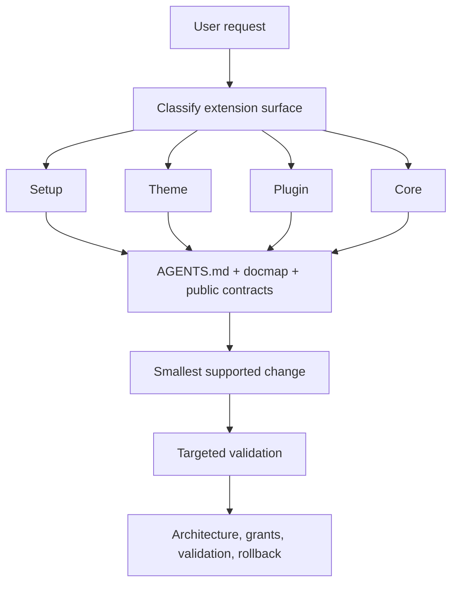

# OR3 Skills architecture

## Boundary

Skills select and orchestrate a supported extension surface. OR3 Chat's public
documentation, SDKs, CLIs, schemas, and tests remain the source of truth and
perform deterministic validation. A skill never substitutes prose for a
successful command.

## Decisions

- Classify by the user's outcome: setup, presentation, functionality, or a
  missing public contract.
- Escalate in this order: configuration, theme tokens/overrides, plugin,
  provider, new public extension point, core behavior.
- Prefer V1 for a feature that must run in the current product today; choose
  V2 for its public authoring/package contracts and state its activation limit.
- Treat `trusted-host` as reviewed host code, not a sandbox. Never silently
  replace isolated execution with trusted-host execution.
- Require an explicit completion report that includes rollback and only genuine
  remaining risks.

The detailed product exploration is retained in the repository-level
[`planning/skills_v1`](../../../planning/skills_v1/) documents.
