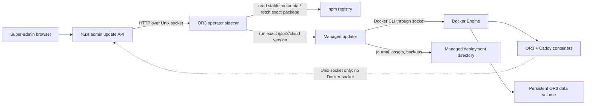

# Design

## Overview

Keep Docker, but remove it from the normal administrator workflow. Every supported managed deployment gets a small, non-public operator sidecar that owns the Docker socket and deployment-directory mount. The Nuxt server talks to that operator through a Unix socket using three typed operations: read status, check for a stable release, and start an exact-version update.

The operator does not implement deployment mutation itself. It downloads and executes the exact target `@or3/cloud` package, so the dashboard inherits the existing backup, asset replacement, digest verification, deep-health, automatic restoration, and recovery behavior. The stable release pointer remains npm's existing `latest` metadata, which becomes visible only after the matching GHCR image is promoted. Ordinary OR3 releases therefore remain one qualified application image plus one matching npm package.

All Unix-socket and process code remains under `server/**` or the Cloud package. Shared code contains schemas/types only, and the existing SSR/admin gates keep static generation independent of Docker and the operator.

## Architecture



### Components

1. **Operations Update Card** (`app/pages/admin/system.vue`, `app/composables/admin/useAdminUpdate.ts`) has one responsibility: present update availability, confirmation, active-job state, and terminal results. It serves R1 and R3.
2. **Admin Update API** (`server/api/admin/system/update*.ts`) has one responsibility: enforce super-admin and mutation policy, validate browser payloads, and map typed operator results to HTTP. It serves R1, R2, R3, and R6.
3. **Operator Client** (`server/admin/update/operator-client.ts`) has one responsibility: make bounded HTTP requests over the configured Unix socket. It serves R1-R3 and R6.
4. **Operator Program** (`packages/or3-cloud/src/dashboard-operator.ts`, bundled into the package's managed assets) has one responsibility: discover compatible releases, serialize jobs, invoke the exact target updater, and reconcile dashboard-owned interruptions. It serves R1-R7.
5. **Managed Updater and Operation Lease** (`packages/or3-cloud/src/cli.ts` plus a focused lease module) have one responsibility each: perform the existing safe lifecycle and serialize all mutating CLI processes. They serve R4-R6.
6. **Managed Compose Bridge** (`packages/or3-cloud/assets/compose.operator.yaml`) has one responsibility: extend supported managed deployments with the pinned operator runtime, same-path deployment-directory bind, Docker socket, and Unix-socket volume it needs. It serves R2 and R7.
7. **Release Metadata Gate** (`packages/or3-cloud/package.json` and release checks) has one responsibility: declare protocol compatibility and prove package/image identity before a release can be offered. It serves R1, R2, R4, and R7.

The application container never receives `/var/run/docker.sock` or the deployment directory. The operator has no published port, runs with a read-only root filesystem and dropped Linux capabilities, and exposes only a Unix socket mounted read-only into the application container. A conditional `compose.operator.yaml` overlay adds both the sidecar and the app's read-only IPC mount only after the CLI proves the active context is a bind-mountable Unix Docker socket; remote/TCP contexts continue with the base/public Compose files and report the bridge unsupported. The managed `.env` records `OR3_DEPLOYMENT_DIR` as an absolute, non-secret identity value, and the overlay bind-mounts that host directory at the identical absolute path inside the operator. The operator uses it as its working directory; this is required so nested `docker compose` calls resolve `./Caddyfile` and other host bind sources to real host paths rather than a container-only `/deployment` path. Init also records the deployment owner's numeric UID/GID plus the active Unix Docker-socket path/GID. Compose runs the operator as that owner and adds only the socket group, so its `0600` files remain usable by the host CLI instead of becoming root-owned. Possession of the Docker socket is still host-root-equivalent; isolating it in a small program with a closed request schema materially narrows that risk without pretending it disappears.

The operator runtime image contains only pinned Node/npm, Docker CLI, Compose, certificates, a pre-created mode-`1777` IPC mountpoint, and a tiny supervisor that runs the managed operator program from the deployment directory. It is pinned by immutable digest for protocol major 1 and is not rebuilt for normal OR3 releases. The writable IPC mountpoint lets the non-root deployment owner create the socket in an otherwise read-only image; only the OR3 and operator services mount that named volume. Protocol-1 compatibility freezes the operator service image, command, mounts, and socket contract so `docker compose up` cannot recreate the sidecar that is executing the update. The frequently changing operator program is a managed asset in `@or3/cloud`. A dashboard-triggered child is marked with an internal origin/job environment value; after the parent persists its result, the program exits with the supervisor's reload code and the same container loads the target release's (or restored source release's) asset. A host CLI update/restore instead restarts and probes the operator service after committing its terminal state. This distinction prevents an updater running inside the sidecar from restarting itself while ensuring manual CLI operations do not leave an old program loaded. Compose's `restart: unless-stopped` remains a second layer for whole-container failure. A future runtime-image, service-contract, or protocol-major replacement is an explicit bridge release, not hidden inside an ordinary application update.

`composeArgs` includes `compose.operator.yaml` only when managed state says the bridge is enabled. The same conditional list drives asset installation, backup checksums, restore/removal, diagnostics, and `doctor`, so a failed first bridge update cannot leave an untracked overlay behind.

## Components and Interfaces

### Shared browser/server contract

Define the discriminated unions once in `shared/cloud/dashboard-update.ts` and use runtime validation at the browser API and operator boundaries.

```ts
export type ReleaseCheck =
    | { state: 'unchecked' }
    | {
          state: 'checked';
          result: 'current' | 'available';
          checkedAt: string;
          latestVersion: string;
      }
    | {
          state: 'checked';
          result: 'incompatible';
          checkedAt: string;
          latestVersion: string;
          incompatibility: 'protocol' | 'source_version';
      }
    | {
          state: 'failed';
          checkedAt: string;
          message: string;
          lastSuccessful?: {
              checkedAt: string;
              latestVersion: string;
          };
      };

export type DashboardUpdateJob =
    | {
          state: 'active';
          phase: 'queued' | 'updating' | 'recovering';
          id: string;
          sourceVersion: string;
          targetVersion: string;
          startedAt: string;
      }
    | {
          state: 'succeeded' | 'failed_restored';
          id: string;
          sourceVersion: string;
          targetVersion: string;
          startedAt: string;
          finishedAt: string;
          backupId: string;
          message: string;
      }
    | {
          state: 'failed_safe';
          id: string;
          sourceVersion: string;
          targetVersion: string;
          startedAt: string;
          finishedAt: string;
          mutationStarted: false;
          message: string;
      }
    | {
          state: 'needs_attention';
          id: string;
          sourceVersion: string;
          targetVersion: string;
          startedAt: string;
          updatedAt: string;
          backupId?: string;
          message: string;
      };

export type DashboardUpdateStatus =
    | {
          kind: 'unsupported';
          reason: 'operator_unavailable' | 'unmanaged_deployment' | 'protocol_mismatch';
      }
    | {
          kind: 'managed';
          currentVersion: string;
          operatorProtocol: 1;
          release: ReleaseCheck;
          job?: DashboardUpdateJob;
      };

export type StartDashboardUpdateRequest = {
    requestId: string; // UUID generated once by the client action
    targetVersion: string;
};
```

An unsupported deployment is a normal response, not an exception. Active and terminal job shapes are separate so an active job cannot accidentally contain a completion time or claim restoration.

### Admin HTTP API

```text
GET  /api/admin/system/update
POST /api/admin/system/update/check
POST /api/admin/system/update/start
```

All three routes call `requireAdminApiContext(event, { superAdminOnly: true })`. The POST routes also pass `mutation: true`, which retains the existing `x-or3-admin-intent: admin` and same-origin checks. The start body is limited to a UUID and complete semantic version; it has no command, image, channel, URL, or option fields.

The API maps operator errors consistently:

| Operator result | HTTP response |
|---|---:|
| `unsupported` | 200 with `DashboardUpdateStatus.kind = 'unsupported'` |
| `busy` | 409 |
| `no_update`, `incompatible`, `stale_target` | 409 |
| invalid request | 400 |
| operator socket unavailable during a mutation | 503 |
| accepted | 202 with job identifier |

`OperatorClient` uses Node's HTTP client with `socketPath`, a 2-second status deadline, a 15-second check/start deadline, a 16 KiB response limit, and no redirect support. The longer mutation deadline contains the operator's 10-second registry deadline. It never falls back to TCP.

### Operator Unix-socket protocol

The operator implements HTTP/1.1 on `/run/or3-operator/operator.sock`:

```text
GET  /v1/status
POST /v1/check
POST /v1/updates
```

Requests and responses use the shared discriminated unions, a 16 KiB body limit, and exact-key validation. The socket directory is provided by a named Compose volume; the application mounts it read-only. There is no bearer token because the socket is not mounted into any other service and the operator still validates every request as an untrusted local request. Browser authorization remains at the Nuxt API boundary.

### Release discovery and validation

`packages/or3-cloud/package.json` adds package metadata bundled into every stable release:

```json
{
  "or3Cloud": {
    "dashboardUpdate": {
      "protocol": 1,
      "minimumSourceVersion": "<first-dashboard-update-version>"
    }
  }
}
```

Release preparation replaces the placeholder with the exact first bridge version after the normal unused-version checks; this plan does not reserve or assume the next npm/Git/GHCR version.

The operator fetches npm's single-version `@or3/cloud/latest` document with a 10-second deadline and 256 KiB response cap, then reads its version and compatibility metadata. It does not download the unbounded all-versions document and does not introduce another channel manifest. A check accepts only a stable exact semantic version greater than the current managed version and compatible with protocol 1.

Before spawning an update, the operator re-resolves npm `latest`, requires the confirmed target to still equal that version, and then resolves the exact package metadata. If `latest` changed, it returns `stale_target` so the page can show the new version and ask for a fresh confirmation. The target `@or3/cloud` command then pulls only `ghcr.io/saluana/or3-chat:<targetVersion>`. The updater additionally checks the image's OCI source and version labels before creating a pending operation. npm performs its normal integrity verification while installing the exact package; lifecycle scripts are disabled for the temporary install.

### Operator job runner

The start flow is intentionally linear:

1. Validate the request and return an existing job for a repeated `requestId`.
2. Re-read managed state, require no active job or incomplete operation, and revalidate the exact release metadata.
3. Atomically persist an `active/queued` job before returning acceptance.
4. Spawn, in the validated same-path `OR3_DEPLOYMENT_DIR`, the equivalent of:

   ```text
   npm exec --yes --ignore-scripts \
     --package=@or3/cloud@<target> -- \
     or3 update --to <target>
   ```

5. Mark the job `updating`, capture only bounded redacted diagnostics, and let the target CLI own all Docker/data mutation.
6. Reconcile the CLI exit with managed state. Target version + digest + no pending operation becomes `succeeded`. A failure before pending state or mutation becomes `failed_safe`. A deeply healthy source version after automatic restoration becomes `failed_restored`. Any remaining pending/ambiguous state becomes `recovering` or `needs_attention`.
7. Persist the terminal result before exiting with the supervisor reload code so the same container loads the newly installed (or restored) operator program asset.

The operator does not accept arbitrary npm packages or commands. Its child command and repository are constants; only a previously validated semantic version is interpolated as a single process argument through `spawn`, never a shell.

On startup, the operator reconciles only a dashboard job it previously persisted. A live operation-lease heartbeat means the updater child is still active, so the replacement operator waits and reports the existing job instead of spawning recovery. If the lease is stale and managed state contains that job's update operation, it runs `@or3/cloud@<recorded-target> recover`. If no pending operation exists, it derives success/restoration from the exact managed state and deep health. It never auto-recovers an unrelated manual CLI operation.

### Deployment-wide operation lease

Add `.or3-cloud/operation-lease/` as an atomic directory lease used by every mutating `@or3/cloud` command. Its owner record contains a random nonce, command, origin (`cli` or `dashboard`), host boot/process or container/process identity, acquisition time, heartbeat time, and related managed operation ID when known. The owner refreshes the heartbeat every five seconds while running. Thirty seconds without a heartbeat makes it only a stale candidate; reclamation also requires the origin-specific liveness check to prove that recorded owner is gone, so laptop sleep or a paused container cannot make a live operation stealable. It removes the directory only when its nonce still matches.

An observed lease is reclaimable only when its heartbeat and liveness checks establish a stale owner. If managed state has an incomplete operation, only `recover` may archive the stale owner and acquire the lease, and the journal determines the recovery target. If there is no incomplete operation, a new mutation may reclaim it only after deployment-directory and state/environment identity checks pass. An unavailable or ambiguous liveness check fails closed and is surfaced by `doctor`. This closes the current race between two processes that both pass `assertNoPending` before either writes pending state without adding a database or external lock service.

### UI behavior

The existing Operations page receives one update card. On load it reads status and performs one check when the operator has never checked; later visits reuse the persisted result until the super admin chooses “Check again.” There is no timer or background registry polling while idle. An available update opens the existing confirmation dialog with current version, target version, backup/brief-interruption language, and a release-notes link. There is no version selector.

After acceptance, the composable polls every two seconds while the app responds. Network failures during container replacement change the card to “reconnecting” and retry with bounded backoff for ten minutes; they never resubmit the update. A page reload simply reads the persisted job. If the super-admin session expires, the normal admin login flow occurs and the job remains available afterward. Controls use existing Nuxt UI components, visible focus states, live status text, and disabled/busy states.

## Data Models

No application database table, task queue, cache service, or index is added. The existing managed state and backup manifests remain authoritative for deployment safety. The operator owns one small atomically written file and one lease directory:

```ts
type DashboardUpdateBridge =
    | { enabled: false; reason: 'unsupported_docker_context' }
    | {
          enabled: true;
          protocol: 1;
          runtimeImage: string; // immutable digest reference
          programSha256: string;
          deploymentDir: string;
          operatorUid: number;
          operatorGid: number;
          dockerSocket: string;
          dockerGid: number;
          ipcVolume: string;
      };

// Optional only for state written before the bridge-capable schema extension.
type ManagedStateExtension = {
    dashboardUpdates?: DashboardUpdateBridge;
};
```

```text
<deployment>/.or3-cloud/
  state.json                         # existing managed deployment state
  operations/<operation-id>.json     # existing recovery journal
  backups/<backup-id>/               # existing verified backup
  dashboard-update.json              # latest check + current/last dashboard job
  operation-lease/
    owner.json                        # nonce + command + origin + heartbeat
  operator/
    operator.mjs                     # versioned managed asset from @or3/cloud
```

When the overlay is enabled, the managed `.env` contains `OR3_DASHBOARD_UPDATES_ENABLED=true`, `OR3_DEPLOYMENT_DIR=<absolute host path>`, `OR3_OPERATOR_UID`, `OR3_OPERATOR_GID`, `OR3_DOCKER_SOCKET`, `OR3_DOCKER_GID`, and `OR3_OPERATOR_IPC_VOLUME`; managed state mirrors the protocol and operator identity fields. `loadManaged` requires the directory value to equal the resolved working directory before the operator or target CLI may act. Init resolves the active Docker context to a host Unix-socket path, mounts it into a disposable operator-runtime probe, records the socket's numeric group as observed inside that container, and verifies Docker access plus host-owner file creation before enabling the bridge. The first bridge-capable update performs the same preflight before writing pending state: success installs `compose.operator.yaml` and the identity values, while an unsupported context completes the ordinary application update without the overlay and reports that dashboard updates remain unavailable. Backups preserve enabled operator identity and assets, and moving a deployment or changing Docker context continues to require an explicit managed operation rather than silently targeting a different host path or socket.

Failed first-bridge update, restore, or manual rollback to a backup that predates the bridge is explicit: while the current overlay still exists, the host CLI stops and removes the operator service, restores the backup's base/public assets and environment, and then starts the restored application without the overlay. The empty IPC volume is not a data backup and may remain for a future bridge update; `remove --purge-data` includes it in the deployment's explicit volume cleanup. This prevents an orphaned privileged sidecar from surviving a pre-bridge restoration.

`dashboard-update.json` has schema version 1, mode `0600`, and contains only versions, timestamps, job IDs, result codes, a backup ID, and redacted display messages. It contains no environment values, credentials, raw stdout/stderr, npm response bodies, or Docker inspection payloads. It stores one active-or-last job rather than an unbounded history; existing operation and backup records remain the forensic sources.

The ephemeral Unix socket lives in the named `or3-operator-ipc` volume and is recreated on operator startup. It is not included in backups.

## Error Handling

Module boundaries return typed result values; only the admin API maps them to HTTP and only the CLI entrypoint maps updater errors to process exit codes.

| Failure | Recovery behavior |
|---|---|
| Operator or Unix socket absent | Return `unsupported`; do not affect chat, health, or existing CLI operations. |
| npm registry timeout/unavailable | Preserve the last successful check, return a redacted check failure, and do not spawn an updater. |
| Invalid, stale, prerelease, downgrade, or incompatible target | Return a typed conflict before package download or deployment mutation. |
| Exact npm package download fails | Mark the job `failed_safe`; current application remains running. |
| Image repository/label/version/architecture mismatch | Target CLI refuses before pending state or backup; current application remains running. |
| Current deep health, free-space, digest, or pending-operation preflight fails | Return a redacted preflight failure; preserve current deployment and records. |
| Target startup/deep health fails | Existing updater restores configuration, assets, image, and verified backup; operator reports `failed_restored` only after source deep health. |
| Browser/app disconnects | Operator continues; browser retries status without repeating the mutation. |
| Operator program/container exits mid-job | The pinned supervisor or container restart reloads the managed asset and reconciles only its persisted dashboard job through exact-version recovery. |
| Lease conflict | Return `busy`; no second process passes the mutation boundary. |
| Ambiguous or failed recovery | Preserve journal/backup/lease evidence, report `needs_attention`, and direct the admin to `@or3/cloud doctor`/`recover`. |

Every persisted or returned error passes the existing secret redaction policy plus token/password/authorization pattern redaction. Child output is size-bounded and retained only in container logs; the browser receives a curated message and code.

## Testing Strategy

- **Contract and unit tests:** validate every request/status/job union, exact-key/body limits, semantic-version and compatibility rules, OCI label validation, job transition legality, idempotent request IDs, redaction, atomic job writes, and lease acquire/heartbeat/reclaim/release behavior. Covers R1-R6.
- **Admin API tests:** mock the Unix socket client and prove super-admin success, workspace-admin denial, same-origin/intent enforcement, unsupported responses, 202 acceptance, and 409 busy/idempotency behavior. Covers R1-R3 and R6.
- **Operator integration tests:** run the daemon against a temporary Unix socket/deployment fixture with mocked npm/Docker child boundaries; exercise check timeout, exact command arguments without a shell, restart reconciliation, and no recovery of unrelated CLI work. Covers R1-R6.
- **Cloud package tests:** extend the canonical `packages/or3-cloud/test/cli.test.ts` suite for package metadata, managed operator asset checksums, Compose privilege/mount/port rules, image-label preflight, and deployment-wide lease behavior. Covers R2, R4, R6, and R7.
- **Browser E2E:** exercise the Operations card, confirmation, active-state accessibility, loss/recovery of HTTP during app replacement, page reload, successful completion, and restored failure. The browser harness must never invoke a second start request during reconnect. Covers R1, R3, and R5.
- **Disposable Docker lifecycle:** from the current public version, install the bridge, trigger the candidate through the dashboard, verify login/conversation/file persistence and exact digest, induce unhealthy-target restoration, kill the operator during update and prove recovery, and race a manual CLI mutation against a dashboard request. Covers R2-R7.
- **Release qualification:** add the dashboard lifecycle to the existing candidate workflow rather than create a publication workflow. Because an unpublished candidate cannot truthfully appear at npm `latest`, a release-only entrypoint under `scripts/release/` injects the exact candidate tarball and existing `OR3_CLOUD_TEST_IMAGE` into the same Operator Program core; that entrypoint is excluded from the npm package and managed assets, and no override exists in the production Unix-socket protocol. The receipt binds the exercised tarball hash and image digest. Run it for both image architectures through the existing scan/native-addon gates and retain the result in the candidate receipt. Covers R4 and R7.

No load-test infrastructure is needed: there is one operator and at most one active deployment job. A unit/integration assertion will verify that registry checks occur only on explicit check or start, and that two-second browser polling occurs only while a job is active.

## Design Decisions

1. **Hide Docker instead of replacing it.** The current container distribution already gives local and VPS deployments one tested runtime. Replacing it with host package installation or provider-specific deployment APIs would expand the problem and discard existing rollback guarantees.
2. **Use a dedicated sidecar, not the application container.** Mounting the Docker socket into Nuxt would turn any application remote-code-execution flaw into direct host control. The sidecar keeps that privilege behind three validated operations and no network listener.
3. **Use a Unix socket, not a published HTTP control port or file queue.** A Unix socket needs no credentials, firewall rule, polling daemon directory, or externally reachable surface, while still giving request/response and typed error semantics.
4. **Execute the target `@or3/cloud` package instead of importing or copying its updater.** The target package owns the exact Compose/Caddy/operator assets for its image version and already implements backup, rollback, digest, and recovery policy. A second updater would inevitably drift.
5. **Use npm `latest` as the stable release pointer.** The existing release order already makes npm availability the final public gate after image promotion. A new update service or mutable image channel would add publishing and operational failure modes without adding value to the first version.
6. **Offer only latest stable and no manual rollback UI.** A version chooser, channels, schedules, and data-discarding rollback confirmations are separate products. One “update to the qualified stable version” action is easier to understand and secure.
7. **Persist one job file, not a queue or database.** A single deployment cannot safely perform concurrent updates. One active-or-last job plus the existing managed journal is sufficient, bounded, and easy to inspect or delete later.
8. **Separate the pinned operator runtime from its managed program.** Normal releases update the program through the existing npm asset path, so maintainers do not publish an operator image per OR3 release. A protocol/runtime replacement is deliberately explicit because it changes the host-privileged boundary.

## Risks & Mitigations

1. **The operator's Docker socket is host-root-equivalent.** Mitigate with a separate container, no published ports, a read-only root filesystem, dropped capabilities, exact message schemas, constant child commands/repository, official-version checks, immutable runtime digest, and no socket/deployment mount in Nuxt.
2. **A partial npm/GHCR publication could advertise an unusable release.** Preserve the current image-first/npm-last release order, revalidate exact npm metadata at start, and verify target OCI labels and digest before mutation.
3. **Operator or host interruption could occur during replacement.** Persist the dashboard job before spawn, retain the existing managed operation journal and verified backup, auto-reconcile only dashboard-owned work, and refuse ambiguous recovery.
4. **Concurrent CLI and dashboard use could race.** Introduce one cross-process heartbeat lease for every managed mutation and keep the existing incomplete-operation check as a second guard.
5. **A protocol-runtime security update cannot be treated like an ordinary app release.** Keep the runtime minimal and scanned, ship normal logic as a managed package asset, and require an explicitly qualified bridge release only when the pinned runtime or protocol major actually changes.
