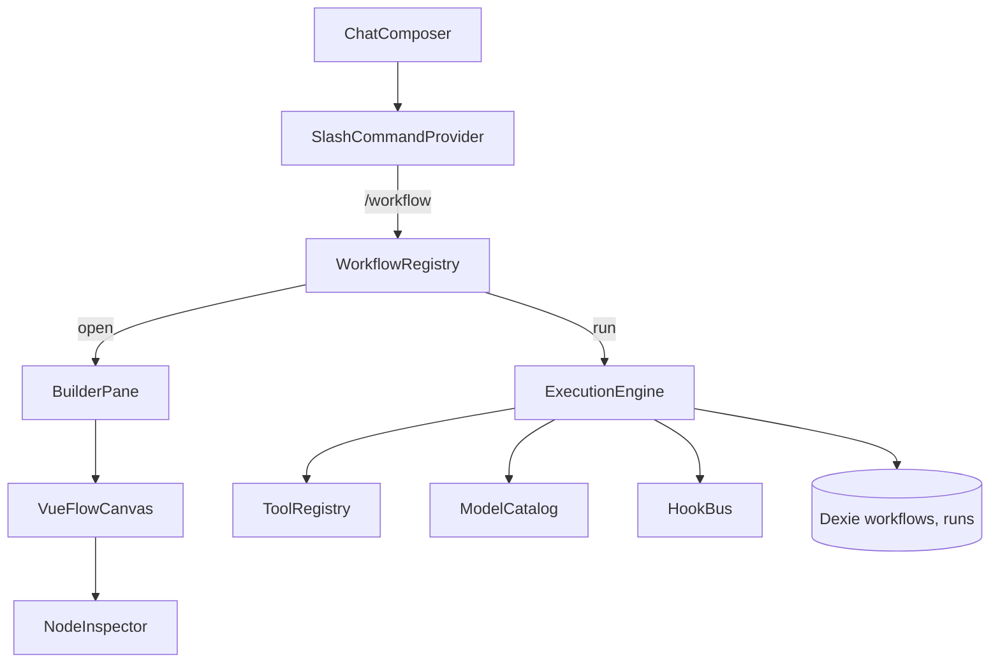

# design.md

## Overview

A VueFlow-based, chat-triggered workflow builder that lets users chain multiple OpenRouter calls with per-node model selection, tool allowlists, and parallel fan-out/merge. The builder launches from `/workflow` in the chat composer, mirrors the mention-style popover UX for discovery, and renders a themed canvas with Start → LLM → Merge nodes. Execution runs client-side with hook events for telemetry and plugin extension.

## System Topology



Key points:
- Slash command provider reuses the mention popover renderer to keep focus and styling consistent with chat.【F:app/plugins/ChatMentions/suggestions.ts†L12-L115】
- Execution engine is decoupled from VueFlow; it consumes a serializable graph schema and uses the tool registry for allowlists.【F:app/utils/chat/tool-registry.ts†L16-L120】
- Theming comes from `v-theme` / `useThemeResolver` so the builder can live in chat modal or sidebar without custom wrappers.【F:app/theme/README.md†L18-L166】
- Hook bus publishes lifecycle events for observability and plugin overrides.【F:docs/hooks.md†L1-L158】

## Core Surfaces

### Slash Command Provider
- TipTap suggestion configured for `/` triggers; uses the same VueRenderer popover as mentions for consistent keyboard/focus handling.【F:app/plugins/ChatMentions/suggestions.ts†L12-L115】
- Items: saved flows, "Create new", "Open last edited". Selecting an item either opens the builder pane or dispatches a run.
- Trigger text is removed on close/selection to avoid stray `/workflow` text in the composer.【F:app/plugins/ChatMentions/suggestions.ts†L30-L115】

### Builder Pane (Modal or Sidebar)
- Hosts VueFlow canvas and a right-side inspector. Pane can be mounted in chat modal or sidebar; wrapping container sets `data-context` to drive theme resolution.【F:app/theme/README.md†L90-L166】
- Node palette: Start (immutable), LLM, Merge/Refine. Context menu supports duplicate/delete; edge creation enforces acyclic graph.
- Inspector sections: Title/description, model selector (search + favorites), tool allowlist (from registry), prompt template, parallel group key, and output preview.

### VueFlow Canvas
- Minimal styling with `v-theme` on toolbar buttons, menus, inspector controls. Theme context derived from parent container (chat vs sidebar).【F:app/theme/README.md†L18-L166】
- Edges tagged as `sequence` or `parallel`; parallel siblings share a `parallelKey` stored on nodes for execution planning.
- Basic validation hints: cycle prevention, missing model/tool warnings, unconnected merge nodes.

## Data Model

```ts
// persisted in Dexie
interface Workflow {
  id: string;
  name: string;
  description?: string;
  nodes: WorkflowNode[];
  edges: WorkflowEdge[];
  updatedAt: number;
  context: 'chat' | 'sidebar';
}

interface WorkflowNode {
  id: string;
  type: 'start' | 'llm' | 'merge';
  title: string;
  model: string;
  toolAllowlist: string[];
  systemPrompt?: string;
  inputTemplate?: string;
  parallelKey?: string;
  ui?: { x: number; y: number };
}

interface WorkflowEdge {
  id: string;
  source: string;
  target: string;
  kind: 'sequence' | 'parallel';
  label?: string;
}

interface WorkflowRun {
  id: string;
  workflowId: string;
  startedAt: number;
  endedAt?: number;
  inputSummary: string;
  nodeResults: Array<{ nodeId: string; status: 'pending'|'running'|'success'|'error'; durationMs?: number; error?: string; model: string; tools: string[]; output?: string }>; 
}
```

## Execution Architecture

### Planner & Validator
- Build DAG from nodes/edges; enforce single Start, acyclic topology, and connected Merge nodes.
- Derive execution stages: siblings with same `parallelKey` in same depth are grouped for concurrent dispatch.
- Validate per-node: model present, tool allowlist reconciled with registry (warn on missing/disabled tools).【F:app/utils/chat/tool-registry.ts†L16-L120】

### Runner
- Uses existing OpenRouter/`useAi` helper (not modified) to send per-node requests with selected `model` and filtered `tools` (only enabled + allowlisted definitions).
- Builds `messages` from Start input (chat text + attachments) plus upstream outputs; Merge nodes concatenate ordered upstream payloads.
- Enforces configurable concurrency cap; waits for all nodes in a parallel group before continuing downstream.
- Emits hook actions per lifecycle: `workflow:node:start/completed/error`, `workflow:run:completed`, `workflow:run:error` for telemetry/plugins.【F:docs/hooks.md†L1-L158】
- Streams node status updates to the UI for badges/progress.

### Error Handling
- Node failure marks status error and blocks dependent downstream nodes; user can retry from failed node (rerun subtree).
- Parallel group failures surface per-node errors and retain successful outputs for inspection; rerun only failed nodes if possible.
- Runner records per-node durations/errors into `WorkflowRun` and persists to Dexie.

## Storage Strategy
- Dexie database in client stores `workflows` and `workflow_runs` keyed by workspace/user context.
- Export/import JSON buttons in builder for sharing early flows; schema aligns with data model above for forward compatibility.
- Abstracted provider interface so future server-backed persistence can replace Dexie without changing builder/executor.

## Hook & Extension Points
- **Command hooks**: `workflow:command:invoked` fires when `/workflow` palette opens or a run is triggered.
- **Builder hooks**: `workflow:builder:opened/closed`, `workflow:builder:saved` allow analytics and plugin UI injection.
- **Run hooks**: Node lifecycle hooks plus `workflow:run:completed/error` for logging or external sync; use hook bus disposers for HMR safety.【F:docs/hooks.md†L12-L149】
- **Builder registry**: Map of `{ id, render, execute }`; default `vueflow` entry used by slash command. Plugins can register alternatives (e.g., n8n) and expose capabilities (supportsParallel?).
- **Execution adapter**: Interface around OpenRouter call; plugins can swap adapter to call remote orchestrators while reusing node schema.

## UX & Theming Notes
- Slash palette and popover reuse mention renderer to keep focus in editor and apply consistent spacing/typography.【F:app/plugins/ChatMentions/suggestions.ts†L12-L115】
- Canvas + inspector buttons/inputs must apply `v-theme`; container sets `data-context` so theme resolver picks chat/sidebar overrides.【F:app/theme/README.md†L18-L166】
- Keyboard shortcuts: `/workflow` to open, `Cmd/Ctrl+S` to save, `Cmd/Ctrl+Enter` to run current flow.

## Risks & Mitigations
- **Tool drift**: Tools toggled off after save could break runs → warn during validation and filter to enabled definitions.【F:app/utils/chat/tool-registry.ts†L16-L120】
- **Rate limits**: Parallel fan-out may hit provider limits → add concurrency cap and simple retry/backoff on 429s (documented in tasks).
- **Theme regressions**: New UI may ignore context → enforce `v-theme` usage and use container `data-context` mapping per theme README.【F:app/theme/README.md†L18-L166】
- **Plugin conflicts**: Multiple builders vying for `/workflow` → registry picks default with user preference; hooks allow analytics without monkeypatching.

