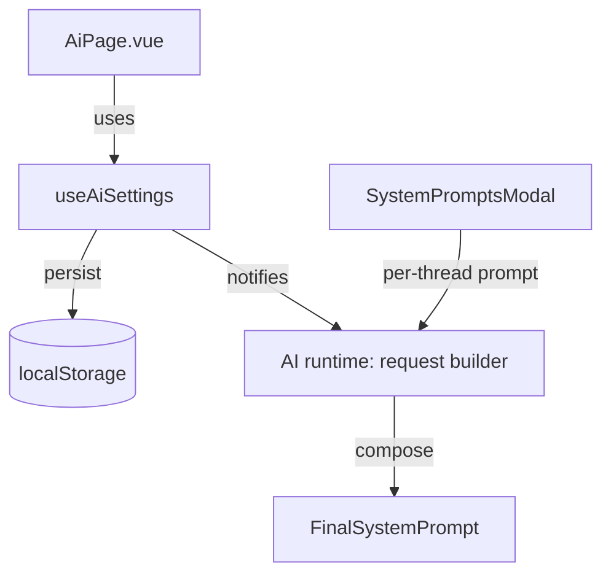

# AI Settings – Design

Artifact ID: 2a2d93a8-3d19-4cd1-9bdf-8c7f2b6a3d3a

## Overview

Implement a global AI Settings page (`AiPage.vue`) styled like `ThemePage.vue`. Store settings locally and expose a simple composable to read/update them. Compose the outgoing system message by combining the master prompt with the per-thread prompt. Provide default model behavior and sane fallbacks.

## Architecture



Core pieces:

-   AiPage.vue: UI with sections matching ThemePage.vue style.
-   useAiSettings.ts: composable for get/set/persist + sanitize + migrate.
-   AI request builder (existing useAi/useOpenrouter pipeline): integrates settings:
    -   Compose system prompt: Master + (two newlines) + Thread-specific (if any).
    -   Resolve model: fixed vs last selected + availability fallback.
    -   Apply defaults: temperature, max tokens, JSON/structured output mode, streaming, tool-use.
    -   Map settings to OpenRouter request fields (tools, tool_choice, parallel_tool_calls, response_format, provider preferences).

## Data model

TypeScript types (local only):

```ts
export type ToolPolicy = 'allow' | 'disallow' | 'ask';

export interface StructuredOutputSettings {
    enabled: boolean; // if true, prefer structured outputs
    // If schema provided, use json_schema; else fallback to json_object when enabled
    schemaName?: string;
    strict?: boolean; // default true when schema provided
    schema?: Record<string, any>; // JSON Schema object
}

export interface ProviderPrefs {
    allowFallbacks: boolean; // provider.allow_fallbacks
    requireParameters: boolean; // provider.require_parameters (enable when using tools/structured outputs)
    dataCollection: 'allow' | 'deny'; // provider.data_collection
    zdr: boolean; // provider.zdr
    // optional minimal sorting or shortcuts can be layered via model suffixes (:nitro, :floor)
}

export interface AiSettingsV1 {
    version: 1;
    masterSystemPrompt: string; // may be ''
    defaultModelMode: 'lastSelected' | 'fixed';
    fixedModelId: string | null; // used only when defaultModelMode === 'fixed'
    temperature: number; // 0.0–2.0
    maxOutputTokens: number | null; // null = auto/unset
    jsonMode: boolean; // simple JSON object response when enabled and supported
    structuredOutput: StructuredOutputSettings; // advanced structured outputs (optional UI later)
    streaming: boolean;
    toolPolicy: ToolPolicy; // governs default tool usage policy
    toolChoiceDefault: 'auto' | 'none'; // maps to tool_choice when tools provided
    parallelToolCalls: boolean; // provider-side hint for multi-tool flows
    provider: ProviderPrefs; // minimal provider routing preferences
}
```

Storage keys:

-   AI_SETTINGS_STORAGE_KEY = 'or3.ai.settings.v1'

Sanitization rules:

-   temperature: clamp to [0, 2]
-   maxOutputTokens: null or integer >= 0
-   fixedModelId: string or null
-   masterSystemPrompt: string; trim right only when composing (preserve entered text)
-   structuredOutput: if schema provided and enabled, ensure `strict` defaults to true; if enabled without schema, prefer `json_object` format.

## Interfaces and composition points

Composable contract:

```ts
export interface AiSettingsApi {
    settings: Ref<AiSettingsV1>;
    set(patch: Partial<AiSettingsV1>): void;
    reset(): void; // reset to defaults
    load(): AiSettingsV1; // reload from storage
}
```

System prompt composition:

```ts
export function composeSystemPrompt(
    master: string,
    threadSystem: string | null
): string | null {
    const m = (master || '').trim();
    const t = (threadSystem || '').trim();
    if (!m && !t) return null;
    if (!m) return t;
    if (!t) return m;
    return `${m}\n\n${t}`;
}
```

OpenRouter request mapping (tools, structured outputs, provider):

```ts
interface BuildOpenRouterBodyDeps {
    // The available tool specs and whether the current chat allows tool usage
    toolSpecs: any[]; // OpenAI-like function tool specs
    toolsSupportedByModel: boolean;
}

export function buildOpenRouterBodyBase(
    set: AiSettingsV1,
    deps: BuildOpenRouterBodyDeps
) {
    const body: any = {};

    // Tools & tool_choice
    const allowTools =
        set.toolPolicy !== 'disallow' && deps.toolsSupportedByModel;
    if (allowTools && deps.toolSpecs?.length) {
        body.tools = deps.toolSpecs;
        const tc = set.toolChoiceDefault || 'auto';
        body.tool_choice = tc; // 'auto' | 'none' | ({ type:'function', function:{name} }) later if needed
        body.parallel_tool_calls = !!set.parallelToolCalls;
    } else {
        body.tool_choice = 'none';
    }

    // Structured outputs / JSON mode
    if (set.structuredOutput?.enabled && set.structuredOutput.schema) {
        body.response_format = {
            type: 'json_schema',
            json_schema: {
                name: set.structuredOutput.schemaName || 'structured_output',
                strict: set.structuredOutput.strict !== false,
                schema: set.structuredOutput.schema,
            },
        };
    } else if (set.jsonMode) {
        body.response_format = { type: 'json_object' };
    }

    // Provider routing preferences
    body.provider = {
        allow_fallbacks: set.provider.allowFallbacks,
        require_parameters: set.provider.requireParameters,
        data_collection: set.provider.dataCollection,
        zdr: set.provider.zdr,
    };

    return body;
}
```

Model selection resolution:

```ts
export interface ModelResolverDeps {
    isAvailable: (id: string) => boolean; // based on current list from openrouter/models service
    lastSelectedModelId: () => string | null; // from model store
    recommendedDefault: () => string; // first recommended/known-good
}

export function resolveDefaultModel(
    set: AiSettingsV1,
    d: ModelResolverDeps
): string {
    if (
        set.defaultModelMode === 'fixed' &&
        set.fixedModelId &&
        d.isAvailable(set.fixedModelId)
    ) {
        return set.fixedModelId;
    }
    const last = d.lastSelectedModelId();
    if (last && d.isAvailable(last)) return last;
    return d.recommendedDefault();
}
```

Applying defaults in request builder:

-   temperature: set if unset in chat.
-   max tokens: set if unset (null means leave to backend auto unless provided).
-   json/structured outputs: set `response_format` accordingly when supported.
-   streaming: set as default for new requests.
-   toolPolicy: default gating before dispatching tool calls (ask: emit prompt/confirmation event).
-   provider: attach `provider` preferences (allow_fallbacks, require_parameters, data_collection, zdr). Enable `require_parameters` when tools/structured outputs are included to avoid providers that would ignore them.

Notes:

-   OpenRouter shortcuts: appending `:nitro` to the model slug prioritizes throughput; `:floor` prioritizes price. We already use `:online` elsewhere when needed.

## Error handling

-   On load parse error: log warn, reset to defaults.
-   On save failure (localStorage quota): log warn, keep in-memory state.
-   On model unavailable fallback: show non-blocking toast.
-   When `require_parameters` is on and no provider supports requested parameters (e.g., tools or structured outputs), surface a friendly error and suggest disabling the option or changing model.

ServiceResult pattern (lightweight): use return values and minimal console warnings; no exceptions for normal flows.

## Testing strategy

-   Unit tests:
    -   sanitizeAiSettings: clamps and coerces values properly.
    -   composeSystemPrompt: covers empty/mixed cases and whitespace.
    -   resolveDefaultModel: covers fixed/last/recommended and availability edges.
    -   buildOpenRouterBodyBase: verifies mapping for tools/tool_choice/parallel, response_format, provider prefs.
-   Integration (minimal): inject mocked deps into model resolver in a request build test.
-   Performance: trivial (local state); no perf tests needed.

## Streaming and tool calls

Our current `openrouterStream.ts` parses text deltas and image parts. To fully support tools and structured outputs during streaming:

-   Parse and surface `delta.tool_calls` events; buffer incremental arguments text if needed.
-   Detect `finish_reason === 'tool_calls'` and yield a final tool-calls event so the client can execute tools and continue the loop.
-   Preserve existing text/reasoning/image handling.

Suggested event extensions (non-breaking additive):

```ts
type ORStreamEvent =
    | { type: 'text'; text: string }
    | { type: 'reasoning'; text: string }
    | { type: 'image'; url: string; final?: boolean; index?: number }
    | {
          type: 'tool_call_delta';
          callId?: string;
          name?: string;
          argumentsChunk?: string;
      }
    | {
          type: 'tool_calls_done';
          calls: Array<{ id: string; name: string; arguments: string }>;
      }
    | { type: 'done' };
```

When tool policy is `ask`, keep `tool_choice: 'none'` until the user approves, then resend with tools enabled and continue the loop (see docs' “agentic loop” pattern).

## UI layout (match ThemePage.vue)

Sections (each in a .section-card):

-   Mode & Model Defaults:
    -   Radio: Use last selected / Use fixed model
    -   Model picker (when fixed)
    -   Streaming toggle
-   Generation Defaults:
    -   Temperature slider, Max tokens input, JSON mode toggle
-   Tool Use Policy:
    -   Segmented: allow / disallow / ask
-   Master System Prompt:
    -   Large textarea, character count
-   Reset:
    -   Reset to defaults button

Reuse classes from ThemePage.vue: section-card, retro-chip, retro-input, etc.

## Defaults

```ts
export const DEFAULT_AI_SETTINGS: AiSettingsV1 = {
    version: 1,
    masterSystemPrompt: '',
    defaultModelMode: 'lastSelected',
    fixedModelId: null,
    temperature: 0.7,
    maxOutputTokens: null,
    jsonMode: false,
    structuredOutput: { enabled: false },
    streaming: true,
    toolPolicy: 'allow',
    toolChoiceDefault: 'auto',
    parallelToolCalls: true,
    provider: {
        allowFallbacks: true,
        requireParameters: false, // recommended true when tools/structured outputs used
        dataCollection: 'allow',
        zdr: false,
    },
};
```
