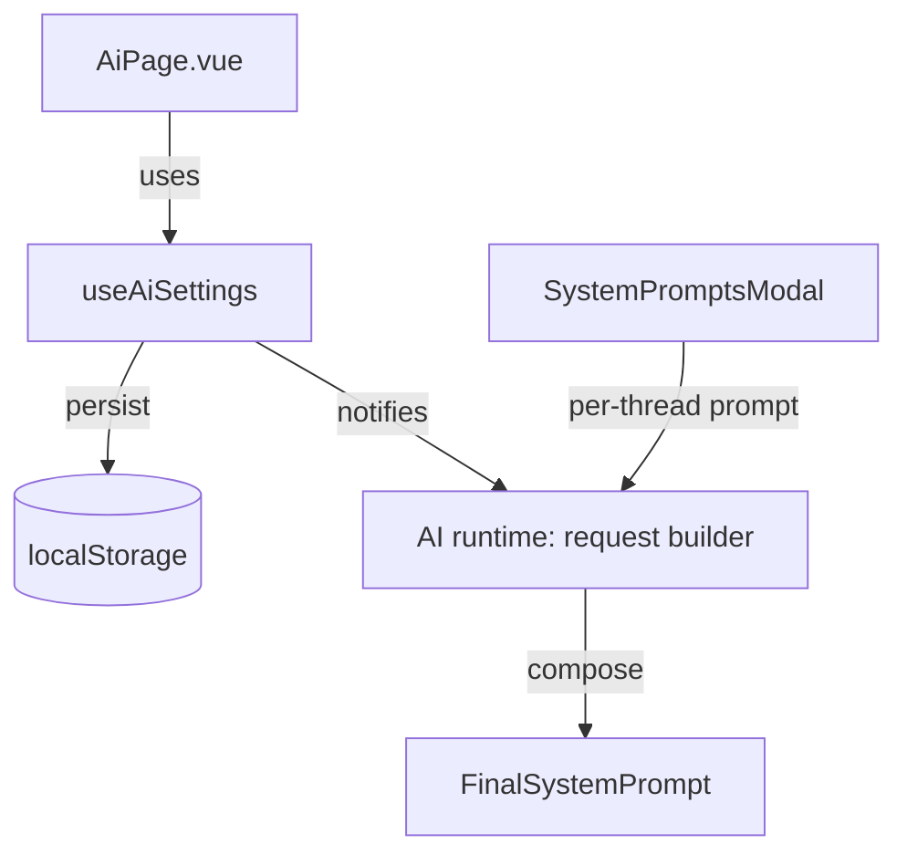

# AI Settings – Design

Artifact ID: 2a2d93a8-3d19-4cd1-9bdf-8c7f2b6a3d3a

## Overview

Deliver a minimal AI Settings page (`AiPage.vue`) with just two options:

-   Master system prompt (global, optional)
-   Default model behavior (use last selected vs fixed model)

Persist locally, expose a tiny composable to read/update, and compose the outgoing system prompt by combining the master prompt with any per-thread prompt.

## Architecture



Core pieces:

-   AiPage.vue: compact UI with two sections matching ThemePage.vue style.
-   useAiSettings.ts: composable for get/set/persist + sanitize.
-   Request builder (useAi.ts):
    -   Compose system prompt: Master + "\n\n" + Thread-specific (if any).
    -   Resolve model: fixed vs last selected + availability fallback with toast.

## Data model

TypeScript types (local only):

```ts
export interface AiSettingsV1 {
    version: 1;
    masterSystemPrompt: string; // may be ''
    defaultModelMode: 'lastSelected' | 'fixed';
    fixedModelId: string | null; // used only when defaultModelMode === 'fixed'
}
```

Storage:

-   Key: `or3.ai.settings.v1`

Sanitization rules:

-   fixedModelId: string or null
-   masterSystemPrompt: string; trimming occurs only during composition

## Interfaces

Composable contract:

```ts
export interface AiSettingsApi {
    settings: Ref<AiSettingsV1>;
    set(patch: Partial<AiSettingsV1>): void;
    reset(): void;
    load(): AiSettingsV1;
}
```

System prompt composition:

```ts
export function composeSystemPrompt(
    master: string,
    threadSystem: string | null
): string | null {
    const m = (master || '').trim();
    const t = (threadSystem || '').trim();
    if (!m && !t) return null;
    if (!m) return t;
    if (!t) return m;
    return `${m}\n\n${t}`;
}
```

Model selection resolution:

```ts
export interface ModelResolverDeps {
    isAvailable: (id: string) => boolean;
    lastSelectedModelId: () => string | null;
    recommendedDefault: () => string;
}

export function resolveDefaultModel(
    set: AiSettingsV1,
    d: ModelResolverDeps
): string {
    if (
        set.defaultModelMode === 'fixed' &&
        set.fixedModelId &&
        d.isAvailable(set.fixedModelId)
    ) {
        return set.fixedModelId;
    }
    const last = d.lastSelectedModelId();
    if (last && d.isAvailable(last)) return last;
    return d.recommendedDefault();
}
```

## Error handling

-   On load parse error: reset to defaults and log a warning.
-   On model unavailable fallback: show non-blocking toast and proceed.

## Testing strategy

-   Unit tests:
    -   composeSystemPrompt: empty/mixed/whitespace cases.
    -   resolveDefaultModel: fixed/last/recommended and availability edges.
    -   useAiSettings: persistence load/save, sanitize.

## UI layout (match ThemePage.vue)

Sections (each in a .section-card):

-   Model Defaults:
    -   Radio: Use last selected / Use fixed model
    -   Model picker (when fixed)
-   Master System Prompt:
    -   Large textarea, character count
-   Reset:
    -   Reset to defaults button

Reuse classes from ThemePage.vue: section-card, retro-chip, retro-input, etc.
