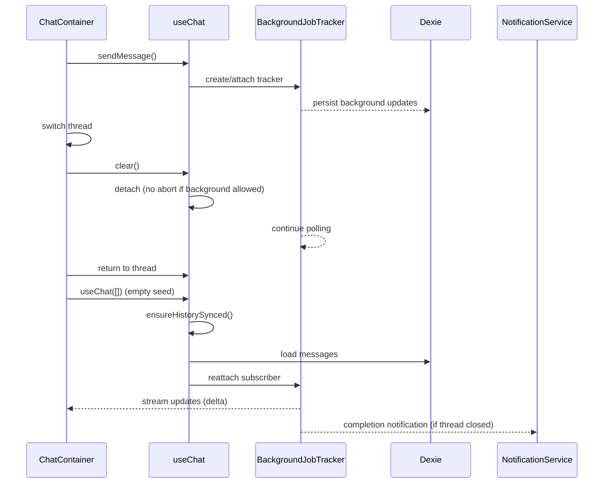

# Background Streaming + Notifications Fix — Design

artifact_id: 7f4a2e07-1f8c-4b1b-9b6d-6c6a8c7a51c3
date: 2026-01-24
revised: 2026-01-24 (post code review)

## 1. Overview

This design fixes background streaming detachment and missing completion notifications in SSR mode.

**Root causes identified:**

1. **CRITICAL: `persistBackgroundJobUpdate()` skips writes when Convex is enabled** — Line 188 has `if (syncProvider === 'convex') return;` which prevents ALL client-side DB writes. When user switches threads and returns, `ensureHistorySynced()` pulls from IndexedDB which has stale/empty data. The in-memory stream state is lost.
2. `clear()` aborts streams when `backgroundJobId` is null, even if `backgroundJobMode === 'hybrid'` (job id hasn't arrived yet).
3. `ChatContainer` re-instantiates `useChat()` with a stale `messageHistory` snapshot on thread switch, wiping state before `ensureHistorySynced()` can run.
4. `emitBackgroundComplete()` and `notification-listeners.client.ts` both gate on `serverNotificationsEnabled`, blocking all local notifications in SSR mode (server-side emission was never implemented).
5. `messageHistory` watcher only checks `loading.value`, missing pending background messages after stream detachment.

**Key fixes:**

- **PRIORITY 1:** Remove the `syncProvider === 'convex'` guard in `persistBackgroundJobUpdate()`. IndexedDB is the handoff point between unmounted/mounted component states.
- Fix `clear()` to check `backgroundJobMode !== 'none'` before aborting.
- Don't seed `useChat()` with stale snapshot; let `ensureHistorySynced()` populate fresh data.
- Remove the `serverNotificationsEnabled` guard in `emitBackgroundComplete()`.
- Guard `messageHistory` watcher for pending assistant messages.
- Add re-entrancy guard to `ensureHistorySynced()`.

---

## 2. Architecture

### 2.1 High-level flow



---

## 3. Components & Responsibilities

### 3.0 `persistBackgroundJobUpdate()` — CRITICAL: Restore client persistence

**Problem:** Line 188 has a guard that skips ALL client-side DB writes when Convex sync is enabled:

```ts
// [FIX] Skip client-side persistence if using Convex
// Convex handles persistence server-side, preventing sync conflicts
const config = useRuntimeConfig();
const syncProvider = config.public.sync?.provider;
if (syncProvider === 'convex') return;  // <-- PROBLEM: breaks everything
```

**Why this breaks everything:**

1. User sends message → background job starts
2. Polling receives content → `persistBackgroundJobUpdate()` is called
3. Guard returns early → IndexedDB never updated
4. User switches threads → `useChat` unmounts → in-memory state lost
5. User returns → `ensureHistorySynced()` pulls from IndexedDB
6. IndexedDB has stale/empty data → UI shows nothing
7. Active stream is orphaned (still running on server, but UI can't find it)

**Why the guard was added:** To prevent sync conflict notifications when both client and server write the same content.

**Why the guard is wrong:** IndexedDB is the **handoff mechanism** between component mounts. Without it, there's no way to restore state after thread switching. The sync conflicts are cosmetic noise; the data loss is catastrophic.

**Fix:** Remove the guard entirely:

```ts
async function persistBackgroundJobUpdate(
    tracker: BackgroundJobTracker,
    status: BackgroundJobStatus,
    content: string
): Promise<void> {
    if (!import.meta.client) return;

    // REMOVED: syncProvider === 'convex' guard
    // Client persistence is required for thread-switch recovery
    // Sync conflicts are handled by LWW and are harmless for identical content

    const now = Date.now();
    // ... rest unchanged
}
```

**Addressing sync conflicts properly:**

- The conflicts occur because client and server write identical content at ~same time
- LWW (last-write-wins) resolves them correctly — both sides have the same content
- The "conflict resolved" notifications are noise, not data corruption
- Solution: Either suppress notifications for identical-content conflicts, OR accept them as harmless

---

**Problem:** Current `clear()` only checks `backgroundJobId.value`. When hybrid mode starts, `backgroundJobMode` is set to `'hybrid'` before the job id header arrives. If the user switches threads in this window, the `else if` branch aborts the stream.

**Current code (simplified):**

```ts
function clear() {
    if (backgroundJobId.value || backgroundJobMode.value === 'hybrid') {
        detached.value = true;
        // ... cleanup subscriptions
    } else if (abortController.value) {
        aborted.value = true;
        abortController.value.abort();  // <-- PROBLEM: aborts the stream
    }
}
```

**Fix:** Check `backgroundStreamingAllowed && backgroundJobMode !== 'none'` first:

```ts
function clear() {
    const isBackgroundActive =
        backgroundStreamingAllowed.value &&
        (backgroundJobId.value || backgroundJobMode.value !== 'none');

    if (isBackgroundActive) {
        detached.value = true;
        clearBackgroundJobSubscriptions();
        // Keep backgroundJobInfo for reattachment lookup
        // Do NOT reset backgroundJobId/backgroundJobMode/backgroundJobInfo here
        return;
    }

    // Only abort if no background mode active
    if (abortController.value) {
        aborted.value = true;
        try { abortController.value.abort(); } catch { /* empty */ }
        streamAcc.finalize({ aborted: true });
        abortController.value = null;
    }
    // ... rest of cleanup
}
```

**Note:** The original plan proposed `pendingDetach` state. This is unnecessary — the existing `backgroundJobMode` already tracks whether a background stream is in progress. The fix is simpler: don't abort when `backgroundJobMode !== 'none'`.

---

### 3.2 `ChatContainer` — stale snapshot fix

**Problem:** On thread switch, `useChat()` is constructed with `props.messageHistory` (a stale pane snapshot). The composable initializes `messages` from this snapshot. Then `ensureHistorySynced()` runs *async*, but the UI has already rendered stale data.

**Current code:**

```vue
watch(
    () => props.threadId,
    (newId) => {
        chat.value?.clear?.();
        chat.value = useChat(
            props.messageHistory,  // <-- Stale snapshot
            newId,
            pendingPromptId.value || undefined
        ) as ChatInstance;
        void chat.value?.ensureHistorySynced?.();
    }
);
```

**Fix:** Pass empty array; let `ensureHistorySynced()` populate:

```vue
watch(
    () => props.threadId,
    async (newId) => {
        try { chat.value?.clear?.(); } catch { /* empty */ }
        // Don't seed with stale snapshot; let ensureHistorySynced pull fresh data
        chat.value = useChat([], newId, pendingPromptId.value || undefined) as ChatInstance;
        await chat.value?.ensureHistorySynced?.();
    }
);
```

---

### 3.3 `ChatContainer` — `messageHistory` watcher guard

**Problem:** The watcher checks `loading.value`, but once streaming finishes (even via background tracker), `loading` becomes `false` and the watcher can clobber messages.

**Current code:**

```vue
watch(
    () => props.messageHistory,
    (mh) => {
        if (!chat.value) return;
        if (chat.value.loading.value) return;  // <-- Insufficient
        chat.value!.messages.value = (mh || []).filter(...).map(...);
    }
);
```

**Fix:** Add secondary guard for pending assistant messages:

```vue
watch(
    () => props.messageHistory,
    (mh) => {
        if (!chat.value) return;
        if (chat.value.loading.value) return;
        // Also bail if any message is pending a background job
        const hasPendingBackground = chat.value.messages.value.some(
            (m) => m.role === 'assistant' && m.pending
        );
        if (hasPendingBackground) return;
        chat.value!.messages.value = (mh || []).filter(...).map(...);
    }
);
```

---

### 3.4 Notifications — double-gating fix

**Problem:** Two code paths gate on `serverNotificationsEnabled`:

1. `emitBackgroundComplete()` in `useAi.ts`
2. `ai.chat.stream:action:complete` listener in `notification-listeners.client.ts`

Both bail when SSR + Convex is enabled, expecting the *server* to create notifications. But server-side notification emission was **never implemented** (see `BACKGROUND_STREAMING_REVIEW.md`). Result: no notifications at all.

**Fix:** Remove the `serverNotificationsEnabled` guard in `emitBackgroundComplete()`. The existing logic already handles:
- Thread open check (`subscribers.size > 0`)
- Muted thread check
- Notification creation

```ts
// In emitBackgroundComplete():
// DELETE these lines:
// const serverNotificationsEnabled = ...;
// if (serverNotificationsEnabled) return;
```

The listener in `notification-listeners.client.ts` becomes redundant and can be removed or left as a no-op (it won't fire for background jobs since `emitBackgroundComplete` handles them).

---

### 3.5 `ensureHistorySynced()` — re-entrancy guard

**Problem:** Rapid thread switches can cause multiple `ensureHistorySynced()` calls to race.

**Fix:** Add in-flight flag:

```ts
let historySyncInFlight = false;
async function ensureHistorySynced() {
    if (historySyncInFlight) return;
    if (threadIdRef.value && historyLoadedFor.value !== threadIdRef.value) {
        historySyncInFlight = true;
        try {
            // ... existing logic
        } finally {
            historySyncInFlight = false;
        }
    }
}
```

---

## 4. What Was Removed From Original Plan

### 4.1 `pendingDetach` state

**Not needed.** The existing `backgroundJobMode` ref already tracks whether a background stream is active before the job id arrives. The fix is to check `backgroundJobMode !== 'none'` in `clear()`.

### 4.2 `refreshPaneMessages()` in `useMultiPane`

**Not needed.** The pane snapshot isn't the root cause — the problem is that `useChat()` is seeded with the snapshot. Fixing the seed (empty array) and letting `ensureHistorySynced()` load fresh data eliminates the need for manual pane refresh.

---

## 5. Error Handling

- If the job never returns an id and `backgroundJobMode` stays `'none'`, the stream aborts on thread switch (existing behavior).
- If polling fails, mark the message with error and create a `system.warning` notification.
- If notification creation fails, log and continue without blocking streaming.

---

## 6. Testing Strategy

### Unit tests

- `clear()` with `backgroundJobMode === 'hybrid'` and `backgroundJobId === null` → no abort
- `clear()` with `backgroundStreamingAllowed === false` → aborts
- `messageHistory` watcher skips update when pending assistant exists
- `ensureHistorySynced()` re-entrancy guard
- `emitBackgroundComplete()` fires in SSR mode when thread is closed

### Integration tests

- Switch thread mid-stream → return before complete → see live streaming
- Switch thread mid-stream → let finish → receive notification
- Rapid thread switching → no duplicate syncs

### Manual tests

- SSR mode with background streaming enabled
- Static build regression check (no new server deps)

