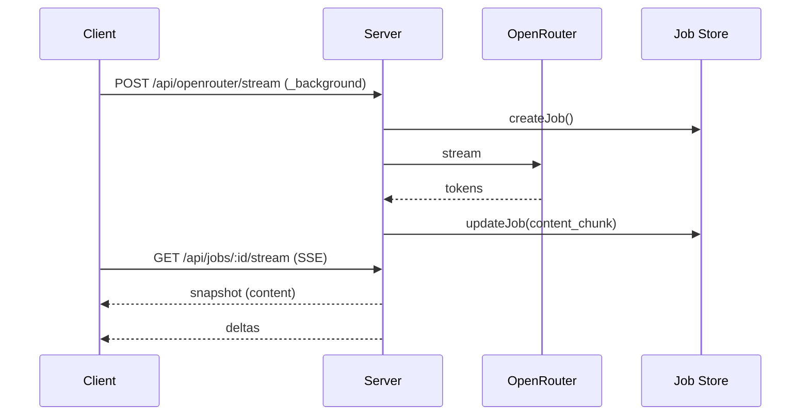

# Background Streaming + Notifications Fix — Design

artifact_id: 7f4a2e07-1f8c-4b1b-9b6d-6c6a8c7a51c3
revised: 2026-01-25 (SSE server-authoritative)

## 1. Overview

This revision replaces hybrid client/server streaming with a **single server-authoritative stream** and an SSE transport for clients. The goal is to eliminate client/server divergence and fix stalled reattach behavior while preserving static build behavior.

**Core change:**
- **Server** is the only OpenRouter stream consumer.
- **Clients** receive updates over `/api/jobs/:id/stream` (SSE), starting with a snapshot and then deltas.
- Static builds retain the existing direct OpenRouter streaming path.

## 2. Root cause (current failure)

1. **Dual sources of truth**: Hybrid mode uses `ReadableStream.tee()` so client and server read different branches. The client updates UI immediately, while the server persists buffered content to job storage.
2. **Reattach gating**: The UI refuses to update if server content length is behind local content. This makes it appear stalled until the server catches up.

## 3. Architecture (new)

### 3.1 Flow

### 3.2 Server

- **`/api/openrouter/stream`**
  - Background requests start a job and return `{ jobId }` immediately.
  - No `tee()`; server consumes the OpenRouter stream once.

- **`/api/jobs/:id/stream` (SSE)**
  - First event: `snapshot` (full content + cursor).
  - Subsequent events: `delta` (content_delta + content_length).
  - Polls the job store on an **active interval** (80ms) to stay real-time.

- **Viewer tracking**
  - A per-process map tracks active SSE viewers so server-side notifications can be suppressed when a client is attached.

### 3.3 Client

- **`startBackgroundStream()`** returns `jobId`.
- **`subscribeBackgroundJobStream()`** opens SSE and feeds deltas into the existing background job tracker.
- The UI renders **server state only** for background jobs.

### 3.4 Static build compatibility

- Static builds never use `/api` routes (no server). The existing direct OpenRouter streaming path remains unchanged.
- `isServerRouteAvailable()`/`isBackgroundStreamingEnabled()` continue to gate SSR-only features.

## 4. Notifications

- Server emits completion/error notifications **only when no SSE viewers exist**.
- Client-side notification fallback still runs when no active subscribers are attached.
- This prevents duplicate notifications when a user is actively attached.

## 5. Changes Summary

- Remove hybrid `tee()` in server route.
- Add `/api/jobs/:id/stream` SSE endpoint.
- Add viewer tracking (`server/utils/background-jobs/viewers.ts`).
- Client: SSE subscription helper + useAi background flow refactor.

## 6. Risks / Tradeoffs

- **Server polling load**: SSE endpoint polls the job store. Frequency matches existing active polling (80ms) to preserve UX.
- **Multi-instance note**: Viewer tracking is per-process; in multi-instance setups, server notifications may be conservative. This is acceptable for current scope.

## 7. Testing Strategy

- Unit: SSE helper parsing, tracker updates, reattach behavior.
- Integration: Switch thread mid-stream, reattach, completion notification.
- Manual: SSR mode, static build fallback.
