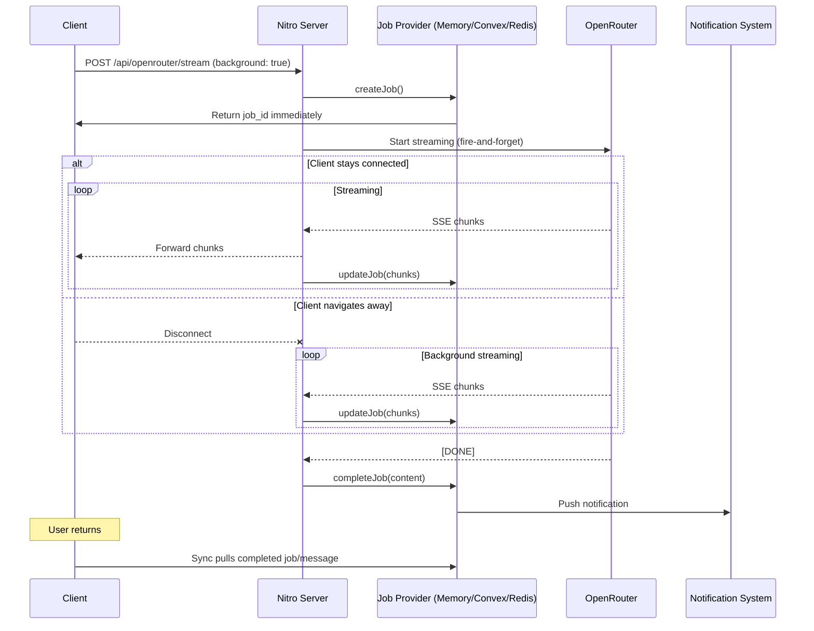
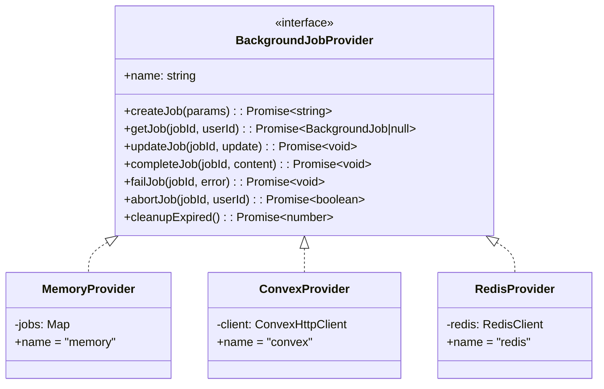

# Background Streaming - Technical Design

artifact_id: bg-stream-001
date: 2026-01-22
updated: 2026-01-22

## 1. Overview

This design enables AI streaming to continue on the server when users navigate away or close tabs. The approach adds minimal code by leveraging existing infrastructure and follows the **pluggable provider pattern** used elsewhere in the codebase (e.g., rate limiting).

**Key Features:**
- Bring-your-own-provider: in-memory (default), Convex, Redis, etc.
- SSR-only; static builds unaffected
- Minimal changes to existing streaming code
- Integrates with notification center

---

## 2. Architecture

### 2.1 High-Level Flow



### 2.2 Provider Architecture



---

## 3. Provider Interface

### 3.1 Types

```typescript
// server/utils/background-jobs/types.ts

export interface BackgroundJob {
    id: string;
    userId: string;
    threadId: string;
    messageId: string;
    status: 'streaming' | 'complete' | 'error' | 'aborted';
    content: string;           // Accumulated content
    chunksReceived: number;    // For progress tracking
    startedAt: number;         // Unix timestamp
    completedAt?: number;
    error?: string;
}

export interface CreateJobParams {
    userId: string;
    threadId: string;
    messageId: string;
    model: string;
}

export interface JobUpdate {
    content?: string;
    chunksReceived?: number;
}

/**
 * Background Job Provider Interface
 *
 * Implement this interface to add a new storage backend for background jobs.
 * Providers are responsible for job persistence and lifecycle management.
 *
 * Built-in providers:
 * - memory: In-memory (single instance, jobs lost on restart)
 * - convex: Convex database (multi-instance, persistent)
 * - redis: Redis (multi-instance, persistent) [future]
 */
export interface BackgroundJobProvider {
    /** Provider name for logging/debugging */
    readonly name: string;

    /**
     * Create a new background job.
     * @returns The job ID
     */
    createJob(params: CreateJobParams): Promise<string>;

    /**
     * Retrieve a job by ID.
     * @param jobId - The job ID
     * @param userId - User ID for authorization check
     * @returns The job or null if not found/unauthorized
     */
    getJob(jobId: string, userId: string): Promise<BackgroundJob | null>;

    /**
     * Update a streaming job with new content.
     * Called incrementally as chunks arrive.
     */
    updateJob(jobId: string, update: JobUpdate): Promise<void>;

    /**
     * Mark a job as successfully completed.
     * @param finalContent - The complete accumulated content
     */
    completeJob(jobId: string, finalContent: string): Promise<void>;

    /**
     * Mark a job as failed.
     */
    failJob(jobId: string, error: string): Promise<void>;

    /**
     * Abort a running job.
     * @returns true if aborted, false if job not found or already complete
     */
    abortJob(jobId: string, userId: string): Promise<boolean>;

    /**
     * Get an AbortController for a job (if provider supports cancellation).
     * Memory provider stores these; Convex/Redis providers return null.
     */
    getAbortController?(jobId: string): AbortController | null;

    /**
     * Create an AbortController for a job.
     * Only applicable for in-process providers (memory).
     */
    createAbortController?(jobId: string): AbortController;

    /**
     * Clean up expired/stale jobs.
     * @returns Number of jobs cleaned up
     */
    cleanupExpired(): Promise<number>;
}
```

### 3.2 Provider Factory

```typescript
// server/utils/background-jobs/store.ts

import type { BackgroundJobProvider } from './types';
import { memoryProvider } from './providers/memory';
import { convexProvider } from './providers/convex';

let cachedProvider: BackgroundJobProvider | null = null;

/**
 * Get the active background job provider.
 * Caches the provider for performance.
 */
export function getJobProvider(): BackgroundJobProvider {
    if (cachedProvider) {
        return cachedProvider;
    }

    const config = useRuntimeConfig();
    const storageProvider = config.backgroundJobs?.storageProvider ?? 'memory';

    switch (storageProvider) {
        case 'convex':
            if (config.public.sync.convexUrl) {
                cachedProvider = convexProvider;
            } else {
                console.warn('[background-jobs] Convex URL not configured, using memory');
                cachedProvider = memoryProvider;
            }
            break;

        case 'redis':
            // Future: Redis provider
            console.warn('[background-jobs] Redis provider not yet implemented, using memory');
            cachedProvider = memoryProvider;
            break;

        case 'memory':
        default:
            cachedProvider = memoryProvider;
            break;
    }

    return cachedProvider;
}

/**
 * Check if background streaming is enabled
 */
export function isBackgroundStreamingEnabled(): boolean {
    const config = useRuntimeConfig();
    return config.backgroundJobs?.enabled === true;
}

/**
 * Reset the cached provider (useful for testing)
 */
export function resetJobProvider(): void {
    cachedProvider = null;
}
```

---

## 4. Provider Implementations

### 4.1 Memory Provider (Default)

Best for: Single-instance deployments, development, testing.

```typescript
// server/utils/background-jobs/providers/memory.ts

import type { BackgroundJobProvider, BackgroundJob, CreateJobParams, JobUpdate } from '../types';

interface MemoryJob extends BackgroundJob {
    abortController: AbortController;
}

const jobs = new Map<string, MemoryJob>();
const MAX_JOBS = Number(process.env.NUXT_MAX_BACKGROUND_JOBS) || 20;
const JOB_TIMEOUT_MS = Number(process.env.NUXT_BACKGROUND_JOB_TIMEOUT) * 1000 || 5 * 60 * 1000;

// Cleanup interval
let cleanupInterval: NodeJS.Timeout | null = null;

function ensureCleanupInterval() {
    if (cleanupInterval) return;
    cleanupInterval = setInterval(() => {
        memoryProvider.cleanupExpired();
    }, 60_000); // Every minute
}

export const memoryProvider: BackgroundJobProvider = {
    name: 'memory',

    async createJob(params: CreateJobParams): Promise<string> {
        ensureCleanupInterval();
        
        // Enforce max concurrent jobs
        const activeJobs = Array.from(jobs.values()).filter(j => j.status === 'streaming');
        if (activeJobs.length >= MAX_JOBS) {
            throw new Error('Max concurrent background jobs reached');
        }

        const id = crypto.randomUUID();
        const job: MemoryJob = {
            id,
            userId: params.userId,
            threadId: params.threadId,
            messageId: params.messageId,
            status: 'streaming',
            content: '',
            chunksReceived: 0,
            startedAt: Date.now(),
            abortController: new AbortController(),
        };
        
        jobs.set(id, job);
        return id;
    },

    async getJob(jobId: string, userId: string): Promise<BackgroundJob | null> {
        const job = jobs.get(jobId);
        if (!job || job.userId !== userId) return null;
        
        // Return without abortController (internal detail)
        const { abortController: _, ...publicJob } = job;
        return publicJob;
    },

    async updateJob(jobId: string, update: JobUpdate): Promise<void> {
        const job = jobs.get(jobId);
        if (!job || job.status !== 'streaming') return;
        
        if (update.content !== undefined) {
            job.content += update.content;
        }
        if (update.chunksReceived !== undefined) {
            job.chunksReceived = update.chunksReceived;
        }
    },

    async completeJob(jobId: string, finalContent: string): Promise<void> {
        const job = jobs.get(jobId);
        if (!job) return;
        
        job.status = 'complete';
        job.content = finalContent;
        job.completedAt = Date.now();
    },

    async failJob(jobId: string, error: string): Promise<void> {
        const job = jobs.get(jobId);
        if (!job) return;
        
        job.status = 'error';
        job.error = error;
        job.completedAt = Date.now();
    },

    async abortJob(jobId: string, userId: string): Promise<boolean> {
        const job = jobs.get(jobId);
        if (!job || job.userId !== userId) return false;
        if (job.status !== 'streaming') return false;
        
        job.abortController.abort();
        job.status = 'aborted';
        job.completedAt = Date.now();
        return true;
    },

    getAbortController(jobId: string): AbortController | null {
        return jobs.get(jobId)?.abortController ?? null;
    },

    createAbortController(jobId: string): AbortController {
        const job = jobs.get(jobId);
        if (!job) throw new Error('Job not found');
        return job.abortController;
    },

    async cleanupExpired(): Promise<number> {
        const now = Date.now();
        let cleaned = 0;
        
        for (const [id, job] of jobs) {
            const age = now - job.startedAt;
            const isExpired = age > JOB_TIMEOUT_MS;
            const isTerminal = ['complete', 'error', 'aborted'].includes(job.status);
            const isStale = isTerminal && (now - (job.completedAt ?? job.startedAt)) > 5 * 60 * 1000;
            
            if (isExpired && job.status === 'streaming') {
                // Timeout streaming job
                job.abortController.abort();
                job.status = 'error';
                job.error = 'Job timed out';
                job.completedAt = now;
                cleaned++;
            } else if (isStale) {
                // Remove old completed jobs
                jobs.delete(id);
                cleaned++;
            }
        }
        
        return cleaned;
    },
};
```

### 4.2 Convex Provider

Best for: Multi-instance deployments, persistence across restarts.

```typescript
// server/utils/background-jobs/providers/convex.ts

import type { BackgroundJobProvider, BackgroundJob, CreateJobParams, JobUpdate } from '../types';
import { ConvexHttpClient } from 'convex/browser';
import { api } from '~~/convex/_generated/api';

function getClient(): ConvexHttpClient {
    const config = useRuntimeConfig();
    const url = config.public.sync.convexUrl;
    if (!url) throw new Error('Convex URL not configured');
    return new ConvexHttpClient(url);
}

export const convexProvider: BackgroundJobProvider = {
    name: 'convex',

    async createJob(params: CreateJobParams): Promise<string> {
        const client = getClient();
        const id = await client.mutation(api.backgroundJobs.create, {
            userId: params.userId,
            threadId: params.threadId,
            messageId: params.messageId,
            model: params.model,
        });
        return id;
    },

    async getJob(jobId: string, userId: string): Promise<BackgroundJob | null> {
        const client = getClient();
        return await client.query(api.backgroundJobs.get, { jobId, userId });
    },

    async updateJob(jobId: string, update: JobUpdate): Promise<void> {
        const client = getClient();
        await client.mutation(api.backgroundJobs.update, { jobId, ...update });
    },

    async completeJob(jobId: string, finalContent: string): Promise<void> {
        const client = getClient();
        await client.mutation(api.backgroundJobs.complete, { jobId, content: finalContent });
    },

    async failJob(jobId: string, error: string): Promise<void> {
        const client = getClient();
        await client.mutation(api.backgroundJobs.fail, { jobId, error });
    },

    async abortJob(jobId: string, userId: string): Promise<boolean> {
        const client = getClient();
        return await client.mutation(api.backgroundJobs.abort, { jobId, userId });
    },

    // Convex provider cannot provide AbortControllers (they're in-process)
    // The abort is signaled via the job status in the database

    async cleanupExpired(): Promise<number> {
        const client = getClient();
        return await client.mutation(api.backgroundJobs.cleanup, {});
    },
};
```

### 4.3 Convex Schema Addition

```typescript
// convex/schema.ts (addition)

backgroundJobs: defineTable({
    userId: v.string(),
    threadId: v.string(),
    messageId: v.string(),
    model: v.string(),
    status: v.union(
        v.literal('streaming'),
        v.literal('complete'),
        v.literal('error'),
        v.literal('aborted')
    ),
    content: v.string(),
    chunksReceived: v.number(),
    startedAt: v.number(),
    completedAt: v.optional(v.number()),
    error: v.optional(v.string()),
})
    .index('by_user', ['userId'])
    .index('by_status', ['status'])
    .index('by_message', ['messageId']),
```

---

## 5. Enhanced Stream Endpoint

```typescript
// server/api/openrouter/stream.post.ts (modifications)

import { getJobProvider, isBackgroundStreamingEnabled } from '../utils/background-jobs/store';

export default defineEventHandler(async (event) => {
    const body = await readBody(event);
    
    // Check for background mode request
    const backgroundMode = body._background === true;
    const threadId = body._threadId as string | undefined;
    const messageId = body._messageId as string | undefined;
    
    // Handle background mode
    if (backgroundMode && isBackgroundStreamingEnabled()) {
        const userId = await resolveUserId(event);
        if (!userId || !threadId || !messageId) {
            setResponseStatus(event, 400);
            return { error: 'Missing required fields for background mode' };
        }
        
        const provider = getJobProvider();
        
        try {
            const jobId = await provider.createJob({
                userId,
                threadId,
                messageId,
                model: body.model,
            });
            
            // Fire-and-forget the streaming
            streamInBackground(jobId, body, apiKey, provider).catch(err => {
                console.error('[stream] Background job failed:', err);
                provider.failJob(jobId, err.message);
            });
            
            // Return immediately
            return { jobId, status: 'streaming' };
            
        } catch (err) {
            if (err instanceof Error && err.message.includes('Max concurrent')) {
                setResponseStatus(event, 503);
                return { error: 'Server busy, try again later' };
            }
            throw err;
        }
    }
    
    // ... existing foreground streaming code ...
});

async function streamInBackground(
    jobId: string,
    body: unknown,
    apiKey: string,
    provider: BackgroundJobProvider
) {
    // Get abort controller (only available for memory provider)
    const ac = provider.getAbortController?.(jobId) ?? new AbortController();
    
    const upstream = await fetch(OR_URL, {
        method: 'POST',
        headers: {
            Authorization: `Bearer ${apiKey}`,
            'Content-Type': 'application/json',
            Accept: 'text/event-stream',
        },
        body: JSON.stringify(body),
        signal: ac.signal,
    });
    
    if (!upstream.ok || !upstream.body) {
        throw new Error(`OpenRouter error: ${upstream.status}`);
    }
    
    let fullContent = '';
    let chunks = 0;
    
    for await (const evt of parseOpenRouterSSE(upstream.body)) {
        if (evt.type === 'text') {
            fullContent += evt.text;
            chunks++;
            
            // Update provider periodically (every 10 chunks)
            if (chunks % 10 === 0) {
                await provider.updateJob(jobId, { 
                    content: evt.text,
                    chunksReceived: chunks 
                });
            }
        }
    }
    
    // Complete the job
    await provider.completeJob(jobId, fullContent);
    
    // Trigger notification (Phase 5 integration)
    await emitBackgroundComplete(jobId);
}
```

---

## 6. Configuration

```typescript
// nuxt.config.ts (additions)

export default defineNuxtConfig({
    runtimeConfig: {
        backgroundJobs: {
            enabled: false, // Set to true to enable
            storageProvider: 'memory', // 'memory' | 'convex' | 'redis'
            maxConcurrentJobs: 20,
            jobTimeoutSeconds: 300,
        },
    },
});
```

Environment variables:
```env
# Enable background streaming
NUXT_BACKGROUND_JOBS_ENABLED=true

# Storage provider: memory, convex, redis
NUXT_BACKGROUND_JOBS_STORAGE_PROVIDER=convex

# Limits
NUXT_BACKGROUND_JOBS_MAX_CONCURRENT_JOBS=20
NUXT_BACKGROUND_JOBS_JOB_TIMEOUT_SECONDS=300
```

---

## 7. Provider Comparison

| Feature | Memory | Convex | Redis |
|---------|--------|--------|-------|
| Multi-instance | ❌ No | ✅ Yes | ✅ Yes |
| Persistent | ❌ No | ✅ Yes | ✅ Yes |
| AbortController | ✅ Yes | ❌ Poll-based | ❌ Poll-based |
| Setup complexity | None | Already have | Need Redis |
| Best for | Dev/single | Production | Scale |

### Abort Handling by Provider

**Memory:** Direct AbortController - instant cancellation.

**Convex/Redis:** Poll-based abort - the streaming loop checks job status periodically:
```typescript
// In streamInBackground(), for non-memory providers:
if (chunks % 10 === 0) {
    const job = await provider.getJob(jobId, '*');
    if (job?.status === 'aborted') {
        throw new Error('Job aborted');
    }
}
```

---

## 8. Static Build Compatibility

No changes needed. Static builds:
1. Have no server routes
2. `isBackgroundStreamingEnabled()` returns false
3. All background code paths are never executed
4. Behavior identical to today

---

## 9. Testing Strategy

### Unit Tests
- Each provider: create, get, update, complete, fail, abort, cleanup
- Provider factory: correct provider selection

### Integration Tests  
- Full flow with memory provider
- Full flow with Convex provider
- Abort during streaming

### Manual Tests
- Send message → close tab → reopen → message present
- Provider switching via env vars

---

## 10. Effort Estimate (Updated)

| Component | Effort |
|-----------|--------|
| Types & interface | 0.5 hours |
| Memory provider | 1.5 hours |
| Convex provider + schema | 2 hours |
| Provider factory | 0.5 hours |
| Stream endpoint changes | 1.5 hours |
| Job status/abort endpoints | 1 hour |
| Client integration | 2 hours |
| Notification integration | 1 hour |
| Testing | 2 hours |
| **Total** | **~12 hours** |

---

## 11. Future Providers

### Redis Provider (Outline)
```typescript
export const redisProvider: BackgroundJobProvider = {
    name: 'redis',
    // Uses Redis hashes for job storage
    // HSET background:jobs:{id} field value
    // TTL for automatic cleanup
    // Pub/sub for abort signaling
};
```

### PostgreSQL Provider (Outline)
```typescript
export const postgresProvider: BackgroundJobProvider = {
    name: 'postgres',
    // Uses a background_jobs table
    // Row-level locking for updates
    // Triggers for notifications
};
```
