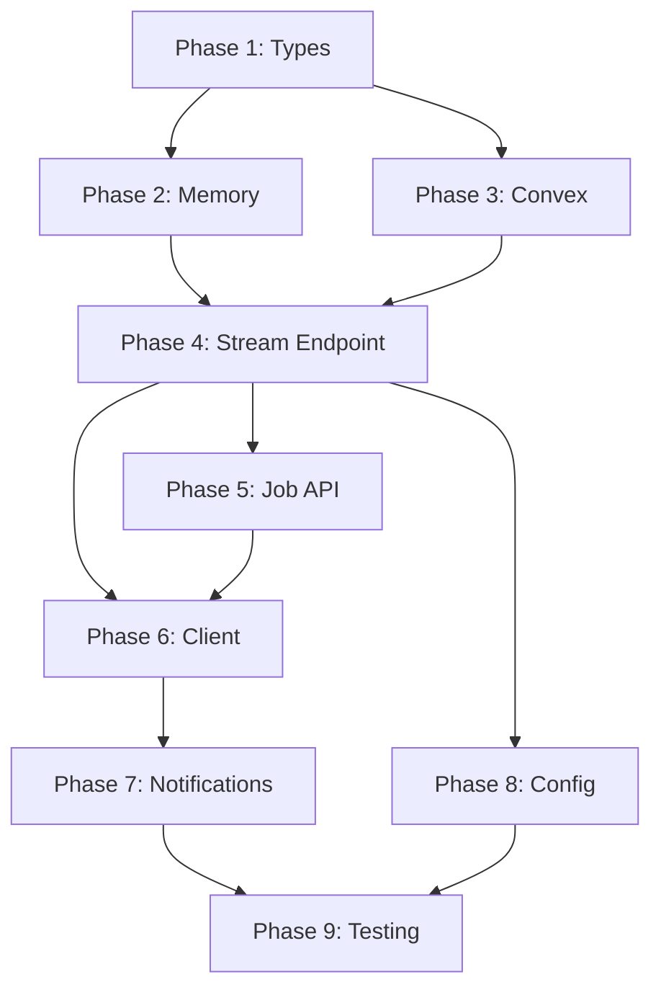

# Background Streaming - Tasks

artifact_id: bg-stream-001
date: 2026-01-22
updated: 2026-01-22

## Purpose

Implementation checklist for background AI streaming with pluggable provider support.

---

## Phase 1: Provider Interface & Types

### 1. Define Provider Interface
Requirements: 2.1, 3.4

- [ ] 1.1 Create `server/utils/background-jobs/types.ts`
    - [ ] Define `BackgroundJob` interface
    - [ ] Define `CreateJobParams` interface
    - [ ] Define `JobUpdate` interface
    - [ ] Define `BackgroundJobProvider` interface
    
- [ ] 1.2 Create `server/utils/background-jobs/store.ts`
    - [ ] Implement `getJobProvider()` factory
    - [ ] Implement `isBackgroundStreamingEnabled()`
    - [ ] Implement `resetJobProvider()` for testing
    - [ ] Read config from `runtimeConfig.backgroundJobs`

---

## Phase 2: Memory Provider (Default)

### 2. Implement Memory Provider
Requirements: 2.1, 3.1, 3.2

- [ ] 2.1 Create `server/utils/background-jobs/providers/memory.ts`
    - [ ] Implement `createJob()` with UUID generation
    - [ ] Implement `getJob()` with user authorization
    - [ ] Implement `updateJob()` for chunk accumulation
    - [ ] Implement `completeJob()`
    - [ ] Implement `failJob()`
    - [ ] Implement `abortJob()` with AbortController
    - [ ] Implement `getAbortController()`
    - [ ] Implement `cleanupExpired()` with timeout handling
    
- [ ] 2.2 Add lifecycle management
    - [ ] Enforce max concurrent jobs limit
    - [ ] Start cleanup interval on first job
    - [ ] Handle job timeout (mark as error)
    - [ ] Clean up stale completed jobs

---

## Phase 3: Convex Provider

### 3. Implement Convex Provider
Requirements: 2.1, 3.1

- [ ] 3.1 Add Convex schema
    - [ ] Add `backgroundJobs` table to `convex/schema.ts`
    - [ ] Add indexes: `by_user`, `by_status`, `by_message`
    
- [ ] 3.2 Create Convex functions
    - [ ] `convex/backgroundJobs.ts` - mutations & queries
    - [ ] `create` mutation
    - [ ] `get` query with user filter
    - [ ] `update` mutation
    - [ ] `complete` mutation
    - [ ] `fail` mutation
    - [ ] `abort` mutation
    - [ ] `cleanup` mutation (scheduled or on-demand)
    
- [ ] 3.3 Create `server/utils/background-jobs/providers/convex.ts`
    - [ ] Implement all provider interface methods
    - [ ] Use ConvexHttpClient for server-side calls
    - [ ] Handle poll-based abort (no AbortController)

---

## Phase 4: Stream Endpoint Enhancement

### 4. Enhance `/api/openrouter/stream`
Requirements: 2.1, 2.2

- [ ] 4.1 Add background mode detection
    - [ ] Check for `_background: true` in request body
    - [ ] Validate `_threadId` and `_messageId`
    - [ ] Check `isBackgroundStreamingEnabled()`
    
- [ ] 4.2 Implement background mode handler
    - [ ] Get provider via `getJobProvider()`
    - [ ] Create job and return `{ jobId, status }` immediately
    - [ ] Handle max jobs exceeded (503)
    
- [ ] 4.3 Implement `streamInBackground()` function
    - [ ] Get AbortController from provider (if supported)
    - [ ] Stream from OpenRouter
    - [ ] Update provider with chunks periodically
    - [ ] Check for abort status (poll-based for Convex)
    - [ ] Call `completeJob()` on success
    - [ ] Call `failJob()` on error
    
- [ ] 4.4 Preserve existing foreground behavior
    - [ ] No breaking changes for non-background requests

---

## Phase 5: Job Management API

### 5. Create Job Endpoints
Requirements: 2.1, 3.3

- [ ] 5.1 Create `server/api/jobs/[id]/status.get.ts`
    - [ ] Resolve user from session
    - [ ] Get job from provider
    - [ ] Return status, progress, timestamps
    - [ ] Handle 404 for missing/unauthorized
    
- [ ] 5.2 Create `server/api/jobs/[id]/abort.post.ts`
    - [ ] Resolve user from session
    - [ ] Call provider's `abortJob()`
    - [ ] Return `{ aborted: boolean }`

---

## Phase 6: Client Integration

### 6. Client-Side Changes
Requirements: 2.1, 2.2, 2.3

- [ ] 6.1 Add to `app/utils/chat/openrouterStream.ts`
    - [ ] Export `startBackgroundStream()` 
    - [ ] Export `pollJobStatus()`
    - [ ] Export `abortBackgroundJob()`
    - [ ] Export `isBackgroundStreamingEnabled()` (client-side)
    
- [ ] 6.2 Modify `app/composables/chat/useAi.ts`
    - [ ] Modify `clear()` to detach instead of abort (SSR mode)
    - [ ] Add reattach logic on thread load
    - [ ] Store detached stream references
    - [ ] Handle completed background jobs

---

## Phase 7: Notification Integration

### 7. Connect to Notification Center
Requirements: 2.4

- [ ] 7.1 Server-side notification emission
    - [ ] Create `emitBackgroundComplete()` helper
    - [ ] Store notification via Convex/Dexie
    - [ ] Include threadId for navigation
    
- [ ] 7.2 Mute preference handling
    - [ ] Check thread mute status before creating notification
    - [ ] Skip notification if user is viewing thread

---

## Phase 8: Configuration

### 8. Add Runtime Config
Requirements: 3.4

- [ ] 8.1 Update `nuxt.config.ts`
    - [ ] Add `runtimeConfig.backgroundJobs` section
    - [ ] Document environment variables in README
    
- [ ] 8.2 Ensure static build compatibility
    - [ ] Feature detection prevents background code paths
    - [ ] Test static build has no regressions

---

## Phase 9: Testing

### 9. Unit Tests
Requirements: All

- [ ] 9.1 Memory provider tests
    - [ ] All CRUD operations
    - [ ] Max jobs limit
    - [ ] Timeout/cleanup
    - [ ] Authorization checks
    
- [ ] 9.2 Convex provider tests
    - [ ] All CRUD operations
    - [ ] Poll-based abort
    
- [ ] 9.3 Provider factory tests
    - [ ] Correct provider selection
    - [ ] Fallback behavior

### 10. Integration Tests

- [ ] 10.1 Full background stream flow
    - [ ] Start → complete → notification
    - [ ] Start → abort → verify aborted
    - [ ] Start → timeout → error notification
    
- [ ] 10.2 Provider switching
    - [ ] Memory → Convex via config change

### 11. Manual Tests

- [ ] 11.1 SSR mode with Memory provider
    - [ ] Send message → close tab → reopen → message present
    
- [ ] 11.2 SSR mode with Convex provider
    - [ ] Same as above, verify persistence
    
- [ ] 11.3 Static build
    - [ ] Verify no regressions

---

## Dependencies



---

## Estimated Effort

| Phase | Effort |
|-------|--------|
| Phase 1: Types & Interface | 0.5 hours |
| Phase 2: Memory Provider | 1.5 hours |
| Phase 3: Convex Provider | 2 hours |
| Phase 4: Stream Endpoint | 1.5 hours |
| Phase 5: Job API | 1 hour |
| Phase 6: Client Integration | 2 hours |
| Phase 7: Notifications | 1 hour |
| Phase 8: Configuration | 0.5 hours |
| Phase 9: Testing | 2 hours |
| **Total** | **~12 hours** |

---

## Parallel Development Strategy

Since Memory and Convex providers share the same interface, they can be developed in parallel:

```
Developer A                    Developer B
-----------                    -----------
Phase 1 (Types)                Phase 1 (Types)
     |                              |
Phase 2 (Memory)               Phase 3 (Convex)
     |                              |
     +---------> Phase 4 <----------+
                (Stream Endpoint)
                     |
              Phase 5-9 (Sequential)
```

**Testing strategy:** Run all tests against both providers to ensure interface compliance.
