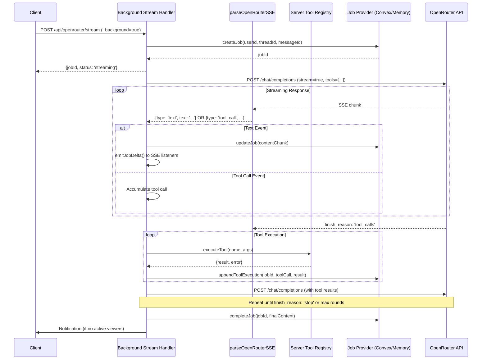
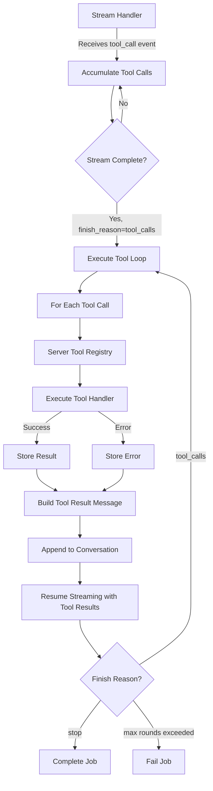
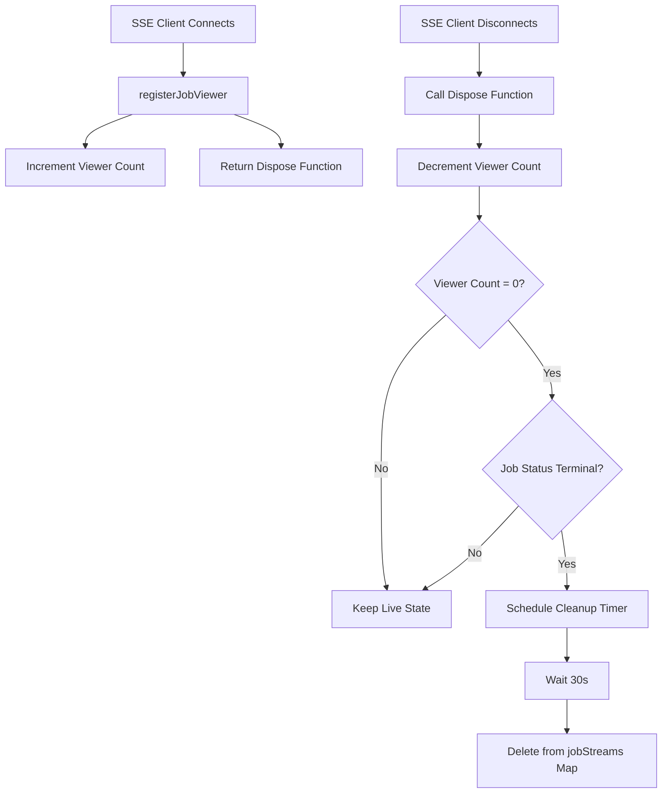

# Background Tool & Workflow Execution - Technical Design

## Overview

This document outlines the technical architecture for enabling tool calls and workflow execution in the OR3 Chat background streaming system. The design extends the existing background jobs infrastructure to support multi-turn AI conversations with tool use, server-side tool execution, and workflow agent orchestration.

**Key Challenges Addressed:**
1. **Tool execution in Node.js server context** (vs. browser-only Vue composables)
2. **Multi-turn conversation loop** with tool results fed back to the model
3. **Memory leaks** in job viewers and live state tracking
4. **Performance bottlenecks** in SSE broadcasting and database writes
5. **State persistence** for workflows across server restarts

## System Architecture

### High-Level Flow



## Core Components

### 1. Server-Side Tool Registry

**Location:** `server/utils/tools/tool-registry.ts` (new)

The client-side tool registry (`app/utils/chat/tool-registry.ts`) is Vue-specific and browser-dependent. We need a parallel server-side implementation.

**Interface:**
```typescript
/**
 * Server-side tool handler signature
 */
export type ServerToolHandler<TArgs = Record<string, unknown>> = (
    args: TArgs,
    context: ToolExecutionContext
) => Promise<string> | string;

export interface ToolExecutionContext {
    userId: string;
    threadId: string;
    jobId: string;
    signal?: AbortSignal; // For cancellation
}

export interface ServerToolDefinition {
    name: string;
    description?: string;
    function: {
        name: string;
        description: string;
        parameters: {
            type: 'object';
            properties: Record<string, unknown>;
            required?: string[];
        };
    };
    handler: ServerToolHandler;
    enabled: boolean;
    timeoutMs?: number; // Default: 10000
    clientOnly?: boolean; // If true, cannot run server-side
}

export interface ServerToolRegistry {
    registerTool(definition: ServerToolDefinition): void;
    unregisterTool(name: string): void;
    getTool(name: string): ServerToolDefinition | undefined;
    listTools(): ServerToolDefinition[];
    getEnabledDefinitions(): ToolDefinition[]; // For OpenRouter API
    executeTool(
        name: string,
        args: string,
        context: ToolExecutionContext
    ): Promise<ToolExecutionResult>;
}

export interface ToolExecutionResult {
    result: string | null;
    toolName: string;
    error?: string;
    timedOut: boolean;
    executionTimeMs: number;
}
```

**Implementation Details:**
- Singleton registry stored in module scope (not Vue reactive)
- Tools register via plugin system: `server/plugins/tools/` (new directory)
- Built-in tools: `get_current_time`, `calculate`, `web_search` (if API key available)
- Timeout enforcement using `Promise.race()` with AbortController propagation
- Validation using JSON schema (reuse logic from client registry)

**Example Tool Registration:**
```typescript
// server/plugins/tools/time.ts
import { defineServerTool } from '~/server/utils/tools/tool-registry';

export default defineServerTool({
    name: 'get_current_time',
    description: 'Get the current date and time',
    function: {
        name: 'get_current_time',
        description: 'Returns the current date and time in ISO 8601 format',
        parameters: {
            type: 'object',
            properties: {
                timezone: {
                    type: 'string',
                    description: 'IANA timezone (e.g., "America/New_York")',
                },
            },
        },
    },
    handler: async (args) => {
        const tz = args.timezone || 'UTC';
        return new Date().toLocaleString('en-US', { timeZone: tz });
    },
    enabled: true,
});
```

### 2. Tool Execution Loop

**Location:** `server/utils/background-jobs/tool-executor.ts` (new)

Handles multi-turn tool call conversations.

**Interface:**
```typescript
export interface ToolRoundResult {
    toolCalls: Array<{
        id: string;
        name: string;
        arguments: string;
        result: string;
        error?: string;
        executionTimeMs: number;
    }>;
    totalExecutionMs: number;
}

export interface ToolExecutionLoopParams {
    jobId: string;
    initialMessages: ORMessage[];
    model: string;
    apiKey: string;
    userId: string;
    threadId: string;
    referer: string;
    provider: BackgroundJobProvider;
    maxRounds?: number; // Default: 10
    maxToolsPerRound?: number; // Default: 20
}

export interface ToolExecutionLoopResult {
    finalContent: string;
    totalRounds: number;
    totalToolCalls: number;
    toolRounds: ToolRoundResult[];
    finishReason: 'stop' | 'length' | 'tool_limit' | 'error';
}

/**
 * Execute a tool call conversation loop.
 * Called by consumeBackgroundStream when tool_calls are detected.
 */
export async function executeToolLoop(
    params: ToolExecutionLoopParams
): Promise<ToolExecutionLoopResult>;
```

**Algorithm:**
1. Initialize conversation with `initialMessages`
2. Loop (max 10 rounds):
   - Stream response from OpenRouter
   - If `finish_reason === 'tool_calls'`:
     - Extract tool calls from stream
     - Execute each tool via `ServerToolRegistry`
     - Append tool results to conversation
     - Continue loop
   - If `finish_reason === 'stop'` or `'length'`:
     - Return final content
3. Persist tool execution metadata to job storage

**Error Handling:**
- Tool execution errors are passed back to the model as tool results
- Network errors trigger exponential backoff (1 retry)
- Timeout at round level: 2 minutes per round

### 3. Enhanced Stream Handler

**Location:** `server/utils/background-jobs/stream-handler.ts` (modified)

**Changes to `consumeBackgroundStream`:**

```typescript
export async function consumeBackgroundStream(params: {
    jobId: string;
    stream: ReadableStream<Uint8Array>;
    context: BackgroundStreamParams;
    provider: BackgroundJobProvider;
    // ... existing params
}): Promise<void> {
    let fullContent = '';
    let chunks = 0;
    const toolCalls: Array<ORStreamEvent & { type: 'tool_call' }> = [];
    
    // ... existing init code
    
    try {
        for await (const evt of parseOpenRouterSSE(params.stream)) {
            if (evt.type === 'text') {
                // ... existing text handling
            } else if (evt.type === 'tool_call') {
                // NEW: Accumulate tool calls
                toolCalls.push(evt);
                
                // Emit tool call status to SSE listeners
                emitJobToolCall(params.jobId, {
                    id: evt.tool_call.id,
                    name: evt.tool_call.function.name,
                    status: 'pending',
                });
            }
        }
        
        // NEW: If tool calls detected, execute tool loop
        if (toolCalls.length > 0) {
            const registry = getServerToolRegistry();
            const messages = buildMessagesFromJobContext(params.context);
            
            const loopResult = await executeToolLoop({
                jobId: params.jobId,
                initialMessages: messages,
                model: params.context.body.model as string,
                apiKey: params.apiKey,
                userId: params.userId,
                threadId: params.threadId,
                referer: params.referer,
                provider: params.provider,
            });
            
            fullContent = loopResult.finalContent;
            
            // Persist tool execution metadata
            await params.provider.updateJobMetadata(params.jobId, {
                tool_rounds: loopResult.toolRounds,
                total_tool_calls: loopResult.totalToolCalls,
            });
        }
        
        // ... existing completion logic
    } catch (err) {
        // ... existing error handling
    }
}
```

### 4. Job Storage Schema Extensions

**Location:** `server/utils/background-jobs/types.ts` (modified)

Extend `BackgroundJob` interface:

```typescript
export interface BackgroundJob {
    // ... existing fields
    
    /** Job type: 'chat' or 'workflow' */
    type?: 'chat' | 'workflow';
    
    /** Active tool calls (for progress tracking) */
    activeToolCalls?: Array<{
        id: string;
        name: string;
        status: 'pending' | 'running' | 'completed' | 'error';
        startedAt?: number;
        finishedAt?: number;
        error?: string;
    }>;
    
    /** Completed tool rounds (for observability) */
    toolRounds?: Array<{
        round: number;
        toolCalls: Array<{
            id: string;
            name: string;
            arguments: string;
            result: string;
            error?: string;
            executionTimeMs: number;
        }>;
    }>;
    
    /** Workflow execution state (if type === 'workflow') */
    workflowState?: {
        workflowId: string;
        workflowName: string;
        nodeStates: Record<string, NodeState>;
        executionOrder: string[];
        currentNodeId: string | null;
        failedNodeId?: string | null;
    };
}
```

**Convex Schema Updates:**

```typescript
// convex/schema.ts (extend background_jobs table)
background_jobs: defineTable({
    user_id: v.string(),
    thread_id: v.string(),
    message_id: v.string(),
    model: v.string(),
    status: v.union(
        v.literal('streaming'),
        v.literal('complete'),
        v.literal('error'),
        v.literal('aborted')
    ),
    type: v.optional(v.union(v.literal('chat'), v.literal('workflow'))),
    content: v.string(),
    chunks_received: v.number(),
    started_at: v.number(),
    completed_at: v.optional(v.number()),
    error: v.optional(v.string()),
    
    // NEW: Tool execution tracking
    active_tool_calls: v.optional(v.array(v.object({
        id: v.string(),
        name: v.string(),
        status: v.string(),
        started_at: v.optional(v.number()),
        finished_at: v.optional(v.number()),
        error: v.optional(v.string()),
    }))),
    tool_rounds: v.optional(v.array(v.object({
        round: v.number(),
        tool_calls: v.array(v.object({
            id: v.string(),
            name: v.string(),
            arguments: v.string(),
            result: v.string(),
            error: v.optional(v.string()),
            execution_time_ms: v.number(),
        })),
    }))),
    
    // NEW: Workflow state
    workflow_state: v.optional(v.object({
        workflow_id: v.string(),
        workflow_name: v.string(),
        node_states: v.string(), // JSON stringified
        execution_order: v.array(v.string()),
        current_node_id: v.optional(v.string()),
        failed_node_id: v.optional(v.string()),
    })),
})
.index('by_thread_message', ['thread_id', 'message_id'])
.index('by_user_status', ['user_id', 'status'])
```

### 5. Memory Leak Fixes

**Location:** `server/utils/background-jobs/viewers.ts` (modified)

**Issue:** Live job state (`jobStreams` Map) accumulates listeners that aren't cleaned up.

**Fix 1: Explicit Listener Cleanup**
```typescript
export function registerJobStream(
    jobId: string,
    listener: (event: LiveJobEvent) => void
): () => void {
    const state = ensureJobLiveState(jobId);
    state.listeners.add(listener);

    let disposed = false;
    return () => {
        if (disposed) return;
        disposed = true;
        state.listeners.delete(listener);
        
        // NEW: Immediate cleanup if no listeners and terminal status
        if (state.listeners.size === 0 && state.status !== 'streaming') {
            clearJobLiveState(jobId);
        }
    };
}

// NEW: Force cleanup
function clearJobLiveState(jobId: string): void {
    const state = jobStreams.get(jobId);
    if (!state) return;
    
    if (state.cleanupTimer) {
        clearTimeout(state.cleanupTimer);
        state.cleanupTimer = null;
    }
    
    state.listeners.clear();
    jobStreams.delete(jobId);
}
```

**Fix 2: WeakRef for Listeners** (Alternative approach)
Use `WeakRef` to allow garbage collection of disconnected SSE response objects:

```typescript
type LiveJobState = {
    // ... existing fields
    listeners: Set<WeakRef<(event: LiveJobEvent) => void>>;
};

function emitToListeners(state: LiveJobState, event: LiveJobEvent): void {
    const deadRefs: WeakRef<any>[] = [];
    
    for (const ref of state.listeners) {
        const listener = ref.deref();
        if (listener) {
            listener(event);
        } else {
            deadRefs.push(ref);
        }
    }
    
    // Clean up dead refs
    for (const ref of deadRefs) {
        state.listeners.delete(ref);
    }
}
```

### 6. Performance Optimizations

#### 6.1 SSE Broadcast Batching

**Location:** `server/utils/background-jobs/viewers.ts` (modified)

```typescript
const SSE_BATCH_INTERVAL_MS = 100; // 100ms batching
const SSE_BATCH_SIZE = 10; // Or 10 chunks, whichever comes first

type LiveJobState = {
    // ... existing fields
    pendingDeltas: string[];
    lastBroadcastAt: number;
    broadcastTimer: ReturnType<typeof setTimeout> | null;
};

export function emitJobDelta(
    jobId: string,
    delta: string,
    meta: { contentLength: number; chunksReceived: number }
): void {
    if (!delta) return;
    const state = ensureJobLiveState(jobId);
    state.content += delta;
    state.chunksReceived = meta.chunksReceived;
    state.status = 'streaming';
    
    // NEW: Batch deltas
    state.pendingDeltas.push(delta);
    
    const now = Date.now();
    const shouldFlush = 
        state.pendingDeltas.length >= SSE_BATCH_SIZE ||
        now - state.lastBroadcastAt >= SSE_BATCH_INTERVAL_MS;
    
    if (shouldFlush) {
        flushPendingDeltas(jobId, state, meta);
    } else if (!state.broadcastTimer) {
        // Schedule flush
        state.broadcastTimer = setTimeout(() => {
            state.broadcastTimer = null;
            flushPendingDeltas(jobId, state, meta);
        }, SSE_BATCH_INTERVAL_MS);
    }
}

function flushPendingDeltas(
    jobId: string,
    state: LiveJobState,
    meta: { contentLength: number; chunksReceived: number }
): void {
    if (state.pendingDeltas.length === 0) return;
    
    const batchedDelta = state.pendingDeltas.join('');
    state.pendingDeltas = [];
    state.lastBroadcastAt = Date.now();
    
    if (state.broadcastTimer) {
        clearTimeout(state.broadcastTimer);
        state.broadcastTimer = null;
    }
    
    const event: LiveJobEvent = {
        type: 'delta',
        content_delta: batchedDelta,
        content_length: meta.contentLength,
        chunksReceived: meta.chunksReceived,
    };
    
    for (const listener of state.listeners) {
        listener(event);
    }
}
```

#### 6.2 Convex Write Throttling

**Already Implemented** in `consumeBackgroundStream`:
- Flush interval: 120ms by default (configurable via `flushIntervalMs`)
- Chunk-based flush: Every 3 chunks (configurable via `flushChunkInterval`)

**Enhancement:** Add size-based flush trigger:
```typescript
const FLUSH_SIZE_THRESHOLD = 1024; // 1KB

if (pendingChunk.length >= FLUSH_SIZE_THRESHOLD) {
    void flushPending();
}
```

### 7. Workflow Integration

**Location:** `server/utils/background-jobs/workflow-executor.ts` (new)

```typescript
export interface WorkflowBackgroundParams {
    workflowId: string;
    workflowName: string;
    prompt: string;
    attachments?: Attachment[];
    conversationHistory: ChatMessage[];
    apiKey: string;
    userId: string;
    threadId: string;
    messageId: string;
}

export async function executeWorkflowInBackground(
    params: WorkflowBackgroundParams,
    provider: BackgroundJobProvider
): Promise<string> {
    const jobId = await provider.createJob({
        userId: params.userId,
        threadId: params.threadId,
        messageId: params.messageId,
        model: 'workflow',
        type: 'workflow',
    });
    
    // Load workflow definition
    const workflow = await loadWorkflow(params.workflowId);
    
    // Execute with callbacks that update job state
    const result = await executeWorkflow({
        workflow,
        prompt: params.prompt,
        attachments: params.attachments,
        conversationHistory: params.conversationHistory,
        apiKey: params.apiKey,
        
        onToken: (token, meta) => {
            // Update job content
            void provider.updateJob(jobId, { contentChunk: token });
        },
        
        onNodeStart: (nodeId) => {
            // Update workflow state
            void provider.updateWorkflowState(jobId, {
                currentNodeId: nodeId,
                nodeStates: {
                    [nodeId]: { status: 'active', startedAt: Date.now() },
                },
            });
        },
        
        onNodeFinish: (nodeId, output) => {
            void provider.updateWorkflowState(jobId, {
                nodeStates: {
                    [nodeId]: { 
                        status: 'completed', 
                        output,
                        finishedAt: Date.now(),
                    },
                },
            });
        },
        
        onToolCallEvent: (event) => {
            // Track tool calls per node
            void provider.appendToolCall(jobId, {
                nodeId: event.nodeId,
                toolCallId: event.id,
                toolName: event.name,
                status: event.status,
            });
        },
        
        onError: (error) => {
            void provider.failJob(jobId, error.message);
        },
    });
    
    await provider.completeJob(jobId, result.finalOutput);
    return jobId;
}
```

**Note:** Workflows use the same `ServerToolRegistry` for tool execution. Agent nodes that call tools will execute them via the background tool executor.

## Data Flow Diagrams

### Tool Execution Flow


### Memory Management Flow


## Error Handling Strategy

### Tool Execution Errors
```typescript
export class ToolExecutionError extends Error {
    constructor(
        message: string,
        public toolName: string,
        public phase: 'validation' | 'execution' | 'timeout',
        public originalError?: Error
    ) {
        super(message);
        this.name = 'ToolExecutionError';
    }
}

// Usage in tool executor:
try {
    result = await executeToolHandler(tool, args, context);
} catch (err) {
    if (err instanceof ToolExecutionError) {
        // Pass structured error to model
        return {
            result: null,
            toolName: tool.name,
            error: `Tool execution failed: ${err.message}`,
            timedOut: err.phase === 'timeout',
        };
    }
    throw err; // Unexpected error, fail job
}
```

### Network Errors (OpenRouter API)
```typescript
async function fetchWithRetry(
    url: string,
    options: RequestInit,
    maxRetries = 1
): Promise<Response> {
    let lastError: Error | null = null;
    
    for (let attempt = 0; attempt <= maxRetries; attempt++) {
        try {
            const response = await fetch(url, options);
            if (response.ok) return response;
            
            // Don't retry 4xx errors (client error)
            if (response.status >= 400 && response.status < 500) {
                throw new Error(`OpenRouter error ${response.status}`);
            }
            
            // Retry 5xx errors (server error)
            lastError = new Error(`OpenRouter error ${response.status}`);
        } catch (err) {
            lastError = err instanceof Error ? err : new Error(String(err));
        }
        
        if (attempt < maxRetries) {
            await sleep(1000 * Math.pow(2, attempt)); // Exponential backoff
        }
    }
    
    throw lastError || new Error('Fetch failed');
}
```

## Testing Strategy

### Unit Tests

**Tool Registry Tests:**
- Tool registration and retrieval
- Tool execution with valid args
- Tool execution with invalid args (validation errors)
- Tool timeout handling
- Client-only tool blocking

**Tool Executor Tests:**
- Single tool round execution
- Multi-turn tool conversations
- Max rounds limit enforcement
- Max tools per round limit
- Tool execution error handling

**Memory Management Tests:**
- Viewer registration/unregistration
- Live state cleanup on zero viewers
- Cleanup timer triggering
- Listener disposal

**SSE Batching Tests:**
- Delta accumulation under batch size
- Flush on batch size reached
- Flush on interval elapsed
- Flush on job completion

### Integration Tests

**Background Tool Execution:**
1. Start background job with tool-enabled model
2. Mock OpenRouter to return tool_call events
3. Verify tools execute via ServerToolRegistry
4. Verify tool results sent back to model
5. Verify final content persisted

**Multi-Turn Tool Conversation:**
1. Mock model to request tool, then request another tool based on result
2. Verify 2 rounds executed
3. Verify both tool results in job metadata

**Workflow Tool Execution:**
1. Create workflow with agent node that calls tools
2. Execute in background mode
3. Verify node states persisted
4. Verify tool calls tracked per node

### End-to-End Tests

**User Workflow:**
1. User sends message with tools enabled
2. User navigates away (background mode)
3. AI calls tool (e.g., `get_current_time`)
4. Tool executes, result sent to AI
5. AI responds with final answer
6. User returns, sees completed message with tool call indicator

**Performance Tests:**
- 20 concurrent background jobs with tools
- Measure SSE broadcast latency under load
- Measure Convex write throughput
- Verify no memory leaks after 100 jobs

## Deployment Considerations

### Configuration

Add to `nuxt.config.ts`:
```typescript
runtimeConfig: {
    backgroundJobs: {
        enabled: true,
        storageProvider: 'convex', // or 'memory'
        maxConcurrentJobs: 20,
        jobTimeoutMs: 5 * 60 * 1000,
        completedJobRetentionMs: 5 * 60 * 1000,
        
        // NEW:
        toolExecution: {
            enabled: true,
            maxRounds: 10,
            maxToolsPerRound: 20,
            defaultTimeoutMs: 10000,
        },
        
        sseBatching: {
            enabled: true,
            intervalMs: 100,
            batchSize: 10,
        },
    },
}
```

### Feature Flags

Use OR3 config system to gate the feature:
```typescript
// config.or3.ts
export default {
    features: {
        backgroundToolExecution: {
            enabled: true,
            description: 'Enable tool calls in background streaming',
        },
    },
};
```

### Monitoring

Log key metrics:
- `background_tool_execution_started{job_id, tool_name}`
- `background_tool_execution_completed{job_id, tool_name, duration_ms}`
- `background_tool_execution_failed{job_id, tool_name, error_type}`
- `background_job_rounds{job_id, total_rounds}`
- `sse_broadcast_batch_size{job_id, batch_size}`

## Migration Path

1. **Phase 1:** Add server-side tool registry (no behavior change)
2. **Phase 2:** Extend job schema, deploy Convex migrations
3. **Phase 3:** Implement tool execution loop (feature flagged off)
4. **Phase 4:** Enable SSE batching and memory leak fixes
5. **Phase 5:** Enable tool execution for beta users
6. **Phase 6:** Roll out to all users
7. **Phase 7:** Add workflow background execution support

## Backwards Compatibility

- Existing background jobs (text-only) continue to work unchanged
- New job schema fields are optional
- Feature flag allows gradual rollout
- Client-side tool execution remains primary for foreground mode
