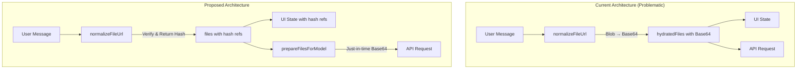

# Blob/Base64 Optimization - Technical Design

## Overview

This design separates Base64 encoding from UI rendering to eliminate memory bloat and CPU overhead. The core change is transforming `normalizeFileUrl` from an eager Base64 converter to a hash validator, and introducing `prepareFilesForModel` as the just-in-time converter for API requests.



---

## Proposed Changes

### Component 1: useAi.ts Dual-Path Separation

#### [MODIFY] [useAi.ts](file:///Users/brendon/Documents/or3-chat/app/composables/chat/useAi.ts)

**Current Problem** (lines 555-656): `normalizeFileUrl` and `hashToContentPart` convert Blobs to Base64 eagerly, leaking large strings into UI state.

**Solution**:

1. **Refactor `normalizeFileUrl`** to only verify Blob existence and return hash references:

```typescript
const normalizeFileUrl = async (f: { type: string; url: string }) => {
  if (typeof FileReader === 'undefined') return f;
  const mime = f.type || '';
  if (!mime.startsWith('image/')) return f;
  let url = f.url || '';
  
  // Already a data URL - pass through (for pasted images not yet stored)
  if (url.startsWith('data:image/')) return { ...f, url };
  
  // Local hash - verify blob exists, return hash reference
  if (!/^https?:|^data:|^blob:/i.test(url)) {
    const { getFileBlob } = await import('~/db/files');
    const blob = await getFileBlob(url);
    if (blob) {
      // Return hash reference - UI will use createObjectURL when needed
      return { ...f, url, _verified: true };
    }
  }
  
  return { ...f, url };
};
```

2. **Extract `prepareFilesForModel`** as a new function for API request preparation:

```typescript
async function prepareFilesForModel(
  files: Array<{ type: string; url: string }>
): Promise<ContentPart[]> {
  const parts: ContentPart[] = [];
  
  for (const f of files) {
    if (!f.url) continue;
    const mime = f.type || '';
    
    // Hash reference - convert to Base64 for API
    if (!/^https?:|^data:|^blob:/i.test(f.url)) {
      const { getFileMeta, getFileBlob } = await import('~/db/files');
      const blob = await getFileBlob(f.url);
      if (!blob) continue;
      
      const dataUrl = await blobToDataUrl(blob);
      if (mime.startsWith('image/')) {
        parts.push({ type: 'image', image: dataUrl, mediaType: mime });
      } else if (mime === 'application/pdf') {
        const meta = await getFileMeta(f.url).catch(() => null);
        parts.push({
          type: 'file',
          data: dataUrl,
          mediaType: mime,
          name: meta?.name || 'document.pdf',
        });
      }
    }
    // Already Base64 data URL - use directly
    else if (f.url.startsWith('data:')) {
      if (mime.startsWith('image/')) {
        parts.push({ type: 'image', image: f.url, mediaType: mime });
      }
    }
  }
  
  return parts;
}

async function blobToDataUrl(blob: Blob): Promise<string> {
  return new Promise((resolve, reject) => {
    const fr = new FileReader();
    fr.onerror = () => reject(fr.error ?? new Error('FileReader error'));
    fr.onload = () => resolve(fr.result as string);
    fr.readAsDataURL(blob);
  });
}
```

3. **Update `buildParts`** call to use the new preparation function just before API request.

---

### Component 2: Hash Computation Optimization

#### [MODIFY] [hash.ts](file:///Users/brendon/Documents/or3-chat/app/utils/hash.ts)

**Optimizations**:

1. **Cache SparkMD5 module** to eliminate repeated dynamic imports:

```typescript
let sparkCache: SparkMd5Module | null = null;

async function loadSpark(): Promise<SparkMd5Module> {
  if (sparkCache) return sparkCache;
  const mod = (await import('spark-md5')) as { default: SparkMd5Module };
  sparkCache = mod.default;
  return sparkCache;
}
```

2. **Increase Web Crypto threshold** from 4MB to 8MB (covers 95% of files):

```typescript
const WEBCRYPTO_THRESHOLD = 8 * 1024 * 1024; // 8MB
```

3. **Pre-allocated hex lookup table** for O(n) hex conversion:

```typescript
const HEX_LOOKUP: string[] = Array.from({ length: 256 }, (_, i) =>
  i.toString(16).padStart(2, '0')
);

function bufferToHex(buf: Uint8Array): string {
  const hexArray = new Array<string>(buf.length);
  for (let i = 0; i < buf.length; i++) {
    hexArray[i] = HEX_LOOKUP[buf[i]];
  }
  return hexArray.join('');
}
```

4. **Adaptive yielding** with scheduler.yield() fallback chain:

```typescript
async function yieldToMain(): Promise<void> {
  if (typeof scheduler !== 'undefined' && scheduler.yield) {
    return scheduler.yield();
  }
  if (typeof requestIdleCallback !== 'undefined') {
    return new Promise(resolve => requestIdleCallback(() => resolve()));
  }
  return new Promise(resolve => setTimeout(resolve, 0));
}
```

---

### Component 3: Database Operation Batching

#### [MODIFY] [files.ts](file:///Users/brendon/Documents/or3-chat/app/db/files.ts)

**Optimizations**:

1. **Parallel metadata + blob writes** in `createOrRefFile`:

```typescript
// Current (sequential):
await db.file_meta.put(mergedMeta);
await db.file_blobs.put({ hash: mergedMeta.hash, blob: file });

// Proposed (parallel):
await Promise.all([
  db.file_meta.put(mergedMeta),
  db.file_blobs.put({ hash: mergedMeta.hash, blob: file }),
]);
```

2. **Bulk operations** in `softDeleteMany`:

```typescript
// Current: individual put() calls in loop
// Proposed: collect updates, single bulkPut()
const updates = metas
  .filter(meta => meta && !meta.deleted)
  .map(meta => ({
    ...meta,
    deleted: true,
    updated_at: nowSec(),
  }));
await db.file_meta.bulkPut(updates);
```

3. **Image loading timeout** in `blobImageSize`:

```typescript
async function blobImageSize(blob: Blob, timeoutMs = 5000) {
  return new Promise((resolve) => {
    const img = new Image();
    const timer = setTimeout(() => {
      URL.revokeObjectURL(img.src);
      resolve(undefined);
    }, timeoutMs);
    
    img.onload = () => {
      clearTimeout(timer);
      const res = { width: img.naturalWidth, height: img.naturalHeight };
      URL.revokeObjectURL(img.src);
      resolve(res);
    };
    // ... error handling ...
  });
}
```

---

### Component 4: Preview Cache Enhancement

#### [MODIFY] [usePreviewCache.ts](file:///Users/brendon/Documents/or3-chat/app/composables/core/usePreviewCache.ts)

**Optimizations**:

1. **Auto-tuned limits** based on device memory:

```typescript
function getDefaultCacheLimits() {
  const mem = navigator.deviceMemory ?? 4;
  if (mem <= 4) {
    return { maxUrls: 80, maxBytes: 48 * 1024 * 1024 };
  }
  return { maxUrls: 120, maxBytes: 80 * 1024 * 1024 };
}
```

2. **Optimized eviction** (sort only unpinned entries):

```typescript
function evictLRU(count: number) {
  const unpinned = [...entries.values()]
    .filter(e => e.pin === 0)
    .sort((a, b) => a.lastAccess - b.lastAccess);
  
  for (let i = 0; i < count && i < unpinned.length; i++) {
    revokeAndRemove(unpinned[i].key);
  }
}
```

---

## Verification Plan

### Automated Tests

1. **Existing tests to verify no regressions**:
```bash
# Run all composable tests (includes previewCache, streamParity)
bun run test -- --run app/composables/__tests__/

# Run file database tests
bun run test -- --run app/db/__tests__/
```

2. **New unit tests for dual-path separation**:
   - Test `normalizeFileUrl` returns hash refs without Base64 conversion
   - Test `prepareFilesForModel` produces correct Base64 content parts
   - Test hash computation with various file sizes

3. **Hash computation performance test**:
   - Verify files ≤8MB use Web Crypto
   - Verify hex conversion uses lookup table

### Manual Verification

> [!IMPORTANT]
> Before proceeding, please confirm how you prefer to manually test memory/performance optimizations. Options include:
> 1. Browser DevTools Memory panel to compare heap snapshots before/after
> 2. Performance panel to measure CPU time during message load
> 3. Visual confirmation that images render correctly with the new architecture

### Browser Test Protocol

1. **Load existing chat with 6+ image attachments**
2. **Open DevTools → Memory tab → Take heap snapshot**
3. **Scroll through messages**
4. **Compare to baseline snapshot** (should show no Base64 strings in UI state)
