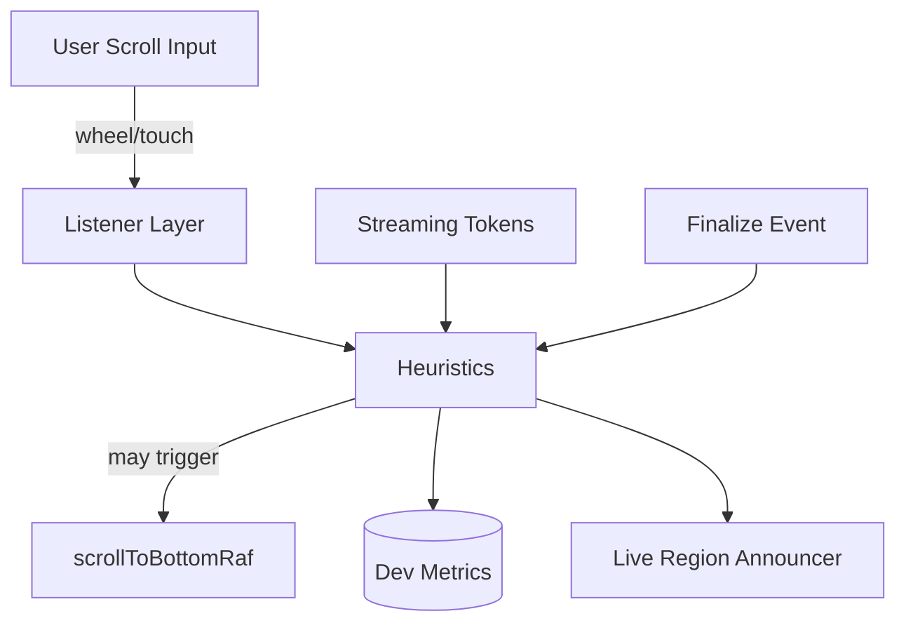

# Chat Scroll Final Polish Design

artifact_id: 94b0ab80-4806-4d99-8984-08f8bf3d75dd

## Overview

Targeted adjustments to `VirtualMessageList.vue` (and minimal `ChatContainer.vue`) to eliminate aggressive auto-scroll suction during streaming and scroll jumps on finalization, plus UX/accessibility refinements. Emphasis on minimal, easily testable heuristics, preserving existing architecture.

## Architecture Additions



## Components Affected

-   `VirtualMessageList.vue`: new heuristic state: `recentBottomEnterAt`, `disengagedAt`, `lastFinalizeAt`, `pendingNewMsgNotice`.
-   `ChatContainer.vue`: add hidden `aria-live` region with debounced burst announcement.

## Heuristic Logic

### Suction Prevention (R1)

Current issue: streaming watchEffect triggers `scrollToBottomRaf(false)` whenever `isStreaming && shouldAutoScroll`. After disengagement we want `shouldAutoScroll` to be false until re-stick criteria satisfied.
Change:

-   Introduce `disengagedAt` timestamp when stick flips false.
-   Modify `shouldAutoScroll = stick && atBottom && !editingActive && !recentDisengage()` where `recentDisengage()` true if `Date.now() - disengagedAt < 200ms` (prevents immediate re-stick due to micro bounce) (R1 guard).

### Delayed Re-Stick (R4)

-   Track `recentBottomEnterAt` when entering threshold zone while stick=false.
-   If remain in zone `>= 300ms` (no upward movement > 4px) then set `stick=true` (allows future shouldAutoScroll true) but only if user hasn't scrolled up again.

### Finalization Stability (R2)

Jump likely from tail placeholder replacement modifying DOM height before previous scrollHeight baseline recorded.
Mitigation:

1. Capture `preFinalizeScrollTop` & `preFinalizeHeight` at finalize start (watching `isStreaming` -> false transition).
2. On nextTick after finalization, compute `delta = (el.scrollTop - preFinalizeScrollTop)`; if user not atBottom and `Math.abs(delta) > 4`, adjust `el.scrollTop = preFinalizeScrollTop` (clamp) and increment metric counter.
3. Avoid smooth behavior during finalize cycle.

### Reduced Motion (R3)

-   Add `prefersReducedMotion = matchMedia('(prefers-reduced-motion: reduce)').matches` reactive listener (only in client) -> `allowSmooth = !prefersReducedMotion`.
-   Smooth scroll only when `allowSmooth && userInitiatedAppend`.

### Announcement Debounce (R7)

-   In `ChatContainer.vue` maintain `newMessagesSinceDisengage` counter. When messages appended and `!stick`, set counter and `setTimeout` 1s; on timeout if counter>0 update live region text `N new messages` then reset counter.

### Editing Stability (R8)

-   Ensure editingActive false transition does not force stick; no changes needed beyond not auto-setting stick.

### Metrics (R10)

Dev-only block (guarded by `if (import.meta.dev)`) maintains counters `scrollCalls`, `preventedAutoScroll`, `finalizeClampCorrections`. Optionally expose via `defineExpose` in dev.

## Data Structures

```ts
interface ScrollHeuristicState {
    disengagedAt: number | null;
    recentBottomEnterAt: number | null;
    lastUserScrollTop: number;
    preFinalize?: { top: number; height: number } | null;
}
```

## Updated shouldAutoScroll

```ts
const shouldAutoScroll = computed(() => {
    if (!stick) return false;
    if (!atBottom.value) return false;
    if (props.editingActive) return false;
    if (state.disengagedAt && Date.now() - state.disengagedAt < 200)
        return false; // suction guard
    return true;
});
```

## Re-Stick Timer

On scroll compute:

```ts
if (!stick && atBottomNow) {
    if (!state.recentBottomEnterAt) state.recentBottomEnterAt = now;
    if (now - state.recentBottomEnterAt >= 300 && !movedUpRecently) {
        stick = true;
    }
} else if (!atBottomNow) {
    state.recentBottomEnterAt = null;
}
```

## Finalization Watch

```ts
watch(
    () => props.isStreaming,
    (v, prev) => {
        if (prev && !v) {
            // finalizing
            const el = scrollEl();
            if (el && !atBottom.value) {
                state.preFinalize = {
                    top: el.scrollTop,
                    height: el.scrollHeight,
                };
                nextTick(() => {
                    if (!state.preFinalize) return;
                    const delta = el.scrollTop - state.preFinalize.top;
                    if (Math.abs(delta) > 4) {
                        el.scrollTop = state.preFinalize.top;
                        if (import.meta.dev) finalizeClampCorrections++;
                    }
                    state.preFinalize = null;
                });
            }
        }
    }
);
```

## Tests Additions

1. streamingSuctionPrevention.test.ts – simulate upward scroll during stream; assert no calls after disengage.
2. finalizeNoJump.test.ts – record before/after scrollTop (disengaged) during finalize.
3. restickDelay.test.ts – bounce into threshold for <150ms (no re-stick) vs >300ms (re-stick).
4. reducedMotion.test.ts – mock matchMedia reduce -> smooth flag not used.
5. liveAnnouncement.test.ts – disengaged append burst of messages; assert one announcement string after debounce.

## Error Handling

-   Guards for missing element remain.
-   If matchMedia unsupported, default to allowing smooth.

## Performance Considerations

-   Only one extra watch (isStreaming finalize) and minimal timestamp comparisons, O(1).
-   No additional DOM queries except during finalize cycle.

## Accessibility Notes

-   Live region should be visually hidden but accessible (`aria-live="polite" role="status" class="sr-only"`).
-   Content updated with concise text; avoid spamming.

## Risks & Mitigations

-   Risk: Over-clamping scroll might fight legit finalization shift if user resumed scrolling; Mitigation: only clamp if user not atBottom AND no userScrolling flag set within last 200ms.
-   Risk: Re-sticking delay feels sluggish; value tunable (300ms) and documented.

## Follow-Up (Optional)

-   Telemetry hook for production to sample scroll corrections frequency.
