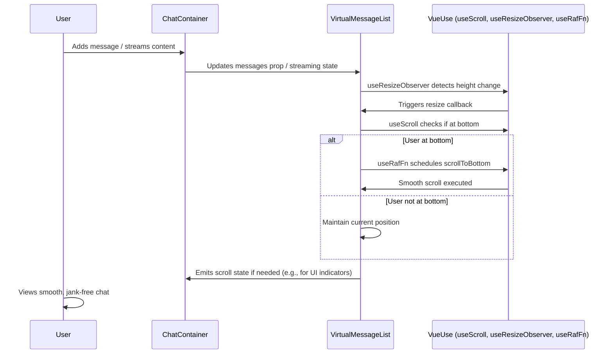

# Chat Scrolling Optimization Design

## Overview

The chat scrolling optimization refactors the scrolling behavior in ChatContainer.vue and related components to address performance bottlenecks, eliminate jank, and reduce code complexity while maintaining all existing functionality. The current implementation relies on a custom `useAutoScroll` composable with multiple watchers, computed properties, and RAF batching via `useRafBatch`, which leads to excessive re-renders, layout thrashing, and jank during streaming and rapid updates. This design proposes consolidating scrolling logic into the `VirtualMessageList` component using VueUse utilities for efficient observation and animation, reducing custom code by approximately 70%. The result will be smoother 60fps scrolling, bug-free behavior across edge cases, and better maintainability.

Key principles:

-   **Declarative over Imperative**: Use VueUse for reactive scroll monitoring instead of manual event listeners and watchers.
-   **Centralization**: Move all scroll logic to `VirtualMessageList` to avoid duplication with `ChatContainer`.
-   **Performance Focus**: Leverage passive listeners, batched updates via `useRafFn`, and ResizeObserver to minimize main-thread work.
-   **Compatibility**: Preserve integration with streaming (via `useStreamAccumulator`), editing (`useMessageEditing`), and virtualization.

Assumptions:

-   Vue 3 with Nuxt 3 and TypeScript.
-   VueUse library is available (install if not: `bun add @vueuse/core`).
-   Existing tests (e.g., `ChatContainer.streamingJank.test.ts`) will be updated to verify improvements.
-   No changes to database or backend; focus on frontend UI.

## Architecture

### High-Level System Flow

The optimized architecture simplifies the scroll management pipeline:

1. **Observation**: Use `useResizeObserver` on the VirtualMessageList container to detect height changes from new messages or streaming.
2. **State Monitoring**: `useScroll` tracks `isAtBottom` and scroll position reactively.
3. **Decision Logic**: A single computed or watchEffect determines if auto-scroll should trigger based on user intent (e.g., manual scroll detected via delta).
4. **Execution**: `useRafFn` batches scrollToBottom calls for smoothness, integrated directly into VirtualMessageList's scroll handler.
5. **Integration Points**: ChatContainer exposes props/refs for messages and streaming state, but defers scrolling to the list component.

This eliminates the separate `useAutoScroll` composable and reduces watchers from ~5-7 to 2-3.

### Component Interaction Diagram



Core Components:

-   **ChatContainer.vue**: Reduced role – manages message list and passes props to VirtualMessageList. Removes direct scroll refs and watchers.
-   **VirtualMessageList.vue**: Enhanced with scroll logic. Handles virtualization (e.g., via `vue-virtual-scroller` or custom) + auto-scroll.
-   **New/Updated Composable**: Optional `useOptimizedScroll.ts` wrapping VueUse functions, but prefer inline in component for code reduction.
-   **Dependencies**: `@vueuse/core` for utilities; no new libraries to keep bundle light.

## Components and Interfaces

### Key Interfaces

Define TypeScript interfaces for scroll state and configuration to ensure type safety and clarity.

```typescript
// types/scroll.ts (new file or extend existing)
export interface ScrollState {
    isAtBottom: boolean;
    scrollTop: number;
    scrollHeight: number;
    clientHeight: number;
    threshold: number; // e.g., 100px for "near bottom"
}

export interface AutoScrollConfig {
    enabled: boolean;
    smooth: boolean; // Use 'smooth' behavior in scrollTo
    threshold: number;
    onScroll?: (state: ScrollState) => void; // Callback for external listeners
}

export interface VirtualMessageListProps {
    messages: Message[]; // Existing message type
    isStreaming: boolean;
    onScrollStateChange?: (state: ScrollState) => void;
    autoScrollConfig?: Partial<AutoScrollConfig>;
}

// In VirtualMessageList.vue setup()
const scrollState = useScroll(containerRef, { behavior: 'passive' });
const resizeObserver = useResizeObserver(containerRef, () => {
    // Trigger potential scroll adjustment
});
const scrollToBottom = useRafFn(() => {
    if (scrollState.value.isAtBottom) {
        containerRef.value?.scrollTo({
            top: containerRef.value.scrollHeight,
            behavior: 'smooth',
        });
    }
});
```

-   **VirtualMessageList**: Uses `computed` for `shouldAutoScroll` based on `isAtBottom` and message changes.
-   **ChatContainer**: Forwards refs and uses `watch` only on `messages.length` to trigger list updates, delegating scroll to child.

### Data Structures

No major database changes, but enhance in-memory state:

```typescript
// Extend existing Message type if needed
export interface OptimizedMessage extends Message {
    // Add if useful for streaming: isStreaming?: boolean;
}

// Scroll config defaults
const defaultConfig: AutoScrollConfig = {
    enabled: true,
    smooth: true,
    threshold: 100,
};
```

## Error Handling

Error scenarios are primarily UI-related (e.g., DOM not ready, resize failures). Use the project's standardized error handling from `@core/engine/errors.ts`.

-   **Scenarios**:

    -   Container ref not available: Log warning via logger, fallback to `window.scrollTo`.
    -   ResizeObserver not supported (older browsers): Fallback to `watchEffect` on message length.
    -   Infinite scroll loop during rapid updates: Use debounced `useRafFn` with a 16ms throttle.
    -   Streaming jank from external renders (e.g., markdown): Delay scroll until `nextTick()`.

-   **Pattern**: Wrap scroll operations in try-catch, returning a `ServiceResult<ScrollState, Error>` (if integrating with existing pattern):

```typescript
import { ServiceResult } from '@core/engine/errors'; // Assuming existing

const performScroll = (): ServiceResult<void, string> => {
    try {
        // Scroll logic
        return { success: true, data: undefined };
    } catch (error) {
        logger.error('Scroll failed', error);
        return { success: false, error: 'Scroll operation failed' };
    }
};
```

-   **Recovery**: On error, disable auto-scroll temporarily and notify user via toast (if UI lib supports).

## Testing Strategy

Align with existing test suite using Vitest. Focus on unit, integration, and performance testing to verify jank elimination.

-   **Unit Tests**:

    -   Test `useScroll` integration: Mock container, verify `isAtBottom` computation.
    -   Test `scrollToBottom` with `useRafFn`: Ensure batching prevents multiple calls.
    -   Edge cases: Empty list, single message, threshold calculations.

-   **Integration Tests**:

    -   Mount `VirtualMessageList` with `ChatContainer`: Simulate message additions, streaming via `useStreamAccumulator`, verify no jank (use `vi.useFakeTimers` for RAF).
    -   Update existing `ChatContainer.streamingJank.test.ts` and `VirtualMessageList.test.ts` to assert smooth scroll (e.g., check scrollTop after updates).
    -   Manual scroll simulation: Use `fireEvent.scroll` to test position maintenance.

-   **End-to-End Tests**:

    -   Use `@vue/test-utils` or Playwright for full component: Load chat page, stream message, assert visual stability (screenshot diffs if possible).
    -   Performance: Use Vitest's `performance` API or browser perf metrics to ensure <16ms per frame during 100-message batch.

-   **Performance Testing**:
    -   Benchmark before/after: Use Chrome DevTools or `vitest --reporter=verbose` to measure layout shifts.
    -   Load test: Simulate 10k messages with virtualization, verify FPS >60.

All tests must pass existing coverage thresholds. Add new tests for VueUse integrations and jank scenarios.
