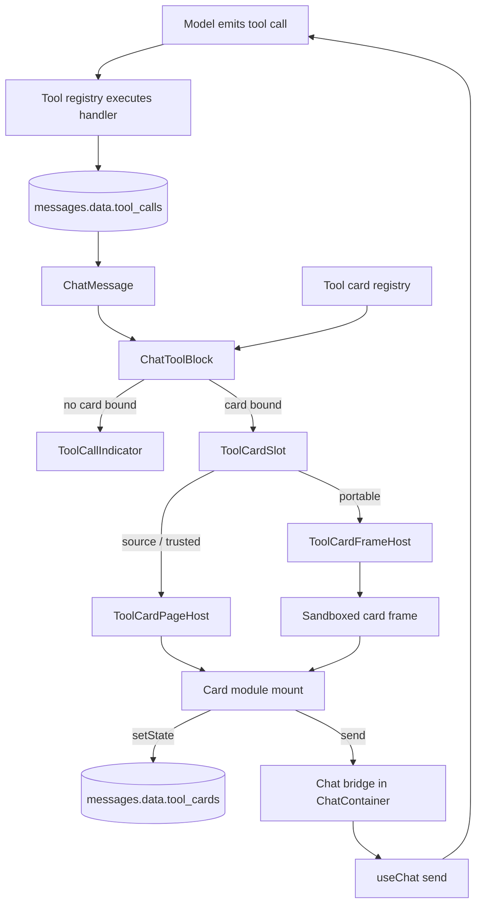
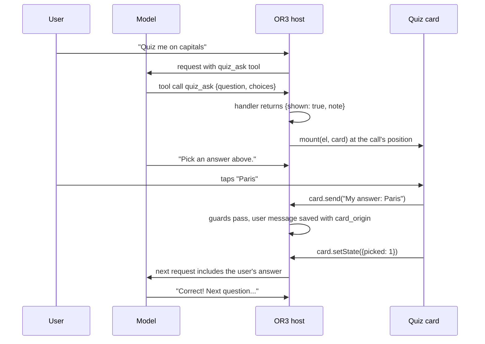

# Design

## Overview

**The idea in one sentence:** a plugin registers a tool and a card; when the model
calls that tool, the card renders inside the reply where the call happened.

Everything else follows from reusing what OR3 already has:

- Ordered assistant `parts` already tell us where each tool call sits in a reply.
- `messages.data.tool_calls` already persists each call's arguments and result,
  so cards re-render after reload and sync without re-running tools.
- The tool registry, the trusted-host context and the portable tool adapter
  already register tools for all three plugin paths.
- The portable runtime already serves verified package bytes into an
  opaque-origin sandbox frame.

The developer writes one function:

```ts
export default defineToolCard({
    mount(el, card) {
        el.textContent = `${card.result?.temp}° in ${card.result?.place}`;
    },
});
```

The host decides where that function runs:

| Plugin path | Runtime | Why |
| --- | --- | --- |
| Source plugin (`app/plugins/*.client.ts`) | In-page | Already part of the host source |
| Trusted-host package (`trust: 'trusted-host'`) | In-page | Already reviewed to run in the host page |
| Portable package (`trust: 'isolated-client'`) | Sandboxed frame | Marketplace code must not reach the page |

The same card file works in both runtimes. Vue and React are one-line wrappers.

### Delivery order

The plan is implemented in one project, in an order where each step is usable:

1. **Cards for source plugins:** registry, rendering, state, `send`, the quiz,
   weather and map examples, and the E2E lane.
2. **Cards for trusted-host packages:** SDK types and helpers, the trusted
   context method, contribution kind, grant and review.
3. **Cards for portable packages:** the shared contained-view frame, manifest,
   review, verified bundle delivery and containment probes. This runtime is
   fully built but stays disabled per browser engine until its probes pass.

## How it fits together



### The quiz, end to end



## Developer experience at a glance

### Source plugin: a display tool and its card in one call

```ts
// app/plugins/examples/quiz-card-example.client.ts
import { defineToolCard } from '@or3/plugin-sdk/cards';
import { registerCardTool } from '~/utils/chat/tool-cards-public';

type QuizArgs = { question: string; choices: string[] };
type QuizState = { picked: number };

const quizCard = defineToolCard<QuizArgs, unknown, QuizState>({
    mount(el, card) {
        const render = () => {
            const question = document.createElement('p');
            question.textContent = card.args?.question ?? '';
            const buttons = (card.args?.choices ?? []).map((choice, index) => {
                const button = document.createElement('button');
                button.textContent = choice;
                button.disabled = card.state !== null;
                button.setAttribute('aria-pressed', String(card.state?.picked === index));
                button.onclick = async () => {
                    const sent = await card.send(`My answer: ${choice}`);
                    if (sent.ok) await card.setState({ picked: index });
                };
                return button;
            });
            el.replaceChildren(question, ...buttons);
        };
        render();
        return card.onUpdate(render);
    },
});

export default defineNuxtPlugin(() => {
    const handle = registerCardTool<QuizArgs>({
        name: 'quiz_ask',
        description: 'Show the user one multiple-choice question, then stop and wait for their answer.',
        parameters: {
            type: 'object',
            properties: {
                question: { type: 'string' },
                choices: { type: 'array', items: { type: 'string' }, minItems: 2, maxItems: 6 },
            },
            required: ['question', 'choices'],
        },
        label: 'Quiz',
        card: quizCard,
        handler: () => ({ shown: true, note: 'The user can see the question. Wait for their answer and do not reveal it.' }),
    });
    if (import.meta.hot) import.meta.hot.dispose(() => handle.dispose());
});
```

### Vue card

```vue
<!-- WeatherCard.vue -->
<script setup lang="ts">
import type { ToolCardContext } from '@or3/plugin-sdk/cards';
import type { Forecast } from './forecast';
defineProps<{ card: ToolCardContext<{ location?: string }, Forecast> }>();
</script>

<template>
    <section class="weather" :data-daytime="card.result?.isDay">
        <p class="place">{{ card.result?.place }}</p>
        <p class="temp">{{ Math.round(card.result?.current.temperature ?? 0) }}°</p>
        <p>{{ card.result?.current.summary }}</p>
    </section>
</template>
```

```ts
registerCardTool({
    name: 'weather_show',
    description: "Show the current weather and forecast. Omit location to use the user's location.",
    parameters: { type: 'object', properties: { location: { type: 'string' } } },
    handler: ({ location }) => getForecast(location),
    card: vueCard(WeatherCard),
    label: 'Weather',
    chrome: 'none',
    minHeight: 220,
});
```

### React card (any package that bundles React)

```tsx
import { reactCard } from '@or3/plugin-sdk/cards/react';
export default reactCard(({ card }) => <p>{card.result?.temp}°</p>);
```

### Portable package

```json
{
    "requestedGrants": ["tools.register.client", "chat.tool.card", "network.http"],
    "toolCards": [
        {
            "id": "forecast",
            "tool": "acme_weather_show",
            "entry": "cards/forecast.mjs",
            "label": "Weather",
            "chrome": "none",
            "minHeight": 220
        }
    ]
}
```

`cards/forecast.mjs` exports a card module (for example `export default vueCard(Forecast)`);
`or3-plugin build` bundles it with Vue included.

## Current implementation versus required change

Paths are relative to the repository root.

| Existing code | What it does today | Change |
| --- | --- | --- |
| `app/components/chat/ChatMessage.vue` | Renders ordered text and tool blocks; legacy indicator above text | Render tool blocks with `ChatToolBlock`; add end-placed cards; show `card_origin` chip on user rows |
| `app/components/chat/ToolCallIndicator.vue` | Renders a tool group and the built-in document-change card | Unchanged API; used for calls without a card |
| `app/composables/chat/message-renderers.ts` | Owner-checked registry with reactive revision | Pattern copied for `tool-cards.ts` |
| `app/utils/chat/tool-registry.ts` | Registers tools; no owning plugin recorded | Add optional `ownerPluginId` to options and records, plus `ownerOf(name)` |
| `app/composables/plugins/workspace-runtime.ts` | Managed runtime; knows `ownerPluginId` | Pass owner to tool registration; add `registerToolCard` |
| `app/composables/plugins/portable-tools.ts` | Discovers and registers portable tools | Pass owner; companion `portable-tool-cards.ts` registers frame bindings |
| `app/composables/plugins/trusted-host-context.ts` | Maps contribution kinds to registries | Add `chat.tool.card` and `context.chat.registerToolCard` |
| `app/utils/chat/uiMessages.ts` | Maps stored rows to `UiChatMessage` | Add `toolCards` and `cardOrigin` |
| `app/db/messages.ts` (`patchMessageInDb`) | Shallow `data` key merge inside the write transaction | Add a nested-entry merge for one key of a map |
| `app/utils/chat/types.ts`, `app/composables/chat/useAi.ts` | `SendMessageParams`; user row creation | Add `cardOrigin`, written as `data.card_origin` |
| `app/components/chat/ChatContainer.vue` | Owns `useChat` and `onSend` | Provide the chat bridge for cards |
| `shared/plugins/isolation/containment-policy.ts` | Portable policy and CSP | Add the contained-view policy and CSP builder |
| `shared/plugins/isolation/portable-frame-document.ts` | Portable relay and wire guard | Reuse the wire guard; new contained-view relay beside it |
| `server/routes/or3/portable-frame.get.ts` | Serves the portable frame | New route serves the card frame with a per-card CSP |
| `server/admin/plugins/package-client-entry.ts` | Hashes the served client entry | Also hash card entries and stylesheets |
| `server/admin/extensions/types.ts` | Manifest zod schema | Add `toolCards` |
| `shared/plugins/runtime-descriptor.ts` | Descriptor sent to the browser | Add verified card descriptors |
| `server/admin/plugins/v2-host-capabilities.ts` | Grant qualification registry | Add `chat.tool.card` and `chat.tool.card.embed` |
| `shared/plugins/grant-description.ts` | Review text per grant | Describe both grants |
| `shared/plugins/contribution-surfaces.ts` | Admin-selectable surfaces | Add `chat-tool-cards` |
| `packages/plugin-sdk/src/{contracts,capabilities,manifest}.ts` | Kinds, clients, grants, manifest type | Add kind, grants, method, `toolCards` |
| `packages/plugin-sdk/src/cli/{build,validate,create}.ts` | Bundles and checks the client entry | Bundle and check card entries; scaffold option |
| `app/theme/_shared/design-token-registry.ts` | Canonical theme tokens | Source of tokens sent to frames |
| `app/core/hooks/{hook-keys,hook-types}.ts` | Hook maps | Two observability hooks |

## Components and interfaces

### 1. Card module and card context (`@or3/plugin-sdk/cards`)

New files: `packages/plugin-sdk/src/cards.ts`, `cards-vue.ts`, `cards-react.ts`,
exported as `./cards`, `./cards/vue` and `./cards/react`. They import nothing from
the host.

```ts
import type { PluginResult } from './results';

export type ToolCardStatus = 'running' | 'complete' | 'error';
export type ToolCardRuntime = 'page' | 'frame';

export interface ToolCardTheme {
    readonly mode: 'light' | 'dark';
    /** Already applied to the card root; provided for canvas/chart code. */
    readonly tokens: Readonly<Record<`--${string}`, string>>;
}

export interface ToolCardContext<TArgs = unknown, TResult = unknown, TState = unknown> {
    readonly tool: string;
    readonly callId: string;
    readonly messageId: string;
    readonly runtime: ToolCardRuntime;
    readonly status: ToolCardStatus;
    readonly args: TArgs | null;
    readonly result: TResult | null;
    readonly error: string | null;
    readonly state: TState | null;
    readonly theme: ToolCardTheme;
    /** Aborted when the card unmounts. */
    readonly signal: AbortSignal;
    setState(next: TState): Promise<PluginResult<void>>;
    send(text: string): Promise<PluginResult<void>>;
    openLink(url: string): Promise<PluginResult<void>>;
    /** Called after any field above changes (batched per microtask). Returns an unsubscribe. */
    onUpdate(listener: (card: ToolCardContext<TArgs, TResult, TState>) => void): () => void;
}

export interface ToolCardModule<TArgs = unknown, TResult = unknown, TState = unknown> {
    mount(
        el: HTMLElement,
        card: ToolCardContext<TArgs, TResult, TState>
    ): void | (() => void);
    /** In-page runtime only. Set by `vueCard`; rendered in the host tree with a `card` prop. */
    readonly component?: unknown;
}

export function defineToolCard<TArgs = unknown, TResult = unknown, TState = unknown>(
    module: ToolCardModule<TArgs, TResult, TState>
): ToolCardModule<TArgs, TResult, TState>;
```

Context fields are live getters: reading `card.state` always returns the latest
value. Only the context object crosses into card code; it has no reference to
host objects.

**Parsing:** `args` comes from `ToolCallInfo.args` and `result` from
`ToolCallInfo.result` (the UI projection, at most 32 KiB per
`shared/chat/tool-limits.ts`). Each is `JSON.parse`d when valid, otherwise passed
as the raw string. A result replaced by the host's omission notice is passed as
that string, so cards should keep their payload compact.

**Helpers:**

- `vueCard(Component)` returns `{ component: Component, mount }`. In-page, the
  host renders `component` in its own tree (so trusted cards inherit the app
  context and can use `context.ui.kit`). In a frame, `mount` creates a Vue app with
  a `shallowReactive` copy of the context that `onUpdate` refreshes.
- `reactCard(Component)` returns `{ mount }`, which calls `createRoot(el)` and
  re-renders with a fresh frozen snapshot on each update. `react` and `react-dom`
  are optional peer dependencies of the SDK; the SDK's own typecheck uses dev
  dependencies for them, and the host app never imports this subpath.
- `escapeHtml(value)` for authors who build markup strings. The docs state the
  rule plainly: model-generated `args` are untrusted text; in-page cards must use
  `textContent`, framework bindings or `escapeHtml`, never raw `innerHTML`.
- `createToolCardHarness({ args, result, state, status, runtime })` in
  `@or3/plugin-sdk/testing`: returns a context whose actions record calls, plus
  `update(patch)` to drive `onUpdate`. It lets authors unit-test cards in jsdom
  or happy-dom without OR3.

### 2. Card bindings and the registry

New file: `app/composables/chat/tool-cards.ts`, mirroring
`message-renderers.ts`.

```ts
export interface ToolCardPresentation {
    readonly label?: string;                     // accessible name and attribution; default: tool label
    readonly placement?: 'inline' | 'end';       // default 'inline'
    readonly renderWhile?: 'complete' | 'always';// default 'complete'
    readonly chrome?: 'card' | 'none';           // default 'card'
    readonly minHeight?: number;                 // px reserved before mount; 48–720, default 64
}

export type ToolCardSource =
    | { readonly kind: 'page'; readonly module: ToolCardModule }
    | {
          readonly kind: 'frame';
          readonly pluginId: string;
          readonly packageDigest: Sha256;
          readonly card: PackageV2ToolCardDescriptor; // id, entry, digests, embeds
      };

export interface ToolCardBinding extends ToolCardPresentation {
    readonly tool: string;
    /** null for source plugins */
    readonly ownerPluginId: string | null;
    readonly source: ToolCardSource;
}

export function registerToolCardBinding(binding: ToolCardBinding): RegistrationHandle;
export function resolveToolCard(toolName: string): ToolCardBinding | null;
```

Rules:

- **One card per tool.** A second binding for the same tool from a different
  owner throws `ToolCardConflictError`. The same owner replaces its earlier
  binding (hot reload, plugin update).
- **Own tools only.** `resolveToolCard` returns a binding only when
  `binding.ownerPluginId === null` or
  `useToolRegistry().ownerOf(tool) === binding.ownerPluginId`. A tool that is
  registered but toggled off in chat settings still resolves, so past cards keep
  rendering.
- **Reactive.** A `shallowRef` revision is touched on every change, as in
  `message-renderers.ts`, so disabling a plugin re-renders affected rows.
- **Admin surface switch.** Bindings from plugins whose `chat-tool-cards`
  contribution surface is disabled do not resolve
  (`shared/plugins/contribution-surfaces.ts`).

`ownerOf` requires a small tool-registry change: `RegisterOptions` and
`RegisteredTool` gain `ownerPluginId?: string`. `workspace-runtime.ts` passes its
existing `ownerPluginId`; `portable-tools.ts` passes the package plugin ID.

### 3. Registration paths

**Source plugins** use `app/utils/chat/tool-cards-public.ts`:

```ts
export function registerToolCard(input: { tool: string; card: ToolCardModule } & ToolCardPresentation): RegistrationHandle;

export function registerCardTool<TArgs, TResult = unknown>(input: {
    name: string;
    description: string;
    parameters: JsonSchemaObject;
    card: ToolCardModule<TArgs, TResult>;
    /** Default: returns `{ shown: true }`. Objects are JSON-serialized for you. */
    handler?: (args: TArgs, context: ToolExecutionContext) => TResult | string | Promise<TResult | string>;
    icon?: string;
    category?: string;
    defaultEnabled?: boolean; // default false, matching existing tools
} & ToolCardPresentation): RegistrationHandle; // disposes both the tool and the card
```

`registerCardTool` validates with `defineTool`, registers through
`useToolRegistry()`, then binds the card. Either step failing undoes the other.

**Trusted-host packages** call `context.chat.registerToolCard(definition)` with
`definition = { tool, card, ...presentation }`, or register the
`chat.tool.card` contribution kind with the same definition. Both require the
`chat.tool.card` grant and bind with `ownerPluginId = context.pluginId`. The
handle is disposed with the activation, like renderers today. The managed source
runtime (`workspace-runtime.ts`) gets the same `registerToolCard` method.

**Portable packages** declare cards in the manifest; there is nothing to call in
`setup()`. `context.chat.registerToolCard` in the portable adapter returns
`unsupported` with the message "Declare portable tool cards in
or3.manifest.json `toolCards`." After `registerPortableTools(pluginId)`
succeeds, `portable-tool-cards.ts` registers one frame binding per verified
descriptor when all of these are true: the package has `chat.tool.card` in
`effectiveGrants`, the host advertises `or3-tool-card-frame-v1` for this browser,
and the descriptor's tool is in the registered catalog. Its disposer is tied to
the same activation teardown as the tools.

### 4. Rendering in chat

New components in `app/components/chat/tool-cards/`:

- **`ChatToolBlock.vue`** (exported for themes): props `toolCalls`, `message`,
  emits `resize`. It walks calls in order and splits them into runs. A call whose
  binding is inline and ready to render becomes a `ToolCardSlot`. Consecutive calls
  without one stay in a single `ToolCallIndicator`. End-placed calls are skipped
  here.
- **`ChatToolCardsEnd.vue`**: renders end-placed cards for a message after the
  body, in call order.
- **`ToolCardSlot.vue`**: owns one card instance. It handles lazy mounting, chrome,
  reserved height, fallback and the choice between the page and frame hosts.

`ChatMessage.vue` changes are limited to three spots: the ordered-block loop and
the legacy indicator use `ChatToolBlock`, and `ChatToolCardsEnd` follows the
message body. Themes that replace `chat-message` use the same two components;
`public/_documentation/themes` gains a short note.

**When a card renders:**

| Call status | `renderWhile: 'complete'` (default) | `renderWhile: 'always'` |
| --- | --- | --- |
| `pending` / `loading` | Standard running indicator | Card, `status: 'running'` |
| `complete` | Card | Card, `status: 'complete'` |
| `error` | Standard error indicator | Card, `status: 'error'` |

**Fallback.** `ToolCardSlot` falls back to a one-call `ToolCallIndicator` when the
binding disappears or the card fails. Failures add one muted line,
"{label} card unavailable ({code})". Reason codes are listed under
[Errors and reason codes](#errors-and-reason-codes).

**Chrome.** `chrome: 'card'` wraps the card in a container using
`--md-surface-container-low`, `--md-outline-variant`, `--md-border-radius` and
`--md-border-width-subtle`, with `overflow: hidden`. `chrome: 'none'` removes
border, background and padding. The container has `role="group"`,
`aria-label={label}` and `data-tool-card={tool}` so themes can target it with the
existing CSS selector system.

**Lazy mounting and the frame cap.** `ToolCardSlot` reserves `minHeight` and
mounts when an `IntersectionObserver` reports the slot within 600 px of the
viewport. The page admits at most 12 live frame cards per pane. Offscreen preloads
wait when capacity is full. A newly visible card can replace the least recently
visible offscreen frame, preserving its last height. Visible frames keep their
slots; waiting cards resume when a slot is released or an offscreen slot can be
reclaimed. Card state is persisted. In-page cards are not capped; they are
ordinary host components and `Or3Scroll` virtualization already bounds them.

**Resize.** A `ResizeObserver` on the slot emits `resize`, which `ChatMessage`
already forwards as `content-resize` for `Or3Scroll`.

### 5. In-page runtime (`ToolCardPageHost.vue`)

- **Context:** built by `createToolCardContext()` in
  `app/utils/chat/tool-card-context.ts` from the `ToolCallInfo`, the message's
  `toolCards` entry, the binding, the chat bridge and the theme. It is backed by a
  `shallowReactive` snapshot; a watcher batches changes per microtask and calls
  `onUpdate` listeners.
- **Component path:** if `module.component` exists, render
  `<component :is="module.component" :card="card" />`. An `onErrorCaptured` hook
  marks the slot failed with `mount-error` and returns `false` so errors do not
  propagate to the chat.
- **Mount path:** otherwise render a `<div>` and call `module.mount(div, card)` in
  `onMounted` inside `try/catch`. On unmount, abort `card.signal`, then call the
  cleanup function once, catching and logging its errors.
- **Hooks:** emit `ui.chat.tool-card:action:mounted` and
  `ui.chat.tool-card:action:failed` with `{ pluginId, tool, callId, runtime, code? }`.
  No card data is included.

### 6. Frame runtime (portable cards)

This is the first consumer of the contained-view profile described in
`planning/plugin-host-sdk/design.md` ("Custom UI"). The frame document, relay, CSP
builder, asset verification and theme/resize messages live in shared modules so
custom panes can reuse them later.

New shared modules:

- `shared/plugins/isolation/contained-view-policy.ts`: profile
  `or3-contained-view-v1`, its `ContainmentPolicy`, `containedViewCsp(...)`, and
  `CONTAINED_VIEW_SANDBOX = 'allow-scripts'`.
- `shared/plugins/isolation/contained-view-document.ts`: the inert frame document
  and its hash-authorized inline relay, reusing `PORTABLE_WIRE_GUARD_SOURCE`.
- `shared/plugins/isolation/tool-card-protocol.ts`: message types, validators and
  limits shared by the relay and the host.

New host pieces:

- `server/routes/or3/tool-card-frame/[pluginId]/[digest]/[cardId].get.ts`
- `app/components/chat/tool-cards/ToolCardFrameHost.vue`
- `app/utils/chat/tool-card-bundles.ts` (fetch, verify, cache)

#### Frame element

```html
<iframe
  sandbox="allow-scripts"
  allow=""
  referrerpolicy="no-referrer"
  loading="lazy"
  title="{label}"
  src="/or3/tool-card-frame/{pluginId}/{digest}/{cardId}">
</iframe>
```

No `allow-same-origin`, `allow-popups`, `allow-forms`, `allow-modals` or
`allow-top-navigation*`. The opaque origin is what denies cookies, web storage and
IndexedDB, as in the portable profile.

#### Frame document and CSP

The route checks session, workspace access and that `{digest}` is the selected
package. It then checks that `{cardId}` exists in that manifest and that the
workspace approved `chat.tool.card`. It responds with the inert document and:

```text
default-src 'none';
script-src 'sha256-<relay>' blob:;
style-src 'unsafe-inline' blob:;
img-src blob: data: <approved image origins>;
font-src blob: data:;
media-src blob: data:;
frame-src <approved frame origins, or 'none'>;
connect-src 'none'; worker-src 'none'; manifest-src 'none';
form-action 'none'; base-uri 'none'; frame-ancestors 'self';
sandbox allow-scripts
```

plus `x-content-type-options: nosniff`, `referrer-policy: no-referrer` and
`cache-control: no-store`. Approved origins come only from the reviewed manifest
entry and the workspace's `chat.tool.card.embed` approval, never from the URL.
`assertNoContainmentRelaxation` gains a profile-scoped allowance for
`style-src 'unsafe-inline'` (see decision D4). Every other relaxation it detects
stays an error.

#### Boot sequence

1. `ToolCardFrameHost` gets the verified bundle (below) and creates the iframe
   hidden behind a placeholder of `minHeight`.
2. On the frame's first `load`, the host creates a `MessageChannel` and posts
   `{ type: 'or3-card:connect', protocol: 1 }` to `iframe.contentWindow` with
   `port2` transferred.
3. The relay accepts only the first connect whose `event.source === parent`. It
   keeps the port in a closure and captures the primitives it needs before any
   publisher code runs: the port's `postMessage`, the `UserActivation.isActive`
   getter, `ResizeObserver` and `navigation`. It installs a `navigate` listener that
   cancels every navigation, then replies `ready`.
4. The host sends `boot` with the module bytes (an `ArrayBuffer`, transferred), the
   stylesheet text and the context snapshot.
5. The relay creates blob URLs, adds the stylesheet `<link>`, applies theme tokens
   and `color-scheme` to `:root` (so the frame background stays transparent), then
   `import()`s the module. It checks that the default export has `mount` and calls
   it with a context proxy. It reports `mounted`, then starts reporting height.
6. The host reveals the frame. If `mounted` has not arrived 5 s after `load`, the
   host destroys the frame with `boot-timeout`.

A second `load` event on the frame means it navigated despite the canceller. The
host destroys it immediately, records `frame-navigated`, and emits the `failed`
hook.

#### Protocol (`tool-card-protocol.ts`)

| Direction | Message | Payload | Limits |
| --- | --- | --- | --- |
| host → frame | `boot` | `module: ArrayBuffer`, `stylesheet?: string`, `snapshot` | Bundle ≤ 1.5 MiB; snapshot ≤ 160 KiB |
| host → frame | `update` | Changed snapshot fields | ≤ 160 KiB |
| host → frame | `action-result` | `id`, `PluginResult` | — |
| host → frame | `teardown` | — | — |
| frame → host | `ready`, `mounted` | — | Once each |
| frame → host | `resize` | `height: number` | Clamped 48–720; at most 30 per second |
| frame → host | `action` | `id`, `name: 'setState' \| 'send' \| 'openLink'`, `payload`, `activated: boolean` | ≤ 64 KiB; at most 20 per second |
| frame → host | `error` | `code`, `message` (≤ 1 KiB) | — |

`snapshot` contains exactly `tool`, `callId`, `messageId`, `status`, `args`,
`result`, `error`, `state`, `theme` and `runtime: 'frame'`. Every inbound
message is checked by the wire guard and a strict shape validator. Identity is
bound host-side to the `ToolCardFrameHost` instance; the protocol has no field
naming a plugin, message or call. Invalid messages are dropped. Three invalid
messages destroy the frame with `protocol-violation`.

`activated` is read by the relay through the getter captured at boot, so
publisher code cannot redefine it. Containment probes cover forged activation
(see Testing).

#### Verified bundles (`tool-card-bundles.ts`)

At admission, `server/admin/plugins/package-client-entry.ts` gains
`readPackageToolCardEntries()`. It hashes each card entry and its optional sibling
stylesheet from the immutable package tree, so the descriptor carries host-computed
digests, as it already does for the client entry. The browser fetches
`/api/plugins/packages/{pluginId}/{digest}/{entry}` and verifies the bytes with
`verifyServedModuleBytes()` against that digest. Verified bytes are cached in
memory per `(packageDigest, cardId)` for the session; a new digest naturally misses.

#### Theme tokens

On boot and whenever the theme or light/dark mode changes, the host reads computed
values from the card slot for every property in `COLOR_TOKEN_REGISTRY`, the
`--md-border-radius*` and `--md-border-width*` variables, and `--font-sans`,
`--font-heading` and `--font-mono`. It sends them in `theme.tokens`. Web fonts are
not loaded in the frame (`font-src` allows only blobs and data URLs); families fall
back to installed fonts unless the card bundles its own.

#### Host-side containment policy

`CONTAINED_VIEW_CONTAINMENT` lists the same denied channels as the portable
profile (parent DOM, cookies, storage, network, popups, top navigation, clipboard,
geolocation, notifications, eval). It adds:

- `navigation.self`: denied, enforced by the relay's navigate canceller and the
  host's second-load detection.
- `network.webrtc`: denied. Probed, because CSP does not govern WebRTC in every
  engine.
- `embed.frame` and `embed.image`: mediated by review (`chat.tool.card.embed`).

### 7. Card state store

**Wire format** (snake_case, in the assistant row):

```json
{
    "tool_cards": {
        "<call_id>": { "v": 1, "state": { "picked": 1 }, "updated_at": 1791234567 }
    }
}
```

**Write path.** `app/db/messages.ts` gains:

```ts
export async function patchMessageDataEntry(
    db: Or3DB,
    id: string,
    field: string,
    entryKey: string,
    value: unknown | null // null deletes the entry
): Promise<void>;
```

It re-reads the row inside the write transaction and replaces only
`data[field][entryKey]`. It runs the same filters, validation, clock and HLC
updates as `patchMessageInDb`, so the streaming persister (which writes
`tool_calls`) and other cards on the same message cannot lose each other's
writes.

**Card-facing behavior.** `setState(value)` validates JSON-serializability and
the 16 KiB per-call and 64 KiB per-message limits, then updates the local snapshot
at once and resolves after persistence. The write is coalesced per `(messageId, callId)` with a
300 ms trailing delay. It is flushed on unmount and on `pagehide`. Writes go
through the chat bridge, which binds them to the pane's captured workspace DB and
generation. A write after a workspace switch is dropped and the pending promise
resolves `stale-context`.
Already admitted saves finish on their original thread during same-workspace
navigation. Saves for a call are serialized across asynchronous preparation
hooks; only the latest queued value is retained while a write is in flight.
Flush waits for both active and queued writes.

**Read path.** `ensureUiMessage()` copies `data.tool_cards` into
`UiChatMessage.toolCards` for the initial snapshot. Each mounted card subscribes
to its captured message row with Dexie `liveQuery`, scoped by workspace generation
and thread. This read path observes local and synced state without replacing a
streaming transcript. Successful saves update the local state reference; theme
and status updates cannot replace it with stale message props. Remounts read the
persisted entry, and subscriptions are disposed on unmount.

**Sync.** State uses existing message sync: row-level last-writer-wins by clock
and HLC. Cards should treat state as UI memory, not a ledger. The quiz's
authoritative answer is the user message, not the state.

**Why message data and not plugin storage:** state belongs to one call in one
message. It must travel with branching, copying, deletion and sync of that
message. Plugin KV storage is not keyed or lifecycled by message.

### 8. Chat bridge and `send`

New file `app/composables/chat/tool-card-chat-bridge.ts`:

```ts
export interface ToolCardChatBridge {
    readonly threadId: Readonly<Ref<string | null>>;
    readonly busy: Readonly<Ref<boolean>>; // loading || retryPending || compaction active
    send(text: string, origin: CardOrigin): Promise<PluginResult<void>>;
    writeState(messageId: string, callId: string, value: unknown | null): Promise<PluginResult<void>>;
}
export function provideToolCardChatBridge(bridge: ToolCardChatBridge): void;
export function useToolCardChatBridge(): ToolCardChatBridge | null;
```

`ChatContainer.vue` provides it. Its `send` mirrors `onSend` for a text-only
payload: the current `model` and `modelVariant`, no attachments, and
`cardOrigin`. It resolves after `waitForDurableSendAcceptance`, so `ok` means "the
user message is saved in the thread". `ToolCardSlot` injects the bridge.
Without one (for example a transcript rendered by a plugin), `send` and `setState`
return `unsupported`, and the card still renders.

**Guards, in order** (applied by the slot for both runtimes):

| Check | Refusal |
| --- | --- |
| Bridge present | `unsupported` |
| User activation at call time (page: `navigator.userActivation.isActive`; frame: relay-reported `activated`) | `permission-denied`, `reason: 'no-user-activation'` |
| Slot at least 25% visible | `permission-denied`, `reason: 'not-visible'` |
| Text non-empty, ≤ 8 KiB | `invalid-input` |
| Last send from this card ≥ 3 s ago | `quota-exceeded`, retryable |
| Chat idle (`busy` false) | `conflict`, retryable, `reason: 'chat-busy'` |

**Attribution.** `SendMessageParams.cardOrigin` is
`{ plugin_id: string | null; tool: string; call_id: string; message_id: string; label: string }`.
`useAi` writes it to the user row as `data.card_origin`. It is plain JSON, so the
recovery checkpoint's `structuredClone` of the input keeps working.
`ensureUiMessage` exposes it as `cardOrigin`, and `ChatMessage` shows a small
"via {label}" chip on that user message. The label is stored, so the chip still
renders after the plugin is removed.

**`openLink(url)`** requires user activation and an `http:` or `https:` URL of at
most 2 KiB. It calls `window.open(url, '_blank', 'noopener,noreferrer')`.

**Model context.** Only the sent text reaches the model. Card state and UI events
do not.

### 9. Manifest, grants, review and qualification

**Manifest** (`PluginManifestV2.toolCards`, zod schema in
`server/admin/extensions/types.ts`):

```ts
interface PluginToolCardManifestEntry {
    readonly id: string;                 // /^[a-z][a-z0-9-]{0,31}$/, unique in the package
    readonly tool: string;               // exact tool name from runtime.tools (namespaced)
    readonly entry: string;              // package-relative .js/.mjs, bundled by the CLI
    readonly label?: string;             // ≤ 40 chars
    readonly placement?: 'inline' | 'end';
    readonly renderWhile?: 'complete' | 'always';
    readonly chrome?: 'card' | 'none';
    readonly minHeight?: number;         // 48–720
    readonly embeds?: {
        readonly frames?: readonly string[]; // exact https origins
        readonly images?: readonly string[];
    };
}
```

Validation: at most 16 cards, unique `id`s, unique `tool`s, `tool` starts with the
package's normalized prefix, entry paths are safe and present. Embed origins must
be `https://host[:port]` with no path, wildcard or IP literal, at most 8 across
both lists. Any `embeds` requires `chat.tool.card.embed`; any card requires
`chat.tool.card`.

`toolCards` is for `isolated-client` packages only. Trusted-host packages import
their card modules in the client entry and call `context.chat.registerToolCard`,
so validation refuses `toolCards` in a trusted-host manifest rather than keeping
two sources of truth.

**Grants** added to `PluginGrant`, `TRUSTED_HOST_GRANTS`, grant descriptions and
the qualification registry:

| Grant | Review description | trusted-host | isolated-client |
| --- | --- | --- | --- |
| `chat.tool.card` | Shows interactive cards in chat replies for this plugin's tools. A card can send a message for you when you interact with it. | Qualified (adapter: `registerToolCardBinding`) after E2E | `unqualified` until the probes pass |
| `chat.tool.card.embed` | Cards can display content from: {origins}. | Not applicable (in-page cards are unrestricted) | `unqualified` until the probes pass |

The review screen lists each card's label, tool and embed origins. A package
update that adds cards or origins is an authority expansion and needs new review,
per the existing rule.

**Feature flag.** `or3-tool-card-frame-v1` is advertised only when
`QUALIFIED_TOOL_CARD_ENGINES` (beside `QUALIFIED_BROWSER_ENGINES` in
`portable-bootstrap.ts`) includes the current engine. It starts empty and gains an
engine only with a recorded probe receipt.

### 10. Authoring toolchain

- **Build** (`packages/plugin-sdk/src/cli/build.ts`): `bundleToolCardEntries()`
  runs after `bundleClientEntry()` with the same Bun bundler settings. For each
  portable `toolCards[].entry` it compiles `.vue` with the existing SFC plugin
  (`trustedVueSfcPlugin`, without marking `vue` external), uses Bun's built-in JSX
  for `.jsx`/`.tsx`, and inlines images and fonts ≤ 64 KiB with the `dataurl`
  loader. One sibling `.css` is allowed. Everything is bundled, and any remaining
  bare import fails the build. Each output (JS plus CSS) must be ≤ 1.5 MiB.
  Trusted-host packages need no new step: card modules imported by the client
  entry are bundled with it, with `vue` and `@or3/plugin-sdk` external as today.
- **Validate:** the manifest rules above, plus a conformance rule that portable
  card bundles do not reference `fetch`, `XMLHttpRequest`, `WebSocket` or
  `importScripts` without a warning that they will be blocked. This is advisory;
  enforcement is the CSP.
- **Create:** `or3-plugin create --template portable-v1 --with-tool-card` adds a
  namespaced `*_show_greeting` tool, `cards/greeting.mjs` with a vanilla card, the
  manifest entry and grants.
- **Dev loop:** `bun run dev:plugin` already watches and re-admits portable
  packages. Card entries are included in the watched build. A new generation
  changes the digest, so slots remount with the new bundle. Source plugins get
  Vite HMR. `registerToolCard` replaces same-owner bindings, and slots remount
  when their binding object changes.

## Data model summary

| Location | Field | Shape | Notes |
| --- | --- | --- | --- |
| Assistant row `data` | `tool_calls[]` | Existing `ToolCallInfo` | Unchanged; source of `args` and `result` |
| Assistant row `data` | `tool_cards` | `{ [call_id]: { v: 1, state, updated_at } }` | New; ≤ 16 KiB per entry, ≤ 64 KiB total |
| User row `data` | `card_origin` | `{ plugin_id, tool, call_id, message_id, label }` | New; written by `send` |
| `UiChatMessage` | `toolCards`, `cardOrigin` | Mirrors of the above | UI only |
| Manifest | `toolCards[]` | See section 9 | Reviewed authority |
| Runtime descriptor | `toolCards[]` | Manifest entry plus `entrySha256`, `stylesheet?: { path, sha256 }` | Host-computed digests |

No new Dexie table, index or sync schema is needed. Both new `data` keys sync with
their message.

## Errors and reason codes

| Code | When | User sees | Developer sees |
| --- | --- | --- | --- |
| *(none)* | No binding for the tool | Standard indicator | — |
| `plugin-unavailable` | Owner disabled, removed or not yet activated | Standard indicator | — |
| `runtime-unsupported` | Frame card on an unqualified engine, or static build | Indicator plus muted line | Console note once per plugin |
| `bundle-unavailable` | Fetch failed or digest mismatch | Indicator plus line | Console error with digests |
| `boot-timeout` | No `mounted` within 5 s | Indicator plus line | Console error |
| `mount-error` | `mount` threw, component error, invalid default export | Indicator plus line | Console error with stack (page) or message (frame) |
| `frame-navigated` | Second `load` event | Indicator plus line | Console error; `failed` hook |
| `protocol-violation` | Three invalid frame messages | Indicator plus line | Console error |
| `binding-conflict` | Second owner for a tool | — | Registration throws `ToolCardConflictError` |

Action refusals (`send`, `setState`, `openLink`) return `PluginResult` errors
with the codes listed in sections 7 and 8. They never throw into card code.

## Security model

| Threat | Mitigation |
| --- | --- |
| Model-generated args inject markup into the host page | In-page cards are trusted code. The docs, harness and examples use `textContent` and bindings. `escapeHtml` is provided. Portable cards run in the frame, where injected markup cannot reach the host. |
| A card renders another plugin's tool data | Bindings resolve only for the owner's own tools (section 2). |
| A portable card reads host data, cookies or storage | Opaque-origin `allow-scripts` frame. The context carries only its own call's data (R3.AC5). |
| A portable card sends data to the network | `connect-src 'none'`, `worker-src 'none'`. No bytes fetched by the frame. Embeds limited to reviewed origins. WebRTC, DNS prefetch and other egress paths are probed. |
| A portable card navigates itself to exfiltrate through the URL | The relay cancels navigations via the Navigation API before publisher code runs. The host destroys frames on a second load. Engines where the probe fails stay unqualified. Residual exposure is bounded to the card's own call data. |
| A card sends messages or opens links without the user | User activation, visibility, rate and idle guards. Sends are visible and attributed with `card_origin`. Forged activation is a containment probe. |
| A card floods the host | Wire guard, message size limits, action and resize rate limits, frame cap, boot timeout. |
| A malicious package update swaps card code | Bundles are bound to the approved package digest. New cards or embed origins require a new review. |
| A broken card breaks the chat | Error boundary, `try/catch` around mount and cleanup, per-slot fallback (R9.AC5). |

The frame runtime inherits the portable profile's position: a sandbox or CSP
declaration is not evidence of containment. Only probe receipts qualify an engine.

## Performance

- **No cards, no cost:** `ChatToolBlock` does one `resolveToolCard()` lookup per
  call (a `Map` read). Messages without tool calls never reach it.
- **Lazy:** slots mount near the viewport. Frames have an LRU cap of 12 per pane.
  Bundles are verified once per digest per session.
- **Writes:** state writes are coalesced at 300 ms. `send` is rate-limited.
- **Sizes:** each bundle is ≤ 1.5 MiB, and the snapshot is ≤ 160 KiB. A bundled
  Vue or React runtime fits well inside the bundle limit.
- **Measured:** the E2E lane records time-to-mounted for an in-page card and a
  frame card, and scroll position stability in a thread with 30 cards.

## Testing strategy

Follows `AGENTS.md`: E2E first, and failure modes written before any isolated test.

**E2E lane** `test:e2e:tool-cards`: Playwright, `tests/e2e/tool-cards.spec.ts`. It
runs a harness flag `OR3_TOOL_CARDS_TEST_HARNESS=true` that enables the example
plugins plus fixture cards (one that throws in mount, one that never reports
ready, one hostile frame card). OpenRouter streams are scripted with
`page.route('**openrouter.ai/**', ...)` fulfilling SSE with tool calls; the
journey suites already intercept the same URL pattern. Cases:

1. Quiz: the tool call renders the card inline. Tapping an answer sends an
   attributed user message, and the scripted model replies. Reload shows the
   locked answer.
2. Weather (`chrome: 'none'`) and map (embedded frame) render with stubbed network
   responses.
3. `placement: 'end'`, legacy rows, and `renderWhile: 'always'` status changes.
4. Guards: send while streaming, send without a gesture (dispatched from a timer),
   a second send within 3 s.
5. Fallback: a throwing card, plugin disable while mounted, removed binding.
6. Lazy mount, frame LRU cap and scroll stability with 30 cards.
7. Frame card (Chromium, with the feature forced on in the harness): mounts,
   resizes, follows theme changes, and is destroyed on navigation attempts.

The lane writes `test-results/tool-cards/receipt.json` (commit, dirty state,
browser and version, cases, timings) plus screenshots of the three examples in
light and dark mode.

**Containment probes.** Extend `scripts/plugin-runtime/qualify-containment.ts`
with a `tool-card-frame` target and a probe bundle under
`tests/plugin-runtime/fixtures/tool-card-probes/`. Probes: parent and top access;
self-navigation by `location`, anchor click, meta refresh and `document.open`;
URL exfiltration; popups; forms; `fetch`, XHR, WebSocket, EventSource, beacon and
WebRTC; DNS prefetch and `link rel` hints; storage; nested `about:blank` realms;
frames and images outside approved origins; forged `activated` sends and
`openLink`. Receipts follow `planning/plugin-host-sdk/containment-probe-record.md`.

**Isolated tests** (failure modes first, in existing suites where one fits):

- `patchMessageDataEntry`: concurrent entry writes, interleaving with the streaming
  persister, deleted row, oversized entry, null delete, filter hooks.
- Binding rules: owner conflict, same-owner replace, own-tool resolution,
  disabled-tool resolution, surface switch, disposal.
- Protocol validator and CSP builder: every field limit, unknown types, origin
  normalization, and the relaxation check refusing anything except the allowed
  `style-src` relaxation.
- CLI: card bundling for vanilla, Vue SFC, TSX and CSS outputs; external handling
  per trust mode; validation messages (SDK test suite).

**Checks to run:** `bun run type-check`, `bun run test:changed`, the SDK package
typecheck, `bun run test:plugin-compatibility` (contract change), `bun run
check:docs`, `bun run plugin-runtime:containment:qualify` (frame work), and
`bun run test:e2e:tool-cards`.

## Reference examples

All three examples ship as source plugins in `app/plugins/examples/`, with their
tools disabled by default like `demo-calculator-tool`. Weather also ships as a
portable package under `examples/plugins/weather-card/`.

| Example | Tool | Handler | Card |
| --- | --- | --- | --- |
| Quiz | `quiz_ask {question, choices}` | Returns `{shown, note}` telling the model to wait | Vanilla buttons; `send` then `setState`; locked state after answer |
| Weather | `weather_show {location?}` | Open-Meteo geocoding and forecast (no key). Without `location`, uses browser geolocation; if denied, tells the model to ask for a city | Vue, `chrome: 'none'`, day/night gradient, current conditions, hourly strip, 7-day list |
| Map | `map_show {query}` | Open-Meteo geocoding for coordinates and a display name | Vanilla. Embeds OpenStreetMap by default. If a Google Maps Embed API key is set in the plugin's settings, it embeds Google Maps for the query instead. "Open in Maps" uses `openLink` |

The portable weather package uses `network.http` with `api.open-meteo.com` and
`geocoding-api.open-meteo.com` as approved destinations. Its card needs no embed
origins. A portable map package would declare `embeds.frames:
["https://www.openstreetmap.org"]`.

## Documentation

- New `public/_documentation/plugins/tool-cards.md`: concept, the three
  registration paths, the context API, Vue/React/vanilla, placement and chrome,
  state, `send`, limits, security model, troubleshooting by reason code. Added to
  `docmap.json` under Plugins → Building plugins.
- Updates: `overview.md` (tool cards in the path table), `add-features.md` (recipe
  link), `plugin-sdk.md` (operations row), `manifest.md` (`toolCards` field),
  `hooks/hook-catalog.md` (two hooks), and the themes docs (chat-message
  replacements use `ChatToolBlock`).
- `planning/plugin-host-sdk/tasks.md` section 8 notes that the contained-view frame
  is delivered here, and cross-links this plan.

## Decisions

- **D1. Cards attach to tool calls.** The model already decides when to call tools.
  Ordered parts give placement, persistence comes free, and a card always has
  data. Free-form components in assistant text would need a new markup protocol.
- **D2. One `mount(el, card)` contract.** It is the smallest surface that supports
  every framework, and it is identical in both runtimes. Helpers add Vue and React
  ergonomics without changing the contract.
- **D3. Runtime follows trust.** Source and trusted-host cards run in-page;
  isolated-client cards run in the frame. There is no per-card choice, which keeps
  review and mental models simple.
- **D4. The contained-view profile allows inline styles, never inline script.**
  Vue, React and vanilla code all set inline styles and inject `<style>`. CSS cannot
  execute script, and its network-capable features stay limited by `img-src`,
  `font-src` and `style-src` origins. The relaxation is scoped to this profile and
  checked by `assertNoContainmentRelaxation`.
- **D5. Interaction continues through a normal user message.** No paused tools,
  timeouts or new provider message shapes. The transcript stays honest about what
  the user did.
- **D6. State lives in message data.** It travels with the message (see section 7).
- **D7. The frame never fetches.** The host delivers verified bytes, reusing the
  served-byte integrity boundary, so `connect-src` stays `'none'`.
- **D8. Share the contained-view runtime with plugin-host-sdk section 8**, rather
  than building a card-only sandbox.

## Risks

| Risk | Effect | Response |
| --- | --- | --- |
| Self-navigation cannot be blocked on an engine | Portable cards unavailable there | Keep the engine unqualified and fall back; source and trusted cards are unaffected |
| WebRTC egress not covered by CSP on an engine | Same | Same; record in the probe receipt |
| Navigation API missing on an engine | Same | Same |
| Many cards in one long thread | Memory and CPU | LRU frame cap, lazy mount, virtualization |
| Theme replacements of `chat-message` skip `ChatToolBlock` | Cards missing in that theme | Document it; built-in themes use it; fallback still shows the indicator |
