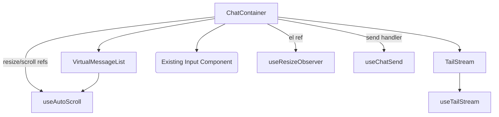

# design.md

artifact_id: 1c6c2204-0a95-4e3d-9ed6-0f1ff0e8c4fa

## Overview

Refactors `ChatContainer.vue` into an orchestration shell delegating to specialized child components and composables:

-   Virtualized message list wrapper (`VirtualMessageList.vue` or composable) abstracts the third-party library.
-   Streaming tail handler (`TailStream.vue` + `useTailStream` composable) manages buffering + flush cadence for in-progress model output.
-   Scroll + auto-stick logic (`useAutoScroll`) encapsulates scroll event handling & threshold determination.
-   Resize observation via VueUse (`useElementSize` or `useResizeObserver`) eliminating custom observer logic.
-   Message send payload assembly (`useChatSend`) decouples business logic from UI container.

The refactor aims to reduce complexity, improve separation of concerns, and introduce testable pure logic units while preserving outward functionality and performance characteristics.

## Architecture



### Component / Composable Responsibilities

-   ChatContainer: Wires data sources, passes reactive collections to `VirtualMessageList`, renders in-progress tail segment, hosts input component, and mediates events.
-   VirtualMessageList: Receives `messages: ChatMessage[]`, exposes events `visible-range-change`, `reached-top`, `reached-bottom`. Internally wraps virtualization library; isolates library-specific props.
-   TailStream (optional component) OR inline usage of composable: Displays streaming message (if any) appended after stable messages; updates as `displayText` changes.
-   useTailStream: Accepts pushes of token/string chunks, buffers them, schedules flushes (rAF or interval), exposes `displayText`, `isStreaming`, `done`, `error`, `push(chunk)`, `complete()`, `fail(err)`, `reset()`.
-   useAutoScroll: Tracks `atBottom`, decides whether new content triggers scroll; provides imperative `scrollToBottom({ smooth })` & `stickBottom()`.
-   useElementSize / useResizeObserver (VueUse): Observes an element ref and provides size refs without custom cleanup logic.
-   useChatSend: Assembles message payload (thread, attachments, metadata), dispatches to store / API, returns promise & error state.

## Data Flow

1. Incoming stable messages (historical + completed) flow to `VirtualMessageList`.
2. Streaming message chunks flow into `useTailStream` via pushes initiated by existing model streaming hook.
3. On each flush, `displayText` updates; `TailStream` renders appended content. Auto-scroll logic inspects `atBottom` to decide scroll.
4. User scroll events update `atBottom`; if user scrolls away, auto-scroll disabled until manual action (jump or explicit re-stick when message complete).
5. Input component emits `send` events captured by `ChatContainer` which delegates to `useChatSend`.

## Key Interfaces (TypeScript)

```ts
// Streaming Tail
export interface TailStreamController {
    displayText: Ref<string>;
    isStreaming: Ref<boolean>;
    done: Ref<boolean>;
    error: Ref<Error | null>;
    push: (chunk: string) => void;
    complete: () => void;
    fail: (err: unknown) => void;
    reset: () => void;
}

export interface UseTailStreamOptions {
    flushIntervalMs?: number; // default 33 (~30fps)
    maxBuffer?: number; // optional cap
    immediate?: boolean; // flush synchronously on first chunk
}

// Auto Scroll
export interface AutoScrollApi {
    atBottom: Ref<boolean>;
    stickBottom: () => void; // engage auto-stick
    scrollToBottom: (opts?: { smooth?: boolean }) => void;
    onContentIncrease: () => void; // call after height increases
    detach: () => void; // cleanup
}

export interface UseAutoScrollOptions {
    thresholdPx?: number; // distance from bottom to still count as bottom
    behavior?: ScrollBehavior; // default 'smooth' for programmatic scrolls
}

// Resize Observer
export interface ResizeState {
    width: Ref<number>;
    height: Ref<number>;
    stop: () => void;
}

// Chat Send
export interface ChatSendPayload {
    threadId: string;
    text: string;
    attachments?: string[]; // IDs
    meta?: Record<string, any>;
}

export interface ChatSendResult {
    id: string; // message id
    createdAt: number;
}

export interface ChatSendApi {
    sending: Ref<boolean>;
    error: Ref<Error | null>;
    send: (payload: ChatSendPayload) => Promise<ChatSendResult>;
}
```

### useTailStream Implementation Sketch (VueUse Interval)

```ts
export function useTailStream(
    opts: UseTailStreamOptions = {}
): TailStreamController {
    const { flushIntervalMs = 33, maxBuffer, immediate } = opts;
    const displayText = ref('');
    const buffer: string[] = [];
    const isStreaming = ref(false);
    const done = ref(false);
    const error = ref<Error | null>(null);
    // Leverage VueUse useIntervalFn for managed timer lifecycle
    const {
        pause: pauseInterval,
        resume: resumeInterval,
        isActive,
    } = useIntervalFn(
        () => {
            if (!buffer.length) return;
            displayText.value += buffer.join('');
            buffer.length = 0;
        },
        flushIntervalMs,
        { immediate: false }
    );

    function push(chunk: string) {
        if (done.value || error.value) return;
        isStreaming.value = true;
        buffer.push(chunk);
        if (maxBuffer && buffer.join('').length > maxBuffer) flush();
        if (immediate && displayText.value === '') flush();
        if (!isActive.value) resumeInterval();
    }

    function flush() {
        if (buffer.length) {
            displayText.value += buffer.join('');
            buffer.length = 0;
        }
    }

    function complete() {
        flush();
        pauseInterval();
        done.value = true;
        isStreaming.value = false;
    }
    function fail(err: unknown) {
        flush();
        error.value = err instanceof Error ? err : new Error(String(err));
        pauseInterval();
    }
    function reset() {
        pauseInterval();
        displayText.value = '';
        buffer.length = 0;
        done.value = false;
        error.value = null;
        isStreaming.value = false;
    }
    onBeforeUnmount(pauseInterval);
    return {
        displayText,
        isStreaming,
        done,
        error,
        push,
        complete,
        fail,
        reset,
    };
}
```

### useAutoScroll Sketch

```ts
export function useAutoScroll(
    container: Ref<HTMLElement | null>,
    opts: UseAutoScrollOptions = {}
): AutoScrollApi {
    const { thresholdPx = 64, behavior = 'auto' } = opts;
    const atBottom = ref(true);
    let stick = true;

    function compute() {
        const el = container.value;
        if (!el) return;
        const dist = el.scrollHeight - el.scrollTop - el.clientHeight;
        const newAtBottom = dist <= thresholdPx;
        if (!newAtBottom) stick = false;
        atBottom.value = newAtBottom;
    }

    function scrollToBottom({ smooth }: { smooth?: boolean } = {}) {
        const el = container.value;
        if (!el) return;
        el.scrollTo({
            top: el.scrollHeight,
            behavior: smooth ? 'smooth' : behavior,
        });
        stick = true;
        atBottom.value = true;
    }

    function stickBottom() {
        stick = true;
        scrollToBottom({ smooth: true });
    }
    function onContentIncrease() {
        if (stick) nextTick(() => scrollToBottom({ smooth: false }));
    }

    const listener = () => compute();
    onMounted(() => {
        compute();
        container.value?.addEventListener('scroll', listener, {
            passive: true,
        });
    });
    onBeforeUnmount(() =>
        container.value?.removeEventListener('scroll', listener)
    );
    function detach() {
        container.value?.removeEventListener('scroll', listener);
    }

    return { atBottom, stickBottom, scrollToBottom, onContentIncrease, detach };
}
```

### Resize Handling (VueUse)

Prefer `useElementSize(elRef)`:

```ts
const elRef = ref<HTMLElement | null>(null);
const { width, height } = useElementSize(elRef);
```

If granular callback-based observation needed (unlikely here), fallback to `useResizeObserver(elRef, (entries) => { ... })`.

No custom wrapper unless abstraction naming consistency is required.

### useChatSend Sketch

```ts
export function useChatSend(): ChatSendApi {
    const sending = ref(false);
    const error = ref<Error | null>(null);
    async function send(payload: ChatSendPayload): Promise<ChatSendResult> {
        sending.value = true;
        error.value = null;
        try {
            // TODO integrate with existing DB/store API
            const id = generateId();
            const createdAt = Date.now();
            // persist message & update thread
            return { id, createdAt };
        } catch (e) {
            error.value = e as Error;
            throw e;
        } finally {
            sending.value = false;
        }
    }
    return { sending, error, send };
}
```

## Error Handling Strategy

-   Composables surface errors via `error` refs; container logs with existing hooks: `hooks.doAction('chat.error', { source, error })`.
-   Critical failures in streaming stop timers and mark `done=false, isStreaming=false`.
-   Auto-scroll errors (rare) are swallowed after logging to avoid UX disruption.

## Testing Strategy

-   Unit Tests (Vitest):
    -   useTailStream: push cadence, complete, fail, reset.
    -   useAutoScroll: threshold logic via mocking scroll container metrics.
    -   useResizeObserver: simulated entries -> state update.
-   Integration: Mount `ChatContainer` with mocked virtualization + push streaming chunks; assert progressive rendering and scroll stick/un-stick.
-   Performance: Capture baseline render metrics with a dataset of N messages, compare after refactor (scripted measurement harness logging timing).

## Performance Considerations

-   Batching tail updates via `useIntervalFn` reduces DOM writes and ensures automatic cleanup.
-   Virtualization wrapper ensures only visible messages render; tail appended outside virtualization DOM subtree to avoid reflow cost.
-   Avoid watchers on entire message arrays where possible; rely on push updates.

## Migration Plan (VueUse Integrated)

1. Snapshot current `ChatContainer.vue` size & basic perf metrics.
2. Introduce new composables/components alongside existing container (unused initially) + tests (use VueUse utilities from first commit to avoid later churn).
3. Incrementally replace inline logic with composables (streaming, resize, scroll, send) keeping behavior parity.
4. Extract virtualization into wrapper component; update container template accordingly.
5. Remove legacy code paths and confirm length reduction >=50%.
6. Final cleanup, docs, perf re-measure.

## Open Assumptions

-   Existing message store provides reactive `messages` + streaming chunk events (to be wired to `useTailStream.push`).
-   Virtualization library API accessible in new child without side-effects.
-   Testing framework (Vitest) can be added if not present.

## Future Extensions (Not in Scope Now)

-   SSR-friendly streaming with partial hydration.
-   Pluggable flush strategies (rAF, microtask, idle callback).
-   Unified event bus with typed contracts.
