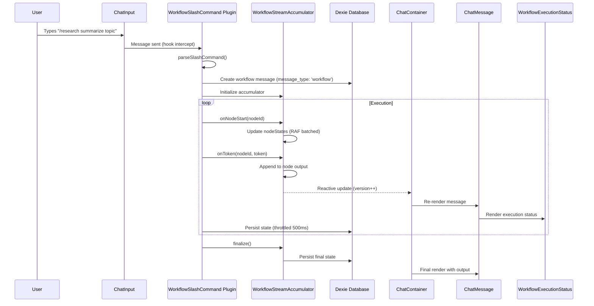

# Workflow Message Integration - Technical Design

## Overview

This document describes the technical architecture for displaying workflow/agent execution results within the chat interface. The design uses the existing message schema's flexible `data` field with a type discriminator—**requiring zero schema changes**—and introduces a specialized streaming accumulator and UI components for workflow execution visualization.

---

## ⚠️ BACKWARD COMPATIBILITY GUARANTEES

**This design makes ZERO breaking changes:**

| Area                    | Guarantee                                                           |
| ----------------------- | ------------------------------------------------------------------- |
| **Database Schema**     | No schema changes. No Dexie version bump. No migrations.            |
| **MessageSchema**       | Uses existing `data: z.unknown()` field for workflow data           |
| **UiChatMessage**       | All new fields are optional (`isWorkflow?`, `workflowState?`)       |
| **Existing Messages**   | Continue to work unchanged; missing workflow fields = regular chat  |
| **Existing Components** | `ChatMessage.vue` only conditionally renders workflow UI            |
| **Existing Hooks**      | No hook signatures changed; new hooks added with `workflow:` prefix |
| **Existing APIs**       | All message CRUD operations unchanged                               |

**How workflow messages are discriminated:**

```typescript
// Inside the existing data field:
message.data = {
    type: 'workflow-execution', // ← Discriminator
    workflowId: string,
    workflowName: string,
    // ... workflow state
};

// Regular messages have data: null, undefined, or other shapes
```

**Detection logic:**

```typescript
function isWorkflowMessage(message: Message): boolean {
    return message.data?.type === 'workflow-execution';
}
```

---

## Architecture

### System Flow



### Core Components

| Component                                      | Responsibility                                                  |
| ---------------------------------------------- | --------------------------------------------------------------- |
| `MessageSchema`                                | **UNCHANGED** - Uses existing `data` field for workflow state   |
| `WorkflowMessageData`                          | **NEW** TypeScript interface for workflow-specific `data` field |
| `UiChatMessage` (extended)                     | **ADDITIVE** - Add optional workflow fields for rendering       |
| `WorkflowStreamAccumulator`                    | **NEW** RAF-batched reactive state for execution progress       |
| `WorkflowExecutionStatus.vue`                  | **NEW** Collapsible node pipeline visualization                 |
| `ChatMessage.vue` (modified)                   | **CONDITIONAL** - Only renders workflow UI if `isWorkflow`      |
| `workflow-slash-commands.client.ts` (modified) | Wire execution callbacks to accumulator                         |

---

## Data Models

### Schema: NO CHANGES REQUIRED

**CRITICAL: Zero Schema Changes**

The existing `MessageSchema` already has a flexible `data: z.unknown()` field that can store any JSON structure. We use this field to discriminate workflow messages via a `type: 'workflow-execution'` discriminator inside the data object.

**Why no schema changes:**

1. Adding columns to Dexie requires version bumps and migrations
2. Existing messages would need backfilling
3. The `data` field is already designed for extensibility
4. This approach is 100% backward compatible

```typescript
// app/db/schema.ts - NO CHANGES NEEDED
// The existing schema already supports workflow messages:

export const MessageSchema = z.object({
    id: z.string(),
    data: z.unknown().nullable().optional(), // ← Workflow data goes here
    role: z.string(),
    created_at: z.number().int(),
    updated_at: z.number().int(),
    error: z.string().nullable().optional(),
    deleted: z.boolean().default(false),
    thread_id: z.string(),
    index: z.number().int(),
    clock: z.number().int(),
    stream_id: z.string().nullable().optional(),
    file_hashes: z.string().nullable().optional(),
    // NO new fields - we use data.type discriminator instead
});
```

### WorkflowMessageData Interface

```typescript
// app/utils/chat/workflow-types.ts

export type NodeExecutionStatus =
    | 'pending'
    | 'active'
    | 'completed'
    | 'error'
    | 'skipped';
export type WorkflowExecutionState =
    | 'running'
    | 'completed'
    | 'error'
    | 'stopped'
    | 'interrupted';

export interface NodeState {
    /** Node execution status */
    status: NodeExecutionStatus;
    /** Node label/name from workflow definition */
    label: string;
    /** Node type (agent, router, parallel, etc.) */
    type: string;
    /** Accumulated streaming output */
    output: string;
    /** Streaming text (cleared on completion, output gets final) */
    streamingText?: string;
    /** Error message if status is 'error' */
    error?: string;
    /** Start timestamp (ms) */
    startedAt?: number;
    /** Finish timestamp (ms) */
    finishedAt?: number;
    /** Token count for this node */
    tokenCount?: number;
}

export interface BranchState {
    /** Branch ID */
    id: string;
    /** Branch label */
    label: string;
    /** Branch status */
    status: NodeExecutionStatus;
    /** Accumulated output */
    output: string;
    /** Streaming text */
    streamingText?: string;
}

export interface WorkflowMessageData {
    /** Discriminator for type narrowing */
    type: 'workflow-execution';

    /** Workflow identification */
    workflowId: string;
    workflowName: string;

    /** Original user prompt */
    prompt: string;

    /** Overall execution state */
    executionState: WorkflowExecutionState;

    /** Per-node execution states, keyed by nodeId */
    nodeStates: Record<string, NodeState>;

    /** Execution order (list of nodeIds in execution order) */
    executionOrder: string[];

    /** Currently active node ID */
    currentNodeId: string | null;

    /** Parallel branch states (for parallel nodes) */
    branches?: Record<string, BranchState>;

    /** Final output content (from output node or last agent) */
    finalOutput: string;

    /** Execution result metadata */
    result?: {
        success: boolean;
        duration: number;
        totalTokens?: number;
        error?: string;
    };
}

/** Type guard for workflow message data */
export function isWorkflowMessageData(
    data: unknown
): data is WorkflowMessageData {
    return (
        typeof data === 'object' &&
        data !== null &&
        'type' in data &&
        (data as { type: string }).type === 'workflow-execution'
    );
}
```

### Extended UiChatMessage (Additive Only)

**CRITICAL: All new fields are optional - zero breaking changes**

Existing code that uses `UiChatMessage` will continue to work unchanged because:

1. All new fields are optional (`?`)
2. No existing field types or names are modified
3. `ensureUiMessage()` returns the same structure for non-workflow messages

```typescript
// app/utils/chat/uiMessages.ts (extended with OPTIONAL fields only)

export interface UiChatMessage {
    // EXISTING FIELDS - UNCHANGED
    id: string;
    role: 'user' | 'assistant' | 'system' | 'tool';
    text: string;
    file_hashes?: string[];
    reasoning_text?: string | null;
    stream_id?: string;
    pending?: boolean;
    toolCalls?: ToolCallInfo[];

    // NEW: Workflow-specific fields (ALL OPTIONAL - no breaking changes)
    isWorkflow?: boolean; // undefined/false for regular messages
    workflowState?: {
        // undefined for regular messages
        workflowId: string;
        workflowName: string;
        executionState: WorkflowExecutionState;
        nodeStates: Record<string, NodeState>;
        executionOrder: string[];
        currentNodeId: string | null;
        branches?: Record<string, BranchState>;
    };
}
```

---

## Component Design

### WorkflowStreamAccumulator

```typescript
// app/composables/chat/useWorkflowStreamAccumulator.ts

import { reactive } from 'vue';
import type {
    NodeState,
    BranchState,
    WorkflowExecutionState,
    WorkflowMessageData,
} from '~/utils/chat/workflow-types';

export interface WorkflowStreamingState {
    /** Overall execution state */
    executionState: WorkflowExecutionState;
    /** Per-node states */
    nodeStates: Record<string, NodeState>;
    /** Execution order */
    executionOrder: string[];
    /** Currently active node */
    currentNodeId: string | null;
    /** Branch states for parallel execution */
    branches: Record<string, BranchState>;
    /** Final accumulated output */
    finalOutput: string;
    /** Is execution still active */
    isActive: boolean;
    /** Version counter for watchers */
    version: number;
    /** Error if any */
    error: Error | null;
}

export interface WorkflowStreamAccumulatorApi {
    state: Readonly<WorkflowStreamingState>;

    // Node lifecycle
    nodeStart(nodeId: string, label: string, type: string): void;
    nodeToken(nodeId: string, token: string): void;
    nodeReasoning(nodeId: string, token: string): void;
    nodeFinish(nodeId: string, output: string): void;
    nodeError(nodeId: string, error: Error): void;

    // Branch lifecycle (for parallel nodes)
    branchStart(nodeId: string, branchId: string, label: string): void;
    branchToken(nodeId: string, branchId: string, token: string): void;
    branchComplete(nodeId: string, branchId: string, output: string): void;

    // Execution lifecycle
    finalize(opts?: { error?: Error; stopped?: boolean }): void;
    reset(): void;

    // Export for persistence
    toMessageData(
        workflowId: string,
        workflowName: string,
        prompt: string
    ): WorkflowMessageData;
}

export function createWorkflowStreamAccumulator(): WorkflowStreamAccumulatorApi {
    const state = reactive<WorkflowStreamingState>({
        executionState: 'running',
        nodeStates: {},
        executionOrder: [],
        currentNodeId: null,
        branches: {},
        finalOutput: '',
        isActive: true,
        version: 0,
        error: null,
    });

    // Pending updates for RAF batching
    let pendingNodeTokens: Map<string, string[]> = new Map();
    let pendingBranchTokens: Map<string, string[]> = new Map();
    let rafId: number | null = null;
    let finalized = false;

    function scheduleFlush() {
        if (rafId !== null || finalized) return;
        rafId = requestAnimationFrame(flush);
    }

    function flush() {
        rafId = null;

        // Flush node tokens
        for (const [nodeId, tokens] of pendingNodeTokens) {
            const node = state.nodeStates[nodeId];
            if (node) {
                node.streamingText =
                    (node.streamingText || '') + tokens.join('');
            }
        }
        pendingNodeTokens.clear();

        // Flush branch tokens
        for (const [key, tokens] of pendingBranchTokens) {
            const branch = state.branches[key];
            if (branch) {
                branch.streamingText =
                    (branch.streamingText || '') + tokens.join('');
            }
        }
        pendingBranchTokens.clear();

        state.version++;
    }

    function nodeStart(nodeId: string, label: string, type: string) {
        if (finalized) return;

        state.nodeStates[nodeId] = {
            status: 'active',
            label,
            type,
            output: '',
            streamingText: '',
            startedAt: Date.now(),
        };

        if (!state.executionOrder.includes(nodeId)) {
            state.executionOrder.push(nodeId);
        }

        state.currentNodeId = nodeId;
        state.version++;
    }

    function nodeToken(nodeId: string, token: string) {
        if (finalized || !token) return;

        const existing = pendingNodeTokens.get(nodeId) || [];
        existing.push(token);
        pendingNodeTokens.set(nodeId, existing);
        scheduleFlush();
    }

    function nodeReasoning(nodeId: string, token: string) {
        // Reasoning tokens treated same as regular tokens for now
        // Could be extended to track separately per-node
        nodeToken(nodeId, token);
    }

    function nodeFinish(nodeId: string, output: string) {
        if (finalized) return;

        // Force flush pending tokens first
        if (rafId !== null) {
            cancelAnimationFrame(rafId);
            flush();
        }

        const node = state.nodeStates[nodeId];
        if (node) {
            node.status = 'completed';
            node.output = output;
            node.streamingText = undefined; // Clear streaming buffer
            node.finishedAt = Date.now();
        }

        if (state.currentNodeId === nodeId) {
            state.currentNodeId = null;
        }

        // Update final output (last completed node's output becomes final)
        state.finalOutput = output;
        state.version++;
    }

    function nodeError(nodeId: string, error: Error) {
        if (finalized) return;

        const node = state.nodeStates[nodeId];
        if (node) {
            node.status = 'error';
            node.error = error.message;
            node.finishedAt = Date.now();
        }

        state.error = error;
        state.executionState = 'error';
        state.version++;
    }

    function branchStart(nodeId: string, branchId: string, label: string) {
        if (finalized) return;

        const key = `${nodeId}:${branchId}`;
        state.branches[key] = {
            id: branchId,
            label,
            status: 'active',
            output: '',
            streamingText: '',
        };
        state.version++;
    }

    function branchToken(nodeId: string, branchId: string, token: string) {
        if (finalized || !token) return;

        const key = `${nodeId}:${branchId}`;
        const existing = pendingBranchTokens.get(key) || [];
        existing.push(token);
        pendingBranchTokens.set(key, existing);
        scheduleFlush();
    }

    function branchComplete(nodeId: string, branchId: string, output: string) {
        if (finalized) return;

        const key = `${nodeId}:${branchId}`;
        const branch = state.branches[key];
        if (branch) {
            branch.status = 'completed';
            branch.output = output;
            branch.streamingText = undefined;
        }
        state.version++;
    }

    function finalize(opts?: { error?: Error; stopped?: boolean }) {
        if (finalized) return;
        finalized = true;

        // Flush any pending tokens
        if (rafId !== null) {
            cancelAnimationFrame(rafId);
            flush();
        }

        if (opts?.error) {
            state.error = opts.error;
            state.executionState = 'error';
        } else if (opts?.stopped) {
            state.executionState = 'stopped';
        } else {
            state.executionState = 'completed';
        }

        state.isActive = false;
        state.currentNodeId = null;
        state.version++;
    }

    function reset() {
        if (rafId !== null) {
            cancelAnimationFrame(rafId);
            rafId = null;
        }
        pendingNodeTokens.clear();
        pendingBranchTokens.clear();
        finalized = false;

        state.executionState = 'running';
        state.nodeStates = {};
        state.executionOrder = [];
        state.currentNodeId = null;
        state.branches = {};
        state.finalOutput = '';
        state.isActive = true;
        state.error = null;
        state.version++;
    }

    function toMessageData(
        workflowId: string,
        workflowName: string,
        prompt: string
    ): WorkflowMessageData {
        return {
            type: 'workflow-execution',
            workflowId,
            workflowName,
            prompt,
            executionState: state.executionState,
            nodeStates: { ...state.nodeStates },
            executionOrder: [...state.executionOrder],
            currentNodeId: state.currentNodeId,
            branches:
                Object.keys(state.branches).length > 0
                    ? { ...state.branches }
                    : undefined,
            finalOutput: state.finalOutput,
            result:
                state.executionState !== 'running'
                    ? {
                          success: state.executionState === 'completed',
                          duration: calculateDuration(state.nodeStates),
                          error: state.error?.message,
                      }
                    : undefined,
        };
    }

    return {
        state,
        nodeStart,
        nodeToken,
        nodeReasoning,
        nodeFinish,
        nodeError,
        branchStart,
        branchToken,
        branchComplete,
        finalize,
        reset,
        toMessageData,
    };
}

function calculateDuration(nodeStates: Record<string, NodeState>): number {
    const nodes = Object.values(nodeStates);
    if (nodes.length === 0) return 0;

    const startTimes = nodes
        .map((n) => n.startedAt)
        .filter((t): t is number => t !== undefined);
    const endTimes = nodes
        .map((n) => n.finishedAt)
        .filter((t): t is number => t !== undefined);

    if (startTimes.length === 0) return 0;

    const earliest = Math.min(...startTimes);
    const latest = endTimes.length > 0 ? Math.max(...endTimes) : Date.now();

    return latest - earliest;
}
```

### WorkflowExecutionStatus Component

```vue
<!-- app/components/chat/WorkflowExecutionStatus.vue -->
<template>
    <div class="workflow-execution-status">
        <!-- Header with workflow name and overall status -->
        <div
            class="wes-header flex items-center gap-2 p-2 cursor-pointer hover:bg-[var(--md-surface-container)]"
            @click="toggleCollapsed"
        >
            <!-- Status indicator -->
            <div class="wes-status-icon shrink-0">
                <UIcon
                    v-if="executionState === 'running'"
                    :name="icons.running"
                    class="w-4 h-4 animate-spin text-[var(--md-primary)]"
                />
                <UIcon
                    v-else-if="executionState === 'completed'"
                    :name="icons.completed"
                    class="w-4 h-4 text-[var(--md-tertiary)]"
                />
                <UIcon
                    v-else-if="executionState === 'error'"
                    :name="icons.error"
                    class="w-4 h-4 text-[var(--md-error)]"
                />
                <UIcon
                    v-else-if="executionState === 'stopped'"
                    :name="icons.stopped"
                    class="w-4 h-4 text-[var(--md-outline)]"
                />
            </div>

            <!-- Workflow name and status text -->
            <div class="wes-header-text flex-1 min-w-0">
                <span class="font-semibold text-[var(--md-on-surface)]">
                    {{ workflowName }}
                </span>
                <span class="text-xs opacity-70 ml-2">
                    {{ statusText }}
                </span>
            </div>

            <!-- Collapse indicator -->
            <UIcon
                :name="collapsed ? icons.chevronDown : icons.chevronUp"
                class="w-4 h-4 opacity-50"
            />
        </div>

        <!-- Collapsible node list -->
        <div
            v-if="!collapsed"
            class="wes-nodes border-t border-[var(--md-outline-variant)]"
        >
            <div
                v-for="nodeId in executionOrder"
                :key="nodeId"
                class="wes-node"
            >
                <details
                    :open="
                        nodeId === currentNodeId || nodeId === expandedNodeId
                    "
                    @toggle="onNodeToggle($event, nodeId)"
                >
                    <summary
                        class="wes-node-summary flex items-center gap-2 p-2 cursor-pointer hover:bg-[var(--md-surface-container)] select-none"
                    >
                        <!-- Node status icon -->
                        <div class="wes-node-icon shrink-0">
                            <UIcon
                                v-if="nodeStates[nodeId]?.status === 'active'"
                                :name="icons.running"
                                class="w-3 h-3 animate-spin text-[var(--md-primary)]"
                            />
                            <UIcon
                                v-else-if="
                                    nodeStates[nodeId]?.status === 'completed'
                                "
                                :name="icons.completed"
                                class="w-3 h-3 text-[var(--md-tertiary)]"
                            />
                            <UIcon
                                v-else-if="
                                    nodeStates[nodeId]?.status === 'error'
                                "
                                :name="icons.error"
                                class="w-3 h-3 text-[var(--md-error)]"
                            />
                            <UIcon
                                v-else
                                :name="icons.pending"
                                class="w-3 h-3 text-[var(--md-outline)]"
                            />
                        </div>

                        <!-- Node label and type -->
                        <div class="wes-node-label flex-1 min-w-0">
                            <span class="text-sm font-medium">
                                {{ nodeStates[nodeId]?.label || nodeId }}
                            </span>
                            <span class="text-xs opacity-50 ml-1">
                                ({{ nodeStates[nodeId]?.type || 'node' }})
                            </span>
                        </div>

                        <!-- Preview of output when collapsed -->
                        <span
                            v-if="
                                nodeStates[nodeId]?.output &&
                                nodeId !== expandedNodeId
                            "
                            class="text-xs opacity-50 truncate max-w-[150px]"
                        >
                            {{ truncate(nodeStates[nodeId]?.output, 50) }}
                        </span>
                    </summary>

                    <!-- Expanded node content -->
                    <div
                        class="wes-node-content p-2 bg-[var(--md-surface)] border-t border-[var(--md-outline-variant)]"
                    >
                        <!-- Streaming or final output -->
                        <pre
                            class="wes-node-output text-xs whitespace-pre-wrap overflow-x-auto max-h-48 overflow-y-auto"
                            ref="outputRefs"
                            :data-node-id="nodeId"
                            >{{
                                nodeStates[nodeId]?.streamingText ||
                                nodeStates[nodeId]?.output ||
                                'No output yet...'
                            }}</pre
                        >

                        <!-- Error message -->
                        <div
                            v-if="nodeStates[nodeId]?.error"
                            class="wes-node-error mt-2 text-xs text-[var(--md-error)] p-2 bg-[var(--md-error-container)] rounded"
                        >
                            {{ nodeStates[nodeId]?.error }}
                        </div>

                        <!-- Branches for parallel nodes -->
                        <div
                            v-if="getNodeBranches(nodeId).length > 0"
                            class="wes-branches mt-2 space-y-1"
                        >
                            <div class="text-xs font-medium opacity-70">
                                Parallel branches:
                            </div>
                            <div
                                v-for="branch in getNodeBranches(nodeId)"
                                :key="branch.id"
                                class="wes-branch pl-4 border-l-2 border-[var(--md-outline-variant)]"
                            >
                                <div class="flex items-center gap-1">
                                    <UIcon
                                        v-if="branch.status === 'active'"
                                        :name="icons.running"
                                        class="w-2 h-2 animate-spin"
                                    />
                                    <UIcon
                                        v-else-if="
                                            branch.status === 'completed'
                                        "
                                        :name="icons.completed"
                                        class="w-2 h-2 text-[var(--md-tertiary)]"
                                    />
                                    <span class="text-xs font-medium">{{
                                        branch.label
                                    }}</span>
                                </div>
                                <pre class="text-xs opacity-70 truncate">{{
                                    truncate(
                                        branch.output || branch.streamingText,
                                        100
                                    )
                                }}</pre>
                            </div>
                        </div>
                    </div>
                </details>
            </div>
        </div>
    </div>
</template>

<script setup lang="ts">
import { ref, computed, watch, nextTick } from 'vue';
import { useIcon } from '~/composables/useIcon';
import type {
    NodeState,
    BranchState,
    WorkflowExecutionState,
} from '~/utils/chat/workflow-types';

const props = defineProps<{
    workflowName: string;
    executionState: WorkflowExecutionState;
    nodeStates: Record<string, NodeState>;
    executionOrder: string[];
    currentNodeId: string | null;
    branches?: Record<string, BranchState>;
}>();

const collapsed = ref(false);
const expandedNodeId = ref<string | null>(null);

const icons = {
    running: useIcon('workflow.status.running').value,
    completed: useIcon('workflow.status.completed').value,
    error: useIcon('workflow.status.error').value,
    stopped: useIcon('workflow.status.stopped').value,
    pending: useIcon('workflow.status.pending').value,
    chevronDown: useIcon('common.chevronDown').value,
    chevronUp: useIcon('common.chevronUp').value,
};

const statusText = computed(() => {
    switch (props.executionState) {
        case 'running':
            return 'Executing...';
        case 'completed':
            return 'Completed';
        case 'error':
            return 'Failed';
        case 'stopped':
            return 'Stopped';
        case 'interrupted':
            return 'Interrupted';
        default:
            return '';
    }
});

function toggleCollapsed() {
    collapsed.value = !collapsed.value;
}

function onNodeToggle(event: Event, nodeId: string) {
    const details = event.target as HTMLDetailsElement;
    if (details.open) {
        expandedNodeId.value = nodeId;
    } else if (expandedNodeId.value === nodeId) {
        expandedNodeId.value = null;
    }
}

function getNodeBranches(nodeId: string): BranchState[] {
    if (!props.branches) return [];
    return Object.entries(props.branches)
        .filter(([key]) => key.startsWith(`${nodeId}:`))
        .map(([, branch]) => branch);
}

function truncate(text: string | undefined, length: number): string {
    if (!text) return '';
    return text.length > length ? text.slice(0, length) + '...' : text;
}

// Auto-expand current node when it changes
watch(
    () => props.currentNodeId,
    (nodeId) => {
        if (nodeId) {
            expandedNodeId.value = nodeId;
        }
    }
);

// Auto-scroll streaming output
watch(
    () => props.nodeStates[props.currentNodeId || '']?.streamingText,
    async () => {
        await nextTick();
        const el = document.querySelector(
            `[data-node-id="${props.currentNodeId}"]`
        );
        if (el) {
            el.scrollTop = el.scrollHeight;
        }
    }
);
</script>

<style scoped>
.workflow-execution-status {
    border: 1px solid var(--md-outline-variant);
    border-radius: var(--md-border-radius);
    margin-bottom: 1rem;
    overflow: hidden;
    background: var(--md-surface-container-low);
}

.wes-node-output {
    font-family: var(--md-font-mono);
}
</style>
```

---

## Integration Points

### 1. Modified workflow-slash-commands.client.ts

The key integration is wiring the workflow execution callbacks to the accumulator and updating reactive state:

```typescript
// Key changes to workflow-slash-commands.client.ts

import { createWorkflowStreamAccumulator } from '~/composables/chat/useWorkflowStreamAccumulator';
import type { WorkflowMessageData } from '~/utils/chat/workflow-types';

// Inside the before_send hook:

// Create accumulator for this execution
const accumulator = createWorkflowStreamAccumulator();

// Create workflow message instead of chat message
const assistantDbMsg = await tx.appendMessage({
    thread_id: threadIdRef,
    role: 'assistant',
    stream_id: newStreamId,
    message_type: 'workflow', // NEW: Set message type
    data: accumulator.toMessageData(
        workflowPost.id,
        workflowPost.title,
        parsed.prompt
    ),
});

// Wire execution callbacks to accumulator
const controller = execMod.executeWorkflow({
    workflow: workflowPost.meta,
    prompt: parsed.prompt,
    conversationHistory,
    apiKey: apiKey.value,

    onNodeStart: (nodeId) => {
        const node = workflowPost.meta.nodes.find((n) => n.id === nodeId);
        accumulator.nodeStart(
            nodeId,
            node?.data?.label || nodeId,
            node?.type || 'unknown'
        );
    },

    onToken: (nodeId, token) => {
        accumulator.nodeToken(nodeId, token);
    },

    onNodeFinish: (nodeId, output) => {
        accumulator.nodeFinish(nodeId, output);
        // Persist state
        persistWorkflowState(assistantDbMsg.id, accumulator, workflowPost);
    },

    onBranchStart: (nodeId, branchId, label) => {
        accumulator.branchStart(nodeId, branchId, label);
    },

    onBranchToken: (nodeId, branchId, _, token) => {
        accumulator.branchToken(nodeId, branchId, token);
    },

    onBranchComplete: (nodeId, branchId, _, output) => {
        accumulator.branchComplete(nodeId, branchId, output);
    },

    onError: (error) => {
        accumulator.finalize({ error });
        persistWorkflowState(assistantDbMsg.id, accumulator, workflowPost);
    },
});

// Emit workflow-specific reactive state for ChatContainer
hooks.doAction('workflow.execution:action:state_update', {
    messageId: assistantDbMsg.id,
    state: accumulator.state,
});
```

### 2. Modified ChatMessage.vue

Add conditional rendering for workflow messages:

```vue
<!-- Inside ChatMessage.vue template -->

<template>
    <!-- Existing message structure... -->

    <!-- Workflow execution status (above final output) -->
    <WorkflowExecutionStatus
        v-if="isWorkflow && message.workflowState"
        :workflow-name="message.workflowState.workflowName"
        :execution-state="message.workflowState.executionState"
        :node-states="message.workflowState.nodeStates"
        :execution-order="message.workflowState.executionOrder"
        :current-node-id="message.workflowState.currentNodeId"
        :branches="message.workflowState.branches"
        class="mb-4"
    />

    <!-- Final output (uses existing StreamMarkdown) -->
    <StreamMarkdown
        v-if="hasContent"
        :content="message.text"
        :theme="currentShikiTheme"
        :class="streamMdClasses"
    />
</template>

<script setup lang="ts">
// Add computed for workflow detection
const isWorkflow = computed(() => props.message.isWorkflow === true);
</script>
```

### 3. Modified ensureUiMessage

```typescript
// In app/utils/chat/uiMessages.ts

export function ensureUiMessage(raw: RawMessageLike): UiChatMessage {
    // ... existing code ...

    // NEW: Handle workflow messages
    let isWorkflow = false;
    let workflowState: UiChatMessage['workflowState'] = undefined;

    if (raw.data && isWorkflowMessageData(raw.data)) {
        isWorkflow = true;
        workflowState = {
            workflowId: raw.data.workflowId,
            workflowName: raw.data.workflowName,
            executionState: raw.data.executionState,
            nodeStates: raw.data.nodeStates,
            executionOrder: raw.data.executionOrder,
            currentNodeId: raw.data.currentNodeId,
            branches: raw.data.branches,
        };
        // Use final output as message text
        text = raw.data.finalOutput || '';
    }

    return {
        id,
        role,
        text,
        file_hashes,
        reasoning_text,
        stream_id: raw.stream_id,
        pending: Boolean(raw.pending),
        toolCalls,
        isWorkflow,
        workflowState,
    };
}
```

---

## Error Handling

### Workflow Execution Errors

```typescript
interface WorkflowError {
    type: 'validation' | 'execution' | 'timeout' | 'cancelled';
    message: string;
    nodeId?: string;
    nodeLabel?: string;
    recoverable: boolean;
}

function handleWorkflowError(
    error: Error,
    accumulator: WorkflowStreamAccumulatorApi
): WorkflowError {
    // Determine error type and context
    const isValidation = error.message.includes('validation');
    const isTimeout = error.message.includes('timeout');
    const isCancelled = error.name === 'AbortError';

    return {
        type: isCancelled
            ? 'cancelled'
            : isValidation
            ? 'validation'
            : isTimeout
            ? 'timeout'
            : 'execution',
        message: error.message,
        nodeId: accumulator.state.currentNodeId || undefined,
        nodeLabel: accumulator.state.currentNodeId
            ? accumulator.state.nodeStates[accumulator.state.currentNodeId]
                  ?.label
            : undefined,
        recoverable: !isValidation,
    };
}
```

---

## Testing Strategy

### Unit Tests

1. **WorkflowStreamAccumulator**

    - Test RAF batching behavior
    - Test node state transitions
    - Test branch tracking
    - Test finalization with error/stopped states
    - Test toMessageData serialization

2. **ensureUiMessage (workflow path)**
    - Test workflow data detection
    - Test workflowState population
    - Test finalOutput extraction

### Integration Tests

1. **Workflow execution flow**

    - Execute workflow and verify accumulator updates
    - Verify database persistence
    - Verify UI updates via reactive state

2. **ChatMessage workflow rendering**
    - Render workflow message and verify WorkflowExecutionStatus presence
    - Test collapsed/expanded states
    - Test node output display

### E2E Tests

1. **Full slash command flow**
    - Type `/workflow-name prompt`
    - Verify execution UI appears
    - Verify real-time node updates
    - Verify final output display

---

## Performance Considerations

1. **RAF Batching**: All token callbacks are batched to ensure ≤1 reactive update per frame
2. **Throttled Persistence**: Database writes are throttled to 500ms intervals during streaming
3. **Scoped Re-renders**: WorkflowExecutionStatus uses fine-grained reactivity to minimize re-render scope
4. **Lazy Component Loading**: WorkflowExecutionStatus is lazily loaded via `<LazyWorkflowExecutionStatus>`
5. **Memory Management**: Streaming buffers are cleared on node completion; accumulator disposed on unmount
