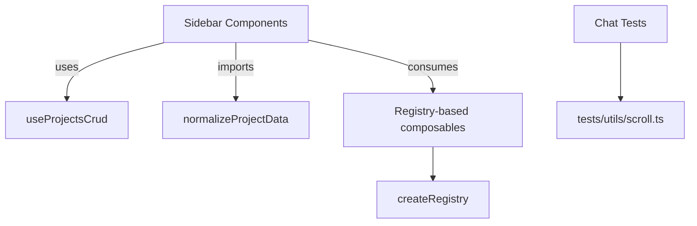
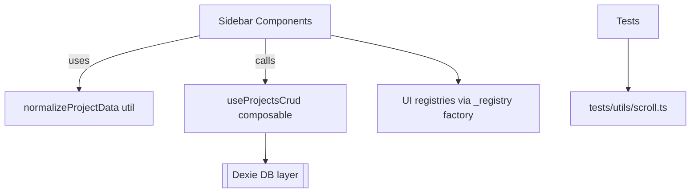

# Overview

This design consolidates duplicate logic and removes unused code while preserving behavior in a Nuxt 3/Vue 3 app. The core themes are: a shared tolerant parser for `project.data`, a small registry factory for UI extension lists, a thin composable for project CRUD and entry title syncing, a single scroll test helper, and removal of deprecated shims/aliases.

# Architecture



Components:

-   normalizeProjectData: centralized tolerant parser for `project.data`.
-   useProjectsCrud: CRUD operations returning `ServiceResult` with consistent error handling.
-   createRegistry<T>: factory to unify Map + reactive array patterns.
-   tests/utils/scroll.ts: shared helper for scroll metrics.

# Components and Interfaces

TypeScript-style contracts for clarity; adjust to fit codebase types.

```ts
// app/utils/projects/normalizeProjectData.ts
export interface ProjectEntryBase {
    id: string;
    type: 'chat' | 'doc';
    title?: string;
}
export interface ProjectData {
    entries: ProjectEntryBase[];
    // future-safe extension point; keep minimal
}

export function normalizeProjectData(raw: unknown): ProjectData {
    // Accept: undefined, string (JSON), object; never throw.
    // Guarantee: return { entries: ProjectEntryBase[] } with valid ids.
    return { entries: [] }; // placeholder; implement per existing behavior
}
```

```ts
// app/composables/useProjectsCrud.ts
import type { ProjectData } from '~/utils/projects/normalizeProjectData';

export interface ServiceResult<T> {
    ok: boolean;
    value?: T;
    error?: unknown;
}

export interface ProjectsCrudApi {
    createProject(name: string): Promise<ServiceResult<{ id: string }>>;
    renameProject(id: string, newName: string): Promise<ServiceResult<void>>;
    deleteProject(id: string): Promise<ServiceResult<void>>;
    updateProjectEntries(
        id: string,
        entries: ProjectData['entries']
    ): Promise<ServiceResult<void>>;
    syncProjectEntryTitle(
        entryId: string,
        title: string
    ): Promise<ServiceResult<number>>; // count updated
}

export function useProjectsCrud(): ProjectsCrudApi {
    // Wrap existing DB calls and local state updates; no UI side-effects.
    // Errors captured and returned via ServiceResult; UI decides to toast.
    return {
        async createProject(name) {
            return { ok: true, value: { id: '' } };
        },
        async renameProject() {
            return { ok: true };
        },
        async deleteProject() {
            return { ok: true };
        },
        async updateProjectEntries() {
            return { ok: true };
        },
        async syncProjectEntryTitle() {
            return { ok: true, value: 0 };
        },
    };
}
```

```ts
// app/composables/ui-extensions/_registry.ts
export interface RegistryItem {
    id: string;
    order?: number;
}
export interface RegistryApi<T extends RegistryItem> {
    items: Readonly<Ref<T[]>>;
    register(item: T): void;
    unregister(id: string): void;
}

export function createRegistry<T extends RegistryItem>(
    key: string,
    sort?: (a: T, b: T) => number
): RegistryApi<T> {
    // Implement via Map + computed array; warn on duplicate id with same key
    // Maintain existing sorting default: by (order ?? 200), then id.
    // Preserve current public APIs of callers.
    return {} as any;
}
```

```ts
// tests/utils/scroll.ts
export function setScrollMetrics(
    el: HTMLElement,
    m: { scrollTop?: number; scrollHeight?: number; clientHeight?: number }
) {
    Object.defineProperties(el, {
        scrollTop: { value: m.scrollTop ?? 0, configurable: true },
        scrollHeight: { value: m.scrollHeight ?? 0, configurable: true },
        clientHeight: { value: m.clientHeight ?? 0, configurable: true },
    });
}
```

# Data Model Notes

-   ProjectData is intentionally minimal: `entries: { id, type, title? }[]`.
-   Existing DB schemas remain unchanged; this is a logic consolidation only.

# Error Handling

-   Use a `ServiceResult<T>` pattern to avoid throwing across UI boundaries.
-   Map DB and parsing errors into `{ ok: false, error }`; calling layers may toast via existing helpers.
-   Parser must never throw; return empty/defaults on malformed input.

# Testing Strategy

-   Unit tests

    -   normalizeProjectData: invalid JSON, missing fields, mixed entries, preserves known-good input.
    -   createRegistry: ordering, duplicate registration warning, unregister behavior.
    -   useProjectsCrud: mock DB calls, verify return shapes and no UI side-effects.

-   Integration tests

    -   Sidebar flows (create, rename, delete, add/remove entry) still behave the same.

-   E2E smoke (manual)
    -   Verify projects and chat list scroll behavior remain unchanged.

# Rollout Plan

1. Introduce new utilities behind existing code; add tests.
2. Migrate one component (SidebarProjectTree) to validate no regressions.
3. Migrate remaining sidebar components.
4. Swap registry composables to factory internally with the same exports.
5. Deduplicate test helpers; ensure tests pass.
6. Remove deprecated shim/alias and update ignores for production.

## Addendum: Additional non-breaking consolidations

### Orama search helpers

Introduce `app/utils/search/orama.ts`:

```ts
export async function importOrama() {
    try {
        return await import('@orama/orama');
    } catch {
        throw new Error('Failed to import Orama');
    }
}
export async function createDb(schema: Record<string, string>) {
    const { create } = await importOrama();
    return create({ schema });
}
export async function buildIndex<T>(db: any, docs: T[], insertMultiple?: any) {
    const { insertMultiple: im } = await importOrama();
    await (insertMultiple || im)(db, docs);
    return db;
}
export async function searchWithIndex(db: any, term: string, limit = 100) {
    const { search } = await importOrama();
    return search(db, { term, limit });
}
```

Refactor `useModelSearch`, `useThreadSearch`, and `useSidebarSearch` to use these helpers without changing public APIs, debounce, or race-guard behavior.

### TipTap JSON and titles utilities

Add `app/utils/tiptap.ts`:

```ts
export function emptyDocJSON() {
    return { type: 'doc', content: [] };
}
export function parseTipTapJson(raw: any): any {
    if (!raw) return emptyDocJSON();
    try {
        const parsed = typeof raw === 'string' ? JSON.parse(raw) : raw;
        return parsed && parsed.type ? parsed : emptyDocJSON();
    } catch {
        return emptyDocJSON();
    }
}
```

Add `app/utils/titles.ts`:

```ts
export function normalizeTitle(
    title?: string | null,
    opts: { fallback?: string; allowEmpty?: boolean } = {
        fallback: 'Untitled',
        allowEmpty: true,
    }
) {
    const t = (title ?? '').trim();
    if (t.length) return t;
    return opts.allowEmpty ? '' : opts.fallback ?? 'Untitled';
}
```

Use these in `db/documents.ts` and `db/prompts.ts` to remove local duplicates, preserving exact fallback values and trimming behavior.

### Capability guards refactor

In `app/utils/capability-guards.ts`, extract a local helper that preserves toast text and error tags:

```ts
function denyToastAndError(message: string, tags: Record<string, any>) {
    const toast = useToast();
    toast?.add?.({
        title: 'Permission Denied',
        description: message,
        color: 'error',
        timeout: 5000,
    } as any);
    reportError(err('ERR_INTERNAL', message, { tags }));
}
```

Call from both `guardCapability` and `guardAnyCapability` with the same inputs currently used.

### ErrorToasts removal/migration

If `<ErrorToasts>` isn’t mounted, remove `app/components/ErrorToasts.vue` and deprecated `useErrorToasts()` export in `utils/errors.ts`. If it is mounted, migrate those call sites to rely on `reportError` (which already toasts via Nuxt UI) or an `error:raised` hook listener.

### Storage helpers

Add `app/utils/storage.ts` with SSR guards and small helpers to reduce repetition without changing keys or timing:

```ts
export function readJSON<T>(key: string): T | null {
    try {
        if (typeof window === 'undefined') return null;
        const raw = localStorage.getItem(key);
        return raw ? (JSON.parse(raw) as T) : null;
    } catch {
        return null;
    }
}
export function writeJSON(key: string, v: any): void {
    try {
        if (typeof window === 'undefined') return;
        localStorage.setItem(key, JSON.stringify(v));
    } catch {}
}
```

Adopt in `useAiSettings`, `models-service`, and `ChatInputDropper` for LAST_MODEL_KEY reads/writes.

---

title: Design — Codebase Hygiene (Dupes Cleanup, Unused Removal)
artifact_id: 9f2a4a3a-70f3-43a1-b012-fd78a3f2d2c1

---

# Design

## Overview

We consolidate duplicated logic and remove deprecated code without changing runtime behavior. The main areas are: project.data parsing, project CRUD flows, shared registries, test utilities, and build exclusion for dev-only files. All refactors are additive and then swap-in; risks are mitigated by unit tests and incremental rollouts.

## Architecture and Flow



### Core Components

-   normalizeProjectData util (pure function):

    -   Input: `unknown` (project.data)
    -   Output: `Array<{ id: string; name?: string; kind?: 'chat'|'doc' }>`
    -   Behavior: tolerant array/JSON-string parse, returns [] on error.

-   useProjectsCrud composable:

    -   Depends on `~/db` and its hook-integrated functions (create/upsert/delete).
    -   Exposes: `createProject`, `renameProject`, `deleteProject`, `updateProjectEntries`, `syncProjectEntryTitle`.
    -   Emits no UI; components keep their modals/emits/expansion behavior.

-   \_registry factory:

    -   `createRegistry<T>(globalKey: string, sort?: (a,b)=>number)` creates a Map-backed registry with reactive mirror.
    -   Used by `useProjectTreeActions`, `useHeaderActions`, `useSidebarSections` for consistency.

-   tests/utils/scroll.ts:
    -   `setScrollMetrics(el, { scrollTop, scrollHeight, clientHeight })` shared across chat list tests.

## Components and Interfaces

### normalizeProjectData.ts (TypeScript)

```ts
export type ProjectEntryKind = 'chat' | 'doc';
export interface ProjectEntry {
    id: string;
    name?: string;
    kind?: ProjectEntryKind | string;
}

export function normalizeProjectData(raw: unknown): ProjectEntry[] {
    if (Array.isArray(raw)) return raw as any[];
    if (typeof raw === 'string') {
        try {
            const parsed = JSON.parse(raw);
            return Array.isArray(parsed) ? parsed : [];
        } catch {
            return [];
        }
    }
    return [];
}
```

Usage pattern in UI components:

```ts
import { normalizeProjectData } from '~/utils/projects/normalizeProjectData';
const children = normalizeProjectData(project.data);
```

### useProjectsCrud.ts

```ts
import { create, upsert, del, db } from '~/db';
import { nowSec } from '~/db/util';
import { normalizeProjectData } from '~/utils/projects/normalizeProjectData';

export function useProjectsCrud() {
    async function createProject({
        name,
        description,
    }: {
        name: string;
        description?: string | null;
    }) {
        const now = nowSec();
        const id = crypto.randomUUID();
        await create.project({
            id,
            name,
            description: description ?? null,
            data: [],
            created_at: now,
            updated_at: now,
            deleted: false,
            clock: 0,
        } as any);
        return id;
    }
    async function renameProject(id: string, name: string) {
        const p = await db.projects.get(id);
        if (!p) return;
        await upsert.project({ ...p, name, updated_at: nowSec() });
    }
    async function deleteProject(id: string, opts = { soft: true }) {
        return opts.soft ? del.soft.project(id) : del.hard.project(id);
    }
    async function updateProjectEntries(
        id: string,
        mutator: (arr: any[]) => any[]
    ) {
        const p = await db.projects.get(id);
        if (!p) return;
        const arr = normalizeProjectData(p.data);
        const next = mutator([...arr]);
        await upsert.project({ ...p, data: next, updated_at: nowSec() });
    }
    async function syncProjectEntryTitle(
        entryId: string,
        kind: 'chat' | 'doc',
        name: string
    ) {
        const all = await db.projects.toArray();
        const now = nowSec();
        const updates: any[] = [];
        for (const p of all) {
            const arr = normalizeProjectData(p.data);
            let changed = false;
            for (const e of arr) {
                if (
                    e.id === entryId &&
                    (e as any).kind === kind &&
                    e.name !== name
                ) {
                    e.name = name;
                    changed = true;
                }
            }
            if (changed) updates.push({ ...p, data: arr, updated_at: now });
        }
        if (updates.length) await db.projects.bulkPut(updates);
    }
    return {
        createProject,
        renameProject,
        deleteProject,
        updateProjectEntries,
        syncProjectEntryTitle,
    };
}
```

### Registry factory

```ts
export function createRegistry<T>(key: string, sort?: (a: T, b: T) => number) {
    const g: any = globalThis as any;
    const registry: Map<string, T> = g[key] || (g[key] = new Map());
    const list = reactive<{ items: T[] }>({ items: [] });
    const sync = () => (list.items = Array.from(registry.values()));
    function register(id: string, value: T) {
        registry.set(id, value);
        sync();
    }
    function unregister(id: string) {
        if (registry.delete(id)) sync();
    }
    function listIds() {
        return Array.from(registry.keys());
    }
    function useItems() {
        return computed(() => (sort ? [...list.items].sort(sort) : list.items));
    }
    return { register, unregister, listIds, useItems };
}
```

Integration example (project tree actions): keep existing exported API, swap internals to use the factory, preserving order semantics `(a.order ?? 200)`.

## Data Models

No schema changes. We only centralize reading/writing `Project.data` and project metadata. All DB hooks and schemas in `app/db/schema.ts` remain as-is.

## Error Handling

-   Use existing `reportError`/`err` patterns in any new code.
-   Remove `useErrorToasts()` if not used; otherwise migrate callers to `reportError(..., { toast: true })` and `useToast()`.

## Testing Strategy

-   Unit tests:

    -   normalizeProjectData: array pass-through; JSON string; malformed JSON; unknown kind.
    -   useProjectsCrud: mock `db` to ensure upsert/creates are called with expected values; test `syncProjectEntryTitle` updates.
    -   Registry factory: register/unregister/listIds/useItems sort.
    -   Chat tests: refactor to use `tests/utils/scroll.ts` with no behavior change.

-   Integration smoke:
    -   Sidebar project tree renders entries the same before and after refactor (snapshot of labels/kinds for a synthetic project).

## Rollout Plan

1. Add utilities (`normalizeProjectData`, `_registry`, `useProjectsCrud`) and their tests.
2. Swap call sites incrementally: first `SidebarProjectTree.vue`, then `SideNavContent.vue`, then `SideNavHeader.vue`.
3. Deduplicate test helpers.
4. Remove deprecated shims and trivial aliases after grep confirms no live usage.
5. Update `nuxt.config.ts` ignore patterns for examples and `_test.vue` in production.

## Edge Cases

-   Project.data not present or is non-array non-string: util returns `[]`.
-   Entries missing `name`: UI already displays `(untitled)`; keep that logic.
-   Unknown entry `.kind`: treat as `'chat'` (unchanged behavior).
