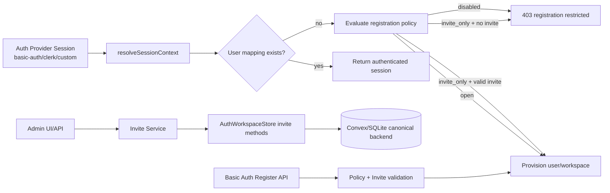

# design.md

artifact_id: c341f8f3-b17f-49d8-8f02-d9cfd733c25f

## Overview

This design adds a provider-agnostic registration control layer to OR3 SSR auth with three policy modes:

- `open`: self-service registration allowed.
- `invite_only`: self-service blocked unless a valid invite is presented.
- `disabled`: no new registrations.

It extends onboarding without changing locked boundaries:

- `resolveSessionContext()` still orchestrates provider session + canonical store resolution.
- `can()` remains the sole authorization gate for SSR API operations.
- Canonical user/workspace state remains in selected sync backend via `AuthWorkspaceStore`.

## Architecture



## High-Level Changes

### 1. Config: registration policy

Add a new auth config surface:

```ts
export type AuthRegistrationMode = 'open' | 'invite_only' | 'disabled';

export interface Or3CloudAuthConfig {
  enabled: boolean;
  provider: string;
  autoProvision?: boolean; // legacy
  registrationMode?: AuthRegistrationMode;
}
```

Env mapping:

- `OR3_AUTH_REGISTRATION_MODE=open|invite_only|disabled` (new)
- `OR3_AUTH_AUTO_PROVISION` remains supported as legacy fallback

Resolution rules:

1. If `registrationMode` is explicitly set, it is authoritative.
2. Else fallback to legacy `autoProvision` behavior.
3. Strict mode validates allowed values and provider capability compatibility.

### 2. Session resolution registration gate

Current `resolveSessionContext()` already checks unknown user behavior via `getUser` + `getOrCreateUser` and `OR3_AUTH_AUTO_PROVISION`.

Replace ad-hoc boolean checks with a policy gate:

```ts
interface RegistrationDecision {
  allowed: boolean;
  reason?: 'disabled' | 'invite_required' | 'invite_invalid' | 'invite_expired';
  invite?: InviteResolution;
}
```

Flow for unknown users:

1. Resolve `existingUser = store.getUser(...)`.
2. If exists, proceed.
3. Else evaluate registration policy.
4. If allowed, validate any invite against current store state first, then call `getOrCreateUser(...)` and continue to workspace resolution.
5. If denied, return/throw deterministic 403 with no sensitive leakage.

### 3. Invite domain model and store contract

Store invite metadata in canonical backend (Convex/SQLite), not provider-local auth DB.

```ts
export interface WorkspaceInvite {
  id: string;
  workspace_id: string;
  email: string;
  role: 'owner' | 'editor' | 'viewer';
  status: 'pending' | 'accepted' | 'revoked' | 'expired';
  invited_by_user_id: string;
  token_hash: string;
  expires_at: number;
  accepted_at?: number | null;
  accepted_user_id?: string | null;
  created_at: number;
  updated_at: number;
}
```

### 4. `AuthWorkspaceStore` extensions

Extend store interface with invite lifecycle methods:

```ts
export interface AuthWorkspaceStore {
  // existing methods...

  createInvite?(input: {
    workspaceId: string;
    email: string;
    role: 'owner' | 'editor' | 'viewer';
    invitedByUserId: string;
    expiresAt: number;
    tokenHash: string;
  }): Promise<{ inviteId: string }>;

  listInvites?(input: {
    workspaceId: string;
    status?: 'pending' | 'accepted' | 'revoked' | 'expired';
    limit?: number;
  }): Promise<WorkspaceInvite[]>;

  revokeInvite?(input: {
    workspaceId: string;
    inviteId: string;
    revokedByUserId: string;
  }): Promise<void>;

  consumeInvite?(input: {
    workspaceId: string;
    email: string;
    tokenHash?: string;
    acceptedUserId: string;
  }): Promise<{ ok: boolean; role?: 'owner' | 'editor' | 'viewer'; reason?: string }>;
}
```

Capability policy:

- `invite_only` mode requires invite methods on active store.
- If missing in strict mode: startup failure.
- If missing in non-strict mode: explicit warning + fallback to deny unknown registrations.

### 5. Invite token service

New server utility:

- Generates signed token for invite links.
- Stores only `token_hash` in backend.
- Validates expiry and integrity on acceptance.

```ts
interface InviteTokenPayload {
  invite_id: string;
  workspace_id: string;
  email: string;
  exp: number;
}
```

Security:

- HMAC-based signing with dedicated secret.
- Token TTL configurable; short-lived by default.
- One-time consumption with atomic status transition.

### 6. Admin API additions

Add SSR admin endpoints (owner/admin guarded):

- `POST /api/admin/workspace/invites/create`
- `GET /api/admin/workspace/invites/list`
- `POST /api/admin/workspace/invites/revoke`

Use existing admin security pattern:

- `requireAdminApi(..., { ownerOnly: true, mutation: true })` for writes
- `Cache-Control: no-store`
- same-origin checks for mutations
- rate limiting for create/revoke

### 7. Basic-auth registration implementation

Current basic-auth provider supports sign-in/sign-out/refresh/change-password but not account creation.

Add:

- `POST /api/basic-auth/register`
- `BasicAuthRegisterModal.client.vue`
- Sign-in modal toggle for “Create account”

Endpoint behavior:

1. Validate email/password/displayName (+ optional invite token).
2. Evaluate registration policy.
3. If `invite_only`, validate invite and bind to email.
4. Create account (reject duplicate email safely).
5. Create session + set cookies (same as sign-in flow).
6. Emit auth session changed signal.

### 8. Clerk and other provider behavior

No provider-specific registration endpoint required in core.

For OAuth/managed providers (e.g., Clerk):

- Provider handles identity creation UX externally.
- OR3 enforces policy during first `resolveSessionContext()` provisioning.
- In `invite_only`, provisioning succeeds only when invite resolution succeeds and store validation passes before a new user record is created.

This satisfies “register with any enabled provider” while keeping provider runtime boundaries intact.

### 9. Admin/system capability reporting

Extend provider/admin status payloads with registration capability details:

```ts
interface AuthRegistrationCapabilities {
  supportsOpenRegistration: boolean;
  supportsInviteOnly: boolean;
  supportsAdminInvites: boolean;
}
```

Used by admin UI to conditionally show invite controls and diagnostics.

## Data Model Notes

### SQLite provider

Add migration table:

- `auth_invites` with indexes on:
  - `(workspace_id, status, expires_at)`
  - `(workspace_id, email, status)`
  - unique `id`

### Convex provider

Add `auth_invites` table/collection with equivalent fields and indexes.

## Error Handling

Service result shape for registration/invite operations:

```ts
type RegistrationErrorCode =
  | 'REGISTRATION_DISABLED'
  | 'INVITE_REQUIRED'
  | 'INVITE_INVALID'
  | 'INVITE_EXPIRED'
  | 'INVITE_REVOKED'
  | 'EMAIL_ALREADY_IN_USE'
  | 'CAPABILITY_UNAVAILABLE';
```

HTTP mapping:

- 400: malformed payload
- 401: unauthenticated admin route access
- 403: policy denial / forbidden invite actions
- 404: invite not found (admin scope)
- 409: duplicate registration
- 503: backend capability mismatch in runtime

## Testing Strategy

### Unit

- Policy evaluation matrix (`open/invite_only/disabled`, existing vs unknown user).
- Invite token sign/verify/tamper/expiry.
- Invite consume race conditions (single-use semantics).
- Basic-auth register validation and duplicate email behavior.

### Integration

- `resolveSessionContext()` with each mode and invite inputs.
- Admin invite create/list/revoke APIs.
- Basic-auth register -> `/api/auth/session` authenticated path.
- Clerk first-login deny/allow based on invite mode.

### E2E

- Open registration onboarding.
- Invite-only onboarding via emailed token flow.
- Existing user sign-in unaffected after mode switch.
- Admin invite lifecycle from dashboard.

## Rollout Plan

1. Ship config + policy gate behind default-preserving fallback.
2. Add store contract + provider implementations (sqlite, convex).
3. Add admin invite APIs and UI.
4. Add basic-auth register API/UI.
5. Update docs and migration guide.
6. Enable invite-only mode in staging and validate matrix.
