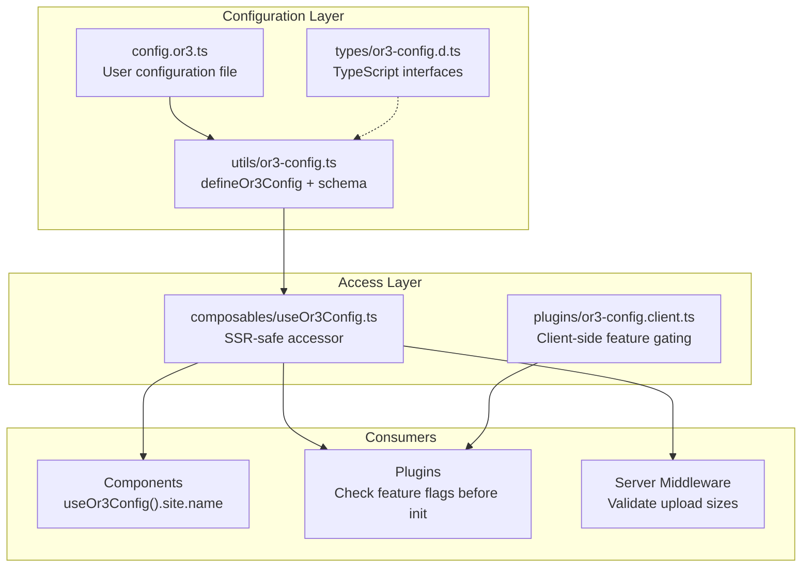
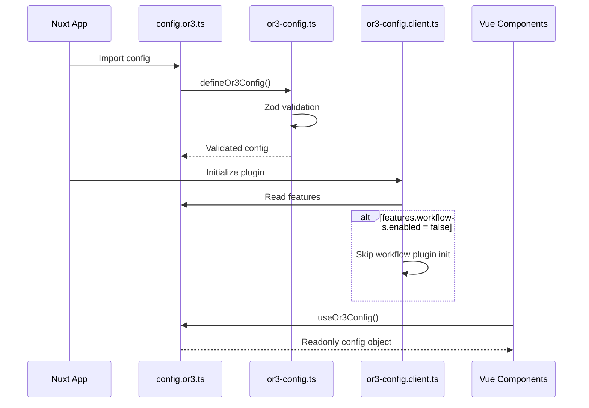

# OR3 Base Config System Design

## Overview

This document describes the technical design for the OR3 base configuration system. The system provides a centralized, type-safe way to configure site branding, feature toggles, and client-side limits. It mirrors the architecture of the existing cloud config (`or3-cloud-config.ts`) for consistency.

### Key Principles

1. **Mirror cloud config patterns** - Use same Zod validation + `defineX` helper pattern
2. **Non-overlapping concerns** - Base config = site/features/limits; Cloud config = auth/sync/storage/services
3. **SSR-compatible** - Works identically on server and client
4. **Zero dependencies on cloud** - Works in fully offline/local mode

---

## Architecture



---

## Components and Interfaces

### Core Types

```typescript
// types/or3-config.d.ts

export interface Or3Config {
    /**
     * Site branding and identity settings.
     */
    site: {
        /**
         * Display name for the site.
         * @default "OR3"
         */
        name: string;
        
        /**
         * Site description for meta tags.
         */
        description?: string;
        
        /**
         * URL to custom logo image.
         */
        logoUrl?: string;
        
        /**
         * URL to custom favicon.
         */
        faviconUrl?: string;
        
        /**
         * Default theme for new users.
         * @default "blank"
         */
        defaultTheme?: string;
    };

    /**
     * Feature toggles for enabling/disabling capabilities.
     */
    features: {
        /** Workflow automation feature with granular controls */
        workflows?: {
            /** Master toggle - disables all workflow functionality */
            enabled?: boolean;
            /** Allow access to workflow editor UI */
            editor?: boolean;
            /** Enable workflow slash commands (/) */
            slashCommands?: boolean;
            /** Allow workflow execution */
            execution?: boolean;
        };
        
        /** Document editor feature */
        documents?: { enabled?: boolean };
        
        /** Workspace backup/restore feature */
        backup?: { enabled?: boolean };
        
        /** @mentions autocomplete with granular source controls */
        mentions?: {
            /** Master toggle - disables all mention functionality */
            enabled?: boolean;
            /** Allow @mentions for documents */
            documents?: boolean;
            /** Allow @mentions for past conversations */
            conversations?: boolean;
        };
        
        /** Dashboard settings panel */
        dashboard?: { enabled?: boolean };
    };

    /**
     * Upload and storage limits.
     */
    limits: {
        /**
         * Maximum file size for local uploads (bytes).
         * @default 20971520 (20MB)
         */
        maxFileSizeBytes?: number;
        
        /**
         * Maximum file size for cloud uploads (bytes).
         * @default 104857600 (100MB)
         */
        maxCloudFileSizeBytes?: number;
        
        /**
         * Maximum files per chat message.
         * @default 10
         */
        maxFilesPerMessage?: number;
        
        /**
         * Local storage quota warning threshold (MB).
         * When set, warnings appear when usage approaches this limit.
         */
        localStorageQuotaMB?: number;
    };

    /**
     * UI experience defaults.
     */
    ui?: {
        /**
         * Default number of panes for new users.
         * @default 1
         */
        defaultPaneCount?: number;
        
        /**
         * Maximum number of panes allowed.
         * @default 4
         */
        maxPanes?: number;
        
        /**
         * Whether sidebar starts collapsed by default.
         * @default false
         */
        sidebarCollapsedByDefault?: boolean;
    };

    /**
     * Plugin/extension configuration namespace.
     * Allows third-party plugins to register their own config.
     */
    extensions?: Record<string, unknown>;
}

export interface Or3ConfigOptions {
    /**
     * If true, throws at startup if required values are missing.
     * @default true in production, false in development
     */
    strict?: boolean;
}
```

### Validation Schema

```typescript
// utils/or3-config.ts

import { z } from 'zod';

const or3ConfigSchema = z.object({
    site: z.object({
        name: z.string().min(1).default('OR3'),
        description: z.string().optional(),
        logoUrl: z.string().url().optional(),
        faviconUrl: z.string().url().optional(),
        defaultTheme: z.string().optional().default('blank'),
    }),
    features: z.object({
        workflows: z.object({
            enabled: z.boolean().optional().default(true),
            editor: z.boolean().optional().default(true),
            slashCommands: z.boolean().optional().default(true),
            execution: z.boolean().optional().default(true),
        }).optional(),
        documents: z.object({ enabled: z.boolean().optional().default(true) }).optional(),
        backup: z.object({ enabled: z.boolean().optional().default(true) }).optional(),
        mentions: z.object({
            enabled: z.boolean().optional().default(true),
            documents: z.boolean().optional().default(true),
            conversations: z.boolean().optional().default(true),
        }).optional(),
        dashboard: z.object({ enabled: z.boolean().optional().default(true) }).optional(),
    }).optional().default({}),
    limits: z.object({
        maxFileSizeBytes: z.number().int().positive().optional().default(20 * 1024 * 1024),
        maxCloudFileSizeBytes: z.number().int().positive().optional().default(100 * 1024 * 1024),
        maxFilesPerMessage: z.number().int().min(1).optional().default(10),
        localStorageQuotaMB: z.number().int().positive().optional(),
    }).optional().default({}),
    ui: z.object({
        defaultPaneCount: z.number().int().min(1).max(4).optional().default(1),
        maxPanes: z.number().int().min(1).max(8).optional().default(4),
        sidebarCollapsedByDefault: z.boolean().optional().default(false),
    }).optional().default({}),
    extensions: z.record(z.string(), z.unknown()).optional().default({}),
}).passthrough();
```

### Config Helper Function

```typescript
// utils/or3-config.ts

export function defineOr3Config(
    config: Partial<Or3Config>,
    options: Or3ConfigOptions = {}
): Or3Config {
    const strict = options.strict ?? process.env.NODE_ENV === 'production';
    const merged = mergeWithDefaults(config);
    validateConfig(merged, strict);
    return merged;
}
```

---

## Data Flow

### Startup Flow



### Feature Gating Pattern

Plugins and components check feature flags before initializing:

```typescript
// Example: workflows.client.ts
export default defineNuxtPlugin(async (nuxtApp) => {
    const config = useOr3Config();
    
    if (!config.features.workflows?.enabled) {
        console.log('[workflows] Feature disabled, skipping initialization');
        return;
    }
    
    // ... initialize workflow feature
});
```

---

## File Structure

```
or3-chat/
├── config.or3.ts                    # [NEW] User config file
├── utils/
│   ├── or3-config.ts                # [NEW] defineOr3Config + schema
│   └── or3-cloud-config.ts          # [EXISTS] Cloud config (unchanged)
├── types/
│   ├── or3-config.d.ts              # [NEW] Base config types
│   └── or3-cloud-config.d.ts        # [EXISTS] Cloud config types
├── app/
│   ├── composables/
│   │   └── useOr3Config.ts          # [NEW] SSR-safe config accessor
│   └── plugins/
│       ├── or3-config.client.ts     # [NEW] Feature gating plugin
│       ├── mentions.client.ts       # [MODIFY] Check feature flag
│       ├── workflows.client.ts      # [MODIFY] Check feature flag
│       └── workspaces.client.ts     # [MODIFY] Check feature flag
└── tests/
    └── unit/
        └── or3-config.test.ts       # [NEW] Config validation tests
```

---

## Error Handling

### Validation Errors

When config validation fails, clear error messages are provided:

```typescript
function formatConfigErrors(errors: string[]) {
    const heading = '[or3-config] Configuration validation failed:';
    return `${heading}\n${errors.map((err) => `- ${err}`).join('\n')}`;
}

// Example output:
// [or3-config] Configuration validation failed:
// - site.name: String must contain at least 1 character(s)
// - limits.maxFileSizeBytes: Expected number, received string
```

### Graceful Degradation

When a feature flag is missing, defaults are applied:

```typescript
// If features.workflows is undefined, default to enabled
const isWorkflowsEnabled = config.features.workflows?.enabled ?? true;
```

---

## Testing Strategy

### Unit Tests

Test the `defineOr3Config` function:

```typescript
describe('defineOr3Config', () => {
    it('applies defaults for optional fields');
    it('validates site.name is not empty');
    it('validates URL format for logoUrl');
    it('validates limits are positive integers');
    it('throws in strict mode on invalid config');
    it('returns fully typed config object');
});
```

### Integration Tests

Test feature gating in plugins:

```typescript
describe('Feature Gating', () => {
    it('workflows plugin skips init when disabled');
    it('mentions plugin skips init when disabled');
    it('dashboard route redirects when disabled');
});
```

---

## Migration Considerations

### Existing Hardcoded Values

The following values are currently hardcoded and will be migrated to the config:

| Current Location | Value | Config Path |
|------------------|-------|-------------|
| `app/db/files.ts:32` | `MAX_FILE_SIZE_BYTES = 20 * 1024 * 1024` | `limits.maxFileSizeBytes` |
| `server/api/storage/presign-upload.post.ts:64` | `MAX_FILE_SIZE = 100 * 1024 * 1024` | `limits.maxCloudFileSizeBytes` |
| `app/app.config.ts:33` | `mentions.enabled: true` | `features.mentions.enabled` |

### Backwards Compatibility

- If `config.or3.ts` does not exist, all-defaults config is used
- Existing `app.config.ts` mentions config continues to work (deprecated)
