# design.md

artifact_id: b8e2f9d3-5f0a-4g4b-c9f6-3d2e4f6g7h8i
date: 2026-01-11

## Overview

This design adds a **database synchronization** and **remote file storage** subsystem to OR3 Chat that:

- Keeps local-first IndexedDB (Dexie) as the source of truth for UX
- Syncs record metadata to a SyncProvider backend (Convex default) for multi-device/multi-user access
- Transfers file blobs separately via presigned URLs (not in record sync)
- Provides a provider-extensible architecture (Convex default, S3/Supabase pluggable)
- Uses content-addressed storage with hash versioning (SHA-256 for new, MD5 legacy support)

The implementation follows existing OR3 patterns:

- Extension points via typed hooks system (`useHooks()`)
- Global registries using `createRegistry()` utilities
- Error handling via `err()` + `reportError()` conventions
- Integration with SSR auth system for workspace-scoped authorization

---

## High-level architecture


---

## Data model

### Local Dexie schema (extend existing)

Current tables remain unchanged. We add new fields and one new table:

#### Extended `file_meta` fields (for remote sync)

```typescript
// Add to FileMetaSchema (snake_case wire schema)
storage_provider_id: z.string(),        // 'convex' | 's3' | 'supabase-storage'
storage_id: z.string().optional(),      // Convex storage ID or remote key

// New hash format with algorithm prefix
hash: z.string(), // 'sha256:<hex>' or 'md5:<hex>' or '<hex>' (legacy MD5)
```

Notes:
- `ref_count` is derived (computed from references) and should not be LWW-synced.
- Server-side metadata commits may seed `ref_count` (hint only) for new uploads.

#### New `file_transfers` table (transfer outbox)

```typescript
// New Dexie table for blob transfer queue
interface FileTransfer {
    id: string;                      // UUID
    hash: string;                    // File content hash
    workspace_id: string;            // Workspace scope
    direction: 'upload' | 'download';
    bytes_total: number;
    bytes_done: number;
    state: 'queued' | 'running' | 'paused' | 'failed' | 'done';
    attempts: number;
    last_error?: string;
    created_at: number;
    updated_at: number;
}
```

Notes:
- Per-device transfer state lives in `file_transfers` and is not synced.

#### New `sync_state` table (sync cursor tracking)

```typescript
interface SyncState {
    id: string;           // 'sync:<providerId>:<workspaceId>'
    tableName: string;    // 'messages' | 'threads' | etc.
    cursor?: string;      // Convex cursor or timestamp
    lastSyncAt: number;
    status: 'idle' | 'syncing' | 'error';
}
```

### Convex schema (server-side)

Create Convex schema to mirror local tables with workspace scoping:

```typescript
// convex/schema.ts
import { defineSchema, defineTable } from "convex/server";
import { v } from "convex/values";

export default defineSchema({
    // Auth/Workspace (from auth system design)
    users: defineTable({
        email: v.optional(v.string()),
        display_name: v.optional(v.string()),
        created_at: v.number(),
    }),
    
    authAccounts: defineTable({
        user_id: v.id("users"),
        provider: v.string(),
        provider_user_id: v.string(),
        created_at: v.number(),
    }).index("by_provider", ["provider", "provider_user_id"]),
    
    workspaces: defineTable({
        name: v.string(),
        owner_user_id: v.id("users"),
        created_at: v.number(),
    }),
    
    workspaceMembers: defineTable({
        workspace_id: v.id("workspaces"),
        user_id: v.id("users"),
        role: v.union(v.literal("owner"), v.literal("editor")),
        created_at: v.number(),
    }).index("by_workspace", ["workspace_id"])
      .index("by_user", ["user_id"]),
    
    // Chat data (synced from client)
    threads: defineTable({
        workspace_id: v.id("workspaces"),
        id: v.string(),  // Original Dexie ID
        title: v.optional(v.string()),
        status: v.string(),
        deleted: v.boolean(),
        pinned: v.boolean(),
        created_at: v.number(),
        updated_at: v.number(),
        last_message_at: v.optional(v.number()),
        parent_thread_id: v.optional(v.string()),
        project_id: v.optional(v.string()),
        clock: v.number(),
    }).index("by_workspace", ["workspace_id", "updated_at"])
      .index("by_workspace_id", ["workspace_id", "id"]),
    
    messages: defineTable({
        workspace_id: v.id("workspaces"),
        thread_id: v.string(),
        id: v.string(),
        role: v.string(),
        data: v.optional(v.any()),
        index: v.number(),
        order_key: v.string(),        // HLC-derived ordering key
        file_hashes: v.optional(v.string()),  // JSON array of hashes
        pending: v.optional(v.boolean()),
        deleted: v.boolean(),
        created_at: v.number(),
        updated_at: v.number(),
        clock: v.number(),
    }).index("by_thread", ["workspace_id", "thread_id", "index", "order_key"])
      .index("by_workspace_id", ["workspace_id", "id"]),
    
    // File metadata (synced separately from blobs)
    file_meta: defineTable({
        workspace_id: v.id("workspaces"),
        hash: v.string(),              // Content hash with algorithm prefix
        name: v.string(),
        mime_type: v.string(),
        kind: v.union(v.literal("image"), v.literal("pdf")),
        size_bytes: v.number(),
        width: v.optional(v.number()),
        height: v.optional(v.number()),
        ref_count: v.number(),
        storage_id: v.optional(v.id("_storage")),  // Convex storage reference
        storage_provider_id: v.string(),
        deleted: v.boolean(),
        deleted_at: v.optional(v.number()),
        created_at: v.number(),
        updated_at: v.number(),
    }).index("by_workspace_hash", ["workspace_id", "hash"])
      .index("by_workspace_deleted", ["workspace_id", "deleted"]),
    
    // Projects
    projects: defineTable({
        workspace_id: v.id("workspaces"),
        id: v.string(),
        name: v.string(),
        description: v.optional(v.string()),
        data: v.optional(v.any()),
        deleted: v.boolean(),
        created_at: v.number(),
        updated_at: v.number(),
        clock: v.number(),
    }).index("by_workspace", ["workspace_id", "updated_at"]),
});
```

### Data model mapping

The storage metadata wire schema matches Dexie (snake_case). Mapping is only required when a backend enforces different conventions.

---

## Hashing strategy

### Self-describing hash format

```typescript
type HashAlgorithm = 'sha256' | 'md5';

interface ParsedHash {
    algorithm: HashAlgorithm;
    hex: string;
    full: string;  // Original string for storage
}

function parseHash(hash: string): ParsedHash {
    if (hash.startsWith('sha256:')) {
        return { algorithm: 'sha256', hex: hash.slice(7), full: hash };
    }
    if (hash.startsWith('md5:')) {
        return { algorithm: 'md5', hex: hash.slice(4), full: hash };
    }
    // Legacy: plain hex is treated as MD5
    return { algorithm: 'md5', hex: hash, full: `md5:${hash}` };
}

function formatHash(algorithm: HashAlgorithm, hex: string): string {
    return `${algorithm}:${hex}`;
}
```

### Migration path

- New files always use `sha256:<hex>`
- Existing files with plain hex continue to work (treated as MD5)
- Gradual migration: on file access, update hash format if needed

---

## Provider architecture

### Storage provider interface

```typescript
// app/core/storage/types.ts
export interface PresignedUrlResult {
    url: string;
    headers?: Record<string, string>;
    expiresAt: number;
}

export interface ObjectStorageProvider {
    id: string;
    displayName: string;
    mode?: 'gateway'; // storage uses SSR endpoints for auth and presign
    supports: {
        presignedUpload: boolean;
        presignedDownload: boolean;
        multipart?: boolean;
    };
    
    // Generate presigned upload URL
    getPresignedUploadUrl(input: {
        workspaceId: string;
        hash: string;
        mimeType: string;
        sizeBytes: number;
    }): Promise<PresignedUrlResult & { storageId?: string }>;
    
    // Generate presigned download URL
    getPresignedDownloadUrl(input: {
        workspaceId: string;
        hash: string;
        storageId?: string;
    }): Promise<PresignedUrlResult>;
    
    // Confirm upload completed (optional for some providers)
    commitUpload?(input: {
        workspaceId: string;
        hash: string;
        storageId: string;
    }): Promise<void>;
    
    // Delete object (used by GC)
    deleteObject?(input: {
        workspaceId: string;
        hash: string;
        storageId?: string;
    }): Promise<void>;
}
```

### Provider registry

```typescript
// app/core/storage/provider-registry.ts
import { createRegistry } from '~/composables/_registry';

export interface StorageProviderRegistryItem {
    id: string;
    order?: number;
    create: () => ObjectStorageProvider;
}

const registry = createRegistry<StorageProviderRegistryItem>(
    '__or3_storage_providers'
);

export const registerStorageProvider = registry.register;
export const useStorageProviders = registry.useItems;

export function getActiveProvider(): ObjectStorageProvider | null {
    const config = useRuntimeConfig();
    const providerId = config.public.storage?.provider || 'convex';
    const items = registry.snapshot();
    const item = items.find(i => i.id === providerId);
    return item?.create() ?? null;
}
```

### Example: Convex provider implementation

```typescript
// app/core/storage/providers/convex-storage-provider.ts
export function createConvexStorageProvider(): ObjectStorageProvider {
    return {
        id: 'convex',
        displayName: 'Convex Storage',
        supports: {
            presignedUpload: true,
            presignedDownload: true,
            multipart: false,
        },
        
        async getPresignedUploadUrl(input) {
            // Call SSR endpoint to generate upload URL
            const result = await $fetch('/api/storage/presign-upload', {
                method: 'POST',
                body: {
                    workspace_id: input.workspaceId,
                    hash: input.hash,
                    mime_type: input.mimeType,
                    size_bytes: input.sizeBytes,
                },
            });
            return result;
        },
        
        async getPresignedDownloadUrl(input) {
            // Call SSR endpoint to get file URL
            const result = await $fetch('/api/storage/presign-download', {
                method: 'POST',
                body: {
                    workspace_id: input.workspaceId,
                    hash: input.hash,
                    storage_id: input.storageId,
                },
            });
            return result;
        },
        
        async commitUpload(input) {
            // Confirm upload and link storage ID to file metadata
            await $fetch('/api/storage/commit', {
                method: 'POST',
                body: {
                    workspace_id: input.workspaceId,
                    hash: input.hash,
                    storage_id: input.storageId,
                },
            });
        },
    };
}
```

---

## Sync engine design

### Sync flow (records)


### Conflict resolution

- **Last-write-wins** based on `clock` field
- Each client increments `clock` on every create/update/delete
- Server stores highest observed `clock`
- On conflict, higher `clock` wins; ties broken by server timestamp

### Sync outbox pattern

```typescript
// Outbox entry for pending sync
interface SyncOutboxEntry {
    id: string;
    table_name: string;
    operation: 'upsert' | 'delete';
    pk: string;
    data: unknown;
    clock: number;
    attempts: number;
    status: 'pending' | 'syncing' | 'failed';
    created_at: number;
}
```

---

## File transfer engine

### Upload flow


### Download flow

```mermaid
flowchart TB
    A["Render file by hash"] --> B{"Blob in file_blobs?"}
    B -->|Yes| C["Create blob: URL → render"]
    B -->|No| D{"storage_id present?"}
    D -->|No| E["Show placeholder: missing"]
    D -->|Yes| F["Request presigned download URL"]
    F --> G["Fetch blob from URL"]
    G --> H["Write to file_blobs"]
    H --> C
```



### Transfer queue implementation

```typescript
// app/core/storage/transfer-queue.ts
export class FileTransferQueue {
    private concurrency = 2;
    private running = new Set<string>();
    private backoff = new ExponentialBackoff({ base: 1000, max: 60000 });
    
    async enqueue(hash: string, direction: 'upload' | 'download', workspaceId: string) {
        await db.file_transfers.put({
            id: newId(),
            hash,
            workspace_id: workspaceId,
            direction,
            bytes_total: 0,
            bytes_done: 0,
            state: 'queued',
            attempts: 0,
            created_at: nowSec(),
            updated_at: nowSec(),
        });
        this.processQueue();
    }
    
    private async processQueue() {
        if (this.running.size >= this.concurrency) return;
        
        const slots = this.concurrency - this.running.size;
        const pending = await db.file_transfers
            .where('state')
            .equals('queued')
            .limit(slots)
            .toArray();
        
        if (!pending.length) return;
        
        pending.forEach((transfer) => {
            this.running.add(transfer.id);
            this.processTransfer(transfer)
                .finally(() => {
                    this.running.delete(transfer.id);
                    this.processQueue();
                });
        });
    }
    
    private async processTransfer(transfer: FileTransfer) {
        // Update state to running
        await db.file_transfers.update(transfer.id, { state: 'running' });
        
        try {
            if (transfer.direction === 'upload') {
                await this.doUpload(transfer);
            } else {
                await this.doDownload(transfer);
            }
            
            await db.file_transfers.update(transfer.id, { state: 'done' });
        } catch (error) {
            const attempts = transfer.attempts + 1;
            const delay = this.backoff.next(attempts);
            
            await db.file_transfers.update(transfer.id, {
                state: attempts >= 5 ? 'failed' : 'queued',
                attempts,
                last_error: String(error),
                updated_at: nowSec(),
            });
            
            if (attempts < 5) {
                setTimeout(() => this.processQueue(), delay);
            }
        }
    }
}
```

Progress tracking note:
- Upload progress requires XHR or fetch upload streams; plain `fetch` cannot report upload progress.
- Download progress can use streams + `ReadableStream` byte counts.

---

## SSR API endpoints

### File storage endpoints

Notes:
- SSR endpoints enforce `can()` and call Convex with server credentials.
- Convex functions assume server-trusted calls when invoked from SSR endpoints.
- Workspace membership is sourced from `AuthWorkspaceStore` (same backend as the SyncProvider).

```typescript
// server/api/storage/presign-upload.post.ts
export default defineEventHandler(async (event) => {
    const session = await getSession(event);
    if (!session?.authenticated) {
        throw createError({ statusCode: 401, message: 'Unauthorized' });
    }
    
    const { workspace_id, hash, mime_type, size_bytes } = await readBody(event);
    
    // Verify workspace membership
    const canAccess = await can(session, 'workspace.write', {
        workspaceId: workspace_id,
    });
    if (!canAccess.allowed) {
        throw createError({ statusCode: 403, message: 'Forbidden' });
    }
    
    // Generate upload URL via Convex
    const convex = useConvexClient();
    const result = await convex.mutation(api.storage.generateUploadUrl, {
        workspace_id,
        hash,
        mime_type,
        size_bytes,
    });
    
    return {
        url: result.uploadUrl,
        storage_id: result.storageId,
        expiresAt: Date.now() + 3600_000, // 1 hour
    };
});
```

```typescript
// server/api/storage/presign-download.post.ts
export default defineEventHandler(async (event) => {
    const session = await getSession(event);
    if (!session?.authenticated) {
        throw createError({ statusCode: 401, message: 'Unauthorized' });
    }
    
    const { workspace_id, hash } = await readBody(event);
    
    // Verify workspace membership
    const canAccess = await can(session, 'workspace.read', {
        workspaceId: workspace_id,
    });
    if (!canAccess.allowed) {
        throw createError({ statusCode: 403, message: 'Forbidden' });
    }
    
    // Get file URL via Convex
    const convex = useConvexClient();
    const result = await convex.query(api.storage.getFileUrl, {
        workspace_id,
        hash,
    });
    
    if (!result?.url) {
        throw createError({ statusCode: 404, message: 'File not found' });
    }
    
    return {
        url: result.url,
        expiresAt: Date.now() + 3600_000,
    };
});
```

---

## Hook integration

### New storage hooks

Add to `CoreHookPayloadMap` in `hook-types.ts`:

```typescript
// Storage lifecycle hooks
'storage.files.upload:action:before': [{ hash: string; workspace_id: string; size_bytes: number }];
'storage.files.upload:action:after': [{ hash: string; workspace_id: string; storage_id: string }];
'storage.files.download:action:before': [{ hash: string; workspace_id: string }];
'storage.files.download:action:after': [{ hash: string; workspace_id: string; size_bytes: number }];
'storage.files.url:filter:options': [{ hash: string; expiry_ms: number; disposition?: string }];
'storage.files.upload:filter:policy': [{ hash: string; mime_type: string; size_bytes: number } | false];
'storage.files.gc:action:run': [{ deleted_count: number; workspace_id: string }];

// Sync lifecycle hooks
'sync.push:action:before': [{ tableName: string; count: number }];
'sync.push:action:after': [{ tableName: string; successCount: number; failCount: number }];
'sync.pull:action:after': [{ tableName: string; count: number }];
'sync.conflict:action:detected': [{ tableName: string; pk: string; resolution: 'local' | 'remote' }];
```

---

## Example: Convex functions

### Storage mutations

```typescript
// convex/storage.ts
import { v } from "convex/values";
import { mutation, query } from "./_generated/server";

export const generateUploadUrl = mutation({
    args: {
        workspace_id: v.id("workspaces"),
        hash: v.string(),
        mime_type: v.string(),
        size_bytes: v.number(),
    },
    handler: async (ctx, args) => {
        // Generate upload URL
        const uploadUrl = await ctx.storage.generateUploadUrl();
        
        return { uploadUrl };
    },
});

export const commitUpload = mutation({
    args: {
        workspace_id: v.id("workspaces"),
        hash: v.string(),
        storage_id: v.id("_storage"),
        storage_provider_id: v.string(),
        mime_type: v.string(),
        size_bytes: v.number(),
        name: v.string(),
        kind: v.union(v.literal("image"), v.literal("pdf")),
    },
    handler: async (ctx, args) => {
        // Upsert file metadata
        const existing = await ctx.db
            .query("file_meta")
            .withIndex("by_workspace_hash", (q) =>
                q.eq("workspace_id", args.workspace_id).eq("hash", args.hash)
            )
            .first();
        
        if (existing) {
            await ctx.db.patch(existing._id, {
                storage_id: args.storage_id,
                storage_provider_id: args.storage_provider_id,
                updated_at: Date.now(),
            });
        } else {
            await ctx.db.insert("file_meta", {
                workspace_id: args.workspace_id,
                hash: args.hash,
                name: args.name,
                mime_type: args.mime_type,
                kind: args.kind,
                size_bytes: args.size_bytes,
                storage_id: args.storage_id,
                storage_provider_id: args.storage_provider_id,
                ref_count: 1,
                deleted: false,
                created_at: Date.now(),
                updated_at: Date.now(),
            });
        }
    },
});

export const getFileUrl = query({
    args: {
        workspace_id: v.id("workspaces"),
        hash: v.string(),
    },
    handler: async (ctx, args) => {
        const file = await ctx.db
            .query("file_meta")
            .withIndex("by_workspace_hash", (q) =>
                q.eq("workspace_id", args.workspace_id).eq("hash", args.hash)
            )
            .first();
        
        if (!file?.storage_id) return null;
        
        const url = await ctx.storage.getUrl(file.storage_id);
        return { url };
    },
});
```

---

## Error handling

Use existing OR3 conventions:

```typescript
// Storage-specific error codes
export const StorageErrors = {
    UPLOAD_FAILED: 'ERR_STORAGE_UPLOAD_FAILED',
    DOWNLOAD_FAILED: 'ERR_STORAGE_DOWNLOAD_FAILED',
    QUOTA_EXCEEDED: 'ERR_STORAGE_QUOTA_EXCEEDED',
    FILE_NOT_FOUND: 'ERR_STORAGE_FILE_NOT_FOUND',
    PROVIDER_ERROR: 'ERR_STORAGE_PROVIDER_ERROR',
} as const;

// Usage
throw err(StorageErrors.UPLOAD_FAILED, 'Upload timed out', {
    cause: originalError,
    tags: { domain: 'storage', stage: 'upload', hash },
});
```

---

## Testing strategy

### Unit tests

1. **Hash parsing and formatting**
   - `parseHash()` correctly identifies algorithm
   - `formatHash()` produces self-describing strings
   - Legacy plain hex treated as MD5

2. **Transfer queue logic**
   - Queue respects concurrency limit
   - Exponential backoff on failures
   - Failed transfers marked after max attempts

3. **Provider interface**
   - Registry correctly selects provider by ID
   - Missing provider returns null safely

### Integration tests

1. **Upload flow**
   - File stored locally first
   - Transfer queued when authenticated
   - Remote status updated on success

2. **Download flow**
   - Local blob preferred when present
   - Remote fetch triggered when missing
   - Downloaded blob cached locally

3. **Sync flow**
   - Local writes pushed to Convex
   - Remote changes pulled and merged
   - Conflicts resolved correctly

### Manual verification

1. **Multi-device sync**
   - Create message on device A
   - Verify appears on device B within seconds

2. **Offline resilience**
   - Go offline, create messages
   - Go online, verify sync completes

3. **File attachment flow**
   - Attach image in offline mode
   - Go online, verify upload completes
   - Open on new device, verify download works

---

## Migration plan

1. **Phase 1: Schema additions**
   - Add `storage_provider_id` and `storage_id` fields to `FileMetaSchema`
   - Add `file_transfers` and `sync_state` tables
   - Bump Dexie version (7)

2. **Phase 2: Provider infrastructure**
   - Implement provider interface and registry
   - Add Convex provider
   - Add SSR API endpoints

3. **Phase 3: Transfer engine**
   - Implement `FileTransferQueue`
   - Integrate with file creation flow
   - Add download-on-demand

4. **Phase 4: Sync engine**
   - Implement sync outbox
   - Add reactive subscriptions
   - Handle conflicts

5. **Phase 5: UI integration**
   - Sync status indicators
   - Transfer progress UI
   - Error handling and retry UI
