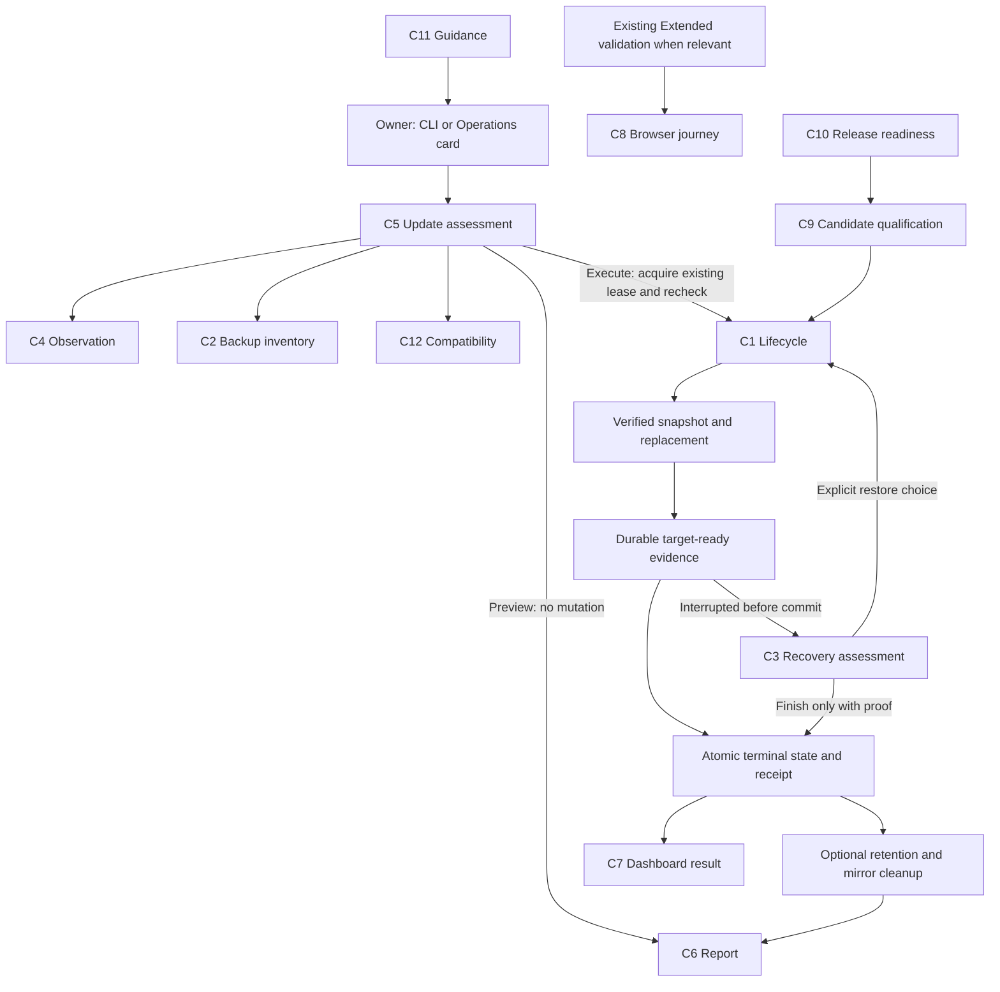

# Design

## Overview

Evolve the existing managed CLI into an operation with three clear boundaries: assess, replace/verify/commit, and maintain. Keep the deployment state authoritative, use the existing lease for mutations, and make the terminal commit independent of retention. Preview, recovery, CLI output, and dashboard status consume the same assessments and operation results.

Deliver the cleanup fix and compatibility readers first, then the richer recovery format and dashboard experience. This ordering gives current installations relief without requiring the entire project to finish before shipping. No versions are reserved by this plan.

CI scope is limited to more focused cases inside existing suites and jobs. Add no workflows, jobs, runners, services, schedules, required status contexts, or image builds. Essential update/recovery regressions remain required; broader historical, interruption, and browser combinations use existing Extended validation when relevant code changes. Existing release/security gates are preserved.

Evidence from the inspected source:

| Current behavior | Consequence and planned change |
| --- | --- |
| `updateCommand` changes the in-memory target state, calls `pruneBackups`, schedules operator handoff, then calls `clearPending`; its catch persists the changed state with pending still present. | The precise fault is a mixed terminal/pending state, not necessarily a separate successful disk commit before pruning. C1 commits completion before maintenance. |
| `clearPending` and `commitRecoveredState` remove the operation mirror before writing terminal state. | A crash can split the two records. C1 makes state authoritative and writes it before optional mirror deletion. |
| `enumerateBackups` skips legacy adoption/unsigned backups but throws for other bad entries; `readManifest` enforces authentication and archive checks. | C2 separates inventory from trusted restore eligibility without relaxing `readManifest`. |
| `recoverCommand` restores snapshots for updates past `snapshot-created`; phases lack a durable target-ready milestone. | C3 needs positive completion evidence to finish forward safely. |
| `verifyCommand` is a leased mutation and performs sign-in and a storage write/read/delete probe. | C4 adds explicitly read-only observation instead of simply removing `assertNoPending`. |
| `update` accepts only `--to`; operator preparation currently follows a snapshot that can stop OR3. | C5 introduces shared preview and moves artifact/operator preparation ahead of downtime. |
| Dashboard job/status validators reject unknown fields; operator state reader only accepts schema 1. | C7/C12 must cover old/new app, CLI, and operator combinations explicitly. |
| The candidate lifecycle already seeds five unsigned backups and an adoption directory, tests a stale update, restores, reapplies, and restarts. | C9 extends that harness with mixed failures and actual interruption boundaries; it does not replace working coverage. |
| The PKCE callback can emit an SDK toast plus a second retry toast and reuse the same code. Shipped Caddy now allows OpenRouter. | C8 preserves the CSP fix, proves it in a real browser, and makes failed connection restart explicit. |

## Architecture



Components are responsibilities, not a request to create twelve modules. Start with small helpers in the current CLI and established server/UI files; extract a file only when a caller needs a real shared boundary.

| Component | Responsibility and existing integration point | Requirements |
| --- | --- | --- |
| C1 Lifecycle | Own durable operation transitions in `packages/or3-cloud/src/cli.ts`; use `writeSecure`/fsync and existing lease. | R1, R3, R6, R13 |
| C2 Backup inventory | Classify entries and produce retention decisions around `enumerateBackups`, `readManifest`, and `selectPruneTargets`. | R2, R5, R9, R13 |
| C3 Recovery assessment | Decide whether finish, restore, or further inspection is admissible; execute an explicitly selected action. | R3, R4, R6, R13 |
| C4 Observation | Collect independent runtime/state/lease evidence without modifying it; extend status/doctor/verify. | R4, R5, R6, R11, R13 |
| C5 Update assessment | Produce one plan used by dry run and execution before the mutation boundary. | R5, R7, R11, R13 |
| C6 Operation reporting | Render typed outcomes, progress, redacted receipts, and exact supported next commands. | R1, R6, R7, R11, R12 |
| C7 Dashboard integration | Adapt existing operator, `server/admin/update/operator-client.ts`, admin routes/types, and `AdminSystemUpdateCard.vue`. | R1, R7, R13 |
| C8 Connection journey | Preserve shipped CSP and correct callback recovery in `app/core/auth/openrouter-auth.ts` and `app/pages/openrouter-callback.vue`. | R8, R12 |
| C9 Qualification | Add cases to existing Cloud/lifecycle tests; use existing Extended validation jobs for broader history/browser coverage. | R1–R9, R13 |
| C10 Release readiness | Extend local `scripts/release/prepare-release.ts`, existing summaries/receipts, and release guidance without new CI jobs. | R10, R11 |
| C11 Guidance | Update canonical operations/developer docs, Cloud README, affected provider docs, and docmap. | R3–R8, R10–R12 |
| C12 Compatibility | Decode state/operation formats and enforce the supported CLI/operator transition. | R1, R3, R7, R13 |

## Components and Interfaces

### C1/C12: completion protocol and compatibility

Keep schema 1 for the first safety/reader release. It can atomically persist the already-supported terminal state before cleanup; this needs no change to the meaning of recovery phases. It also teaches the CLI/operator to recognize the forthcoming schema 2, display diagnostics, and route mutations to its compatible exact target CLI. The old `/status` response remains unchanged.

Use state schema 2 for the subsequent release that writes the new recovery milestones. This is intentional: today's schema-1 reader ignores extra fields and an old `recover` would otherwise interpret a new operation using its destructive old policy. The existing 0.1.67 reader rejects a different top-level schema before data mutation. Do not rely on an advisory `minimumCliVersion` field to provide protection that old code does not enforce.

The first release is the compatibility bridge. It reads both formats but continues writing schema 1 until a schema-2-capable updater starts the next upgrade. Its operator understands both protocol versions and invokes the recorded exact target updater for owned interruptions. The schema-2 release declares the bridge as its minimum source version. Older installations receive a preview with the exact bridge step before the target step; neither step deletes data or edits state manually. The direct host path follows this same supported sequence rather than introducing a second migration algorithm.

Before any schema migration, the bridge/source deployment must be settled with a verified snapshot. Write schema 2 and its initial pending update in one atomic state replacement; never publish an empty new-format state between them. A failed migration leaves the original readable state. The source bridge app/operator can read schema 2 after rollback, so data rollback does not require downgrading management metadata.

Illustrative TypeScript contracts, using current names where practical:

```ts
type ReleaseIdentity = {
  appVersion: string;
  image: string;
  imageDigest: string;
  sourceRevision?: string;
  operatorImageDigest?: string;
};

type UpdateJournalV2 = {
  id: string;
  operation: 'update';
  startedAt: string;
  origin: 'cli' | 'dashboard';
  dashboardJobId?: string;
  source: ReleaseIdentity;
  target: ReleaseIdentity;
  backupId: string;
  backupPath: string;
} & (
  | { phase: 'prepared' }
  | { phase: 'snapshot-created'; snapshot: VerifiedSnapshot }
  | { phase: 'target-mutating'; snapshot: VerifiedSnapshot }
  | {
      phase: 'target-ready';
      snapshot: VerifiedSnapshot;
      evidence: TargetReadyEvidence;
    }
  | { phase: 'restoring-previous'; snapshot: VerifiedSnapshot }
);

type VerifiedSnapshot = {
  backupId: string;
  path: string;
  dataSha256: string;
  configSha256: string;
  createdAt: string;
};

type TargetReadyEvidence = {
  checkedAt: string;
  deploymentId: string;
  deploymentRoot: string;
  containerId: string;
  imageDigest: string;
  configurationSha256: string;
  managedAssetSha256: Record<string, string>;
  dataReplacementCompleted: true;
  checks: CheckResult[];
};
```

Other operation kinds retain their own explicit variants: backup, init/adopt, restore/rollback, and credentials reset. Do not reuse the update finish path for restoring data, bootstrapping accounts, or adoption. Type validation must cover operation-specific required fields before mutation. Backup authentication and protected credential reset records remain separate from public reporting.

Update sequence:

1. Assess and present failures; execution acquires the existing lease and repeats identity/space/compatibility checks.
2. Resolve/pull both images, validate provenance/revision/platform bindings, render and validate target assets, and perform operator preparation while the source remains running. Do not recreate a dashboard supervisor that is executing the updater.
3. Persist pending preparation; stop only for the existing consistent snapshot process. Verify the snapshot and its assets before target mutation. Insufficient space must never be solved by deleting the only rollback point.
4. Persist target-mutating before the first data/config/asset replacement. Retain existing restore/ownership safeguards.
5. Complete replacement and target startup; run required digest, deep/local health, database/ownership, asset, and public HTTPS/CSP checks. Full credentialed probes are separate and labeled if unavailable.
6. Persist target-ready with proof of completed replacement. Health alone cannot create this proof after a crash. Recheck live identity before committing.
7. Atomically replace state with target identity, rollback reference, terminal receipt, and no incomplete operation. The operation mirror is never more authoritative than state.
8. Delete the redundant operation mirror and run optional retention. Persist maintenance results if possible; failures produce warnings, never rollback or a new pending update. An unresolved warning can be rediscovered by inventory even if its post-commit write failed.

For a crash during the final write, re-read and validate durable state: a matching terminal receipt means complete; a valid pending state means recovery; an unreadable state means diagnostic-only. Never infer success from the absence of an operation mirror. Preserve the old file when an atomic write fails.

Operator image handoff is not janitorial work. Schedule the existing helper while the lease/operation are active, but make it wait on the authoritative terminal operation ID and the matching durable dashboard job result. Persist its required status in the receipt. If scheduling/verification fails after the app is proven ready, record app completion with operator attention required, disable new dashboard mutation until reconciled, and offer an idempotent host `recover --finish` to complete handoff without restoring app data. A verified unsupported host stays CLI-only as today; a broken expected operator is not silently relabeled unsupported.

### C2: inventory and retention

```ts
type BackupEntry =
  | { kind: 'verified'; backup: BackupListing }
  | {
      kind: 'legacy-unsigned' | 'legacy-adoption' | 'unsupported' | 'invalid' | 'unreadable';
      entryName: string;
      code: string;
      message: string;
    };

type BackupInventory = {
  entries: BackupEntry[];
  storeErrors: Diagnostic[];
};

type RetentionPlan = {
  keep: string[];
  remove: string[];
  preserve: Array<{ entryName: string; reason: string }>;
  warnings: Diagnostic[];
  canPrune: boolean;
};
```

Inventory is an observation, not authority to restore or delete. Walk direct entries with `lstat`, reject symlinks and non-direct descendants, bound metadata reads, and distinguish missing metadata from unreadable metadata. Catch entry-specific errors, continue scanning, then order diagnostics by severity/code/name. Authentication happens before trusting metadata; existing full archive verification remains required for a selected restore or prune target. Stream existing hashes rather than loading archives into memory. No cache or archive rewrite is introduced.

Unsigned/adoption entries are visibly preserved, with a clear explanation that a new backup of the current healthy deployment is the supported way to obtain a trusted restore point. Do not sign history automatically. An unsupported future manifest stays preserved until a capable reader is used.

Automatic policy:

- Known historical unsigned/adoption entries do not prevent pruning independently verified backups.
- Invalid authentication, corruption, unreadable entries, or an unknown artifact defer automatic pruning for that pass. This conservative choice requires no quarantine mover and never blocks a separate fresh authenticated update snapshot.
- A store-level enumeration failure defers pruning and yields an unknown history warning. Failure to create/verify the new snapshot or read an actually required rollback source blocks the corresponding mutation.
- Protected IDs include `rollback.backupId`, update `backupId`, restore/rollback `previousBackupId`, journal-bound external sources, and any snapshot still referenced by unfinished work. External sources are never deletion candidates.
- Re-read state and revalidate each selected entry immediately before deletion under the lease; a changed entry aborts pruning. `--force` remains a separately confirmed advanced operation, never used by automatic cleanup and never allowed to override active-operation references.

`backup list --json` succeeds when it successfully inventories a store, even if entries are classified invalid. `backup prune` returns a specific nonzero result when it cannot safely perform the requested cleanup; when invoked as update housekeeping, the same result becomes a maintenance warning. Listing never presents excluded archives as verified backups.

### C3/C4: recovery and diagnostic command policy

Proposed public surface:

```text
npx --yes @or3/cloud@<target> update --to <target> --dry-run
npx --yes @or3/cloud@<target> update --to <target>
npx --yes @or3/cloud@<compatible> status --json
npx --yes @or3/cloud@<compatible> doctor --json
npx --yes @or3/cloud@<compatible> verify --read-only --public
npx --yes @or3/cloud@<compatible> recover --dry-run
npx --yes @or3/cloud@<compatible> recover --finish
npx --yes @or3/cloud@<compatible> recover --restore --yes
```

`<compatible>` is a resolved published CLI version from the operation/compatibility metadata, not literal `latest`. Flags are explicitly allowlisted. Retain plain `recover` as the safe convenience entry: it finishes only proven non-destructive work, otherwise prints the assessment and required explicit restore command. Noninteractive plain recover must not silently choose data loss. New dashboard recovery uses this policy and records `needs_attention` when restore is required.

| Evidence | Default/finish behavior | Restore behavior |
| --- | --- | --- |
| No pending operation; no unfinished handoff | Report last outcome, no mutation. | No-op; do not restore an old receipt opportunistically. |
| Prepared/snapshot-created before target mutation | Resume known source safely, preserve initially stopped state where applicable, settle journal. | Usually unnecessary; explain source is unchanged. |
| New target-ready milestone and all rechecks match | Finish target state, preserving all current data. | Explicit snapshot restore only, with the displayed data-loss boundary. |
| Legacy journal or target-mutating with no completion proof | Refuse finish and report missing evidence, even if HTTP health is green. | Require valid pre-mutation backup and explicit restore choice. |
| Restoring-previous or inconsistent target identity/assets | Do not finish target. | Resume authenticated restore under the existing operation semantics and explicit data-loss consent. |
| Completed app with unfinished operator handoff | Reconcile only the recorded handoff; do not replace application data. | Not applicable to handoff repair. |

Finish verifies the recorded snapshot for provenance/rollback availability, journal identity, exact target package/image binding, deployment resource labels, environment/asset hashes, completed data-replacement milestone, database integrity/ownership, and mode-appropriate health. It may not create a new backup and pretend that snapshot proves the earlier replacement. Changed configuration/assets since the recorded target-ready point are reported rather than overwritten.

During a live update, automatic restoration remains permitted only for failures demonstrably before the target can accept new writes under the existing pre-mutation guarantees. Once target startup may have accepted writes, do not infer that it is safe to discard them: keep a proven healthy target or require the explicit restore choice. This trades an honest recovery-required result for silent data loss.

Observation bypasses the mutation dispatcher, not authorization or identity validation. Read state/environment/lease independently, retain each failure, and inspect containers only when enough identity is established to select them safely. Do not execute commands derived from untrusted state. If state or lease changes during observation, mark the result non-authoritative/in-progress.

Read-only verification excludes login, storage writes, writable health probes, helper containers, and lease operations. Inspect existing Docker metadata/health and safe HTTP endpoints. Use SQLite inspection only through a proven read-only mechanism that cannot create/change journal/WAL/SHM files; otherwise explicitly defer that check. Do not reuse a script that opens databases read/write, or use SQLite `immutable` against a changing live WAL as a shortcut. Full `verify` keeps the lease and performs its existing reversible probes only in settled state.

For corrupt/missing state, doctor and inventory still supply bounded diagnostics; no generic `--force-clear` or arbitrary state reconstruction command is introduced. Supported repair depends on actual authenticated evidence.

### C5: one update assessment, two modes

```ts
type CheckResult = {
  code: string;
  status: 'passed' | 'failed' | 'deferred' | 'unknown';
  detail: string;
};

type Diagnostic = {
  code: string;
  severity: 'blocker' | 'warning' | 'info';
  resource?: string;
  message: string;
  nextCommand?: string;
};

type UpdateAssessment = {
  schemaVersion: 1;
  observedAt: string;
  source: ReleaseIdentity | null;
  target: ReleaseIdentity;
  checks: CheckResult[];
  findings: Diagnostic[];
  retention: RetentionPlan;
  stateFingerprint: string;
};
```

Use existing manifest/digest/architecture, Compose validation, disk headroom, and ownership checks. Preview renders assets in memory and uses registry metadata or local image metadata without pulling. A Docker validation that cannot run without a scratch artifact or container is deferred to preparation. Outer `npx` may populate its package cache; the CLI preview itself changes neither the deployment nor Docker resources.

Measure available bytes on the actual backup/data filesystems; do not use client-host free space for an unsupported remote Docker volume. Where image expansion or data size cannot be measured safely, report the uncertainty and require execution-time validation before downtime. Do not promise a runtime bound based on an unknown archive size.

Preview fingerprints are explanatory, not authorization tokens. Real execution re-reads under the lease and reruns critical checks. An active operation permits a diagnostic preview but makes it non-executable. Already-installed exact version/digests produce a settled no-op result instead of another update cycle. A registry outage cannot turn a known target into a guessed tag.

### C6: output contract and durable receipt

```ts
type OperationOutcome =
  | { kind: 'blocked'; findings: Diagnostic[] }
  | { kind: 'completed'; receipt: OperationReceipt }
  | { kind: 'completed-with-warnings'; receipt: OperationReceipt; warnings: Diagnostic[] }
  | { kind: 'restored'; receipt: OperationReceipt; cause: Diagnostic }
  | { kind: 'needs-recovery'; operationId: string; findings: Diagnostic[] };

type OperationReceipt = {
  schemaVersion: 1;
  operationId: string;
  cliVersion: string;
  source: ReleaseIdentity;
  target: ReleaseIdentity;
  observed: ReleaseIdentity;
  completedAt: string;
  rollbackBackupId: string;
  checks: CheckResult[];
  warnings: Diagnostic[];
  phaseDurationsMs: Record<string, number>;
  operatorHandoff: 'not-required' | 'verified' | 'pending' | 'needs-attention';
};
```

Use existing `CommandResult` for subprocesses. Add typed diagnostic/results at the operation boundary rather than wrapping every filesystem call in a framework. Retain `Error` for unexpected exceptions; translate once with phase context and redaction. Do not parse stderr strings to decide whether an update committed.

The latest receipt lives in the authoritative terminal state and can be exported as `.or3-cloud/last-operation.json` with mode 0600. Export is a convenience mirror, not a second transaction authority. Keep this bounded to the latest operation initially; the existing dashboard audit remains separate. Structured findings use capped text, safe paths, and no raw logs, environment values, tokens, passwords, or credential-reset journal payloads.

Example terminal output:

```text
OR3 <target> is running. Update complete with a maintenance warning.
Verified: image, assets, databases, internal health, public HTTPS.
Not checked: live OpenRouter authorization.
Rollback: backup-... (restoring it discards later writes).
Cleanup deferred: 2 historical entries need inspection; all backups preserved.
Next: npx --yes @or3/cloud@<target> backup list
```

Update exit 0 means the app commit completed, including cleanup warnings. A restored update exits nonzero because the requested target was not installed. Successful explicit recovery exits 0 with its actual result. A JSON consumer must inspect check/operator states instead of interpreting process success as proof of every user journey. Observational partial results are distinct from failed command execution.

### C7: dashboard compatibility and experience

The compatibility bridge retains protocol-1 `/status`, `/check`, and `/start` responses verbatim for old app readers and introduces versioned protocol-2 endpoints for preview and richer results. This finite transition is required by existing exact-key validation, not a generic API versioning platform. The target app uses protocol 2 and can present protocol-1 limited capability while old assets are active. Published metadata expresses the minimum source bridge and supported protocol; never allow caller-provided commands or arbitrary package locations.

Keep the existing accepted job ID and 202 response pattern. Repeated start with the same ID returns that job; conflicting target/ID returns a conflict. The operator uses the same CLI assessment and terminal receipt, including completed-with-warnings. A receipt is validated against the job ID, target version, and expected digest before deriving success. Reconciliation never launches recovery for unrelated host work.

The card shows installed/available versions, preview blockers, backup/rollback effect, and stages with elapsed time. It retains current polling/backoff limits, displays an explicit timeout/reconnect state when polling stops, and offers refresh without starting another job. Missing credentials yield an unverified login check with supported guidance, not a misleading success badge. Expand details for digests and diagnostics; keep the primary flow brief. Preserve keyboard focus and accessible live announcements.

### C8: browser and first-use behavior

Use the shipped `Caddyfile` and real app asset paths in the existing browser harness. For browser-facing Caddy/CSP, authentication, or connection changes, run a focused Chromium journey before tagging: login, fresh PKCE redirect/callback, persistence via `persistUserApiKey`, and reload. Keep WebKit/mobile and broader chat/file combinations in existing Extended validation for relevant browser/auth changes. CLI-only retention changes do not acquire a new browser gate. Make a restrictive-CSP fixture fail as a negative control so mocking cannot accidentally bypass the behavior under test.

Intercept only the external OpenRouter boundary with controlled responses or a local HTTPS fixture origin. Do not disable browser security, replace the deployed CSP, or perform real OAuth/key creation in the automated lane. The existing test harness may inject deterministic PKCE setup, but production callback/key persistence code must execute and the harness must be excluded from the npm artifact. Record simulated authorization explicitly; a manual real-account acceptance remains separate and cannot be marked passed by CI.

One UI layer owns error display. On failed or ambiguous exchange, discard the old authorization attempt through the existing auth helpers and offer “Start connection again,” generating fresh state/verifier. Detect an actual `securitypolicyviolation` where available; otherwise use neutral network wording. Retain secret redaction and existing key storage/connection events. Do not proxy OAuth through the server just to avoid testing the existing browser contract.

### C9/C10/C11: qualification, release readiness, and guidance

Keep the candidate's existing published-source, unsigned-backup, and adoption fixtures. Put additional malformed-entry permutations and format cases in the existing fast Cloud tests; put broader historical deployment combinations in existing Extended validation. Share a fixture helper only if both harnesses actually need it. Fixtures contain no production databases, auth keys, or user uploads; label their format provenance. Every lane reuses existing built artifacts rather than building an image for each case.

Fault tests must exercise production transitions, not just manufacture plausible terminal state. Use existing command/process seams plus disposable process interruption at synchronization points. Keep any harness-only fault control outside the published CLI/assets; retained unit seams must not enable production bypass flags. Fast unit/process cases cover transition permutations. The existing candidate lifecycle adds only representative cleanup-failure and finish-versus-restore checks alongside its existing rollback/restart/persistence sequence. Broader Docker interruption combinations belong in existing Extended validation.

Select deeper checks using the existing named suites and maintainer review of the deployed/base-to-target diff. Backup/state/migration changes require relevant historical and interruption cases; operator/protocol changes require the compatibility cases; browser-facing Caddy/auth/connection changes require the browser cases. A missing comparison baseline is treated as relevant. Bind results to the actual source SHA and image/tarball digests using existing run links and receipts. Do not add a cross-workflow wait, new required status, dynamic selector system, or new evidence service. Unrelated releases do not rerun the full added matrix, and existing schedules are not expanded by this plan.

Extend local `release:prepare` with a proposed `--repository` readiness option, maintaining a cheap prerequisites stage before builds, not a new CI job. Use GitHub APIs to inspect default-branch workflow contents/registration and permissions, and inspect CI failure evidence or accessible capacity metadata without pretending billing information is always available. Unknown setup is actionable, not automatically passing. No account change or dispatch happens in this read-only stage.

Retain qualified artifacts and existing per-stage timing. Document rerunning failed jobs on unchanged artifacts and restoring account capacity/workflow setup through the normal GitHub path. Do not add a new publication provider or self-hosted production runner to solve a billing problem. Revalidate source/remote SHA, candidate evidence, and immutable identities before tagging.

Release notes use a short component-change table and issue references validated against the diff. The release receipt distinguishes publication, post-publication verification, deployment, and user acceptance. Required operational docs point to `docs/cloud-updates.md` for procedure; source-development docs explain local code/dependencies versus a running image. Surface the already-supported owner/admin credentials reset instead of creating a second password-reset mechanism. Update relevant Basic Auth/provider docs only when their published guidance is affected.

## Data Models

No application database tables, indexes, queues, or services change.

| Existing/new persisted item | Ownership and lifecycle |
| --- | --- |
| `.or3-cloud/state.json` | Sole authoritative managed state. Bridge reads schemas 1/2; new writer migrates settled schema 1 into schema 2 plus pending operation atomically. Terminal state embeds latest receipt. |
| `.or3-cloud/operations/<id>.json` | Existing diagnostic mirror. Pending state wins on disagreement; terminal matching ID makes leftover mirror removable housekeeping. Never used alone to trigger recovery. |
| `.or3-cloud/last-operation.json` | Proposed replaceable owner-only receipt export. Can be regenerated from terminal state; failure does not undo completion. |
| Backup manifests/authentication keys | Existing trust model unchanged. Inventory does not edit or migrate historical files. |
| `.or3-cloud/dashboard-update.json` | Existing durable job, decoded explicitly by protocol version. Linked to operation receipt by job/operation ID; never a substitute for deployment state. |
| Lease directory | Existing single mutation owner and heartbeat mechanism. Preview/diagnostics never create or reclaim it. |

Schema-2 decoding accepts only bounded, validated operation-specific fields. Preserve the source rollback reference when applying or recovering; never lose it when constructing state from environment. Credentials reset secret fields remain protected and excluded from result serialization. Receipt/check schemas are validated separately from the privileged state format.

## Error Handling

| Failure | Required behavior |
| --- | --- |
| Several historical entries plus one bad signature | List all findings; preserve entries; defer prune; permit fresh-snapshot update if its own safety checks pass. |
| Required rollback archive missing, unauthenticated, or corrupt | Block restore/finish that depends on it; preserve live deployment and report the specific missing proof. |
| Disk full before snapshot | Block without downtime; show actual filesystem requirement and preserved rollback IDs. |
| Disk full during terminal write | Keep pending evidence; re-read state; never announce commit or start blind restoration. |
| Prune/receipt mirror/operation-mirror deletion fails after commit | Completed-with-warnings; retry only housekeeping through existing backup commands. |
| Operator handoff fails after app readiness | Keep healthy app and rollback snapshot; report operator attention; disable further dashboard updates pending host reconciliation. |
| Public HTTPS or identity check fails | Name the failing layer; no target-ready proof. If writes may have occurred, require explicit restore choice. |
| Legacy pending operation lacks completion proof | Preview remains available; authenticated restore is offered without pretending finish is safe. |
| Active lease or concurrent state change | Observers report in progress; mutators fail conflict; no lock deletion advice. |
| Missing credentials for full verification | Mark auth/storage journey unverified and show protected-file guidance; do not invent a password or relax invite policy. |
| OpenRouter network or callback failure | One error, fresh connection action, no automatic code replay, no secrets in diagnostic output. |
| GitHub capacity/workflow failure | Local readiness result identifies the blocked stage; no tag or unqualified publication. |

## Testing Strategy

These are future implementation checks; none are run during planning. This allocation is the CI scope contract:

| Coverage | Where it runs | When |
| --- | --- | --- |
| Completion ordering, backup trust/protection, dry-run side effects, recovery decisions, codecs, redaction | Existing Cloud/unit/contract suites in their existing jobs | Existing required lane cadence; no new job |
| Published-source update with existing legacy fixtures, representative cleanup failure and finish/restore, rollback/restart/persistence | Existing candidate lifecycle job, same images/tarball | Every candidate, for features already implemented |
| Additional historical versions and Docker interruption combinations | Existing Extended validation deployment suite | Relevant backup/state/migration changes before tagging |
| Wider old/new app/operator compatibility combinations | Existing contract tests plus Extended validation deployment suite | Relevant state/protocol/operator changes before tagging |
| Caddy-backed Chromium connection regression; broader WebKit/mobile journeys | Existing browser harness in an existing Extended validation job, or that same harness locally | Relevant browser-facing Caddy/auth/connection changes before tagging; no candidate browser job |
| Large-store timing diagnostics | Local harness or existing Extended validation performance suite | Changes to scanning/preview performance; no new benchmark job |

- **Unit/contract (R1–R7, R10–R13):** extend `packages/or3-cloud/test/cli.test.ts`, `security-assets.test.ts`, `server/admin/update/__tests__/operator-client.test.ts`, and existing release script suites. Cover terminal-write ordering, every recovery branch, path substitution/symlinks, protected snapshots including `previousBackupId`, inventory permutations, dry-run side-effect rejection, structured redaction, stable exit semantics, and strict old/new protocol validation. Use injected filesystem/command failures, not implementation-string matching.
- **Process integration (R1–R6, R9, R13):** use the existing fast harness for write/rename/fsync and mirror/prune failures, idempotent replay, and lease races. Run the broader real-process/Docker crash combinations in the existing Extended validation deployment suite when lifecycle behavior changes.
- **Disposable Docker lifecycle (R1–R7, R9, R13):** keep the current published-source update, legacy fixtures, rollback/restart/persistence checks. In that same candidate job, prove a representative post-commit cleanup failure stays complete and a target-ready interruption can finish while preserving later writes; explicit restore proves its different data boundary. Additional older source versions and fault combinations run in Extended validation when relevant, using the same already-built artifacts.
- **Browser (R7–R8, R12):** extend `scripts/release/smoke-browser.mjs` and the established dashboard harness within existing Extended validation jobs. For affected changes, check actual Caddy HTTPS headers, PKCE/reload behavior, reconnect without duplicate start, and the restrictive-CSP negative control. Keep WebKit/mobile combinations out of the default candidate lane. Synthetic external requests cannot authorize real keys or charge an account.
- **Compatibility (R3, R7, R13):** keep codec and old-reader rejection cases in existing contract suites. Run the broader old app/new operator, bridge transition, supervisor interruption, and rollback combinations in existing Extended validation when the format/protocol/operator changes. Such releases still need passing relevant evidence before tagging; unrelated releases do not repeat the full Docker matrix.
- **Cost/performance (R5, R9–R10, R13):** add no image builds or runner/job matrix entries. Reuse the existing phase timing output; measure small/100-entry stores locally or in the existing Extended validation performance suite when scanning/preview changes. Record any added runtime rather than promise zero overhead, and move broad combinations out of the critical path if they dominate it. Do not add a cache or raise timeouts to hide a stall.
- **Final verification:** run targeted affected suites and typechecks once per coherent batch. Preserve the existing release policy, including the required full fixed-profile check for these high-risk changes, package/tarball/docs/provider-registry checks, and current candidate/security gates. Run relevant deeper cases through existing Extended validation before tagging and retain their exact-source/artifact results. Do not create new jobs, rebuild the candidate for those cases, or add an always-on cross-workflow gate.

## Design Decisions

1. **Commit before cleanup, using one authoritative state file.** Merely swallowing prune errors leaves crash ordering and conflicting records unresolved. No second journal database is necessary.
2. **Classify history; do not manufacture trust.** Automatic signing/grandfathered restore would hide whether old data was altered. Preserved, labeled history plus a fresh verified snapshot solves updates without claiming false authenticity. A manual legacy-import product is deferred.
3. **Finish only a recorded completed replacement.** HTTP health and SQLite quick_check cannot prove a partially restored dataset is complete. Legacy ambiguity deliberately remains a supported explicit restore decision rather than unsafe adoption.
4. **Separate read-only verification from active probes.** Removing the existing pending guard would let login/storage mutations race a restore. Reusing only proven observational checks avoids that new failure mode.
5. **Use a compatibility bridge for changed recovery semantics.** An additive field cannot stop old recovery code from ignoring it. A finite schema/protocol transition costs a one-time extra upgrade but makes old/new behavior explicit and testable. Ship immediate cleanup relief in that first release.
6. **Treat handoff as an operational result, not retention.** A stale privileged operator affects future updates and security; it needs explicit reconciliation while preserving a healthy app. It must not be hidden in a generic cleanup catch.
7. **Cap CI expansion at test cases inside existing jobs.** Add zero workflows/jobs/runners/schedules/builds and retain existing release/security gates. Keep essential regressions in the current required tests/lifecycle job; use existing Extended validation for relevant broader matrices. Reuse the current update card and avoid a new deploy service or qualification framework.
8. **Simulate third-party authorization but prove browser restrictions.** A normal CI key-creation flow is unsuitable; a browser negative control behind shipped Caddy proves the CSP boundary while live acceptance is honestly recorded separately.

## Risks & Mitigations

1. **False finish after partial data replacement.** Require durable target-ready evidence, revalidate it under the lease, and include partial-restore negative cases plus post-replacement writes in qualification.
2. **Old supervisor misreads a new job/state.** Ship compatible readers first, retain protocol-1 responses, and declare a minimum bridge source. Require codec checks in existing tests and relevant old/new deployment cases in Extended validation before releasing a format/protocol change.
3. **Cleanup removes a recovery source after pending is cleared.** Carry the rollback reference into the same terminal write; protect every operation reference and revalidate before deletion.
4. **Mocked browser checks bypass CSP/CORS or hide live failure.** Run through shipped Caddy with browser security enabled and a failing restrictive-policy control; label external simulation explicitly.
5. **A large reliability project delays immediate relief.** Release the small completion/retention fix with reader compatibility first; keep finish recovery, richer UI, and release polish in subsequent ordered work. Essential regressions remain in existing required jobs; broader browser/history work does not become a prerequisite for unrelated CLI fixes.
