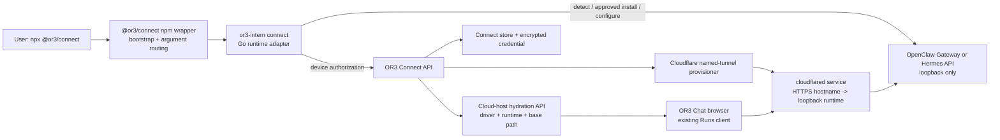

# Design

## Overview

Add two runtime adapters to the existing OR3 Connect CLI and make cloud-host
records driver-aware. The adapters own only runtime detection, approved setup,
loopback target discovery, exact CORS configuration, non-secret health checks,
and secure credential preparation. OR3 Connect continues to own device
authorization, Cloudflare tunnel provisioning, encryption, lifecycle, and
background `cloudflared` service management.

The Connect CLI ships from the `or3-intern` repository: the `@or3/connect`
npm wrapper (`packages/or3`) bootstraps the `or3-intern` binary and
`cloudflared`, then forwards to the Go `or3-intern connect` command that owns
the device flow, tunnel client, resumable state, and service management. The
runtime adapters are therefore Go modules inside that connect command; the
wrapper only routes the new `openclaw`/`hermes` arguments through and never
reimplements the lifecycle in JavaScript.

Target user experience: two approvals and done. The command prints its full
plan, the user approves once in the terminal and once in the browser (the
existing device authorization), and the enrolled host appears in OR3 Agents
with no forms, URLs, or tokens to copy. An interrupted run resumes at its
failed step instead of starting over.

The initial implementation deliberately does not turn OR3 Connect into a
general package manager or runtime supervisor. OpenClaw and Hermes retain
ownership of their model onboarding and native Gateway services; OR3 Connect
starts/restarts them only through their documented lifecycle commands when the
user approves.

## Architecture



### Components

| Component | Responsibility | Requirements |
| --- | --- | --- |
| npm wrapper + Go command router | Route `openclaw`/`hermes` from `npx @or3/connect` to the Go adapter; preserve no-argument Intern behavior; reject unknown arguments before side effects. | R1 |
| Go runtime adapter | Detect, install with consent, configure, start/restart, validate, resume interrupted setup, and produce a connection target/credential. | R2, R4, R6 |
| Existing Connect lifecycle | Authorize device, provision/revoke a named tunnel, persist encrypted credentials, and supervise `cloudflared`. | R3, R4, R6 |
| Driver-aware cloud environment | Persist an additive driver/runtime/base-path declaration and return it only to the owning workspace. | R5 |
| Existing Runs client | Discover the remote runtime and render only advertised capabilities. | R5 |

## Components and Interfaces

### CLI runtime adapter

Implement the adapters in the `or3-intern` repository that publishes
`@or3/connect`, as Go modules alongside `internal/connect`, wired into the
`or3-intern connect` command as `connect openclaw` and `connect hermes`. The
npm wrapper routes those arguments unchanged. Keep the adapter interface local
to the connect command:

```go
type ConnectRuntimeID string // "intern" | "openclaw" | "hermes"
type ConnectDriver string    // "intern" | "runs"

type RuntimeConnectionTarget struct {
    Driver      ConnectDriver
    Runtime     ConnectRuntimeID
    LocalOrigin string // loopback only, e.g. http://127.0.0.1:18789
    BasePath    string // "/" for Hermes, "/or3/" for OpenClaw
    AccessToken string // never printed, never passed as a process argument
    Version     string // runtime version reported as host metadata
    DisplayName string // suggested environment name, e.g. "OpenClaw (this Mac)"
}

type PrepareInput struct {
    CloudOrigin string                            // exact OR3 Cloud browser origin for CORS
    Confirm     func(action string) (bool, error) // every mutation needs approval
    Resume      *AdapterState                     // nil on first run; set when resuming
}

type Verification struct {
    Capabilities  map[string]any
    Streaming     string // "verified" | "blocked" | "not-tested"
    Commands      string // "verified" | "not-advertised"
    Cancellation  string // "verified" | "not-tested"
}

type RuntimeAdapter interface {
    ID() ConnectRuntimeID
    Detect(ctx context.Context) (installed bool, version string, err error)
    Prepare(ctx context.Context, input PrepareInput) (*RuntimeConnectionTarget, error)
    Verify(ctx context.Context, target *RuntimeConnectionTarget) (*Verification, error)
}
```

`Prepare` must return a typed failure rather than creating a tunnel on partial
readiness. It may run an official installer after confirmation. When
runtime-owned model/provider onboarding is incomplete, it prints the exact
runtime-owned next step and offers to wait: the command polls for readiness
and resumes by itself, so the user never re-runs the command to continue.
Preparation state joins the existing resumable connect state, so an
interrupted run (Ctrl+C, a failed step, a closed laptop) continues where it
stopped.

Consent is deliberately light: the command displays its full plan up front and
collects one terminal approval covering configuration changes, token
preparation, enrollment, and service installation. Separate explicit consent
remains only for running the runtime's official installer, applying the Hermes
source patch, or replacing an existing environment.

`Verify` runs the same checks twice: pre-enrollment against the loopback
target (fail fast before any tunnel exists) and post-tunnel through the
managed HTTPS hostname (prove the exact browser path end to end). The
completion report lists every result — capability discovery, streaming,
command discovery when advertised, and cancellation — plus the non-secret
HTTPS URL and the exact place the host appears in OR3 (Agents). The user
never copies a value.

### Adapter behavior

**OpenClaw adapter**

1. Detect `openclaw`; if absent, offer the official installer.
2. Check Gateway health and version against the plugin's declared
   compatibility line, guide provider onboarding if needed, then install and
   enable the published, version-pinned `@or3/openclaw` npm package
   (`openclaw plugins install npm:@or3/openclaw@<pinned> --pin`). The pin
   ships with the CLI and moves only with a tested release.
3. Add the exact OR3 Cloud origin to the plugin/Gateway allowlist without
   replacing unrelated configured origins or plugins.
4. Reuse an approved string-valued Gateway bearer token or configure a
   dedicated plugin bearer token. Restart and inspect the live plugin runtime.
5. Return local origin `http://127.0.0.1:18789`, base path `/or3/`, driver
   `runs`, runtime `openclaw`.

**Hermes adapter**

1. Detect `hermes`; if absent, offer the official installer.
2. Require complete Hermes provider/model setup before enabling the API server.
3. Merge documented API server settings into the user's supported `.env` or
   nested configuration: loopback host, explicit port, strong bearer key, and
   exact OR3 Cloud origin.
4. Start/restart the Hermes Gateway and verify authenticated capabilities.
5. Subscribe to a harmless live run from an `Origin` request. If the 200 SSE
   response lacks CORS, show the upstream issue, offer an update check, and
   require a separate approval for the narrowly verified local source patch.
   Current Hermes documentation states SSE responses carry CORS headers, so a
   current Hermes normally passes this check and the patch path should be
   rare.
6. Return the verified API origin/path, driver `runs`, runtime `hermes`.

### Cloud environment contract

Evolve the existing Intern-shaped host data additively. Existing records read
as `{ driver: 'intern', runtime: 'intern', basePath: '/' }`; no replacement
migration or data rewrite is needed.

```ts
type StoredConnectDriver = 'intern' | 'runs'
type StoredConnectRuntime = 'intern' | 'openclaw' | 'hermes'

interface CloudConnectEnvironment {
  // existing identity, tunnel, lifecycle, encrypted credential fields
  driver?: StoredConnectDriver
  runtime?: StoredConnectRuntime
  base_path?: '/' | '/or3/'
}

interface HydratedCloudHost {
  id: string
  name: string
  baseUrl: string
  accessToken: string
  driver: StoredConnectDriver
  runtime: StoredConnectRuntime
}
```

The server builds `baseUrl` from the managed HTTPS hostname plus the validated
stored base path. It validates the driver/runtime/path combination on all API
boundaries. The client maps `intern` to its existing client and `runs` to the
existing generic Runs client; it does not infer a driver from the hostname.

#### Enrollment wire path and host metadata

The adapter's declaration travels with the existing device authorization start
request inside `host`; the server validates it once there, stores it on the
authorization record, and copies it onto the environment record at
approval/reserve. The server never infers a driver from a hostname, and the
CLI never resends the declaration.

```ts
interface ConnectHostMetadata {
  name: string
  platform: string
  architecture: string
  internVersion?: string // required when runtime is absent/'intern'
  runtime?: 'intern' | 'openclaw' | 'hermes' // absent = 'intern'
  runtimeVersion?: string // required for 'openclaw'/'hermes'
  driver?: 'intern' | 'runs' // derived from runtime when absent
  basePath?: '/' | '/or3/' // required for 'openclaw'/'hermes'
}
```

Validation at device/start, before any record is created:

| runtime | driver | basePath | version requirement |
| --- | --- | --- | --- |
| absent/`intern` | `intern` | `/` | `internVersion` required (unchanged legacy CLI) |
| `openclaw` | `runs` | `/or3/` | `runtimeVersion` required |
| `hermes` | `runs` | `/` | `runtimeVersion` required |

Any unknown or mismatched combination is a 400 with a safe message. This
generalizes the current host-metadata parser, which hard-requires
`internVersion` and would otherwise reject every external runtime.

#### Active-only hydration

`GET /api/connect/environments` returns only `active` environments.
Provisioning, revoking, error, and revoked records are never decrypted or
shipped to the browser: a host appears in Agents only when it is usable, and
disappears on revocation through the existing replace-reconcile. The CLI
reports setup progress itself, so users never see a host that cannot connect.

#### Driver-aware status probe

The device status endpoint selects its check from the stored driver. Intern
records keep the existing intern-client probe. Runs records use a small
server-local probe (`server/connect/runs-probe.ts`) that fetches
`{baseUrl}/v1/capabilities` with the bearer token, `cache: no-store`, and a
short timeout. No `app/` code is imported into `server/`.

### Tunnel and service boundary

Reuse the current Cloudflare named-tunnel provisioner and per-environment
`cloudflared` service. The tunnel's ingress target comes from the adapter's
typed loopback target. Do not expose the runtime port directly, add a second
relay, or make the Connect service proxy agent traffic. A remote URL therefore
continues to be HTTPS at Cloudflare and HTTP only on the host loopback.

## Data Models

Add nullable/additive `driver`, `runtime`, and `base_path` fields to each
Connect store implementation and its serialization schema. Defaults for missing
values preserve Intern behavior. No new table or index is required: cloud hosts
are already queried by account/workspace and environment ID, and these fields
are read with that record.

The authorization record carries the same additive fields from device/start to
approval, and the store's approve/reserve inputs accept them. On the browser
side, cloud-host parsing becomes per-record tolerant: one malformed record is
skipped with a safe diagnostic and never fails the whole list or relabels an
unrelated host.

Keep the existing encrypted credential envelope. Rename only internal generic
types where needed from `controlToken` to `accessToken` while retaining a
backwards-compatible parser for existing Intern envelopes. Encrypt any new
runtime bearer token under the same account/workspace/environment binding; do
not place it in host metadata, tunnel metadata, URLs, or process arguments.

## Error Handling

| Failure | Behavior |
| --- | --- |
| Runtime missing | Explain official installer and await consent; a refusal leaves no OR3 Connect records or tunnel. |
| Runtime onboarding incomplete | Stop before credential/tunnel provisioning, show the runtime-owned next step, and offer to wait and resume automatically. |
| Config write rejected or unsupported | Preserve the original config, report the exact non-secret field, and do not continue. |
| Gateway/API unavailable | Retry only documented local lifecycle once; otherwise stop before provisioning. |
| CORS or capability verification fails | Do not mark the environment active; retain a resumable provisioning record only when the existing lifecycle expects it. |
| Cloudflare provisioning fails | Reuse existing rollback/reconciliation; never print Cloudflare or runtime credentials. |
| Cloud hydration contains unknown driver | Ignore the record, log only a safe diagnostic, and leave unrelated hosts intact. |
| Environment is provisioning, revoking, or in error | The hydration API omits it entirely; only usable hosts appear in Agents. |
| Rerun finds an existing environment | Offer status/repair/replacement explicitly; replacement revokes only after approval. |

## Testing Strategy

- **CLI adapter unit tests (R1–R4, R6):** mock process execution and filesystem
  boundaries; cover absent install, declined approval, existing configuration
  preservation, gateway/API readiness, exact-origin CORS update, secret redaction,
  and no tunnel call before readiness.
- **Connect server/store tests (R3–R5):** extend both configured store fixtures
  for Intern defaults and Runs records; validate encrypted credential bindings,
  driver/path rejection, lifecycle rollback, and revocation.
- **Browser reconciliation tests (R5):** hydrate an Intern, OpenClaw, and Hermes
  record simultaneously; assert their drivers remain distinct and Runs discovery
  is used only for external hosts.
- **Tunnel integration tests (R3, R6):** retain Cloudflare mock canaries and add
  adapter-provided ingress targets/path assertions; do not contact Cloudflare in
  ordinary test runs.
- **Manual smoke tests (R2–R6):** use a real OpenClaw and Hermes installation
  through a named tunnel; verify HTTPS connection, streamed text, live tools,
  command discovery if advertised, cancellation, restart survival, and revoke.

## Design Decisions

1. **Extend OR3 Connect instead of asking users to manually operate
   cloudflared.** It delivers the requested one-command UX and reuses audited
   enrollment, encryption, and revocation rather than creating token-pasting
   instructions.
2. **Use two explicit adapters, not a generic runtime configuration DSL.** Two
   runtimes have materially different plugin/configuration rules. A third
   runtime can justify a shared abstraction later; it is premature now.
3. **Keep native runtime services native.** Supervising OpenClaw/Hermes from
   OR3 Connect would add process ownership, updates, and recovery complexity.
   The command can verify and restart their documented services, while Connect
   supervises only its tunnel.
4. **Use the existing direct browser Runs protocol through the tunnel.** A new
   OR3 relay/proxy would add an unnecessary data plane, latency, and another
   authorization boundary.
5. **Do not require Cloudflare Access in v1.** Existing OR3 Connect already
   owns account-scoped credential delivery and tunnel revocation. Cross-origin
   browser sessions through Access require explicit cookie/redirect behavior and
   should be designed separately rather than assumed to work.
6. **Adapters live in the Go connect command, not the npm wrapper.** The
   wrapper already bootstraps the binary that owns the audited device flow,
   tunnel client, and service management; duplicating that lifecycle in
   JavaScript would double its audit surface with no user-visible benefit.
   Either way the user types one npx command.
7. **Publish `@or3/openclaw` first and pin it in the CLI.** The adapter
   installs a known-good plugin version instead of resolving a floating tag,
   so the one-command flow is reproducible. The pin moves only with a tested
   CLI release.
8. **Only active environments hydrate.** A host that cannot connect yet is
   noise and a needless credential shipment; the CLI's own progress output is
   the only setup surface.

## Risks & Mitigations

| Risk | Mitigation |
| --- | --- |
| `@or3/connect` ships from the `or3-intern` repository, not this checkout | The source is confirmed (`packages/or3`, `internal/connect`, `cmd/or3-intern connect`); document its release path before server-schema work and land the CLI changes there first. |
| `@or3/openclaw` is unpublished or the pin is stale | Publish from or3-chat before the CLI release, verify registry availability, and gate the CLI release on the pinned version installing cleanly. |
| Runtime installers/onboarding change upstream | Keep adapters thin, run documented commands, detect versions/capabilities, and link the maintained setup skills for manual recovery. |
| Credential leaks through child processes or logs | Use existing encrypted envelope and `0600` token-file pattern; pass secrets via protected config/environment, never args/stdout. |
| Hermes SSE CORS regression persists upstream | Gate activation on a live-stream check and offer the approved upgrade/patch path; track the upstream issue. |
| Mixed Intern/Runs cloud records regress current users | Default missing fields to Intern, test mixed hydration, and refuse unknown driver values rather than guessing. |
