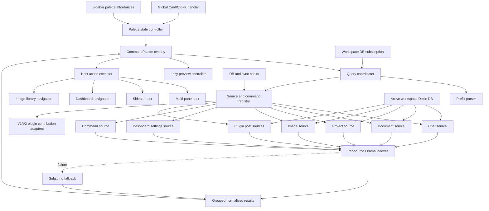

# Global Search and Command Palette Plan

## 1. Introduction

OR3 Chat will gain a global command palette opened with Cmd+K on Apple
platforms and Ctrl+K elsewhere. The palette will combine full-content workspace
search, application navigation, and executable commands in one overlay while
preserving the existing sidebar search for local sidebar filtering.

The first release will use fuzzy, client-side Orama search over the active
workspace. It will search chats, documents, projects, workflows, images,
dashboard pages, settings, commands, and plugin-defined post types. The
architecture will leave a narrow retrieval boundary that can support embeddings
later without introducing vector storage, embedding jobs, or network search in
this release.

## 2. Repository Context

OR3 Chat is a Nuxt 4 and Vue 3 TypeScript application using Bun, Nuxt UI,
Dexie/IndexedDB for local-first workspace data, Vitest for unit and integration
tests, and Playwright for browser tests. `@orama/orama` 3.1.16 is already
installed and is loaded dynamically through `app/core/search/orama.ts`.
Existing search composables build isolated Orama databases, debounce queries,
discard stale async results, and fall back to case-insensitive substring
matching. The application already has registries for pane apps, dashboard
plugins and pages, sidebar pages, and contextual actions. Plugin Runtime V2
provides owned contributions, grants, access gating, and cleanup handles, but
does not yet expose a command-palette contribution surface.

The existing Cmd+K label in the sidebar does not have a global shortcut
implementation. The sidebar search currently covers thread, project, and
document titles only. Chat mentions maintain a separate title-only Orama index.
Those features will remain independent in v1; the command palette will reuse
the common Orama utilities and application registries rather than sharing their
component-scoped index instances.

## 3. Product Decisions

The following decisions are fixed for v1:

1. Documents and chats are searched by full text, not titles alone.
2. A chat or document appears once in results even when several chunks or
   messages match. The best matching chunk supplies the preview snippet.
3. Plugins may register local shared-post types and commands. Arbitrary
   network-backed search providers are deferred.
4. Before typing, the palette shows ordered commands followed by recently
   updated content. It does not persist usage history.
5. Tab or Cmd+Enter reveals secondary actions and focuses the first action.
   Tab and Shift+Tab then move between action buttons.
6. Search indexes remain in memory and are scoped to the active workspace.
7. The v1 search engine runs on the main thread using bounded batches and
   cooperative yielding. A worker will be considered only if measurement shows
   the defined performance budgets cannot be met.

## 4. Goals

- Provide one fast, keyboard-first place to find content and execute actions.
- Search body content while presenting resource-level, comprehensible results.
- Make the palette useful before the first character is typed.
- Integrate with current pane, dashboard, sidebar, image-library, feature-gate,
  and workspace behavior.
- Give plugins a safe, owned way to expose local records and commands.
- Prevent inaccessible or previous-workspace content from leaking into results.
- Fail gracefully when Orama, a source, a preview, or an action fails.
- Preserve a clean path to future embedding or hybrid retrieval.

## 5. Out of Scope

- Embedding generation, vector fields, vector indexes, and hybrid ranking.
- Remote or network-backed plugin search providers.
- Server-side search APIs or cloud search infrastructure.
- Persisting Orama indexes in IndexedDB or sending index contents over sync.
- Search-history, frequency, or personalization-based ranking.
- Custom plugin Vue components inside the preview panel.
- Replacing or merging the existing sidebar, mentions, model-catalog, or
  documentation search implementations.
- Message-level result rows; chat message matches are grouped by thread.
- Searching deleted records, internal document-revision posts, file blobs, or
  secrets stored in KV.

## 6. Requirements

### R1: Global palette lifecycle

**User Story:** As a user, I want to open search from anywhere so that I can
find content without first navigating to a particular screen.

**Acceptance Criteria:**

- R1.AC1: WHEN the user presses Cmd+K or Ctrl+K in the workspace THEN the system
  SHALL prevent the browser default, open one palette overlay, and focus its
  input.
- R1.AC2: WHEN the shortcut is pressed while the palette is already open THEN
  the system SHALL refocus and select the palette query without creating a
  second overlay.
- R1.AC3: WHEN the palette opens THEN the system SHALL save the previously
  focused element.
- R1.AC4: WHEN the palette closes THEN the system SHALL clear transient query
  and secondary-action state and SHALL restore focus when the prior element
  still exists.
- R1.AC5: IF a key event is composing text or has already been prevented THEN
  the global shortcut handler SHALL NOT open the palette.
- R1.AC6: WHEN Escape is pressed while the palette is open THEN the system
  SHALL close it.

### R2: Keyboard and pointer interaction

**User Story:** As a keyboard user, I want predictable result navigation and
action execution so that the palette does not require a mouse.

**Acceptance Criteria:**

- R2.AC1: WHEN ArrowDown or ArrowUp is pressed in result-navigation mode THEN
  the system SHALL move one flattened active-result index and wrap at either
  end.
- R2.AC2: WHEN the active result changes THEN the system SHALL update the
  preview without opening or executing the result.
- R2.AC3: WHEN a result is hovered or single-clicked THEN the system SHALL make
  it active without executing its primary action.
- R2.AC4: WHEN Enter is pressed in result-navigation mode or an already
  click-selected result is clicked again THEN the system SHALL execute its
  primary action.
- R2.AC4a: AFTER a result is click-selected THEN pointer hover SHALL NOT replace
  its active preview until another result is explicitly clicked.
- R2.AC5: WHEN Tab or Cmd+Enter is pressed for a result with secondary actions
  THEN the system SHALL display the action tray and focus its first enabled
  action.
- R2.AC6: WHILE the action tray is active, Tab and Shift+Tab SHALL move through
  its buttons and Enter SHALL execute the focused action.
- R2.AC7: IF the active result has no secondary actions THEN Tab or Cmd+Enter
  SHALL keep focus in the palette and SHALL announce that no additional
  actions are available.
- R2.AC8: WHEN an enabled action succeeds THEN the palette SHALL close unless
  that action explicitly declares `closeOnSuccess: false`.
- R2.AC9: IF an action fails THEN the palette SHALL remain open and SHALL
  present a recoverable error without moving the active result.

### R3: Query syntax and category filtering

**User Story:** As a user, I want category prefixes so that I can narrow a
search without switching interfaces.

**Acceptance Criteria:**

- R3.AC1: WHEN a query begins with a recognized, case-insensitive
  `<alias>:` prefix THEN the system SHALL search only sources assigned to that
  category and SHALL search the remaining text as the term.
- R3.AC2: WHEN the recognized prefix has no remaining term THEN the system SHALL
  show recent resources from that category.
- R3.AC3: IF a leading prefix is not registered THEN the system SHALL treat the
  entire input as literal search text.
- R3.AC4: WHEN the system registers its core sources THEN `chat:`, `doc:`,
  `project:`, `workflow:`, `image:`, `setting:`, `dashboard:`, and `command:`
  SHALL be available.
- R3.AC5: IF a plugin requests an invalid or conflicting alias THEN source
  registration SHALL fail and SHALL leave the current alias owner unchanged.

### R4: Full-content search and grouped results

**User Story:** As a user, I want matches from inside chats and documents while
seeing one result per resource.

**Acceptance Criteria:**

- R4.AC1: WHEN a non-deleted document contains the query only in its body THEN
  the system SHALL return that document.
- R4.AC2: WHEN a non-deleted chat message contains the query only in its content
  THEN the system SHALL return its thread.
- R4.AC3: IF multiple messages or content chunks match one resource THEN the
  system SHALL show one result using the highest-scoring matching chunk.
- R4.AC4: WHEN indexed content exceeds one chunk THEN the system SHALL search
  all chunks and SHALL preserve enough overlap to match phrases crossing a
  chunk boundary.
- R4.AC5: WHEN a result is rendered THEN its snippet SHALL be plain text,
  escaped, centered near a matching term when possible, and SHALL not inject
  stored HTML.
- R4.AC6: WHEN a query contains at least four characters THEN Orama search SHALL
  use Levenshtein tolerance 1; shorter queries SHALL use tolerance 0.
- R4.AC7: WHEN Orama ranks a result THEN title matches SHALL receive more weight
  than keyword, subtitle, or body matches.
- R4.AC8: WHEN results are displayed THEN the system SHALL show no more than
  eight resources per source and no more than fifty resources in total.

### R5: Core searchable sources

**User Story:** As a user, I want the palette to cover the important areas of
the application.

**Acceptance Criteria:**

- R5.AC1: WHEN core sources load THEN chats SHALL index thread titles and
  non-deleted message content.
- R5.AC2: WHEN core sources load THEN documents SHALL index titles and complete
  TipTap-derived plain text.
- R5.AC3: WHEN core sources load THEN projects SHALL index name and description.
- R5.AC4: WHEN core sources load THEN active image metadata SHALL index filename,
  MIME type, dimensions, and kind without loading blobs.
- R5.AC5: WHEN dashboard registries change THEN accessible dashboard plugins and
  pages SHALL become searchable.
- R5.AC6: WHEN a dashboard page belongs to the core settings plugin THEN it SHALL
  appear in the Settings category.
- R5.AC7: WHEN core commands register THEN new chat, new document, new project,
  dashboard, image library, settings, and theme actions SHALL be searchable.
- R5.AC8: WHEN the workflow feature is enabled THEN workflow entries SHALL be
  searchable through the same public post-source API offered to plugins.

### R6: Empty-query discovery

**User Story:** As a user, I want useful choices before typing so that common
actions and recent work are immediately available.

**Acceptance Criteria:**

- R6.AC1: WHEN the query is empty and no category is selected THEN the palette
  SHALL show up to ten enabled commands ordered by configured order and id.
- R6.AC2: WHEN the query is empty and no category is selected THEN the palette
  SHALL show the twelve most recently updated accessible resources after the
  command group.
- R6.AC3: WHEN recent resources are calculated THEN the system SHALL use local
  `updated_at` values and SHALL NOT store palette usage history.

### R7: Preview behavior

**User Story:** As a user, I want to inspect a selected result before opening
it.

**Acceptance Criteria:**

- R7.AC1: WHEN a text resource becomes active THEN the preview SHALL show its
  title, category, best matching snippet, and relevant local metadata.
- R7.AC2: WHEN an image becomes active THEN the preview SHALL lazily load its
  blob and SHALL revoke any created object URL when selection changes or the
  palette closes.
- R7.AC3: WHEN a command becomes active THEN the preview SHALL show its
  description, source/plugin identity when applicable, and its effect.
- R7.AC4: WHEN active selection changes before preview hydration completes THEN
  stale preview data SHALL NOT replace the current preview.
- R7.AC5: IF preview hydration fails THEN the result SHALL remain executable and
  the preview SHALL show a non-blocking unavailable state.

### R8: Primary and secondary navigation

**User Story:** As a user, I want palette results to open in the correct part of
OR3.

**Acceptance Criteria:**

- R8.AC1: WHEN a chat or document primary action runs THEN it SHALL open the
  resource in the active pane.
- R8.AC2: WHEN pane capacity permits THEN chats, documents, and compatible
  plugin posts SHALL offer an Open in New Pane secondary action.
- R8.AC3: IF pane capacity does not permit another pane THEN the new-pane action
  SHALL be disabled with an explanatory label.
- R8.AC4: WHEN a project primary action runs THEN the system SHALL expand the
  sidebar, reveal the project, and preserve the current pane.
- R8.AC5: WHEN a dashboard or settings result runs THEN the system SHALL open
  the dashboard overlay at the exact plugin/page destination.
- R8.AC6: WHEN an image result runs THEN the system SHALL open the image library
  with that image selected.
- R8.AC7: WHEN a plugin post result runs THEN the system SHALL use its registered
  declarative pane-app or dashboard target.

### R9: Plugin extensibility

**User Story:** As a plugin author, I want to register local records and
commands so that my feature participates in global search.

**Acceptance Criteria:**

- R9.AC1: WHEN a plugin registers a valid post source THEN the host SHALL query
  non-deleted rows with the declared `postType` and SHALL index title, content,
  and whitelisted scalar metadata.
- R9.AC2: WHEN a plugin registers a valid command THEN its metadata SHALL become
  searchable and its host-managed executor SHALL run on activation.
- R9.AC3: WHEN a plugin registration handle is disposed, replaced, disabled, or
  unloaded THEN its source records, aliases, commands, previews, and actions
  SHALL be removed.
- R9.AC4: IF a plugin lacks `ui.command-palette.register` or fails its access
  policy THEN its contributions SHALL not be indexed or displayed.
- R9.AC5: WHEN a plugin action is about to execute THEN the host SHALL recheck
  the current plugin generation, grant, feature state, and access policy.
- R9.AC6: WHEN an isolated V2 plugin contributes a command THEN its definition
  SHALL remain declarative and execution SHALL occur through a plugin-scoped
  mediated handler rather than a serialized function.
- R9.AC7: WHEN a todo plugin declares its post source and pane target THEN its
  posts SHALL be searchable with its registered alias without core changes.

### R10: Index consistency and workspace isolation

**User Story:** As a workspace user, I want search results to stay current and
never expose data from another workspace.

**Acceptance Criteria:**

- R10.AC1: WHEN local thread, message, document, post, project, or file hooks
  report a mutation THEN the affected source SHALL update incrementally after a
  bounded debounce.
- R10.AC2: WHEN sync bootstrap, pull, or rescan applies remote records THEN the
  system SHALL reconcile affected source indexes from the active Dexie database.
- R10.AC3: WHEN the active workspace changes or the user logs out THEN the
  system SHALL immediately clear visible resource results, abort stale work,
  dispose old indexes, and bind to the new active database.
- R10.AC4: IF a query or index build from a previous workspace completes late
  THEN its generation SHALL be ignored.
- R10.AC5: WHEN the palette is closed THEN registered source indexes MAY remain
  warm for the current workspace, but previews and temporary blob URLs SHALL be
  released.

### R11: Graceful degradation and observability

**User Story:** As a user, I want search to remain usable when one subsystem
fails.

**Acceptance Criteria:**

- R11.AC1: IF Orama import, build, or search fails THEN each loaded source SHALL
  use case-insensitive substring matching over its normalized records.
- R11.AC2: IF one source fails to load or search THEN other sources SHALL still
  return results and the failed source SHALL expose a retryable status.
- R11.AC3: IF an action throws or returns an error THEN the host SHALL normalize
  it to a typed palette error and SHALL report it through the existing error
  utility.
- R11.AC4: WHEN search telemetry is recorded THEN it SHALL contain timings,
  source ids, counts, outcomes, and error categories but SHALL NOT contain query
  text, indexed content, snippets, or resource titles.

### R12: Performance and accessibility

**User Story:** As a user, I want the palette to feel immediate and remain
accessible with assistive technology.

**Acceptance Criteria:**

- R12.AC1: WHEN the shortcut is used in a warm application THEN the palette shell
  and focused input SHALL be visible within 100 ms on the reference CI runner,
  independently of index readiness.
- R12.AC2: WHEN a fixed benchmark searches approximately 50,000 normalized
  chunks representing 10,000 resources THEN warm search execution SHALL remain
  at p95 75 ms or less, excluding the intentional 120 ms debounce.
- R12.AC3: WHILE an index is built or reconciled, insertion batches SHALL contain
  no more than 500 records and SHALL yield so that no measured palette indexing
  task exceeds 50 ms on the reference runner.
- R12.AC4: WHEN the overlay renders THEN the query SHALL use combobox semantics,
  results SHALL use listbox/option semantics, and the active option SHALL be
  represented by `aria-activedescendant`.
- R12.AC5: WHEN result count, loading state, action availability, or an error
  changes THEN an ARIA live region SHALL announce the change without moving
  focus.
- R12.AC6: WHEN the viewport is narrow THEN the palette SHALL preserve all
  keyboard behavior and SHALL render the preview below the selected result
  without horizontal overflow.

## 7. Architecture



### 7.1 Component responsibilities

#### Palette state controller

Owns only overlay state: open/closed, raw query, active result key, action-tray
state, previous focus, and focus restoration. It exposes `open`, `close`, and
`toggle` operations to the shortcut handler and sidebar controls.

#### Query parser

Parses one optional leading category alias. It returns a discriminated result
so an unknown prefix cannot accidentally filter all results:

```ts
type ParsedPaletteQuery =
    | {
          kind: 'all';
          raw: string;
          term: string;
      }
    | {
          kind: 'category';
          raw: string;
          term: string;
          categoryId: string;
          alias: string;
      };
```

#### Source registry

Owns normalized source definitions, aliases, registration generation, access
checks, sorting, and exact-owner cleanup. It uses the existing contribution
kernel and registration-handle patterns rather than introducing an unrelated
singleton style.

#### Query coordinator

Debounces query changes by 120 ms, starts eligible sources in parallel, applies
a request/workspace generation token, groups results, enforces per-source and
global caps, and emits one flattened sequence for keyboard navigation. Source
sections retain their configured order; within a source, Orama relevance
determines order. Cross-source Orama scores are not compared because BM25 scores
from isolated corpora are not directly comparable.

#### Orama source index

Each source receives one isolated, in-memory Orama database using a shared
schema. This follows current OR3 search conventions and makes source removal and
plugin cleanup inexpensive. The Orama module import remains memoized globally.

Search options:

```ts
{
    term,
    properties: ['title', 'keywords', 'subtitle', 'body'],
    boost: {
        title: 5,
        keywords: 3,
        subtitle: 2,
        body: 1,
    },
    tolerance: term.length >= 4 ? 1 : 0,
    limit: 24,
}
```

The wrapper will accept typed options for `properties`, `boost`, `tolerance`,
`where`, `limit`, `offset`, and `returning`. Existing callers continue to work
through optional parameters.

#### Content normalizer and chunker

The normalizer:

- Converts TipTap JSON into plain text while preserving useful paragraph and
  block boundaries.
- Uses `deriveMessageContent` for structured chat-message data.
- Uses plain post content directly when it is not structured JSON.
- Converts registered scalar metadata keys to short keyword strings.
- Never evaluates content and never writes HTML into a snippet.

Content is split into roughly 4,000-character chunks with 200 characters of
overlap. Chunk boundaries prefer whitespace near the target length. Every chunk
has a stable id derived from source id, record id, content revision, and chunk
position. Source state tracks chunk ids per resource so one resource can be
replaced or removed without rebuilding unrelated records.

#### Preview controller

Accepts a normalized result and delegates to its source. It owns a generation
token and cleanup callback. Core text previews use already-normalized metadata
and best chunks. Image previews fetch the selected `file_blobs` row only after
activation and release its object URL on replacement or close.

#### Host action executor

Resolves data-only action targets against a host context supplied by
`PageShell`. It validates the result and access state immediately before
execution. Exceptions are converted to `PaletteActionResult` errors.

## 8. Components and Public Interfaces

### 8.1 Normalized source and result contracts

```ts
type PaletteCategoryId =
    | 'command'
    | 'chat'
    | 'document'
    | 'project'
    | 'workflow'
    | 'image'
    | 'setting'
    | 'dashboard'
    | (string & {});

interface PaletteCategory {
    id: PaletteCategoryId;
    label: string;
    aliases: readonly string[];
    icon?: string;
    order: number;
}

interface PaletteSearchSource {
    id: string;
    label: string;
    category: PaletteCategory;
    order: number;
    pluginId?: string;
    access?: PluginGatePolicy;
    load(context: PaletteLoadContext): Promise<readonly PaletteResource[]>;
    hydratePreview?(
        resource: PaletteResource,
        context: PalettePreviewContext
    ): Promise<PalettePreview>;
}

interface PaletteResource {
    key: string;
    sourceId: string;
    categoryId: PaletteCategoryId;
    recordId: string;
    title: string;
    subtitle?: string;
    content?: string;
    keywords?: readonly string[];
    updatedAt?: number;
    icon?: string;
    primaryAction: PaletteAction;
    secondaryActions?: readonly PaletteAction[];
    metadata?: Readonly<Record<string, string | number | boolean | null>>;
}

interface PaletteResult {
    key: string;
    sourceId: string;
    categoryId: PaletteCategoryId;
    recordId: string;
    title: string;
    subtitle?: string;
    snippet?: string;
    icon?: string;
    updatedAt?: number;
    score?: number;
    primaryAction: PaletteAction;
    secondaryActions: readonly PaletteAction[];
    metadata: Readonly<Record<string, string | number | boolean | null>>;
}
```

### 8.2 Actions

```ts
type PaletteActionTarget =
    | { kind: 'chat'; threadId: string; destination: 'active' | 'new-pane' }
    | {
          kind: 'document';
          documentId: string;
          destination: 'active' | 'new-pane';
      }
    | {
          kind: 'pane-app';
          appId: string;
          recordId?: string;
          destination: 'active' | 'new-pane';
      }
    | { kind: 'project'; projectId: string }
    | { kind: 'dashboard'; pluginId: string; pageId?: string }
    | { kind: 'image'; hash: string }
    | { kind: 'command'; commandId: string };

interface PaletteAction {
    id: string;
    label: string;
    icon?: string;
    shortcut?: string;
    disabled?: boolean;
    disabledReason?: string;
    closeOnSuccess?: boolean;
    target: PaletteActionTarget;
}

type PaletteActionErrorCode =
    | 'not-found'
    | 'disabled'
    | 'forbidden'
    | 'stale-plugin'
    | 'navigation-failed'
    | 'execution-failed';

type PaletteActionResult =
    | { ok: true }
    | {
          ok: false;
          error: {
              code: PaletteActionErrorCode;
              message: string;
              cause?: unknown;
          };
      };
```

### 8.3 Plugin post-source definition

```ts
interface PalettePostSourceDefinition {
    id: string;
    label: string;
    postType: string;
    categoryId: string;
    filterAliases: readonly string[];
    icon?: string;
    order?: number;
    metaKeys?: readonly string[];
    openTarget:
        | { kind: 'pane-app'; appId: string }
        | { kind: 'dashboard'; pluginId: string; pageId?: string };
    access?: PluginGatePolicy;
}
```

Validation rules:

- `id`, `categoryId`, and aliases are lowercase alphanumeric strings with
  hyphens.
- Aliases are 2–32 characters and globally unique.
- `postType` is non-empty and must not be one of the internal revision types.
- `metaKeys` contains no more than 16 unique property paths. Only string,
  number, boolean, and null values are indexed.
- `openTarget` must reference a currently registered pane app or dashboard
  destination before its action can execute. Registration may precede the
  target; until then, the action is disabled rather than discarded.
- The host injects `pluginId` and generation. A plugin cannot impersonate
  another owner.

### 8.4 Plugin command definition

```ts
interface PaletteCommandDefinition {
    id: string;
    label: string;
    description?: string;
    keywords?: readonly string[];
    icon?: string;
    order?: number;
    access?: PluginGatePolicy;
    closeOnSuccess?: boolean;
}
```

The V1 workspace API will expose:

```ts
registerCommandPalettePostSource(
    definition: PalettePostSourceDefinition
): RegistrationHandle;

registerCommandPaletteCommand(
    definition: PaletteCommandDefinition,
    handler: PaletteCommandHandler
): RegistrationHandle;
```

Both registrations are added to the workspace plugin cleanup scope.

Plugin Runtime V2 will add:

- Grant: `ui.command-palette.register`
- Contribution surface: `command-palette`
- Contribution kinds:
  - `ui.command-palette.post-source`
  - `ui.command-palette.command`
- SDK definition types and exports.
- Fake-host recording and disposal support.
- Manifest and host validation.

For isolated V2 plugins, command metadata is contributed declaratively and the
handler is reached through a plugin-scoped mediated command channel. Arbitrary
functions are never serialized through an iframe or worker boundary.

### 8.5 Host navigation context

`PageShell` will supply a narrow context rather than allowing the search engine
to mutate pane state directly:

```ts
interface PaletteHostContext {
    openChat(threadId: string, destination: 'active' | 'new-pane'):
        Promise<PaletteActionResult>;
    openDocument(documentId: string, destination: 'active' | 'new-pane'):
        Promise<PaletteActionResult>;
    openPaneApp(
        appId: string,
        recordId: string | undefined,
        destination: 'active' | 'new-pane'
    ): Promise<PaletteActionResult>;
    revealProject(projectId: string): Promise<PaletteActionResult>;
    openDashboard(pluginId: string, pageId?: string):
        Promise<PaletteActionResult>;
    openImage(hash: string): Promise<PaletteActionResult>;
    executeCommand(commandId: string): Promise<PaletteActionResult>;
    canOpenNewPane(): boolean;
}
```

## 9. Data Sources and Index Maintenance

### 9.1 Chats

Initial loading queries non-deleted threads and messages in the active
workspace. A thread title becomes a title-focused index record. Every
non-deleted message becomes one or more body chunks with the same thread
resource key. A matched message produces a snippet but the result title and
action come from the thread.

Message create/upsert/delete hooks update only the affected message chunks.
Thread title and deletion hooks update the resource metadata and title record.
Hard-deleting a thread removes every tracked chunk for its resource.

### 9.2 Documents

Documents are non-deleted posts with `postType === 'doc'`. TipTap content is
parsed defensively into plain text. Invalid JSON falls back to indexing the raw
string. Document create/update/save/delete hooks replace or remove only that
document's chunks.

### 9.3 Projects

Projects index name and description. The primary action asks the sidebar host
to expand, switch to its default page if needed, reveal the matching row, and
scroll it into view. It does not change the active pane.

### 9.4 Images

Images are active `file_meta` rows whose kind is image or whose MIME type begins
with `image/`. Only metadata is indexed. Blob data is accessed by preview or
explicit actions. Rename, create, soft-delete, restore, and hard-delete hooks
update the source.

### 9.5 Dashboard and settings

The source observes the computed dashboard registry, including core base items
and plugin pages. Plugin labels, page titles, descriptions, and capability-safe
keywords are indexed. Core settings pages use the `setting` category; other
pages and launchers use `dashboard`.

The dashboard navigation runtime remains the source of truth. The palette host
sets the dashboard modal open and calls `openPlugin` or `openPage`. Missing or
inaccessible pages return structured errors.

### 9.6 Commands

Core commands are registered through the same registry used by plugins. Initial
commands include:

- New chat
- New document
- New project
- Open dashboard
- Open image library
- Open theme settings
- Open AI settings
- Toggle light/dark theme

Feature-disabled commands remain unindexed. Commands with temporary
preconditions may remain visible but disabled with a reason.

### 9.7 Workflow and custom posts

The workflow client plugin registers `workflow-entry`, a `workflow` category,
the `workflow:` alias, and the `or3-workflows` pane app target. This is the
first-party proof that core does not need hard-coded workflow querying.

A todo plugin can similarly register its post type, category, alias, metadata
keys such as `completed`, and pane target. The host provides indexing, generic
preview, active-pane opening, and new-pane secondary actions.

### 9.8 Local updates, sync, and workspace changes

Ordinary CRUD hooks provide low-cost incremental maintenance. Because remote
sync application can write outside those helpers, these events schedule a
source reconciliation:

- `sync.bootstrap:action:complete`
- `sync.pull:action:applied`
- `sync.rescan:action:completed`

Reconciliation reloads each affected source snapshot, diffs resource revision
signatures, replaces changed resources, and removes missing resources. Multiple
events inside the debounce window coalesce into one reconciliation.

The DB client will expose a read-only active-database subscription. A switch
increments a workspace generation before notifying consumers. The palette
coordinator clears prior results synchronously, aborts or invalidates all
pending work, disposes source indexes, then loads the new active database.

## 10. UI Specification

### 10.1 Layout

Desktop:

- Modal width approximately `min(960px, 94dvw)`.
- Height approximately `min(680px, 86dvh)`.
- Query input and category hint at the top.
- Result list on the left, preview on the right.
- Footer displays relevant keyboard hints.

Mobile:

- Near-full-screen modal using `dvh`.
- Query input remains fixed at the top.
- Result list remains primary.
- The active preview appears in a capped region below the result list.
- Secondary actions are full-width focusable buttons.

All colors, borders, spacing, icons, and buttons use Nuxt UI plus existing OR3
theme tokens and overrides. No new styling system or unrelated CSS variables
are introduced.

### 10.2 Result rendering

Results are divided into source/category sections but flattened into one array
for active-index navigation. Section headers are not selectable. Each option
shows:

- Icon
- Title
- Optional subtitle/category label
- Short snippet for query results
- Optional recency or disabled marker

The DOM id for each option is derived from its stable result key. When results
change, the active result is retained by key when possible; otherwise it resets
to the first enabled result.

### 10.3 Loading and empty states

- The modal renders immediately even if indexes are cold.
- Commands and any already-ready recent resources appear first.
- Sources still building show non-selectable status rows.
- No matches displays the parsed category and suggests removing the filter.
- A failed source displays a compact retry control without suppressing healthy
  sources.
- Orama fallback use is not presented as a fatal error.

### 10.4 Secondary actions

Action buttons render in the preview and an action tray associated with the
active option. Opening the tray does not change the active-result index.
Disabled actions are skipped by Tab and expose their reason in visible text or
tooltip content.

The result list resumes keyboard navigation when focus returns to the query or
option list. Escape always closes the palette, matching the requested shortcut
contract.

## 11. Error Handling

| Failure | Behavior |
| --- | --- |
| Orama import fails | Mark Orama unavailable for the current attempt and use normalized-record substring search. |
| One index fails to build | Keep other sources available, show retry for that source, and use fallback if its records loaded. |
| Source loader fails | Record a typed source error, report through `reportError`, and allow retry. |
| Query resolves late | Ignore it using query and workspace generations. |
| Preview resolves late | Run its cleanup and ignore it using the preview generation. |
| Image blob missing | Show metadata-only preview; keep Open Image action available to surface the library's normal missing-state handling. |
| Resource deleted before action | Return `not-found`, refresh that source, and keep the palette open. |
| Access changes before action | Return `forbidden`, remove inaccessible results, and keep the palette open. |
| Plugin generation changes | Return `stale-plugin`, refresh plugin contributions, and do not call the old handler. |
| Pane limit reached | Disable new-pane action but keep active-pane action available. |
| Dashboard target missing | Return `navigation-failed` using the dashboard runtime's error details. |
| Command handler fails | Return `execution-failed`, report safely, and retain query/selection. |
| Workspace switches during work | Clear results immediately, dispose old state, and ignore all previous generations. |

Errors crossing module boundaries use typed result unions. Expected failures do
not rely on exceptions for control flow.

## 12. Performance Plan

- Dynamically import Orama and memoize the module through the current helper.
- Add a `command-palette-search` lazy boundary.
- Request an idle prewarm after the application is interactive. If the browser
  never provides idle time, initialize on first palette open.
- Render the shell before awaiting source or index readiness.
- Debounce search input by 120 ms.
- Batch initial and replacement inserts in groups of no more than 500.
- Yield between large normalization/insertion batches.
- Keep an id-to-resource map and resource-to-chunk-id map per source.
- Update affected resources rather than rebuilding an entire source for normal
  local writes.
- Reconcile in bulk only after sync batch events or workspace rebinding.
- Limit raw Orama hits to 24 per source, visible hits to 8 per source, and total
  visible hits to 50.
- Do not load image blobs until preview activation.
- Do not persist indexes or keep indexes for inactive workspaces.
- Record build, update, and query timings without recording user text.

The checked-in benchmark will create 10,000 logical resources and approximately
50,000 chunks. It will separately measure shell open, initial build batches,
warm query execution, fallback query execution, grouped-hit reduction, and
workspace disposal.

## 13. Security, Privacy, and Access

- All indexed workspace content stays in browser memory.
- Query strings, content, snippets, and titles are excluded from telemetry.
- Deleted and internal revision records are excluded before normalization.
- KV values are not indexed.
- Plugin access gates are applied before source loading and before action
  execution.
- A source that becomes inaccessible is disposed rather than merely hidden from
  rendering.
- Workspace switching clears visible state before asynchronous loading begins.
- Plugins receive no direct Dexie handle from this feature. Declarative post
  sources are queried by the host.
- Plugin `metaKeys` are explicit allowlists; arbitrary nested metadata is not
  flattened.
- Command contributions require an explicit manifest grant.
- Isolated plugin commands use mediated execution and cannot transfer closures
  across the isolation boundary.

## 14. Testing Strategy

### 14.1 Unit tests

Test:

- Prefix recognition, case folding, whitespace, empty terms, and unknown
  prefixes.
- Alias validation, collisions, replacement ownership, and stale disposal.
- TipTap JSON extraction, raw-content fallback, message extraction, scalar
  metadata, and internal-post exclusion.
- Stable chunk ids, whitespace boundaries, overlap, very small content, empty
  content, and replacement/removal.
- Orama option mapping, title boosts, tolerance selection, result caps, and
  fallback matching.
- Grouping several chat-message hits into one thread result.
- Selecting the highest-scoring chunk and generating escaped snippets.
- Empty-query command and recency ordering.
- Active-key preservation, reset, wraparound, and disabled-item skipping.
- Action success/error normalization and `closeOnSuccess`.
- Preview generation and cleanup.
- Access changes and plugin generation changes.

### 14.2 Fake-IndexedDB integration tests

Seed:

- A chat whose title does not match but one message body does.
- A chat with several matching messages.
- A TipTap document whose title does not match but body does.
- A project with a matching description.
- Image metadata with a matching filename.
- Workflow posts.
- A plugin todo post with searchable scalar metadata.
- Dashboard and settings entries.

Verify local creates, updates, renames, soft deletes, hard deletes, restores,
command registrations, source disposal, and sync reconciliation update results
without a reload.

Run a two-workspace test in which workspace A has a unique secret phrase and
workspace B does not. Start an A query/build, switch to B, allow the A work to
finish, and verify that the phrase never appears after the switch.

### 14.3 Vue component tests

Verify:

- Cmd/Ctrl+K open and refocus behavior.
- Focus capture and restoration.
- Arrow wrapping and selection updates.
- Enter and double-click primary actions.
- Single-click preview-only behavior.
- Tab, Cmd+Enter, Shift+Tab, and secondary action execution.
- Escape closure from input, result, preview, and action focus.
- Query result changes retain or reset active keys correctly.
- Loading, failure, retry, fallback, empty, and disabled states.
- Combobox/listbox roles, `aria-expanded`, `aria-controls`,
  `aria-activedescendant`, option state, and live announcements.
- Desktop and mobile layout classes without horizontal overflow.

### 14.4 End-to-end tests

Using Playwright and seeded local data:

1. Open the palette globally from a chat editor.
2. Search a one-character typo in document body content and open the document.
3. Search chat message content and verify only one thread result appears.
4. Use `chat:` to exclude documents.
5. Use `todo:` after a test plugin registers a custom post source.
6. Select results and verify preview updates without route/pane changes.
7. Open a result in the active pane.
8. Reveal secondary actions and open a result in a new pane.
9. Open Theme Settings directly.
10. Search an image, inspect its preview, and open that selected image.
11. Execute a core command.
12. Disable/unload a plugin and verify its results and alias disappear.
13. Force Orama failure and verify substring results remain usable.

### 14.5 Verification commands

Use Bun for all commands:

```sh
bun x vitest run <command-palette unit and integration test paths>
bun run plugin-runtime:sdk:check
bun run plugin-runtime:contracts:check
bun run type-check
bun run generate:static
bun run build
bun x playwright test <command-palette e2e spec>
```

Run the focused suites throughout implementation, then the complete relevant
verification set before marking the feature done.

## 15. Implementation Tasks

Review remediation completed after the initial implementation includes
owner-protected plugin IDs, pre-index access gating, atomic post-source
registration, wired and mediated V2 adapters, source-targeted mutation
reconciliation, cancellable workspace builds, live dashboard invalidation,
resource-diverse chunk search, owned PageShell teardown, and automated
Playwright/performance checks.

Tasks are ordered by dependency and sized for approximately one to four hours
each.

### 15.1 Core contracts and query parsing

- [x] **1.1 Define palette domain contracts and typed result/error unions.**
      Requirements: R2, R4, R7, R8, R11
      Done when: type tests cover valid sources, results, actions, previews, and
      impossible action/error states.

- [x] **1.2 Implement and test the category/alias query parser.**
      Requirements: R3
      Done when: recognized, unknown, empty, whitespace, and case-insensitive
      prefixes pass unit tests.

- [x] **1.3 Implement category and source registration validation.**
      Requirements: R3, R9
      Done when: aliases, ids, post types, metadata keys, collision behavior,
      and exact-owner cleanup pass tests.

- [x] **1.4 Add the command-palette contribution kernel and reactive registry.**
      Requirements: R5, R9
      Done when: source/command additions, replacements, sorting, access
      filtering, and disposal update consumers reactively.

### 15.2 Content normalization and Orama

- [x] **2.1 Implement plain-text normalization for documents, messages, posts,
      and scalar metadata.**
      Requirements: R4, R5, R9
      Done when: structured, malformed, empty, and internal content fixtures
      produce safe expected text.

- [x] **2.2 Implement stable chunking and resource/chunk tracking.**
      Requirements: R4, R10, R12
      Done when: overlap and boundary tests pass and a resource can be replaced
      or removed without affecting another resource.

- [x] **2.3 Extend the shared Orama wrapper with typed search and bulk mutation
      options.**
      Requirements: R4, R11, R12
      Done when: existing Orama helper tests remain green and new tests verify
      boosts, tolerance, limits, returning fields, batches, and removals.

- [x] **2.4 Implement the per-source Orama index and substring fallback.**
      Requirements: R4, R11, R12
      Done when: the same normalized fixture returns useful grouped candidates
      through both Orama and forced fallback paths.

- [x] **2.5 Implement snippet generation and grouped-hit reduction.**
      Requirements: R4
      Done when: several chunks/messages collapse to one resource with the best
      escaped snippet and deterministic ordering.

### 15.3 Query coordination and lifecycle

- [x] **3.1 Implement the debounced multi-source query coordinator.**
      Requirements: R3, R4, R6, R10, R11
      Done when: source fan-out, section order, per-source/global limits,
      category filtering, empty state, and stale-query rejection pass tests.

- [x] **3.2 Add lazy-boundary loading and idle prewarm.**
      Requirements: R12
      Done when: the overlay can render without awaiting Orama and the search
      module loads at most once per retry generation.

- [x] **3.3 Add active-workspace database subscriptions.**
      Requirements: R10
      Done when: DB consumers receive ordered old/new workspace notifications
      without introducing a Vue dependency into the DB client.

- [x] **3.4 Bind coordinator disposal and rebuilding to workspace changes.**
      Requirements: R10
      Done when: late work from workspace A cannot publish after switching to B.

- [x] **3.5 Add DB-hook incremental updates and sync-event reconciliation.**
      Requirements: R10, R12
      Done when: local mutations update individual resources and coalesced sync
      events reconcile remote changes.

### 15.4 Core source adapters

- [x] **4.1 Implement the chat source.**
      Requirements: R4, R5, R10
      Done when: title and body matches return one thread and message mutations
      update its chunks.

- [x] **4.2 Implement the document source.**
      Requirements: R4, R5, R10
      Done when: title and TipTap body matches work and document lifecycle hooks
      remain consistent.

- [x] **4.3 Implement project and image metadata sources.**
      Requirements: R5, R7, R8, R10
      Done when: projects reveal correctly and image metadata search supports
      lazy preview cleanup.

- [x] **4.4 Implement dashboard and settings sources.**
      Requirements: R5, R8, R10
      Done when: registry additions/removals are searchable and exact pages can
      be targeted.

- [x] **4.5 Implement the core command source.**
      Requirements: R5, R6, R8
      Done when: ordered core commands respect feature/access state and return
      typed execution results.

- [x] **4.6 Implement the generic plugin post-source adapter.**
      Requirements: R5, R9, R10
      Done when: a registered post type indexes title/content/allowed metadata
      and resolves its declarative target.

### 15.5 Host navigation

- [x] **5.1 Add active/new-pane chat, document, and pane-app action handlers.**
      Requirements: R8
      Done when: active targets update the current pane, new targets respect
      capacity, and errors are structured.

- [x] **5.2 Expose sidebar project reveal/expand behavior.**
      Requirements: R8
      Done when: a project action expands the sidebar, activates the default
      sidebar page, expands the row, and scrolls it into view.

- [x] **5.3 Add exact dashboard-page host navigation.**
      Requirements: R8
      Done when: the palette can open a plugin or exact settings page while
      preserving dashboard error handling.

- [x] **5.4 Add selected-image library navigation state.**
      Requirements: R7, R8
      Done when: opening an image result loads the library and selects its hash
      after the page mounts.

- [x] **5.5 Implement the central action executor and access recheck.**
      Requirements: R8, R9, R11
      Done when: every target returns `PaletteActionResult`, stale/inaccessible
      actions cannot run, and expected failures keep the palette open.

### 15.6 Overlay UI and shortcuts

- [x] **6.1 Implement the palette state controller and global shortcut.**
      Requirements: R1
      Done when: open, refocus, close, state reset, and focus restoration pass
      component tests with automatic listener cleanup.

- [x] **6.2 Build the responsive Nuxt UI overlay shell.**
      Requirements: R1, R7, R12
      Done when: desktop/mobile layouts render from theme tokens and the input
      appears before index readiness.

- [x] **6.3 Build grouped results with one flattened active index.**
      Requirements: R2, R4, R6, R12
      Done when: keyboard wrapping, pointer selection, stable active keys, caps,
      and no-navigation preview selection pass tests.

- [x] **6.4 Build the preview panel and image cleanup behavior.**
      Requirements: R7
      Done when: text/command/image/error previews are generation-safe and leak
      no object URLs.

- [x] **6.5 Build and test secondary action focus mode.**
      Requirements: R2, R8, R12
      Done when: Tab, Cmd+Enter, Shift+Tab, Enter, disabled actions, live
      announcements, and Escape match the specified behavior.

- [x] **6.6 Complete combobox/listbox accessibility.**
      Requirements: R12
      Done when: automated role/attribute/live-region tests pass and focus
      remains within the modal.

- [x] **6.7 Mount the palette once in PageShell and update sidebar affordances.**
      Requirements: R1
      Done when: expanded/collapsed sidebar triggers open the palette while
      ordinary sidebar text filtering remains unchanged.

### 15.7 Plugin runtime integration

- [x] **7.1 Extend the V1 workspace plugin API and cleanup scope.**
      Requirements: R9
      Done when: post sources and commands register and dispose with a plugin
      instance.

- [x] **7.2 Extend V2 manifest grants, contribution kinds, and SDK types.**
      Requirements: R9
      Done when: SDK and contract checks accept valid definitions and reject
      missing grants or invalid shapes.

- [x] **7.3 Add V2 host contribution mapping and mediated command execution.**
      Requirements: R9
      Done when: trusted and isolated test fixtures register, execute through
      allowed boundaries, and clean up by exact generation.

- [x] **7.4 Extend the plugin SDK fake host and test harness.**
      Requirements: R9
      Done when: plugin authors can inspect registered palette contributions and
      simulate disposal/execution in unit tests.

- [x] **7.5 Register workflows through the public post-source API.**
      Requirements: R5, R9
      Done when: no core search code contains a workflow-specific Dexie query.

- [x] **7.6 Add or update a todo example demonstrating custom search.**
      Requirements: R9
      Done when: the example registers a post type, `todo:` alias, searchable
      metadata, pane target, and cleanup.

### 15.8 Resilience, performance, and documentation

- [x] **8.1 Add source/action timing and error telemetry without content.**
      Requirements: R11, R12
      Done when: tests assert that telemetry payloads contain no query, title,
      snippet, or body fields.

- [x] **8.2 Add the fixed search/index performance benchmark.**
      Requirements: R12
      Done when: it reports shell, build-batch, warm-query, fallback, grouping,
      and disposal timings and enforces the stated budgets.

- [x] **8.3 Add fake-IndexedDB integration and workspace isolation suites.**
      Requirements: R4, R5, R6, R9, R10, R11
      Done when: all source lifecycle and cross-workspace scenarios pass.

- [x] **8.4 Add the Playwright command-palette scenario.**
      Requirements: R1–R12
      Done when: the full keyboard, search, preview, navigation, plugin, image,
      and fallback flow passes in a browser.
      Note: shipped suite is `tests/e2e/command-palette.spec.ts` (open/refocus/
      focus restore, two-click preview lock, mobile overflow). Broader §14.4
      scenarios (content search, category/plugin aliases, pane navigation,
      Orama fallback) remain optional expansion, not blocking the remediated
      approval bar.

- [x] **8.5 Document the user feature and plugin authoring contracts.**
      Requirements: R1, R3, R9
      Done when: shortcut/filter/action behavior, public types, todo example,
      access requirements, limitations, and cleanup are documented and added to
      `public/_documentation/docmap.json`.

- [x] **8.6 Run final static, SSR, type, SDK, unit, integration, benchmark, and
      E2E verification.**
      Requirements: R1–R12
      Done when: every command in the verification section is green and no
      traceability gaps remain.
      Note: remediated approval bar verified (type-check, full Vitest, Playwright
      command-palette, benchmarks gate, plugin SDK/contracts, SSR build).

## 16. Traceability Matrix

| Requirement | Primary components | Tasks |
| --- | --- | --- |
| R1 Global lifecycle | State controller, shortcut host, overlay | 6.1, 6.2, 6.7, 8.4, 8.5 |
| R2 Interaction | Result controller, action tray, executor | 1.1, 6.3, 6.5, 8.4 |
| R3 Filters | Query parser, alias registry | 1.2, 1.3, 3.1, 8.5 |
| R4 Full-content search | Normalizer, chunker, Orama index, reducer | 2.1–2.5, 3.1, 4.1, 4.2, 8.3 |
| R5 Core sources | Core source adapters | 4.1–4.6, 7.5 |
| R6 Empty discovery | Query coordinator, command source | 3.1, 4.5, 6.3, 8.3 |
| R7 Preview | Preview controller, image source | 1.1, 4.3, 5.4, 6.2, 6.4 |
| R8 Navigation | Host context, action executor | 1.1, 5.1–5.5, 6.5 |
| R9 Plugins | Contribution registry, V1/V2 adapters, SDK | 1.3, 1.4, 4.6, 5.5, 7.1–7.6 |
| R10 Consistency | Source lifecycle, DB subscription, sync reconciliation | 3.1, 3.3–3.5, 4.1–4.6, 8.3 |
| R11 Degradation | Fallback index, source errors, executor, telemetry | 2.4, 3.1, 5.5, 8.1, 8.3 |
| R12 Performance/accessibility | Lazy loading, batching, overlay semantics, benchmark | 2.2–2.4, 3.2, 6.2, 6.5, 6.6, 8.1, 8.2 |

## 17. Definition of Done

The feature is complete when:

- Every acceptance criterion R1.AC1 through R12.AC6 has an automated test or a
  documented manual accessibility verification where automation is
  insufficient.
- The palette searches full local content and produces one resource-level result
  with a useful preview.
- Core chats, documents, projects, images, dashboard pages, settings, commands,
  and workflows are searchable.
- A plugin todo post type can be registered and searched without modifying core
  source code.
- Workspace switching cannot expose previous-workspace content.
- Orama failure still leaves usable substring search.
- Access, feature, grant, generation, and cleanup behavior are verified.
- The performance budgets pass on the reference runner.
- Unit, integration, SDK contract, type-check, static generation, SSR build, and
  Playwright verification are green.
- User and plugin documentation is discoverable through the documentation map.
- This plan's traceability matrix has no uncovered requirement or orphan task.
