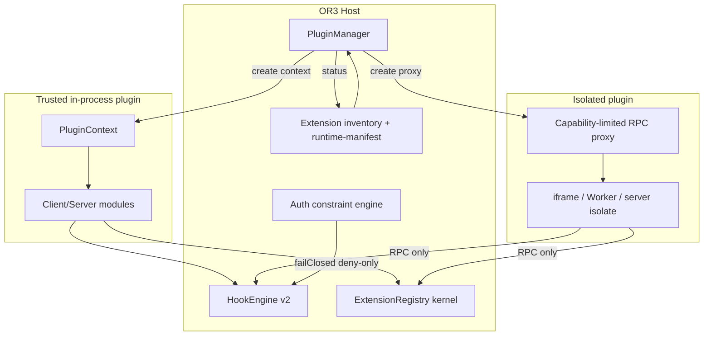

# Design

## Overview

Hook System v2 introduces a central `PluginManager` and an `ExtensionRegistry` kernel around the existing shared hook engine. Trusted first-party plugins continue to run in-process with host-created context and exact-owner cleanup. Isolated third-party plugins are an explicit second class with RPC boundaries. Hook Engine v2 adds ownership, dispatch plans, error policies, and fail-closed authorization constraints. This design builds on the v1 P0 fixes already landed in inventory, installer, registries, workspace loader, auth constraints, route permissions, and sync thenable rejection.

## Architecture



### Components (one responsibility each)

| Component | Responsibility | Requirements |
|---|---|---|
| `PluginManager` | Lifecycle state machine, generation tokens, quarantine | R1, R4, R5, R8 |
| `PluginContext` factory | Host-owned id/grants/signal/logger/storage | R1, R4 |
| `ExtensionRegistry<T>` | Ownership, conflict policy, batching, projections | R2 |
| Surface adapters | Thin field/render definitions for dashboard/panes/actions | R2, R9 |
| `HookEngine` v2 | Dispatch plans, modes, policies, diagnostics APIs | R3, R8 |
| `AuthorizationConstraint` engine | Deny-only fail-closed auth extensions | R3 |
| Runtime package loader | Verified ESM URL / import map loading | R5 |
| Install/inventory services | Atomic swap, id validation, runtime metadata | R7 |
| Plugin route dispatcher | Method→permission + access gate before import | R6 |

## Components and Interfaces

```ts
type PluginLifecycle =
  | 'discovered'
  | 'verified'
  | 'disabled'
  | 'blocked'
  | 'loading'
  | 'active'
  | 'stopping'
  | 'failed'
  | 'quarantined';

type PluginClass = 'trusted-in-process' | 'isolated';

type PluginGrant =
  | 'hooks.register'
  | 'ui.dashboard'
  | 'ui.pane'
  | 'ui.sidebar'
  | 'tools.register'
  | 'server.routes'
  | 'storage.plugin'
  | 'network.fetch'; // isolated only via host proxy

interface PluginContext {
  readonly id: string;
  readonly version: string;
  readonly source: 'builtin' | 'extension' | 'package';
  readonly pluginClass: PluginClass;
  readonly workspaceId: string;
  readonly grants: ReadonlySet<PluginGrant>;
  readonly signal: AbortSignal;
  readonly logger: PluginLogger;
  readonly storage: PluginStorage;
  readonly hooks: ScopedHookApi;
  readonly registry: ScopedRegistryApi;
}

interface RegistrationHandle {
  readonly id: string;
  readonly owner: symbol;
  readonly disposed: boolean;
  dispose(): boolean;
}

interface ExtensionRegistryOptions<T> {
  conflictPolicy: 'replace' | 'reject' | 'coexist-by-owner';
  sort?: (a: T, b: T) => number;
  validate?: (item: T) => T;
  accessPredicate?: (item: T) => boolean;
}

interface HookDefinition {
  mode?: 'series' | 'parallel'; // actions
  errorPolicy?: 'continue' | 'stop' | 'aggregate' | 'rethrow' | 'failClosed';
  timeoutMs?: number;
  sensitive?: boolean;
}

interface AuthorizationConstraint {
  id: string;
  evaluate(context: AuthorizationContext):
    | { allowed: true }
    | { allowed: false; reason: string };
}
```

### PluginManager state machine

```text
discovered -> verified -> disabled|blocked|loading
loading -> active|failed
active -> stopping -> discovered|disabled
failed -> quarantined|loading (manual retry)
```

Commit rule: registrations happen into a staging bag; only after generation matches and `register()` resolves does the manager atomically replace the previous active instance for that plugin id.

### Hook Engine v2 dispatch

- Compile a dispatch plan per hook name (sorted callbacks + wildcard matches) and invalidate on register/unregister.
- Sync path rejects thenables (already partially landed; keep as invariant).
- Auth path never uses general `applyFiltersSync` continue-on-error semantics.
- Diagnostics: `getDiagnosticsSnapshot()`, `resetDiagnostics()`, bounded ring buffers for timings.

### Runtime package loading

Trusted source plugins may keep `import.meta.glob` for local development.

Production install path:
1. Verify zip + manifest + file hashes / optional signature.
2. Extract with existing atomic installer.
3. Publish a host-served module URL under an authenticated, short-lived, capability-scoped route or static hashed path.
4. Client imports that URL inside trusted mode, or into iframe/Worker sandbox for isolated mode.

## Data Models

No new Dexie tables required for MVP v2. Persist only:

- Existing workspace plugin enablement / access settings.
- Optional admin KV for quarantine flags and failure counters keyed by `pluginId@version`.
- Optional on-disk `extensions/.meta/<id>.json` for package integrity hashes.

If quarantine must survive restarts:

```ts
type PluginRuntimeStateRecord = {
  plugin_id: string;
  version: string;
  lifecycle: PluginLifecycle;
  failure_count: number;
  last_error_code?: string;
  updated_at: number;
};
```

Store via existing workspace/admin settings store rather than inventing a sync table unless multi-device quarantine sync becomes a requirement.

## Error Handling

Use structured errors at boundaries (HTTP/`createError` on server, typed results in manager):

| Scenario | Behavior |
|---|---|
| Duplicate install without force | `ExtensionAlreadyInstalledError` → HTTP 409 |
| Install swap failure | Restore backup; leave previous version active |
| Invalid uninstall id / path escape | 400; no delete |
| Sync hook thenable | Diagnostic + keep previous filter value / ignore action result |
| Auth constraint throw/thenable/invalid | Deny (`failClosed`) |
| Workspace generation race | AbortSignal; drop staged registrations |
| Isolated RPC grant missing | Deny call; do not escalate to host object |
| Package verify fail | `blocked`; never import |

## Testing Strategy

- **Unit:** HookEngine modes/policies/thenables/onceAction/diagnostics bounds; registry ownership/conflict/batch; auth constraints; installer pathExists/409/atomic restore; ExtensionIdSchema on uninstall.
- **Integration:** ZIP install → inventory runtime field → runtime-manifest loadAllowed → client loader selection → server dispatcher permission matrix.
- **Race:** overlapping workspace switches with delayed `import()` / `register()`.
- **Adversarial:** zip slip, uninstall `../`, stale handle dispose, Promise-returning auth constraint, POST with viewer role.
- **Performance:** dispatch-plan cache avoids re-sort on hot hooks; timing buffer remains capped under load tests.

## Design Decisions

1. **Keep trusted in-process path**  
   Alternatives: force all plugins into iframes now. Rejected because first-party DX and current Tasks/dashboard plugins would regress for little security gain. Isolation is mandatory only for untrusted class.

2. **Registry kernel over one mega-registry**  
   Alternatives: leave N independent maps. Rejected because ownership/conflict bugs keep recurring. Thin adapters preserve surface-specific types.

3. **Deny-only auth constraints**  
   Alternatives: keep general filters with fail-closed flag. Rejected because transform semantics invite accidental grants and Promise confusion. Dedicated constraint API makes invalid states unrepresentable.

4. **Precompiled packages for post-build install**  
   Alternatives: dynamic Vite transform at runtime. Rejected as incompatible with static/SSR production constraints and `import.meta.glob` build graph.

5. **Staged commit for plugin activation**  
   Alternatives: register immediately during import. Rejected because workspace A→B races can leak contributions.

## Risks & Mitigations

| Risk | Mitigation |
|---|---|
| Large migration of registries | Ship kernel + adapters incrementally; keep legacy unregister(id) for admin/debug |
| Isolated plugin RPC surface too large | Start with minimal grants; expand via explicit allowlist |
| Module URL hosting becomes a security footgun | Hash integrity, auth gate, no path traversal, CSP-friendly URLs |
| Hook policy complexity | Default policies preserve v1 behavior (`series` + `continue`) except auth (`failClosed`) |
| Docs drift | Update `docmap.json` and planning findings in the same tasks as APIs |
