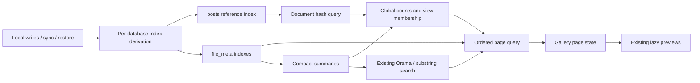

# Design

## Overview

Use sparse, local derived indexes on existing tables. Read document references and image summaries through index keys; hydrate only the gallery page. Keep global counts/search as a separate compact-data pipeline. This is more complete than merely omitting `content` from returned objects: Dexie value reads still transfer the containing row.

Implement in two coherent milestones: first reference-only document reads and their storage invariants; then image pagination, compact global search/counts, and UI integration. Do not claim the overall fix complete after the first milestone.

## Architecture



- **Index derivation** — computes local keys from canonical fields, in the source write; R1, R2, R5.
- **Document hash query** — deduplicates stored active document references using index keys; R1.
- **Gallery queries** — produce ordered IDs, bounded metadata hydration, and compact summaries; R2, R3.
- **Image search** — global matching against summaries with bounded Orama hit batches; R3.
- **Gallery state** — coordinates pages, independent counts, mutations, subscriptions, and request generations; R2, R3, R4.
- **Verification and documentation** — establish migration, sync, behavior, and performance evidence; R1–R5.

## Components and Interfaces

Extend `app/db/documents.ts`, `app/db/files-select.ts`, `app/pages/images/image-library.ts`, and `app/core/search/useImageSearch.ts` where appropriate. One small DB-local index derivation module and one gallery-state composable are justified if necessary to avoid embedding storage machinery in the page. Do not make a reusable framework. Keep shared predicates out of the Vue page so database code need not import UI modules.

Illustrative internal shapes (use existing types and naming conventions when implementing):

```ts
type GalleryState = 'active' | 'trash';
type ImageSummary = Pick<FileMeta,
  'hash' | 'name' | 'mime_type' | 'created_at' | 'size_bytes'> & {
  state: GalleryState;
};
type IndexedCursor = {
  sort: 'newest' | 'oldest' | 'largest' | 'smallest';
  state: GalleryState;
  last: [number, string]; // sort value and hash; exclusive
};
type ImagePage = {
  items: FileMeta[];
  hasMore: boolean;
  nextCursor: IndexedCursor | null;
};
// Name-order pages use an offset into a versioned compact-ID snapshot,
// not a Dexie offset. The gallery controller owns that snapshot.
```

The reference API should return unique hashes (e.g. `listDocumentFileHashes(): Promise<string[]>`), not pretend to return incomplete `DocumentRecord`s. Reuse `parseDocumentFileHashes`. A storage-facts API does not invoke `db.documents.list:filter:output`; retain that existing API unchanged and document the distinction. Do not introduce a new hook unless an actual extension consumer requires it.

Capture `const db = getDb()` once for a logical operation. The gallery controller tags every operation with `getWorkspaceGeneration()` plus a local request/data revision and checks both before publishing.

## Data Models

Schema is currently version 15; recheck before selecting the next unused version. Keep the wire schemas unchanged. Derived fields are optional local storage fields, not new user-authored or synchronized properties.

### Document references

- Add sparse `document_reference_key`, an indexable tuple `[serializedFileHashes, documentId]` only for active `postType === 'doc'` rows with a nonempty string `file_hashes`. Otherwise remove the property.
- Add an index on `document_reference_key` to `posts`.
- Enumerate keys with `orderBy('document_reference_key').eachKey(...)` (or equivalent key-only access), parse the tuple's hash string, and deduplicate into a Set. Do not add value predicates or read cursor values; those would defeat index-only access.
- There is no content parsing, title sorting, document array, or body-loading fallback. Missing historical hashes remain missing as today.

This duplicates only existing reference metadata in an index. It avoids a separate reference table and the need to widen every source transaction to another table. Physical deletion removes index entries automatically.

### Image browsing

- Add sparse local `gallery_state: 'active' | 'trash'`, present only when `isTrustedRasterMeta` accepts the row. Canonical `deleted: true` maps to trash; false maps to active. Explicitly test/document the established paged API's active treatment of legacy missing `deleted` values.
- Add `[gallery_state+created_at+hash]` for newest/oldest, `[gallery_state+size_bytes+hash]` for largest/smallest, and `[gallery_state+name+mime_type+created_at+size_bytes+hash]` as the covering summary index. Preserve existing indexes/API behavior for other callers.
- Scan the covering index's keys into the minimal `ImageSummary` corpus. No `file_meta.toArray()` and no full-row filtering to build this corpus. The state already encodes verified image eligibility.
- Query timestamp/size pages by state and an exclusive `[sortValue, hash]` boundary. Use key-only cursors/primary keys and any current membership Set to find up to 51 matching IDs; hydrate at most the first 50 with ordered `bulkGet`. Use the last emitted result as the cursor so the lookahead is not skipped. Validate positive, finite page limits and scope cursors to their query.
- For unchanged data, reverse traversal reverses both tuple components. Use the same tuple comparator in tests so ties cannot duplicate or omit images.

### Derived-key maintenance

Install deterministic creating/updating derivation once per `Or3DB` instance, including workspace DBs. Follow the existing Dexie hook pattern, but keep these hooks independent of `HookBridge.captureEnabled` and remote-apply suppression: remote rows still need local indexes. Return extra modifications from updating hooks; compute from the effective merged canonical fields, including property removals. Ignore/recompute supplied derived fields. Do not issue a second `put`, bump clocks, or use a module-global database handle.

During upgrade, visit relevant source rows transactionally to populate only derived fields; never parse `content`. Verify old-version normalization (including v15 `post_type` repair) precedes derivation. Test source replacement/removal, bulk operations, and transaction rollback with real Dexie. Inspect backup restore and snapshot paths for any bypass of table hooks and cover actual paths, not just helper calls.

`shared/sync/sanitize.ts` currently strips `file_meta.ref_count`; extend this existing boundary to strip the two new local fields from their respective tables. Verify both initial outbox capture and resend sanitization, plus that local indexing does not affect canonical payload validation or generate echo writes.

## Error Handling

- Use `dbTry` with rethrow where the controller needs to distinguish failure from empty data, plus the existing `reportError`/toast conventions. Avoid duplicate reporting.
- Represent counts/search initialization as pending, ready, or failed; pending is not zero. Render the default first page while independent aggregates initialize.
- Subscribe to relevant Dexie changes so sync/direct writes and same-count renames invalidate state, not just UI action hooks. Use existing `liveQuery` patterns and `subscribeActiveWorkspaceDb`. Dispose old queries when the database changes.
- An invalidation starts a fresh query revision. Discard obsolete page, summary, and search completions. Coalesce duplicate refresh signals only as needed to avoid duplicate in-flight work; do not silently discard refresh requests with the current `if (loading) return` behavior.
- On same-workspace mutations, invalidate affected summaries/counts/pages and reconcile explicit selected hashes. Never infer delete/restore success from whether a hash happens to be in the loaded page; inspect `removeHashesFromState` and its callers.
- On workspace change, clear pages, cursor, summaries, search index, selection, and viewer immediately. Capture database identity for direct command-palette metadata lookup too.
- If a row disappears between key selection and hydration, discard the obsolete revision and retry the current query; do not advance a cursor over missing results without reconciling.

## Testing Strategy

- **Reference unit/integration (R1, R5):** large valid and malformed bodies are never parsed or fetched by reference reads; duplicate/malformed/missing hashes, deleted docs, prompts, revision posts, and multiple referencing docs behave correctly. Spy at the Dexie/IndexedDB value-read boundary, not only on `listDocuments`.
- **Migration/storage integration (R5):** actual pre-change v15 database upgrades; original source fields/clocks/blobs survive; no pending ops appear. Verify `put`, `bulkPut`, update, modify, soft/hard delete, rollback, remote apply, snapshot bootstrap, and backup restore recompute or remove local keys.
- **Page integration (R2):** more than three pages, empty/exact-50/51 rows, duplicate timestamps/sizes/names, all six sorts, each view, legacy raster rows, generic spoofed image MIME, and interleaved changes. Assert real ordered IDs and bounded value reads, not mocked chain calls.
- **Search/counts (R3):** a match outside page one, more than 200 matches, mixed active/trash and generated/upload matches, view filtering after global matching, Orama failure/zero hits, duplicate document refs, and same-count rename/reference updates. Counts stay global and matching totals are complete.
- **Controller/component (R4):** stale request races, query clear during slow search, workspace switch, mutation during Load more, selection and unloaded palette opening, retry state, unmount cleanup, and async aggregates that do not delay first page.
- **Preserved actions (R4):** run existing soft-delete, restore, reference-count, grid, viewer, and preview-cache suites. Destructive action behavior must be tested.
- **Performance evidence (R1–R3):** use a disposable fixture with 10,000 images and 1,000 documents, including several multi-megabyte bodies. Record baseline/candidate first-page timings and IndexedDB value/key reads on the same host. After migration, initial browsing must make zero document value reads, zero document-body parses, and at most 51 full image metadata reads; counts/search may visit O(images + reference entries) compact keys. Measure migration separately. Do not invent a universal millisecond target.
- Use canonical existing suites where they fit: `app/db/__tests__/documents-hooks.test.ts`, `files-select.test.ts`, migration tests, `app/pages/images/__tests__/image-library.test.ts`, `app/core/search/__tests__/orama.test.ts`, and `shared/sync/__tests__/sanitize.test.ts`. Current `files-select.test.ts` uses an array-backed mock; add genuine IndexedDB coverage for the new index/migration semantics.
- Run targeted Vitest paths with Bun, all affected DB/sync/backup regression tests, and one `bun run type-check`. Run docs validation after documentation updates. Planning alone does not require running these checks now.

## Design Decisions

1. **Real index-only references instead of return-value projection.** A `.map`/`.each` over full posts removes JSON parsing but still loads every body. A sparse local index is a modest, justified schema change for the stronger requirement. A temporary streaming helper may be used for measurement, but is not the completed fix.
2. **Derived inline keys instead of extra tables.** Both approaches require write-path correctness. Inline keys let IndexedDB maintain atomicity and deletion without modifying every transaction's table scope or introducing a new synchronized entity.
3. **No boolean index keys.** IndexedDB does not index booleans; the existing `[kind+deleted]` declaration is not a usable basis for boolean-key queries. Use string state and test real key ranges. [Dexie indexable types](https://dexie.org/docs/Indexable-Type).
4. **Keyset timestamp/size pagination; compact snapshot for locale name order.** IndexedDB string ordering cannot be assumed to equal `localeCompare(..., { sensitivity: 'base' })`. Sort only compact summaries/IDs for name modes, use a revision-bound ID snapshot, and hydrate pages. Do not silently replace locale semantics with lowercase binary ordering. [Dexie compound indexes](https://dexie.org/docs/Compound-Index).
5. **One global compact corpus, no durable counters.** The corpus supports existing search, generated-name classification, counts, and locale name sorting. It is O(N) lightweight work, explicitly separate from page hydration. Avoid background jobs or multiple persistent caches.
6. **Preserve Orama and fallback, remove total truncation.** `searchWithIndex` already accepts `offset`. Retrieve complete matching IDs in batches of at most 200 until exhausted, checking query generation between batches; then apply active-view membership and the selected gallery sort. Do not stop at the first batch or apply fallback merely because all hits belong to another view. Lazily build Orama on first nonempty search. The visible matching total can remain pending until complete.
7. **Correct invalidation over array-length heuristics.** Rebuild the compact corpus/search revision for relevant data changes, including renames with unchanged length. Load more must not rebuild the global corpus or search index.

Reference-only reads use index key APIs, and additional updating-hook modifications must be returned rather than mutating the input object. See [Dexie key iteration](https://dexie.org/docs/Collection/Collection.eachKey()) and [updating hooks](https://dexie.org/docs/Table/Table.hook('updating')).

## Risks & Mitigations

1. **Index drift on sync/restore:** derive at the database boundary regardless of sync-capture suppression; test real import/apply paths and aborts.
2. **Increased write/index cost:** only two local fields and three image indexes; measure upgrade and write overhead, retain no content or blobs in keys.
3. **Search/count regressions:** test beyond 50 and 200, every view, global totals, and same-count edits. Never derive totals from loaded rows.
4. **Workspace/race data leakage:** capture database identity and generations; immediately clear old workspace state and drop obsolete results.
5. **Over-expansion:** keep sidebar, providers, release work, preview internals, generalized read models, and historical body repair outside this task. Simplify after the coherent implementation passes.
