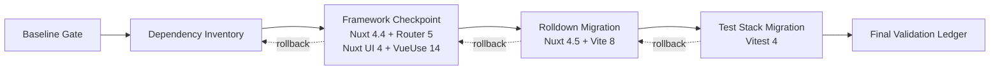

# Design

## Overview

The upgrade is a sequence of independently validated dependency checkpoints rather than one lockfile rewrite. Each checkpoint changes one compatibility boundary, records its resolved dependency tree, runs focused tests, and then runs the repository's production gates. A later checkpoint cannot start while an earlier checkpoint is worse than the recorded baseline.

The implementation keeps the primary `or3-cloud` checkout untouched and uses `chore/nuxt-vue-vite-upgrades`. Vue remains at 3.5.40 because it is already the latest stable compatible runtime. Packages that are already current (`@vite-pwa/nuxt`, `@vue/test-utils`, and `@vue-flow/core`) are verified but not changed.

## Architecture



- **Baseline Gate (R8, R9):** captures install, imports, themes, tests, type-check diagnostics, SSR build, and static build before dependency edits.
- **Dependency Inventory (R2, R6):** owns current/target versions, peer constraints, duplicate-major checks, and packages intentionally left unchanged.
- **Framework Checkpoint (R3, R4):** moves Nuxt to 4.4.8, Vue Router to 5.2.0, Nuxt UI to 4.10.0, and VueUse to 14.3.0 while Vite stays on 7.x. These packages form one peer-compatible unit because Nuxt 4.4 requires Router 5 while Nuxt UI 3 only accepts Router 4.
- **Rolldown Migration (R5):** moves Nuxt to 4.5.0, Vite to 8.1.5, and the Vue Vite plugin to 6.0.8; it owns custom bundler configuration compatibility.
- **Test Stack Migration (R7):** moves Vitest and its V8 coverage provider together only after application builds are green.
- **Final Validation Ledger (R1, R8):** records evidence, distinguishes baseline failures from regressions, and leaves manual or credentialed checks open.

## Components and Interfaces

### Dependency inventory

| Package | Baseline | Target | Batch | Compatibility owner |
|---|---:|---:|---|---|
| `nuxt` | 4.2.2 | 4.4.8, then 4.5.0 | Framework, Rolldown | Nuxt configuration and Nitro output |
| `@nuxt/ui` | 3.3.7 | 4.10.0 | Framework | Components, forms, theme config |
| `vue` | 3.5.40 | 3.5.40 | Verify only | Shared runtime identity |
| `vue-router` | 4.6.4 | 5.2.0 | Framework | Guards, redirects, generated routes |
| `@vueuse/core` | 13.9.0 | 14.3.0 | Framework | Reactive utilities and cleanup |
| `vite` | 7.3.0 | 8.1.5 | Rolldown | Dev/build pipeline and chunking |
| `@vitejs/plugin-vue` | 5.2.4 | 6.0.8 | Rolldown | Vue SFC compilation |
| `tailwindcss` | transitive | 4.3.3 direct | Framework | Nuxt UI 4 peer requirement |
| `vitest` | 2.1.9 | 4.1.10 | Test stack | Test runner and configuration |
| `@vitest/coverage-v8` | 2.1.9 | 4.1.10 | Test stack | Coverage remapping |
| `@vite-pwa/nuxt` | 1.1.1 | unchanged | Verify only | Service-worker build |
| `@vue/test-utils` | 2.4.11 | unchanged | Verify only | Component tests |
| `@vue-flow/core` | 1.48.2 | unchanged | Verify only | Workflow canvas |

The migration ledger uses small typed records so each checkpoint has an explicit contract:

```ts
type ValidationState = 'pass' | 'baseline-failure' | 'regression' | 'manual'

interface DependencyCheckpoint {
  name: 'framework' | 'rolldown' | 'test-stack'
  packages: Record<string, string>
  prerequisites: string[]
  validations: ValidationResult[]
  commit?: string
}

interface ValidationResult {
  command: string
  state: ValidationState
  evidence: string
}
```

### Compatibility adapters

- The UI migration replaces `UButtonGroup` with `UFieldGroup` and `buttonGroup` theme keys with `fieldGroup`. Form usage is audited for `nullify`/`nullable`, nested forms, and submit transforms.
- The Rolldown migration updates `nuxt.config.ts` manual chunking from the deprecated Rollup-facing option to the supported Rolldown code-splitting option where Nuxt exposes it.
- The custom theme compiler uses Vite/Rolldown-compatible plugin types for `buildStart`, `configResolved`, and `handleHotUpdate`; Rollup-only types are retained only when the installed public API requires them.
- The test migration updates `vitest.config.ts` only for documented Vitest 4 behavior. Snapshots are not mass-updated.

## Data Models

No application data model changes are required. The upgrade must not change IndexedDB schemas, provider payloads, workspace serialization, Markdown storage, or server database migrations.

## Error Handling

- A command failure is compared with the baseline ledger before it is classified.
- A new failure blocks the checkpoint and is fixed within that checkpoint or the dependency change is reverted.
- An existing failure is recorded with matching diagnostic text and does not authorize unrelated application fixes.
- Missing external credentials or untracked fixtures are labeled unavailable; their corresponding checklist items remain open.
- Package-manager peer warnings are treated as failures until the dependency tree proves that all direct framework peer ranges are satisfied.
- No forced install, ignored peer constraint, or unrestricted `bun update` is permitted.

## Testing Strategy

Each checkpoint runs a focused layer first and the broader gates second:

1. Install with Bun and inspect resolved Nuxt, Vue, Router, VueUse, Vite, and Vitest versions.
2. Run `check-imports` and theme validation.
3. Run focused tests for routing, auth guards, UI components, VueUse behaviors, theme compilation, or Vitest configuration according to the checkpoint.
4. Compare type-check output with the baseline diagnostic set.
5. Run the full available unit suite, explicitly recording unavailable local fixtures.
6. Build SSR output and run the plugin-runtime production validator.
7. Generate static output and verify PWA artifacts.
8. Use browser smoke tests for high-use UI, route transitions, editors, workflow canvas, and theme switching before merge.

## Design Decisions

- **Nuxt 4.4.8 is an intermediate checkpoint.** Router and UI regressions can be diagnosed without Vite 8/Rolldown in the same diff.
- **Nuxt, Router, Nuxt UI, and VueUse form one checkpoint.** Nuxt 4.4 requires Router 5, Nuxt UI 3 accepts only Router 4, and Nuxt UI 4 uses VueUse 14. Separating those installs would deliberately create an invalid peer graph.
- **Nuxt 4.5 and Vite 8 move together.** Nuxt 4.5 officially adopts Vite 8; separating them would test a less representative dependency graph.
- **Vitest moves last.** Application runtime/build failures remain attributable to framework changes, while test-runner behavior is isolated.
- **Vue stays pinned to the current stable patch.** Version churn without a newer release provides no benefit and risks duplicate runtime identity.
- **Commits follow checkpoint boundaries.** Planning/checklist reconciliation, routing, UI, Rolldown, test tooling, and final evidence remain independently reviewable and revertible.

## Risks & Mitigations

| Risk | Mitigation |
|---|---|
| Vite 8 replaces Rollup internals with Rolldown/Oxc | Upgrade with Nuxt 4.5, migrate custom config deliberately, and validate both production modes. |
| Nuxt UI 4 removes or renames components/config | Search all component and theme-config surfaces, migrate them mechanically, then run theme and browser checks. |
| Vue Router 5 changes route typing or plugin imports | Use a Nuxt 4.4 checkpoint and focused guard/static-route tests. |
| VueUse timing or cleanup behavior changes | Run fake-timer, persistence, observer, clipboard, keyboard, and unmount tests. |
| Vitest 4 changes mocks, coverage, or snapshots | Upgrade runner and provider together, inspect diffs, and reject wholesale snapshot updates. |
| Existing failures obscure regressions | Preserve exact baseline diagnostics and label unavailable fixtures explicitly. |
| Linked packages resolve duplicate Vue majors | Inspect the lockfile/tree after every install and retain a compatible root override. |
| User-owned editor work is overwritten | Work only in the isolated upgrade worktree and review every commit's file list. |
