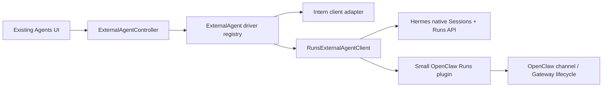

# Design

## Overview

Extend the existing External Agents subsystem with one additional transport driver instead of building a second integration stack. A `runs` client implements the existing `ExternalAgentClient` contract using a small HTTP/SSE surface based on Hermes's native Sessions and Runs APIs. Hermes connects directly. A small OpenClaw plugin exposes the same surface by translating OpenClaw channel/Gateway events, including approval requests, into Runs events.

OR3 Chat continues to own only its current host metadata, credential reference, session references, and display projection. Agent runtimes remain authoritative for execution, native session state, commands, permissions, and approvals.

## Architecture



| Component | Responsibility | Requirements |
| --- | --- | --- |
| `ExternalAgentController` and existing projection | Retain current connection, session, streaming, approval, cancellation, Activity, and UI behavior. | R1, R3-R6 |
| External Agent driver registry | Resolve `intern` or `runs` without runtime-specific branches elsewhere. | R2, R8 |
| `RunsExternalAgentClient` | Map the shared Sessions/Runs HTTP and SSE surface into `ExternalAgentClient`. | R1-R7 |
| Existing credential vault and persistence | Store bearer credentials and the new driver discriminator using current workspace-scoped mechanisms. | R1, R2, R5, R7 |
| OpenClaw Runs plugin | Expose capabilities, sessions, runs, SSE, stop, and approval by translating OpenClaw's native lifecycle. | R3, R4, R6-R8 |
| Hermes API server | Provide the shared surface directly; no Hermes-specific OR3 code. | R3-R8 |

No new OR3 server, relay, data store, controller, Activity source, or protocol package is introduced.

## Components and Interfaces

### Persisted driver discriminator

Add one optional field to the existing host model:

```ts
export type ExternalAgentDriver = "intern" | "runs";

export interface ExternalAgentHost {
  readonly id: string;
  readonly name: string;
  readonly baseUrl: string;
  readonly credentialRef: string;
  readonly driver?: ExternalAgentDriver;
  readonly trustedAt: string;
  readonly lastConnectedAt?: string;
}

export function externalAgentDriver(host: ExternalAgentHost): ExternalAgentDriver {
  return host.driver ?? "intern";
}
```

The persistence parser accepts only the two known values and leaves older records without the field. Missing means `intern`, preserving current behavior without a migration.

### Driver registry

Replace the fixed factory with a two-entry registry:

```ts
type ExternalAgentDriverFactory = ExternalAgentClientFactory;

const externalAgentDrivers: Record<ExternalAgentDriver, ExternalAgentDriverFactory> = {
  intern: createInternExternalAgentClient,
  runs: createRunsExternalAgentClient,
};
```

Connection enrollment determines the driver before saving the host. The preferred flow probes the supplied URL and token through a small bounded detector: a valid `/v1/capabilities` Runs response selects `runs`; otherwise the existing intern health/capability check is attempted. The detected value is shown for confirmation and persisted. Detection failures report the attempted surfaces without leaking response bodies or credentials.

### Shared Sessions and Runs surface

The Runs driver consumes only the operations needed by `ExternalAgentClient`:

```ts
type AgentRunsCapabilities = {
  product?: "openclaw" | "hermes" | string;
  session_list: boolean;
  session_create: boolean;
  session_history: boolean;
  run_events: boolean;
  run_stop: boolean;
  run_approval: boolean;
  attachments?: boolean;
};

type AgentRunEvent =
  | { type: "assistant.delta"; sequence: number; text: string }
  | { type: "tool.started" | "tool.completed"; sequence: number; tool: unknown }
  | { type: "approval.requested"; sequence: number; approvalId: string; choices: string[] }
  | { type: "approval.resolved"; sequence: number; approvalId: string; decision: string }
  | { type: "run.completed"; sequence: number; output?: string }
  | { type: "run.failed"; sequence: number; error: string }
  | { type: "run.cancelled"; sequence: number };
```

The expected HTTP operations are:

| Purpose | Operation |
| --- | --- |
| Health | `GET /health` |
| Discovery | `GET /v1/capabilities` |
| Sessions | `GET/POST /api/sessions`, `GET /api/sessions/:id` |
| History | `GET /api/sessions/:id/messages` |
| Start run | `POST /v1/runs` with `session_id` and `input` |
| Run status | `GET /v1/runs/:id` |
| Stream | `GET /v1/runs/:id/events` using SSE |
| Stop | `POST /v1/runs/:id/stop` |
| Approval | `POST /v1/runs/:id/approval` |

The driver adapts these responses to current OR3 shapes. It synthesizes a single runner descriptor from capabilities instead of introducing runtime-specific runner types. Text starting with `/` is not parsed or rewritten.

### Event translation

`RunsExternalAgentClient.streamTurn()` parses SSE incrementally and emits the current `ExternalRemoteStreamEvent` union. A small pure translator maps each recognized event to existing text, tool, approval, status, failure, or terminal events. Unknown events are skipped. Sequence/cursor information is preserved when supplied; when a runtime supplies no cursor, the driver reconciles through `GET /v1/runs/:id` after disconnect rather than resubmitting the run.

The existing event store remains responsible for deduplication, preview replacement, terminal precedence, and Activity projection.

### OpenClaw compatibility plugin

The OpenClaw package is an adapter, not a relay or agent implementation. It registers the minimum HTTP routes required by the shared surface and delegates execution to OpenClaw's existing channel/Gateway lifecycle:

- session IDs map deterministically to OpenClaw session keys;
- run input enters as a normal owner-authorized channel message, preserving slash commands;
- text/progress/final delivery becomes Runs SSE events;
- `exec.approval.requested` and plugin approval requests become `approval.requested`;
- approval decisions use OpenClaw's native approval resolver or same-session `/approve` path;
- stop delegates to OpenClaw's native abort operation.

The plugin uses the Gateway's existing bearer authentication and does not introduce enrollment codes, outbound sockets, persistence, or a second credential. Its `/v1/capabilities` response advertises only behavior verified against the pinned OpenClaw version.

### Hermes direct connection

Hermes requires no plugin. The user enables its API server, configures a bearer key and an explicit CORS origin when OR3 calls it from a browser, and enters the resulting URL and key in Agents. The same Runs driver uses Hermes's native capabilities, Sessions API, run event stream, stop, and approval operations.

## Data Models

No new database tables or server-side persistence are required. The existing External Agents KV snapshot gains only the optional `ExternalAgentHost.driver` discriminator. Existing credentials, session references, and projected events remain unchanged.

The driver value is justified by the only new lookup pattern: selecting a client implementation when connecting or reopening a persisted host. A two-value enum is sufficient; runtime product identity stays in capabilities and is not part of persistence routing.

## Error Handling

| Failure | Behavior |
| --- | --- |
| Invalid URL or missing token | Reject before network access using the existing connection form error path. |
| Unauthorized or unreachable runtime | Remove any temporary credential and show a redacted verification error. |
| Unsupported capabilities | Reject connection when sessions or run events are absent; capability-gate approval, stop, and attachments. |
| Malformed SSE frame | End the stream with a typed protocol error; never display the raw frame. |
| Unknown SSE event | Ignore it and continue known-event processing. |
| Stream disconnect | Resume from the supported cursor or reconcile run state; never submit the input again. |
| Approval/stop rejection | Keep the previous canonical state and show a retryable action error. |
| Runtime offline after reload | Preserve local history and mark the host offline. |

Existing `redactErrorMessage`, request abort signals, workspace-generation checks, and credential cleanup paths are reused.

## Testing Strategy

- **Unit:** Test driver selection, backwards-compatible host parsing, capability normalization, session/run DTO mapping, SSE parsing, unknown events, terminal mapping, approval decisions, stop, and redaction. Covers R1-R7.
- **Controller integration:** Run the existing controller fixture suite with a Runs client fake for connection, session creation, slash-command pass-through, stream reconnect, approval, and cancellation. Covers R2-R6.
- **Component integration:** Update copy and connection tests while retaining current Intern behavior. Verify capability-hidden controls and existing approval cards. Covers R1, R5, R6, R8.
- **OpenClaw contract:** Run shared HTTP/SSE fixtures plus a disposable pinned-Gateway smoke test covering commands, streaming, approval, and stop. Covers R3, R4, R6-R8.
- **Hermes contract:** Run the same Runs fixtures against a pinned Hermes API server without adding product-specific OR3 assertions. Covers R3-R8.
- **Final verification:** Run targeted Vitest projects for External Agents and the new plugin, then `bun run type-check`. Run the existing External Agents visual test only if rendered behavior changes beyond copy or connection metadata. Covers R8.AC4.

## Design Decisions

1. **Reuse `ExternalAgentClient`; do not add another integration stack.** The existing interface and controller already contain the hard state-management work. Only the fixed factory prevents another transport today.

2. **Use a Runs API as the shared wire path.** Hermes already provides the required sessions, SSE, stop, approval, and capability operations. This gives Hermes a zero-adapter OR3 integration and confines OpenClaw compatibility to one runtime-side plugin.

3. **Use an OpenClaw plugin only for the missing control surface.** OpenResponses already supplies streaming and session routing, but its documented SSE events do not include approval requests. The Gateway does publish approval events. The plugin bridges this gap without making OR3 a paired Gateway client.

4. **Treat channels as an OpenClaw implementation detail.** OR3 should not model Discord-, Telegram-, OpenClaw-, or Hermes-specific channel concepts. The OpenClaw plugin may use the channel lifecycle internally because that preserves command parsing, authorization, streaming delivery, and approval routing.

5. **Keep URL plus bearer token enrollment.** It reuses the current trusted-host and credential-vault flow and requires no new identity system. A future single paste bundle may wrap these values, but it is not required for v1 and must never put the token in a URL query.

6. **Capability-gate optional behavior.** Attachments, artifacts, approval, and stop are not faked. This allows the first implementation to stay focused on the four requested behaviors while preserving truthful UI.

## Risks & Mitigations

| Risk | Mitigation |
| --- | --- |
| OpenClaw plugin APIs or approval events change | Pin and smoke-test a supported OpenClaw version; advertise only verified capabilities. |
| Browser direct access fails because of CORS, mixed content, or reachability | Validate during connection and provide specific localhost/Tailscale/HTTPS and allowed-origin guidance. Do not add a relay as an implicit fallback. |
| The current interface contains Intern-shaped optional features | Implement only required mappings, capability-gate unsupported features, and avoid changing controller contracts unless a concrete method cannot be represented. |
| Runtime event schemas differ slightly | Keep event translation pure and fixture-driven; normalize only the event kinds used by the existing UI. |
| Gateway bearer access is privileged | Keep credentials in the existing vault, redact all failures, recommend loopback/private ingress, and document the runtime's trust implications. |
