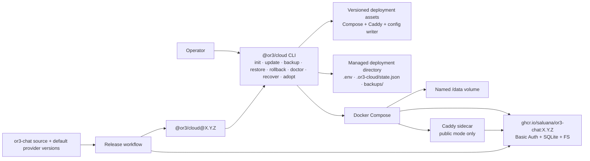

# Design

## Overview

`@or3/cloud` becomes the only supported operator-facing self-hosted distribution. It replaces the source-copying creator for normal local and single-VPS use with a small Node CLI, static deployment assets, and a version-matched OR3 OCI image. The CLI owns deployment state and operations; the image owns the application and its supported Basic Auth, SQLite, and filesystem runtime. This removes application source, package-manager installs, and local image builds from the VPS.

The current source-local wizard remains useful for application contributors and advanced/custom provider projects, but it is not copied or reimplemented in the managed Cloud installer. The Cloud CLI deliberately supports one fixed production profile instead of exposing the current generic provider matrix.

## Architecture



### Components

1. **Cloud CLI** — Parses commands, validates the managed directory, coordinates safe operations, and has no OR3 application build logic. Serves R1, R3, R4, R5, and R6.
2. **Deployment asset renderer** — Writes the fixed-profile Compose files, Caddyfile, `.env`, and credentials with atomic writes and safe permissions. Serves R1, R4, and R6.
3. **Docker operation runner** — Runs explicit Docker Compose commands, checks their result, captures redacted diagnostics, and resolves the pulled image digest. Serves R1, R2, R3, and R4.
4. **State and backup manager** — Records the active version and last successful operation; creates/validates backups and enables constrained rollback. Serves R2, R3, and R5.
5. **V1 adopter** — Inspects a generated source project, recognizes only the supported provider profile, then performs a stop/copy/verify transfer with source restoration on failure. Serves R5.
6. **Release pipeline** — Builds the fixed-profile image from the application source, smoke-tests it, publishes the image, then publishes and registry-qualifies the CLI. Serves R2 and R6.
7. **Documentation and legacy deprecation** — Replaces normal-user creator documentation, provides VPS/local operations instructions, and distinguishes advanced source development. Serves R4, R5, and R6.

## Components and Interfaces

### Package shape

Create `packages/or3-cloud` in the `or3-chat` repository as the source of the published `@or3/cloud` package. Its package has one executable:

```json
{
  "name": "@or3/cloud",
  "bin": { "or3": "./dist/cli.mjs" }
}
```

The documented form remains `npx @or3/cloud <command>` so users never need to globally install a binary. The package includes compiled CLI code and readonly deployment assets only; it does not include the OR3 application source or default provider source.

### Command contract

```text
npx @or3/cloud init [directory] --local
npx @or3/cloud init [directory] --public --domain <hostname>
npx @or3/cloud update [--to <exact-version>]
npx @or3/cloud backup
npx @or3/cloud restore <backup-id-or-path> --yes
npx @or3/cloud rollback --yes
npx @or3/cloud doctor
npx @or3/cloud recover
npx @or3/cloud adopt --from <v1-directory> [directory]
```

`init` prompts for a real administrator email unless supplied with `--admin-email`. It accepts an automation-managed `--admin-password-file`; otherwise it generates a password and writes it only to a mode-`0600` initial-credentials file. It does not accept a normal `--admin-password` argument in the new interface.

`--local` starts the same authenticated container profile on `127.0.0.1:<port>` without Caddy. `--public` requires a hostname and includes the Caddy Compose overlay. Neither mode changes a firewall, DNS record, Cloudflare setting, or Tailscale configuration.

`update` always creates a pre-update backup; there is no skip-backup flag. By default it targets the CLI package version currently being executed. `--to` only accepts a complete semantic version, so tags such as `latest` cannot be recorded as deployment state.

If an operation is interrupted, mutating commands refuse to guess. `doctor`
identifies the pending operation and `recover` resumes the recorded operation
or restores its recorded backup, starts the resulting deployment, and rewrites
state only after deep health passes. An update with an ambiguous `.env` is
refused rather than guessed; adoption also records the source directory so a
failed recovery can restart the original project.

### Deployment assets

The package owns two small static Compose assets and a Caddyfile template, replacing copied application Compose/Docker files:

```yaml
# compose.yaml (conceptual)
name: ${OR3_COMPOSE_PROJECT}
services:
  or3:
    image: ghcr.io/saluana/or3-chat:${OR3_VERSION}
    env_file: .env
    environment:
      HOST: 0.0.0.0
      PORT: 3000
      OR3_BASIC_AUTH_DB_PATH: /data/auth.sqlite
      OR3_SQLITE_DB_PATH: /data/sync.sqlite
      OR3_STORAGE_FS_ROOT: /data/storage
    ports: ["127.0.0.1:${OR3_PORT}:3000"]
    volumes: ["or3-data:/data"]
    restart: unless-stopped
    healthcheck: { ...existing health check... }
volumes:
  or3-data: {}
```

The public overlay keeps the existing Caddy pattern (`80`, `443/tcp`, optional `443/udp`) and has Caddy depend on a healthy OR3 service. The rendered `.env` contains only the supported profile's canonical runtime keys plus existing compatibility aliases still required by OR3. It is written atomically with owner-only mode; generated initial credentials are excluded from Docker build contexts and ordinary CLI output.

The release image must be built from the repository root, not the generated creator template, using the existing Dockerfile and registry-clean manifest preparation. The build workflow passes the fixed cloud profile build arguments:

```text
SSR_AUTH_ENABLED=true
AUTH_PROVIDER=basic-auth
OR3_GUEST_ACCESS_ENABLED=false
OR3_SYNC_ENABLED=true
OR3_SYNC_PROVIDER=sqlite
OR3_STORAGE_ENABLED=true
NUXT_PUBLIC_STORAGE_PROVIDER=fs
```

This is required because the current Nuxt build uses deployment configuration while building server/client behavior. The image contains default provider modules at build time; operators only pull the final image.

### Operation interfaces

Use typed, explicit results at the boundary between command orchestration and shell execution:

```ts
type CloudMode = 'local' | 'public';

type ManagedState = {
  schemaVersion: 1;
  mode: CloudMode;
  composeProject: string;
  appVersion: string;
  image: string;
  imageDigest: string;
  domain?: string;
  lastSuccessfulOperation: 'init' | 'update' | 'restore' | 'adopt';
  updatedAt: string;
  rollback?: RollbackPoint;
  incompleteOperation?: IncompleteOperation;
};

type RollbackPoint = {
  appVersion: string;
  imageDigest: string;
  backupId: string;
  createdAt: string;
};

type IncompleteOperation = {
  id: string;
  operation: 'init' | 'update' | 'backup' | 'restore' | 'rollback' | 'adopt';
  startedAt: string;
  message: string;
  backupId?: string;
  targetVersion?: string;
  targetImage?: string;
  targetImageDigest?: string;
  sourceDirectory?: string;
};

type CommandResult =
  | { ok: true; stdout: string; stderr: string }
  | { ok: false; command: string; exitCode: number | null; stderr: string };
```

The operation runner returns `CommandResult`; only the command layer decides whether a result is recoverable. It redacts known values from output before persisting diagnostic records. Files are written via a temporary sibling file, mode set before rename, then atomically renamed. Pending update/restore/rollback records include their target image and backup ID, so recovery can validate the exact image digest and never switch to an unrelated deployment.

`init` flow:

1. Validate Docker/Compose, target safety, requested hostname/mode, image availability, and public-port availability when applicable.
2. Create the deployment directory and render config/assets with restrictive permissions.
3. Pull `ghcr.io/saluana/or3-chat:<CLI version>`, record its digest in a pending state record, start Compose, then probe `/api/health?deep=true` from the OR3 container.
4. Mark `init` successful only after the deep probe succeeds. On failure, stop only the new project and preserve files plus a copyable diagnostics command.

`update` flow:

1. Require a healthy managed deployment and no pending operation.
2. Stop `or3`, archive the named data volume and deployment configuration, verify the tar listing/checksum, restart the old service, and save a rollback point.
3. Pull the exact target image, atomically update `OR3_VERSION`, bring Compose up, and deep-health probe it.
4. If it fails, stop the replacement, restore the prior version and backup, wait for prior deep health, and leave state marked as failed-but-restored. If it succeeds, commit the new version/digest and retain the backup for manual recovery.

Manual `rollback` is intentionally limited to the immediately preceding successful update point. It requires `--yes` because restoring the associated data archive discards data written since that update. `restore` uses the same stop/write/start/deep-health path and records a pending operation until completion. Backup manifests bind the archive to the original Compose project, named volumes, port, mode, and image digest, so a backup from another deployment cannot be applied accidentally.

### V1 adopter

`adopt` is a separate command rather than a hidden branch of `init`:

1. Read the V1 project's `or3-release.json`, `.env`, generated provider module file, Compose configuration, and resolved data volume. Never print secret values.
2. Accept only Basic Auth, SQLite, filesystem storage, expected `/data` paths, and a published image tag matching the V1 application version. Reject all other combinations before stopping containers.
3. Build a new managed directory, copy only the supported environment keys and Caddy/domain configuration, and back up the source configuration/data.
4. Stop the source `or3` service, copy its data into the new volume, start the managed deployment at the same pinned version, and deep-health probe it.
5. If any transfer/start/probe fails, stop the managed project, restore the old V1 service, and retain source and managed backup paths for inspection.

The original V1 directory is never removed. Adoption makes a new managed deployment and is the one backward-compatibility path needed to make future updates simple.

### Release pipeline

Replace the creator-centric release flow for normal Cloud releases with a single version-matched workflow:

1. Verify every default provider version required by the image is available and run the existing application/provider qualifications.
2. Build the root-context fixed-profile image, run container persistence/login/file/deep-health smoke tests, and publish `ghcr.io/saluana/or3-chat:X.Y.Z`.
3. Build and pack `@or3/cloud@X.Y.Z`, run its CLI integration suite against that exact image, publish it with trusted publishing, and retry exact npm lookup plus `npx @or3/cloud@X.Y.Z --help` until registry propagation completes.
4. Publish release notes containing the package version, immutable image digest, supported profile, upgrade compatibility, and backup/rollback warning.

The image is published first. If CLI publication fails, the next corrected release uses a new version; tags and npm versions are never moved or overwritten.

## Data Models

There is no database beyond the existing OR3 `/data` volume. The CLI owns this file layout:

```text
<deployment>/
  .env                         # mode 0600; runtime secrets and OR3_VERSION
  compose.yaml                 # static rendered asset
  compose.public.yaml          # present only in public mode
  Caddyfile                    # present only in public mode
  .or3-cloud/
    state.json                 # mode 0600; ManagedState
    operations/<id>.json       # mode 0600; pending/failure metadata, redacted
    backups/<id>/
      data.tgz                 # mode 0600; stopped-volume archive
      config.env               # mode 0600; deployment configuration snapshot
      manifest.json            # mode 0600; checksum/version/digest metadata
  .or3-initial-credentials     # mode 0600; operator removes after saving safely
```

`backupId` is an ISO-8601 timestamp plus a random suffix, avoiding collisions from repeated operations. Backups are enumerated by directory name; no index or background cleanup is introduced in the first release.

## Error Handling

| Failure | Behavior |
|---|---|
| Docker/Compose unavailable | Fail preflight without creating or changing deployment files; show the prerequisite command to run. |
| Image pull fails or registry is unavailable | Keep current state/version unchanged; show the exact redacted `docker pull` or `docker compose` diagnostic. |
| Invalid public domain, ports occupied, Caddy unavailable | Do not start the public stack; preserve generated files only after user confirmation and explain the failure. |
| Deep health fails during init | Stop only the new project, retain its diagnostics and secrets in owner-only files, and do not claim deployment success. |
| Deep health fails during update | Restore the immediate rollback point, require the old deep health to pass, and mark the update failed. |
| Backup archive/checksum/list verification fails | Restart the prior service and refuse update, restore, or adoption. |
| Legacy inspection finds unsupported provider configuration | Refuse before source service stop; list detected provider IDs without secrets. |
| Interrupted mutation | Retain `incompleteOperation` before container or volume writes; the next management command refuses guessing and offers the recorded recovery operation. |

## Testing Strategy

- **CLI unit tests:** argument parsing, directory safety, semantic-version validation, public/local asset rendering, secret redaction, mode/permissions, state transitions, and unsupported V1 detection. Covers R1, R3, R4, and R5.
- **Docker integration tests:** use a locally tagged fixed-profile image to exercise `init --local`, Basic Auth sign-in, SQLite/filesystem persistence across restart, `backup`, `update`, induced failed health rollback, and `restore`. Covers R1, R2, and R3.
- **Public Compose integration:** run the Caddy overlay against `localhost`, verify HTTPS/deep health, loopback application exposure, Caddy-to-OR3 proxying, and persistence. Covers R1, R4, and R6.
- **Adoption integration:** create a V1-style default-profile fixture with data, adopt it to the matching image, verify login/data/file access, then run one managed update. Test unsupported provider fixture refusal and failure restoration. Covers R5.
- **Release qualification:** run root image build with explicit fixed-profile arguments; verify default provider dependencies; smoke the packed CLI against the published image before npm publish; after publish, cache-revalidated `npx` exact-version smoke. Covers R2 and R6.
- **Manual release checklist:** pull the public GHCR image unauthenticated from a clean runner, run the documented VPS initialization on an ephemeral host, and verify public HTTPS, backup, and rollback before announcing a new major/minor release. Covers R2–R4.

## Design Decisions

1. **Use containers for both local and VPS modes.** A native Node/system-service option would recreate host dependency drift, dependency installation, and update complexity. Local mode still feels local—one command and `127.0.0.1`—but has the identical runtime to production.
2. **Support one fixed cloud profile.** The current generic wizard has valid developer use, but a package that promises easy operations cannot safely surface untested combinations. Basic Auth + SQLite + filesystem is already the documented recommended stack.
3. **Do not physically merge Basic Auth or other provider source in this migration.** The container compiles their exact versions once; operators never see or install them. Moving security-critical provider source across repositories is a separate code-ownership refactor with no immediate operator benefit and risks duplicating it. This plan removes it from the public install/release experience while preserving the provider extension boundary.
4. **Use exact version tags and record image digests.** The version is readable in support conversations and matches the CLI; the resolved digest detects a registry tag unexpectedly changing and is the rollback identity.
5. **Make V1 migration explicit and narrow.** The deployed user has a default-profile V1 project and needs a path to easy updates. A compatibility adapter for arbitrary generated source would be unsafe and permanent complexity, so `adopt` supports only the known profile and otherwise refuses.
6. **Deprecate rather than forward `create-or3-chat`.** A forwarding wrapper would retain two CLIs and unclear old flag semantics. Marking the old package/docs deprecated gives a single unambiguous command and cannot falsely create a project without completing deployment.
7. **Do not automate firewall, Cloudflare, or Tailscale.** These change systems outside an OR3 deployment and have account-specific safety implications. The CLI reports requirements and the documentation provides vetted instructions.

## Risks & Mitigations

1. **The prebuilt image might omit build-time cloud behavior.** Mitigation: explicit cloud build arguments, root-context image build, and login/persistence/deep-health smoke before publish.
2. **GHCR visibility or authentication might block VPS pulls.** Mitigation: make the package public before release and add a clean unauthenticated pull test to the pipeline and release checklist.
3. **Data migrations may make an image rollback unsafe.** Mitigation: always back up the stopped volume before updates, tie rollback to that immediate snapshot, and state plainly that manual rollback discards post-update writes.
4. **V1 deployments can have hand-edited Compose or unsupported providers.** Mitigation: inspection-only preflight, exact default-profile matching, no mutation before all checks pass, and source service restoration on any post-stop failure.
5. **npm registry propagation can make a valid release look unavailable.** Mitigation: publish after image smoke, retry exact-version registry/npx checks with cache revalidation, and never reuse version tags after a failed publish.
