# architecture.md

artifact_id: 42c5f0fb-155b-4246-a009-dc72e69ee536
date: 2026-01-25

## Purpose

This document visualizes the **Admin Dashboard (SSR-only)** architecture for OR3 Cloud: how requests flow, where authorization is enforced, how deployment extensions are managed, and how workspace-scoped settings are persisted.

It is intended as an implementation aid to keep SSR boundaries, safety constraints, and extensibility surfaces clear.

---

## System Context (High-Level)

```mermaid
flowchart TB
  subgraph Browser["Browser (Admin User)"]
    AdminUI["Admin UI (/admin/*)"]
    AdminApiClient["Admin API Client (fetch)"]
  end

  subgraph Nitro["OR3 Nitro Server (SSR)"]
    AdminPages["SSR Pages + Admin Layout"]
    AdminApi["/api/admin/**"]
    Sess["resolveSessionContext(event)"]
    Can["requireCan(session, permission)"]
    ServerHooks["Server Hook Engine (Nitro-safe)"]
    ExtMgr["ExtensionManager (FS scan/install/remove)"]
    CfgMgr["ConfigManager (.env/config read/write + validate)"]
    SrvCtl["ServerControlProvider (restart/rebuild)"]
    StoreClient["Workspace/Settings Store Client"]
    ProviderAdmin["Provider Admin Adapters (auth/sync/storage)"]
  end

  subgraph Canonical["Canonical Store (selected SyncProvider backend)"]
    WS["workspaces"]
    Members["workspace_members"]
    KV["kv (workspace-scoped settings)"]
  end

  subgraph Providers["External Providers (swappable)"]
    AuthP["Auth Provider (Clerk/Firebase/Custom)"]
    SyncP["Sync Provider Backend (Convex/Postgres/etc.)"]
    StorageP["Object Storage (Convex/S3/R2/etc.)"]
  end

  subgraph Deployment["Deployment Resources"]
    FS["Filesystem (extensions/, .env, manifests)"]
    Supervisor["Process Supervisor (systemd/docker/pm2)"]
  end

  AdminUI --> AdminPages
  AdminUI --> AdminApiClient --> AdminApi

  AdminPages --> Sess --> Can
  AdminApi --> Sess --> Can
  AdminApi --> ServerHooks

  AdminApi --> ExtMgr --> FS
  AdminApi --> CfgMgr --> FS
  AdminApi --> SrvCtl --> Supervisor
  AdminApi --> StoreClient --> Canonical
  StoreClient --> WS
  StoreClient --> Members
  StoreClient --> KV

  AdminApi --> ProviderAdmin --> AuthP
  AdminApi --> ProviderAdmin --> SyncP
  AdminApi --> ProviderAdmin --> StorageP
```

**Key invariants**
- Admin UI is **SSR-only** and **gated by SSR auth**; static builds do not include it.
- All admin API mutations are enforced on the server via `can()` / `requireCan()`.
- Workspaces are the **same** workspaces as the main app: canonical store lives in the selected SyncProvider backend (Convex default).

---

## Route & Origin Isolation

Admin is scoped by:
- Route boundary: `/admin/*`
- Optional origin/host restriction: `OR3_ADMIN_ALLOWED_HOSTS`
- Optional base path override: `OR3_ADMIN_BASE_PATH`

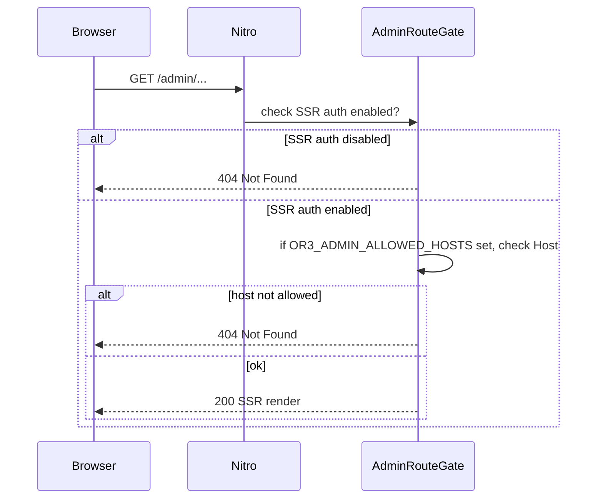

This supports serving admin on `admin.<domain>` via reverse proxy (recommended), or on a different port in dev.

---

## Authorization Flow (Server-Enforced)

All access and mutations flow through `can()`.

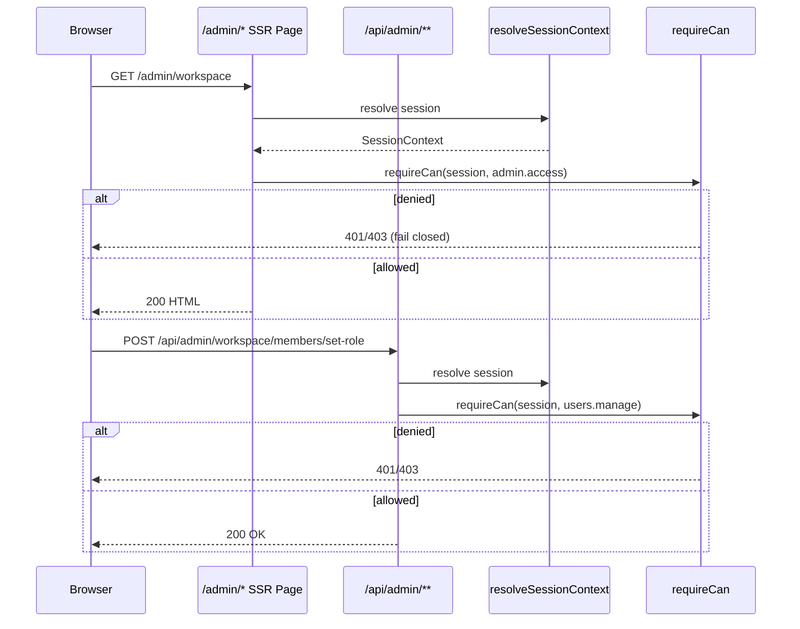

**Role intent (v1)**
- `owner`: full admin UI + mutations
- `editor`: admin UI access (read-only) but no deployment-scoped mutations
- `viewer`: no admin access

---

## Data Ownership & Persistence

### Canonical workspace data (selected backend)

- Workspaces: stored in the canonical workspace store backend (selected SyncProvider backend; Convex default).
- Membership: stored alongside workspaces (roles drive `can()` decisions).
- Session provisioning: `resolveSessionContext` MUST map provider identity → user/workspace via the configured `AuthWorkspaceStore` adapter (default Convex reference implementation currently uses `api.workspaces.ensure`).

### Workspace-scoped admin settings (Synced)

Admin uses the existing synced `kv` table for workspace-scoped settings (so they follow the workspace across devices):

- `admin.guest_access.enabled` → `"true" | "false"`
- `plugins.enabled` → JSON string array `["plugin.a","plugin.b"]`
- `plugins.settings.<plugin_id>` → JSON object string

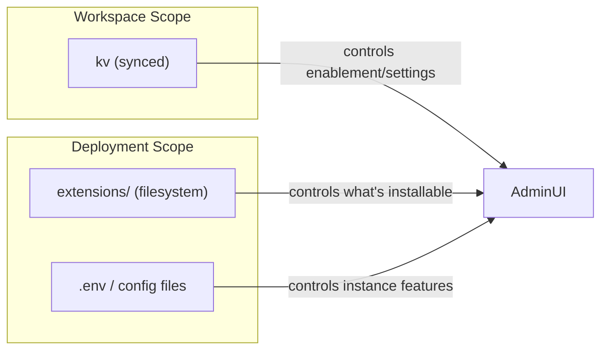

**Why this split matters**
- Deployment install scope: trusted code/assets present on the server.
- Workspace enablement scope: per-team opt-in and configuration.

---

## Workspace & Access Management (Data Flow)

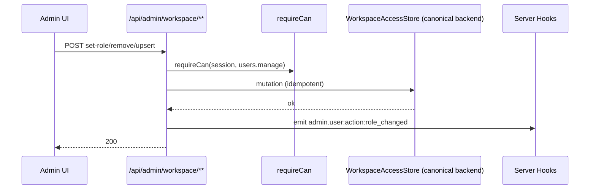

Notes:
- Membership mutations must be **idempotent** (upserts keyed by workspace/user).
- The canonical workspace store enforces membership and owner-only writes as the source of truth (default Convex implementation).

---

## Extension Management (Plugins/Themes/Admin-Plugins)

### On-disk layout (deployment scope)

```
extensions/
  plugins/<id>/
    or3.manifest.json
    plugin.client.ts
    plugin.server.ts (optional)
  themes/<id>/
    or3.manifest.json
    theme.ts
  admin-plugins/<id>/
    or3.manifest.json
    admin.client.ts
```

### Install pipeline (zip → validated → installed)

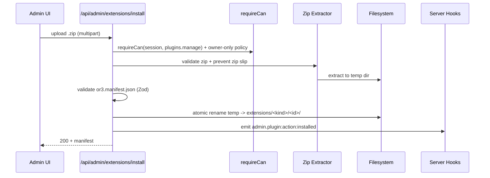

**Safety requirements**
- Zip slip protection (reject `..`, absolute paths, drive prefixes)
- Size limits (zip bytes, file count, total uncompressed)
- Temp dir + atomic rename (no partial installs)
- No execution on install (only enablement triggers load)

---

## Workspace Plugin Enablement (Installed vs Enabled)

Installed plugins exist on disk, but do nothing until enabled for a workspace.

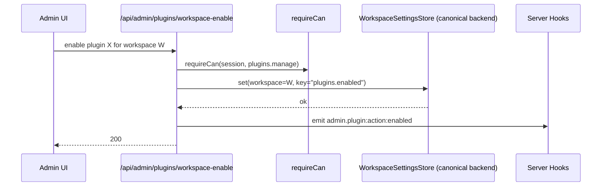

Client-side behavior (SSR app runtime):

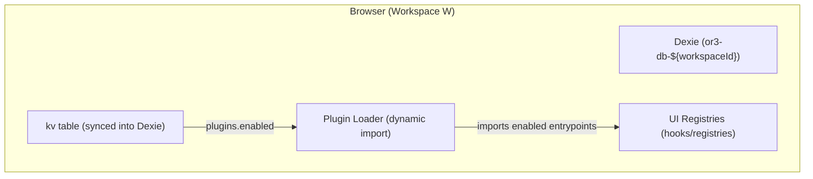

---

## Config Editing + Apply + Restart Flow

Because `nuxt.config.ts` currently imports `config.or3.ts` + `config.or3cloud.ts` at build time, many config changes require **rebuild + restart** in production.

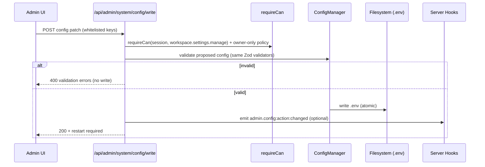

Restart execution (simple default: exit and rely on supervisor):

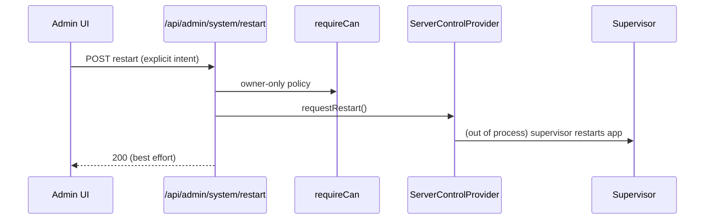

---

## Observability Hooks (Admin Lifecycle)

Admin operations emit hooks from server routes:

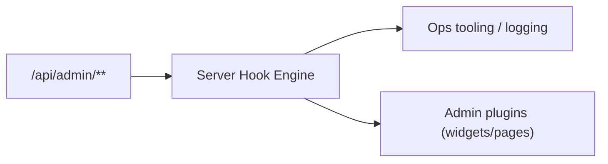

Core events (v1):
- `admin.plugin:action:installed`
- `admin.plugin:action:enabled`
- `admin.plugin:action:disabled`
- `admin.user:action:role_changed`

---

## Provider Management (Auth / Sync / Storage)

The admin dashboard must remain functional when providers are swapped. To avoid hard-coding (e.g., Convex/Clerk), the System page should be driven by provider adapters that expose:

- status/health (config validation + optional live checks)
- warnings (misconfig, degraded mode)
- safe maintenance actions (GC, retention, connectivity tests)

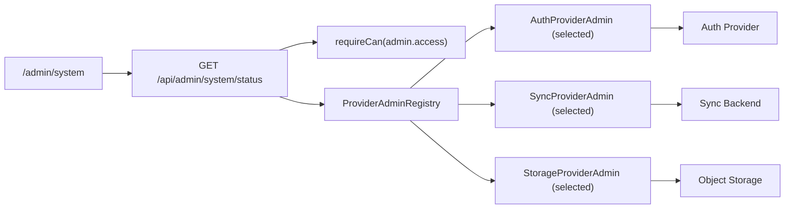

Example maintenance action flow:

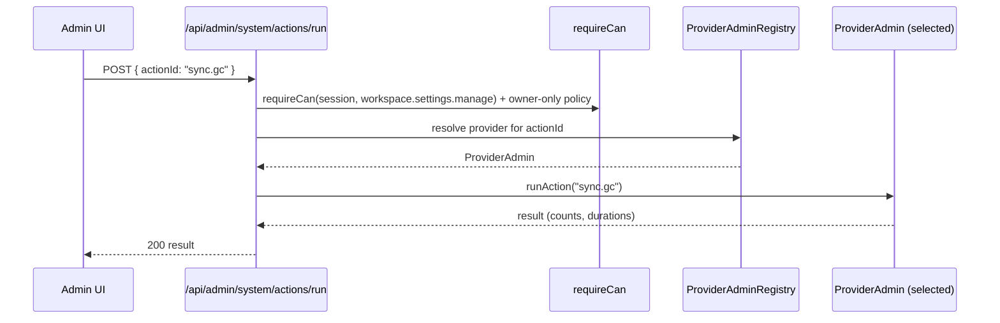

---

## Failure Modes & Recovery (Quick Map)

| Area | Failure | Behavior |
|---|---|---|
| Auth | SSR auth disabled | Admin returns `404` (fail closed) |
| Auth | Session missing/invalid | `401` |
| AuthZ | Viewer/editor performing forbidden mutation | `403` |
| Extensions | Invalid zip / zip slip | `400`, no partial install |
| Extensions | Install collision | `409` unless explicit replace confirmed |
| Config | Validation fails | `400`, no write |
| Restart | No supervisor present | Endpoint returns error; UI warns “restart strategy not configured” |

---

## Implementation Notes (Keep Simple)

1. Prefer **one Nuxt app** with host allowlisting over a second admin server.
2. Store workspace-scoped settings in **synced `kv`** (no new tables unless needed).
3. Keep deployment extension state **on disk** and cache scans briefly.
4. Keep restart/rebuild operations behind a **pluggable provider**, defaulting to “exit and let the supervisor restart”.
