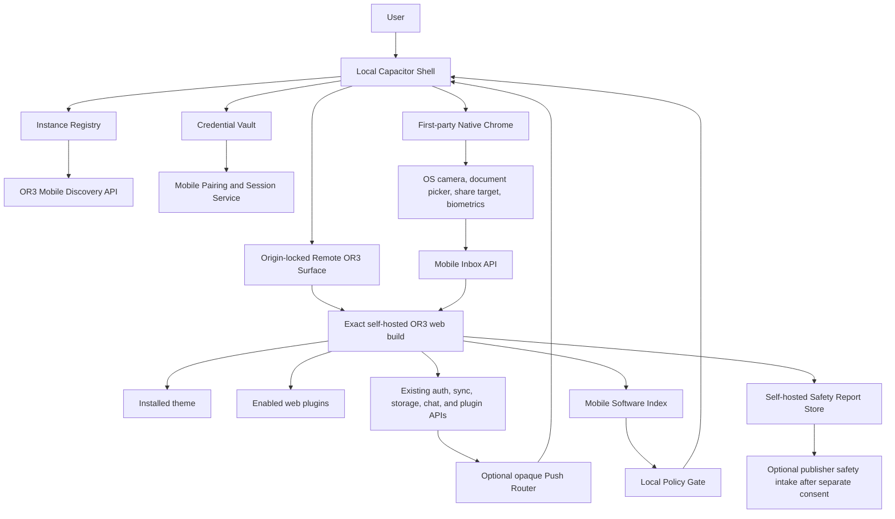

# Design

## Overview

OR3 Mobile Runtime is a specialized client for self-hosted OR3 Chat, not a general browser and not a second implementation of the workspace. A locally bundled Capacitor shell owns instance enrollment, secure credentials, native navigation chrome, native permissions, share targets, biometric lock, diagnostics, and store-compliance surfaces. When the user opens an instance, the shell presents a separate native-managed WKWebView/Android WebView that loads the instance's exact HTTPS OR3 build as a top-level page. That preserves server-installed themes and plugins while preventing hosted JavaScript from receiving Capacitor's generic native bridge.

The design deliberately treats the hosted OR3 build and its plugins as remote HTML5/JavaScript software for store-policy purposes. Native operations are user-initiated first-party shell actions, and their results enter OR3 through authenticated server APIs as ordinary drafts or attachments. This preserves the extension ecosystem while creating a defensible boundary for Apple App Review Guideline 4.7 and Google Play's runtime-code and content policies.

Implementation is split into three delivery gates:

1. **Policy and transport spike:** prove origin isolation, cookie/session bootstrap, exact plugin/theme rendering, and review positioning on both platforms.
2. **Store MVP:** pairing, multi-instance shell, remote surface, camera/file inbox, share target, biometric lock, extension index, AI report action, compliance artifacts, and a stable review instance.
3. **Store-quality follow-up:** opaque push routing and only then any additional native actions justified by user demand and policy review.

## Architecture



### Components

| Component | Single responsibility | Requirements |
|---|---|---|
| Local Capacitor Shell | Render first-party onboarding, instance picker, privacy, diagnostics, and native chrome from bundled assets | R1, R4, R6, R8, R9, R11 |
| Instance Registry | Persist non-secret paired-instance metadata and keep instances isolated | R1, R8, R9 |
| Credential Vault | Store device refresh credentials and biometric-lock state in Keychain/Keystore | R4, R5, R6, R8 |
| Mobile Discovery API | Describe one compatible OR3 instance and its mobile entry, versions, policies, and capabilities | R1, R2, R8, R9 |
| Mobile Pairing and Session Service | Issue, rotate, revoke, and exchange purpose-bound device credentials and browser session tickets | R1, R5, R8 |
| Remote OR3 Surface | Present one exact paired origin in a native-managed WebView without the Capacitor bridge | R2, R3, R4, R5, R9 |
| Native Chrome | Initiate first-party camera/file/share/biometric operations and display instance identity | R2, R4, R6 |
| Mobile Inbox API | Convert native-selected content into short-lived OR3 drafts/attachment references | R4, R5, R6, R9 |
| Mobile Software Index | Project server-authoritative plugin identities and policy metadata for the current workspace | R2, R7, R11 |
| Local Policy Gate | Apply a signed exact-origin/artifact denial list locally without inventory upload | R3, R7, R11 |
| AI Safety Surface | Provide built-in output reporting and moderated-model enforcement in mobile store mode | R7, R11 |
| Optional Push Router | Route content-free notification envelopes for the universal app bundle | R10, R11 |
| Store Compliance Pack | Keep privacy, age/content, permission, review, export, and SDK evidence current | R6, R7, R8, R11 |

### Runtime boundaries

The Capacitor root WebView remains on its default local secure origin and renders only shell assets. Capacitor's configuration warns that external `server.url` and `allowNavigation` are not intended for production, so neither is used. Native code presents `Or3RemoteSurfaceViewController` on iOS and `Or3RemoteSurfaceActivity` on Android. Those controllers have their own cookie/data stores, navigation delegates, process-failure handling, and strict origin policy, but no Capacitor bridge script or generic JavaScript message handler.

The paired HTTPS origin is the remote surface's sole in-WebView origin. Same-origin OR3 API, theme, Nuxt chunk, and plugin-package requests continue working with first-party cookies. Cross-origin HTTP(S) navigations require a user gesture and leave the app through the system browser. OAuth endpoints always use `ASWebAuthenticationSession` on iOS and a system browser/custom-tab authorization flow on Android with PKCE; Google explicitly prohibits OAuth through embedded WebViews.

Native chrome sits outside the remote WebView. A camera or file selection is uploaded by native code using the device credential to the Mobile Inbox API. The remote OR3 core consumes the resulting inbox item and feeds it through the existing attachment validation, storage, and plugin-hook pipeline. Hosted JavaScript can observe an ordinary OR3 attachment only after the user selected it; it cannot invoke the native camera or inspect the device credential. Standard web file inputs remain available for the existing UI and plugins.

## Components and Interfaces

### Repository layout

```text
or3-chat/
  mobile/
    package.json
    capacitor.config.ts
    src/                         # bundled local shell
    ios/                         # reviewed Xcode project and Or3RemoteSurface controller
    android/                     # reviewed Gradle project and Or3RemoteSurface activity
    tests/
  shared/mobile/                 # wire schemas and pure policy helpers
  server/mobile/                 # pairing, device store, inbox, policy projections
  server/api/mobile/             # authenticated mobile endpoints
  server/routes/.well-known/     # unauthenticated discovery document
  app/pages/mobile/              # hosted mobile entry and policy-safe route handling
  app/components/mobile/         # web-side inbox, extensions index, reporting surfaces
```

`mobile/` is an application, not a published npm package. It uses the repository's pinned Bun toolchain but owns its Capacitor dependencies and native lockfiles. Cross-runtime contracts live in `shared/mobile/` and must remain framework-free.

### Discovery contract

```ts
export const OR3_MOBILE_DISCOVERY_SCHEMA = 1 as const;

export interface Or3MobileDiscoveryV1 {
    schemaVersion: 1;
    instance: {
        id: string;
        displayName: string;
        origin: `https://${string}`;
    };
    runtime: {
        minVersion: string;
        maxVersionExclusive?: string;
        mobileEntryPath: '/mobile';
    };
    endpoints: {
        pairing: '/api/mobile/pair';
        sessionTicket: '/api/mobile/session-ticket';
        softwareIndex: '/api/mobile/software-index';
        inbox: '/api/mobile/inbox';
        privacyPolicy: string;
        accountDeletion?: string;
    };
    capabilities: {
        nativeInbox: boolean;
        shareTarget: boolean;
        push: boolean;
        oauthSystemSession: boolean;
    };
    content: {
        minimumAge: 18;
        aiReporting: true;
        upstreamModerationRequired: true;
    };
    chrome: {
        background: `#${string}`;
        foreground: `#${string}`;
        accent: `#${string}`;
    };
}
```

The discovery endpoint is public, cacheable for at most five minutes, contains no user/workspace/plugin inventory, and derives its absolute origin using the repository's proxy-trust rules. The client validates it with a shared Zod schema and rejects redirects to a different origin.

### Pairing QR and device protocol

```ts
export interface MobilePairingQrV1 {
    version: 1;
    origin: `https://${string}`;
    requestId: string;
    secret: string;       // random, single-use, <= 10 minute lifetime
}

export type MobileDeviceStatus = 'active' | 'revoked';

export interface MobileDeviceRegistration {
    deviceId: string;
    name: string;
    platform: 'ios' | 'android';
    appVersion: string;
    signingPublicKey: string;
}

export interface MobileDeviceCredential {
    deviceId: string;
    refreshSecret: string;
    expiresAt: number;
}
```

Pairing reuses the proven shape of OR3 Connect's authorization lifecycle but has separate records, scopes, cryptographic purposes, endpoints, and revocation. A desktop-authenticated user creates the request. The QR secret is stored only as a server-keyed HMAC and appears in the QR payload, never in analytics or server logs. On redemption the mobile app signs the challenge with its new device key. The server binds the device to one OR3 user and its current workspace policy, returns a rotating refresh credential, and records only its keyed hash.

The device access token is short-lived and accepted only by `/api/mobile/*` plus the notification binding endpoints. It is not accepted as a generic plugin route credential. `resolveSessionContext` gains a purpose-checked mobile session-ticket path rather than teaching every existing cookie endpoint to trust long-lived bearer tokens.

### Browser session ticket

```ts
export interface BrowserSessionTicket {
    ticket: string;
    expiresAt: number;
    entryPath: '/mobile';
}
```

Native code authenticates to `POST /api/mobile/session-ticket`, receives a 60-second single-use ticket, and loads `https://instance/mobile/session?ticket=...`. The server stores only a keyed hash, consumes it atomically, sets the normal Secure/HttpOnly/SameSite session cookie, sets `Referrer-Policy: no-referrer` and `Cache-Control: no-store`, then redirects to `/mobile`. The ticket is redacted from request logs and error reports. This keeps the long-lived device secret out of WebView storage while preserving same-origin browser behavior.

### Instance registry

```ts
export interface PairedInstance {
    instanceId: string;
    origin: `https://${string}`;
    displayName: string;
    chrome: Or3MobileDiscoveryV1['chrome'];
    deviceId: string;
    lastOpenedAt: number;
    lastKnownRuntimeRevision?: string;
    pushEnabled: boolean;
}
```

The registry stores this non-secret record in local Capacitor Preferences or a small native SQLite store. The refresh secret is stored separately in Keychain/Keystore under `instanceId + deviceId`. Browser state is separated by HTTPS origin, with a named website data store on iOS where the supported WebKit API permits it; Android uses WebView's origin separation and explicit per-origin deletion because one process cannot safely assign a new data-directory suffix for every instance. If a known hostname returns a different stable instance ID, the shell treats it as a replacement deployment and purges the prior origin's browser state before pairing.

### Remote surface policy

```ts
export type RemoteNavigationDecision =
    | { kind: 'allow-same-origin' }
    | { kind: 'open-system-browser'; url: `https://${string}` }
    | { kind: 'handle-or3-route'; route: string }
    | { kind: 'deny'; reason: RemoteNavigationBlockReason };

export type RemoteNavigationBlockReason =
    | 'origin-mismatch'
    | 'cleartext'
    | 'mixed-content'
    | 'local-resource'
    | 'loopback'
    | 'unapproved-scheme'
    | 'missing-user-gesture'
    | 'policy-denied';
```

The decision function is implemented once in `shared/mobile/` and exercised by native adapters. Native adapters fail closed if they cannot determine the main-frame URL, initiating origin, or user-gesture state. Downloads use the system document picker or a scoped temporary file; they never obtain broad storage permission.

### Native inbox

```ts
export type MobileInboxKind = 'attachment' | 'shared-text' | 'shared-url';

export interface MobileInboxItem {
    id: string;
    workspaceId: string;
    userId: string;
    deviceId: string;
    kind: MobileInboxKind;
    createdAt: number;
    expiresAt: number;
    consumedAt?: number;
    payload:
        | { kind: 'attachment'; storageIntentId: string; name: string; mime: string; size: number }
        | { kind: 'shared-text'; text: string }
        | { kind: 'shared-url'; url: string };
}
```

Native attachments use the existing storage-provider presign/commit path through a mobile-scoped facade. Text and URL sizes are bounded. Inbox items expire after 24 hours, are listed only for the same user/workspace/device unless explicitly shared, and are consumed idempotently. Consumption creates a draft; it never submits a model request.

### Software index and policy metadata

```ts
export interface MobileSoftwareIndexEntry {
    id: string;
    name: string;
    version: string;
    source: 'builtin' | 'extension' | 'package';
    trust: 'trusted-host' | 'isolated-client' | 'isolated-server';
    artifactIdentity: string; // host build identity or sha256 package digest
    publisher: { name: string; verified: boolean };
    content: {
        minimumAge: 18;
        descriptors: string[];
        unverified: boolean;
    };
    privacyPolicyUrl?: string;
    universalInfoUrl: `https://${string}`;
    status: 'active' | 'blocked' | 'failed' | 'mobile-incompatible';
}

export interface MobileSoftwareIndex {
    instanceId: string;
    workspaceId: string;
    revision: string;
    entries: MobileSoftwareIndexEntry[];
}
```

The endpoint projects from the existing runtime manifest, installed extension manifest, package digest, grant review, and workspace activation state. Legacy entries receive clearly labeled conservative defaults. `/mobile/extensions/:id` is an instance-hosted information page and universal-link target. The mobile app does not offer installation or a public catalog.

A publisher-signed policy bundle contains only exact denied origins, exact package digests, expiration, policy version, and signature. The app downloads it without an instance identifier and compares locally. A stale bundle remains usable until its explicit grace deadline; after that the app displays a policy-update error instead of silently running newly fetched remote code.

### AI safety report

```ts
export interface AiContentReportInput {
    messageId: string;
    modelId: string;
    reason: 'sexual' | 'violent' | 'self-harm' | 'hate' | 'deceptive' | 'illegal' | 'other';
    note?: string;
    includeExcerpt: boolean;
    publisherExcerptConsent: boolean;
}
```

The built-in message action is always present for completed assistant and generated-image outputs in mobile store mode and cannot be removed by a theme or plugin. The self-hosted server stores the report for the instance owner. Confirming the report also sends the publisher a disclosed content-free signal containing the selected reason, app/server/plugin/model identities, and a content hash so the publisher can detect repeated violations. Sending the optional note or excerpt requires a separate consent and preview. No prompt or output content is uploaded automatically.

Mobile store mode filters the model catalog to entries whose provider metadata declares upstream moderation. The filter is a client and server policy: the UI hides nonqualifying models, and `/api/openrouter/stream` rejects them for a mobile-store session. Browser/PWA behavior outside mobile store sessions is unchanged.

### Optional push routing

```ts
export interface OpaquePushEnvelope {
    routeId: string;
    eventId: string;
    category: 'job-finished' | 'attention-required' | 'sync-ready';
    expiresAt: number;
}
```

APNs/FCM and the publisher router receive no hostname or user content. The self-hosted server maps `eventId` to content; the app maps `routeId` to a local instance only after unlock. The router is optional, purpose-specific, and stores no message bodies. A signed deletion request removes routing state on device revocation.

### Result and error model

Mobile boundaries return discriminated results rather than throwing opaque errors:

```ts
export type MobileResult<T> =
    | { ok: true; value: T }
    | { ok: false; error: MobileError };

export interface MobileError {
    code:
        | 'invalid-origin'
        | 'incompatible-instance'
        | 'tls-failure'
        | 'pairing-expired'
        | 'pairing-replayed'
        | 'device-revoked'
        | 'session-ticket-expired'
        | 'permission-denied'
        | 'inbox-limit'
        | 'policy-denied'
        | 'remote-process-terminated'
        | 'network-unavailable';
    retryable: boolean;
    safeMessage: string;
}
```

Server error bodies and native logs use codes and safe messages only. QR secrets, device tokens, session tickets, cookie values, push tokens, prompt excerpts, and attachment bytes are classified sensitive and covered by existing redaction tests.

## Data Models

Persistence is provider-neutral. Core defines `MobileDeviceStore` and `MobileSafetyReportStore` contracts and registries following the existing `ConnectStore` pattern. The recommended SQLite and Convex providers implement the contracts; deployments without a registered mobile store return `mobileCompatible: false` from discovery.

### `mobile_pairing_requests`

| Field | Notes |
|---|---|
| `id` | Random primary key |
| `secret_hash` | Unique server-keyed HMAC; never raw secret |
| `user_id`, `workspace_id` | Creator scope |
| `status` | `pending`, `redeemed`, `denied`, `expired` |
| `expires_at`, `created_at`, `updated_at` | Lifecycle |

Indexes: unique `secret_hash` for redemption; `(user_id, workspace_id, status, created_at)` for the device-management page and bounded cleanup.

### `mobile_devices`

| Field | Notes |
|---|---|
| `id` | Device identifier primary key |
| `user_id`, `workspace_id` | Bound OR3 identity |
| `name`, `platform`, `app_version` | User-visible metadata |
| `signing_public_key` | Challenge verification |
| `refresh_hash`, `previous_refresh_hash` | Rotating keyed hashes |
| `previous_valid_until` | Bounded retry window |
| `status` | `active` or `revoked` |
| `last_seen_at`, `created_at`, `revoked_at` | Operations and cleanup |

Indexes: `(user_id, status, last_seen_at)` for device management; unique `refresh_hash`; `(workspace_id, status)` for workspace revocation. Device counts are bounded per user to prevent unbounded credential state.

### `mobile_session_tickets`

| Field | Notes |
|---|---|
| `ticket_hash` | Primary key, server-keyed HMAC |
| `device_id`, `user_id`, `workspace_id` | Bound identity |
| `expires_at`, `consumed_at`, `created_at` | Atomic single-use lifecycle |

Index: `(expires_at, consumed_at)` for bounded cleanup. Tickets are retained only long enough to detect immediate replay and are then purged.

### `mobile_inbox_items`

| Field | Notes |
|---|---|
| `id` | Primary key |
| `device_id`, `user_id`, `workspace_id` | Authorization scope |
| `kind`, `payload_json` | Validated discriminated payload |
| `created_at`, `expires_at`, `consumed_at` | Lifecycle |

Indexes: `(user_id, workspace_id, consumed_at, created_at)` for the web consumer; `(expires_at, consumed_at)` for cleanup. A per-device count and byte quota bounds abuse.

### `mobile_content_reports`

| Field | Notes |
|---|---|
| `id` | Primary key |
| `user_id`, `workspace_id`, `message_id` | Local report scope |
| `model_id`, `reason`, `note` | Report metadata |
| `content_hash`, `excerpt_ciphertext` | Optional, user-approved evidence |
| `publisher_signal_status` | `pending`, `sent`, `failed` |
| `publisher_excerpt_status` | `not-requested`, `pending`, `sent`, `failed` |
| `created_at`, `resolved_at` | Lifecycle |

Indexes: `(workspace_id, resolved_at, created_at)` for owner review; `(publisher_signal_status, created_at)` for bounded signal delivery. Excerpts use the deployment's existing secret-management/encryption conventions and are absent from publisher delivery unless the user opts in separately.

### `mobile_push_bindings` (post-MVP)

| Field | Notes |
|---|---|
| `route_id` | Opaque primary key |
| `device_id`, `workspace_id` | Local binding |
| `router_registration_ciphertext` | Relay credential, encrypted at rest |
| `status`, `created_at`, `revoked_at` | Lifecycle |

Index: `(device_id, status)` for revoke/remove. No prompt or notification body is stored.

## Error Handling

- **Discovery/TLS/DNS failure:** keep the local shell active, show the exact hostname and categorized error, and never offer a certificate bypass in store builds.
- **Manifest incompatibility:** show required runtime range and store-update action; do not partially load remote code.
- **Pairing replay or expiry:** invalidate the request, preserve no mobile credential, and let the user create a fresh QR from web settings.
- **Device revocation:** clear local session state, mark the instance as requiring re-pairing, and leave other instances untouched.
- **OAuth encountered in the remote surface:** cancel the navigation and restart it through the OS authentication-session adapter with PKCE. If the provider cannot complete the verified callback, return to OR3 with a non-secret error.
- **Remote renderer termination:** recreate the isolated WebView once with the same data-store namespace; repeated termination opens diagnostics.
- **Plugin activation failure:** rely on the existing runtime manager's per-plugin failure state and keep core workspace navigation alive.
- **Policy denial:** block the exact origin/digest, explain whether the server or an extension is affected, and offer remove-instance/disable-extension guidance. Do not reveal confidential denial evidence.
- **Permission denial:** retain all unrelated functionality and use scoped web/system pickers when possible.
- **Inbox upload interruption:** preserve a native pending item with a bounded retry count; never create a half-committed OR3 attachment. Cancelled user actions delete temporary files.
- **Safety-report delivery failure:** retain the local self-hosted report and show publisher-signal/excerpt status; retry only the content-free signal within a bounded window and never retry excerpt upload after consent has been withdrawn.
- **Push outage:** mark push degraded and keep foreground/background-job status polling functional.
- **Server log or native crash output:** pass through sensitive-value redaction and omit URLs containing session tickets before persistence.

## Testing Strategy

### Unit and contract tests

- Zod fixtures for discovery, QR, software index, policy bundle, inbox, and error contracts, including oversized and malicious inputs (R1, R3, R4, R7).
- Pure origin/navigation policy matrices covering Unicode hosts, redirects, default ports, IP literals, loopback, custom schemes, mixed content, user gestures, and universal links (R1, R3).
- Pairing/session rotation, replay window, revocation, HMAC purpose separation, redaction, and rate-limit tests (R5, R6).
- Software-index projection tests for V1 build identities, V2 digests, missing legacy metadata, trust labels, workspace changes, and policy denials (R2, R7).
- Model-policy and report tests proving that mobile-store requests reject unmoderated models and report actions cannot be removed (R7).
- Inbox quota, MIME/file validation, presign/commit rollback, expiry, idempotent consumption, and no-auto-send tests (R4, R6, R9).

### Native integration tests

- XCTest and Android instrumentation tests prove the root Capacitor WebView stays local, the remote surface lacks the Capacitor bridge, same-origin navigation works, external navigation leaves the app, and denied navigation fails closed (R2, R3).
- Keychain/Keystore tests cover device credential storage, biometric/passcode behavior, instance removal, backup/restore policy, and redaction (R4, R5, R6, R8).
- Camera/document/share tests use platform fakes to prove just-in-time permission requests, cancellation cleanup, inbox upload, and draft creation (R4, R6).
- Process-death, rotation, keyboard inset, Back navigation, memory pressure, and renderer-recovery tests cover representative phones and tablets (R4, R9).

### Server integration tests

- Run the same `MobileDeviceStore` contract suite against SQLite and Convex provider implementations (R5, R8).
- Test browser-session ticket consumption through the real cookie/session resolver with cache-control, referrer, log-redaction, and replay assertions (R5, R6).
- Test a post-build plugin/theme change against the remote surface and assert that the server and mobile software-index revisions converge without a mobile binary rebuild (R2, R7).
- Test workspace switching and device revocation to prove tenant/plugin state from one workspace cannot survive into another (R1, R2, R5).

### End-to-end qualification

- A public, stable review instance runs Basic Auth, SQLite sync, filesystem storage, one non-default theme, one V1 UI plugin, one V2 logic package, AI chat/image generation, reporting, and mobile inbox.
- iOS and Android E2E journeys cover QR pairing, first open, chat streaming, photo attachment, file share into a draft, theme/plugin visibility, extension index, AI report, biometric reopen, instance switch, revoke, and recovery (R1-R9).
- Performance runs execute 20 cold and warm opens on named reference devices and qualification network conditions and enforce R9.AC5.
- Optional push qualification verifies ciphertext/content-free payload inspection at the server, router, APNs/FCM adapter, and device (R10).

### Store and policy verification

- Before every release, rerun the dated policy checklist against the live official sources listed under Design Decisions, update privacy manifests/Data Safety/privacy labels, and record reviewer evidence (R6, R7, R8, R11).
- Provide App Review and Play review with a demo account, sample QR, reachable instance, exact test steps, extension index route, reporting route, privacy policy, and explanation that native APIs are not exposed to hosted plugins (R11).
- Complete an early submission spike after the remote-surface/native-inbox vertical slice; do not defer policy feedback until the full feature set is built.

## Design Decisions

### Preserve the hosted UI rather than reproduce it

Loading the instance's actual OR3 build is the only approach that makes active themes, V1 build-time plugins, V2 packages, workspace profiles, and future web extensions appear without updating the mobile binary. A bundled generic OR3 client was rejected because it necessarily diverges from the self-hosted extension graph. Per-instance native builds were rejected because they create signing, distribution, and update work for every self-hoster.

### Keep Capacitor local and present a separate remote surface

Capacitor remains valuable for packaging, local shell APIs, share targets, secure storage adapters, and native projects. Its production configuration is not used to load the remote site: official Capacitor configuration describes [`server.url` and `allowNavigation` as not intended for production](https://capacitorjs.com/docs/config), and its [security guidance](https://capacitorjs.com/docs/guides/security) recommends Keychain/Keystore storage, Universal Links, and PKCE. A dedicated native remote surface makes the origin and bridge boundary reviewable and testable.

### Do not expose native APIs to hosted plugins

Apple [App Review Guideline 4.7](https://developer.apple.com/app-store/review/guidelines/) allows HTML5/JavaScript plug-ins but makes the app responsible for them, prohibits extending native platform APIs to that software without prior permission, requires explicit consent before sharing privacy permissions/data, and requires a software index with universal links. Therefore hosted code receives no Capacitor object. Native-selected content enters through the server inbox as ordinary user content. If future UX requires a callable hosted-to-native capability, it requires a new isolation design plus written Apple permission before implementation.

### Build enough first-party mobile value for store quality

Apple's [minimum-functionality rule](https://developer.apple.com/app-store/review/guidelines/) expects more than a repackaged website, and Google Play's [Functionality, Content, and User Experience policy](https://support.google.com/googleplay/android-developer/answer/9898783) rejects limited or broken apps. Native pairing, multi-instance management, native camera/file/share intake, biometric lock, origin-visible privacy controls, universal links, robust recovery, and optional push are therefore product requirements, not review-note claims.

### Treat runtime plugins and AI output as publisher-governed surfaces

Google Play's [Policy Coverage](https://support.google.com/googleplay/android-developer/answer/10146128) applies to content displayed or linked by the app, and its [Device and Network Abuse policy](https://support.google.com/googleplay/android-developer/answer/16559646) permits interpreted JavaScript in a WebView only when it cannot enable policy violations. Google's [AI-Generated Content policy](https://support.google.com/googleplay/android-developer/answer/13985936) requires in-app reporting for offensive generated content. The extension index, exact-digest policy gate, moderated-model requirement, local owner reports, disclosed content-free publisher signals, and separately consented report excerpts are the minimum credible controls while retaining self-hosted plugins.

### Use a conservative adult rating and no in-app commerce

Apple's current [age-rating definitions](https://developer.apple.com/help/app-store-connect/reference/app-information/age-ratings-values-and-definitions/) classify unrestricted web access as 16+ on current operating systems. The first release will explicitly choose 18+ because the app connects to administrator-controlled plugins and general AI providers. Google IARC answers will follow the live [Content Ratings policy](https://support.google.com/googleplay/android-developer/answer/9898843). Mobile hides plugin installation, marketplaces, registration, credit top-ups, license-key unlocks, and purchase calls to action; this avoids mixing the self-hosting client with App Store payment questions in the MVP.

### Keep account creation out of the MVP

The mobile app pairs or signs in to an existing self-hosted account. If account creation is later enabled, Apple requires an in-app deletion path, and Google requires both in-app and public web deletion resources; see Apple's [account deletion guidance](https://developer.apple.com/support/offering-account-deletion-in-your-app/) and Google's [account deletion requirements](https://support.google.com/googleplay/android-developer/answer/13327111). The discovery contract already reserves an account-deletion URL so support can be added without a protocol break.

### Authenticate outside embedded WebViews

Google's current [OAuth best practices](https://developers.google.com/identity/protocols/oauth2/resources/best-practices) prohibit OAuth authorization through mobile WebViews. iOS uses [`ASWebAuthenticationSession`](https://developer.apple.com/documentation/authenticationservices/aswebauthenticationsession); Android uses the system browser/custom tabs with App Links. Both use PKCE, verified callbacks, and a server-issued browser session ticket. Basic Auth pairing is the first qualification route.

### Make privacy artifacts and SDK freshness release gates

Apple requires privacy policies, purpose-limited permission handling, data minimization, and current [privacy manifests](https://developer.apple.com/documentation/bundleresources/privacy-manifest-files). Google requires a complete [Data Safety section and privacy policy](https://support.google.com/googleplay/android-developer/answer/10144311), just-in-time sensitive permissions, and current target SDKs. Google has announced [API level 36 for new apps and updates starting August 31, 2026](https://support.google.com/googleplay/android-developer/answer/11926878), so the Android project targets 36 from its first release rather than planning an immediate migration.

### Defer push until the core privacy boundary is proven

The universal iOS/Android bundle owns APNs/FCM credentials, so fully decentralized push is not practical. A content-free routing service is technically feasible, but it introduces operations and privacy obligations. It follows the MVP as an optional feature and may not become a dependency for chat, sync, files, or job status.

## Risks & Mitigations

| Risk | Impact | Mitigation |
|---|---|---|
| Apple interprets arbitrary self-hosted plugins as noncompliant downloaded functionality or judges the app too close to a website | Store rejection | Design explicitly to Guideline 4.7, expose no native bridge, provide software index/reporting/age controls, add substantial native value, submit a vertical-slice review spike early, and maintain a PWA/direct-distribution fallback. |
| Arbitrary plugin or model content violates store policy | App removal or publisher liability | No mobile marketplace, exact artifact identity, moderated models, always-present reports, signed local denial list, owner disable controls, conservative rating, and a stable safety-response process. |
| OAuth/basic sessions fail inside a custom remote WebView | Users cannot sign in | Qualify Basic Auth pairing first; use OS authentication sessions with PKCE for OAuth; exchange device credentials for single-use browser session tickets; maintain a provider compatibility matrix. |
| Remote WebView receives unintended native power | Credential/device compromise | Separate WebView without Capacitor injection, no generic message handler, first-party native chrome, server inbox handoff, strict navigation tests, and fail-closed native adapters. |
| Provider-neutral device state expands changes across first-party packages | Release and migration complexity | Mirror the existing ConnectStore contract pattern, implement SQLite first, run one canonical contract suite, add Convex only after the protocol stabilizes, and follow the repository release order. |
| Self-hosted servers are offline, misconfigured, or too old during review/use | Broken app experience | Discovery/version contract, exact diagnostics, stable public review instance, process-recovery UI, no blank WebView, and server-update guidance. |
| Store policies change after implementation | Rework or blocked update | Dated policy checklist, live-source verification every release, isolated native capability surface, no in-app commerce in MVP, and explicit kill gates for new capabilities. |
| Opaque push relay weakens the no-middleman promise | User distrust | Keep it optional, transmit no content/hostname, disclose it clearly, support revoke/delete, and ship core app without it first. |
