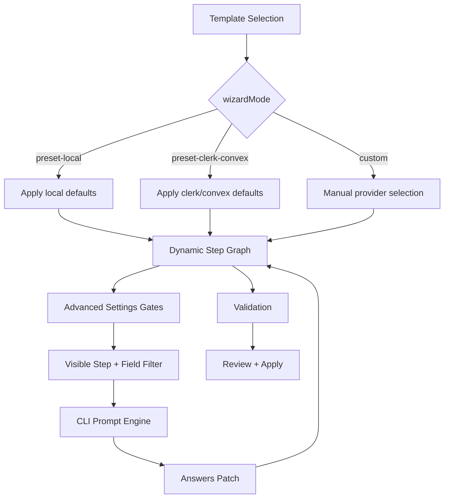

# OR3 Wizard UX Improvements — Technical Design

## Overview

This design improves the OR3 Cloud wizard UX by making flow decisions explicit and condition-aware:

1. Add a third template option (`custom`) with true manual provider selection.
2. Convert template options 1/2 into fast paths that skip redundant provider selection.
3. Introduce field-level visibility predicates to avoid irrelevant questions.
4. Align navigation, progress display, and validation with visible fields only.
5. Add per-section advanced settings gates so operators can skip non-essential prompts.

Target modules:

- `shared/cloud/wizard/types.ts`
- `shared/cloud/wizard/catalog.ts`
- `shared/cloud/wizard/steps.ts`
- `scripts/cli/or3-cloud.ts`
- `shared/cloud/wizard/validation.ts`
- tests under `tests/unit` and `tests/integration`

---

## Current Problems

- Template step currently sets defaults but still forces manual provider step.
- CLI prompt loop renders all fields in a step without field-level conditions.
- Validation still enforces limits numeric checks even when limits are disabled.
- Step/question counters do not account for dynamic visibility.

---

## Proposed Architecture



### Key principle

The wizard should use one source of truth for visibility:

- Step-level: existing `canSkip`
- Field-level: new `visibleWhen(answers)`

All UI behavior (prompting, counters, navigation) must consume these same visibility rules.

---

## Data Model Changes

### `WizardAnswers` additions

Add a mode discriminator:

```ts
export type WizardMode = 'preset-local' | 'preset-clerk-convex' | 'custom';

interface WizardAnswers {
  wizardMode: WizardMode;
  allAdvancedEnabled: boolean;
  baseAdvancedEnabled: boolean;
  authAdvancedEnabled: boolean;
  syncAdvancedEnabled: boolean;
  storageAdvancedEnabled: boolean;
  cloudAdvancedEnabled: boolean;
  // existing fields...
}
```

### Template options

Update preset step options to:

- `preset-local` (maps to preset defaults currently called `recommended`)
- `preset-clerk-convex` (maps to `legacy-clerk-convex` defaults)
- `custom`

Internal preset naming can remain unchanged for compatibility, but `wizardMode` drives flow behavior.

---

## Interface Changes

### Field visibility predicate

Extend `WizardField`:

```ts
export interface WizardField<TValue = unknown> {
  key: keyof WizardAnswers;
  type: WizardFieldType;
  label: string;
  // existing...
  tier?: 'core' | 'advanced';
  visibleWhen?: (answers: WizardAnswers) => boolean;
}
```

### Helper selectors

Add shared helpers (in CLI module or shared wizard util):

```ts
function isStepVisible(step: WizardStep, answers: WizardAnswers): boolean;
function getVisibleFields(step: WizardStep, answers: WizardAnswers): WizardField[];
function getVisibleSteps(steps: WizardStep[], answers: WizardAnswers): WizardStep[];
```

These helpers support consistent behavior for rendering, navigation, and counters.

---

## Step Graph Behavior

## 1) Template step

- Keep first step semantics but update copy to reflect true behavior.
- Selecting template updates:
  - `wizardMode`
  - provider defaults for mode 1/2

## 1.5) Advanced gates step

- Add a lightweight step that asks whether to configure advanced settings globally.
- If global advanced is off, ask optional per-section advanced toggles:
  - OR3 base
  - Auth provider
  - Sync provider
  - Storage provider
  - AI/Limits/Security
- If global advanced is on, all section advanced toggles are treated as enabled.

## 2) Provider selection step

- Entire `providers` step is skipped when `wizardMode` is preset-local or preset-clerk-convex.
- `providers` step remains for `wizardMode='custom'`.

## 3) Conditional fields

Use `visibleWhen` for:

- `themesToInstall`: only when `themeInstallMode === 'install-selected'`
- limits numeric + limits backend fields: only when `limitsEnabled === true`
- `forwardedForHeader`: only when `trustProxy === true`
- advanced fields: only when matching section advanced toggle is true

Provider detail steps continue to use `canSkip`, but provider fields can also use `visibleWhen` if needed.

### Suggested advanced field groups

- OR3 base: branding URLs, theme installation details
- Auth: optional TTL/tuning fields
- Sync: sqlite pragma/strict controls, convex self-hosted extras
- Storage: TTL/checksum/path-style/key-prefix/endpoint overrides
- AI/Limits/Security: limits backend internals, proxy internals, custom origins

---

## CLI Engine Changes

In `scripts/cli/or3-cloud.ts`:

1. Compute visible steps before each step iteration.
2. For each step, compute visible fields and iterate only those fields.
3. `/back` and `/next` operate over visible field list indexes.
4. If visible fields list is empty, auto-advance.
5. Progress UI:
   - `Step X of Y` from visible steps.
   - `Question A of B` from visible fields.

This avoids dead navigation paths and misleading counters.

Additionally:

6. For each section, prompt: “Configure advanced settings for this section?”
7. If skipped, apply defaults and continue without advanced prompts.

---

## Validation Updates

In `shared/cloud/wizard/validation.ts`:

- Gate limits numeric validation by `answers.limitsEnabled`.
- Preserve existing hard safety checks for enabled providers/features.
- Keep authoritative config-builder validation unchanged, but ensure derived env is coherent with gated fields.
- Validate effective defaults for skipped advanced settings instead of requiring manual advanced input.

---

## Backward Compatibility

- Existing presets (`recommended`, `legacy-clerk-convex`) remain valid.
- Existing API contracts (`apply`, `deriveEnvFromAnswers`, `deploy`) stay stable.
- Existing sessions without `wizardMode` can default to `preset-local` or inferred from `presetName` during normalization.

---

## Error Handling

- Invalid/unknown `wizardMode` values should fall back to `custom` with warning log in CLI.
- If visibility rules produce no actionable steps, wizard proceeds to review with summary.
- Navigation commands at boundaries should no-op safely with user feedback.

---

## Testing Strategy

### Unit tests

- `getWizardSteps()` with each `wizardMode`:
  - preset-local skips providers step
  - preset-clerk-convex skips providers step
  - custom includes providers step
- Field visibility tests for limits/theme/proxy conditions.
- Validation tests:
  - limits disabled -> no limits numeric errors
  - limits enabled -> existing numeric constraints still enforced
  - advanced disabled -> no advanced input required
  - advanced enabled -> advanced constraints still enforced

### Integration tests

- Dry-run wizard scenario for each mode:
  - verifies visible-step progression and patch application
- Navigation behavior:
  - `/next` and `/back` with hidden fields and skipped steps
  - advanced-on and advanced-off section flows

### Regression focus

- Ensure `deriveEnvFromAnswers()` output remains unchanged for equivalent answers.
- Ensure preset output contracts and provider modules still match expected values.

---

## Rollout Plan

1. Add type/model support (`wizardMode`, `visibleWhen`).
2. Add advanced section gates + defaults.
3. Add visibility helpers and migrate CLI prompt loop.
4. Update steps definitions and copy.
5. Update validation gating.
6. Add/adjust tests.
7. Verify with `bunx vitest`, `bunx nuxi typecheck`, and manual CLI dry-runs.
