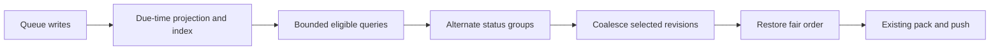

# Design

## Overview

Add one local due-time projection and index to `pending_ops`. Read eligible pending/retry streams, merge them fairly within the scan limit, coalesce revisions, then restore fair ordering before existing request packing.

## Architecture



| Component | Responsibility | Requirements |
| --- | --- | --- |
| Scheduling projection | Keep persisted due keys correct | R1, R4 |
| Eligible selector | Read bounded, already-due candidates | R1 |
| Fair merge | Share scan and request capacity between statuses | R2 |
| Existing coalescer and push pipeline | Preserve revision and transport semantics | R3 |
| Regression tests and mapped docs | Demonstrate and explain the contract | R1–R4 |

## Components and Interfaces

Use existing files and private helpers; add no configuration or public scheduler API.

```ts
// Local storage metadata on PendingOp; absent on old rows until migration.
readyAt?: number;

// Projection rule, evaluated at the Dexie write boundary:
// readyAt = nextAttemptAt ?? 0

// One private OutboxManager field:
nextStatus: 'pending' | 'retry_wait';
```

`readyAt = 0` preserves the existing meaning of an absent retry time: immediately eligible. Keep `createdAt` for ordering ties, not as an eligibility condition. Extend the existing creating/updating hook pattern in `app/db/derived-indexes.ts`; update the local-field comment in `shared/sync/types.ts`. Recompute from the effective committed row, including when `nextAttemptAt` is cleared, rather than trusting a supplied projection.

Within `OutboxManager.flush()`:

1. Preserve startup recovery, lifecycle guards, cooldown, and circuit-breaker checks. Capture `now` once before candidate selection. Recovery resets stale `syncing`/`in_flight` rows to `pending` with `nextAttemptAt` cleared (no positive scheduling time): their `readyAt` becomes `0`, restoring same-status FIFO via `(readyAt, createdAt, id)` instead of sorting after every fresh `readyAt = 0` row, which a sustained backlog would otherwise turn into permanent postponement. Alternating statuses cannot help when both sides are `pending`.
2. For each eligible status, query its index range with `readyAt <= now`, inclusive, then apply `scanLimit`. Each stream is ordered by `(readyAt, createdAt, id)`. Use full four-part numeric bounds (`[status, 0, 0, '']` to `[status, now, MAX_SAFE_INTEGER, '\uffff']`): a two-part prefix upper bound would exclude `readyAt == now` rows with later `createdAt`/`id`, and `Dexie.minKey`/`maxKey` sentinels do not survive `fake-indexeddb`.
3. Interleave the two streams, beginning with `nextStatus`, and stop at the existing combined scan limit. When one stream empties, use the other.
4. Run existing revision-based coalescing on that selected set. Delete only selected losers. Keep deferred and unselected rows intact.
5. Regroup the winners by their original status, order each group by the same scheduling key, and interleave again. This is essential: `coalesceOps()` currently sorts by creation time and would otherwise undo fairness.
6. Pass that order to the existing count/byte packer and push pipeline. Strip `readyAt` before both wire-size calculation and provider submission. Preserve the original persisted rows for lifecycle updates.
7. After a batch actually starts a push attempt, set `nextStatus` to the opposite of the last packed operation's original status. Preserve this turn across flushes; empty or gated flushes do not consume it. Initialize to `retry_wait`. This covers one-operation and byte-limited batches without reserving unused slots.
8. When a push returns `applied: false` with a server winner, apply the winner only when it is newer than the local materialized row/tombstone under `compareSyncRevision` (fail closed on ambiguous equal-clock ties; winner revision is read from its `clock`/`op_id` payload fields with the pushed stamp as fallback). Eligibility-first selection can push revision 1 while revision 3 stays deferred; the server winner (revision 2) must not overwrite local revision 3, which the surviving deferred row alone cannot restore. Acknowledge the pushed operation either way and keep deferred newer rows for later convergence. Apply the same guard to stale deletes.

Retain the queue-capacity hook using indexed counts of pending plus retry-wait rows; the ready candidate count is no longer a suitable proxy for total backlog. Do not materialize the whole queue for this count.

## Data Models

Append the next unused Dexie version in `app/db/client.ts`; version 16 is already present in uncommitted work. Preserve existing indexes and add:

```text
[status+readyAt+createdAt+id]
```

This index supports status-specific due ranges with deterministic ordering before limiting. Backfill `readyAt` transactionally using the same projection rule, without rewriting operation identity or retry state. Cover fresh databases, upgrades, and reopen. No new table or server schema is needed.

## Error Handling

Keep existing thrown-error handling, retry records, hooks, and circuit-breaker behavior. A failed migration must abort opening the upgraded database rather than clear its queue or fall back to an unbounded scan. Provider deferrals retain their existing schedule and attempt count; write hooks update the index in the same transaction. Preserve generation checks after asynchronous selection and before mutations/pushes.

## Testing Strategy

- **R1/R2 — decisive regression:** Use real `Or3DB` with fake IndexedDB in `outbox-manager.test.ts`. Keep at least 500 distinct pending rows before every explicit flush by replenishing successful rows. Put an already-due retry behind older pending work; assert its original operation ID reaches `provider.push` within two eligible flushes while pending remains full. Use a fixed clock and a small flush guard; do not test by merely draining a finite queue.
- **R1 — eligibility:** Put at least one full window of future-due rows ahead of a due row in each status's old ordering. Test missing times, exactly-now times, all-future, empty, and terminal-only queues. Verify indexed queries and bounded materialized results on real Dexie.
- **R2 — final packing:** Keep both statuses populated with distinct records. Test default sizing, `maxBatchSize: 1`, byte capacity for only one valid operation, and either group empty. Assert both groups progress without exceeding existing request limits.
- **R3 — revisions and lifecycle:** Extend existing same-record put/delete tests across pending/retry statuses and equal timestamps. Include a due older revision with a newer deferred revision: the deferred row must survive, retain its stamp, and remain eligible later. Retain all existing request, retry, reconciliation, stop/restart, and recovery tests.
- **R4 — persistence:** Extend `app/db/__tests__/derived-indexes.integration.test.ts` for backfill/reopen and add/put/bulkPut/update/modify transitions, including clearing retry time. Assert the new field never appears in provider requests. Keep test doubles limited to query mechanics; real Dexie proves index behavior.
- **Load:** Run the existing `sync:outbox:benchmark` once. Its finite-drain/coalescing check complements the sustained-backlog regression. No new benchmark framework or broad end-to-end suite is needed.
- **R1/R3 — review corrections:** Cover startup-recovery postponement (recovered `in_flight` rows under a full same-status window) and stale-winner overwrite (older due revision pushed while a newer revision stays deferred, server returns an intermediate winner). Assert the recovered operation progresses and the newer local state survives with its deferred row intact.

## Design Decisions

- Choose one derived due field over indexing optional `nextAttemptAt` directly, which would leave absent-time rows outside that index. Derivation at the write boundary avoids maintaining a second queue or patching every writer separately.
- Choose alternating statuses over pending-first, retry-first, or creation-time-only merging. Alternation protects both groups and remains useful when requests fit one operation.
- Preserve the existing bounded coalescing scope. Eligibility-first selection can send an older due revision while a newer revision remains deferred outside the selection; keep the newer row and rely on the existing total revision comparison for convergence. Do not introduce global sibling scans or change stamps to compensate.

## Risks & Mitigations

- **Schema work overlaps existing edits:** choose the version at implementation time and make additive edits only.
- **Fairness disappears after selection:** re-interleave after coalescing and test the actual provider request order under count and byte limits.
- **Rows become invisible after updates:** share the projection rule between migration and write hooks; test all used write forms on real Dexie.
- **Coalescing changes identity or drops newer work:** preserve `compareSyncRevision` and explicitly test deferred siblings and equal-time put/delete sequences.
- **Stale winner overwrites newer local state:** eligibility-first selection can push an old revision while a newer one stays deferred; guard `applyRemoteWinner` (and stale deletes) with `compareSyncRevision` against the local row/tombstone, fail closed on ambiguous ties, and test that the newer state plus its deferred row survive.
- **Recovered work starves under a sustained backlog:** stamping recovery with `now` sorts recovered rows after all fresh `readyAt = 0` rows; clear the scheduling time instead and test recovery progress with the pending window held full.
