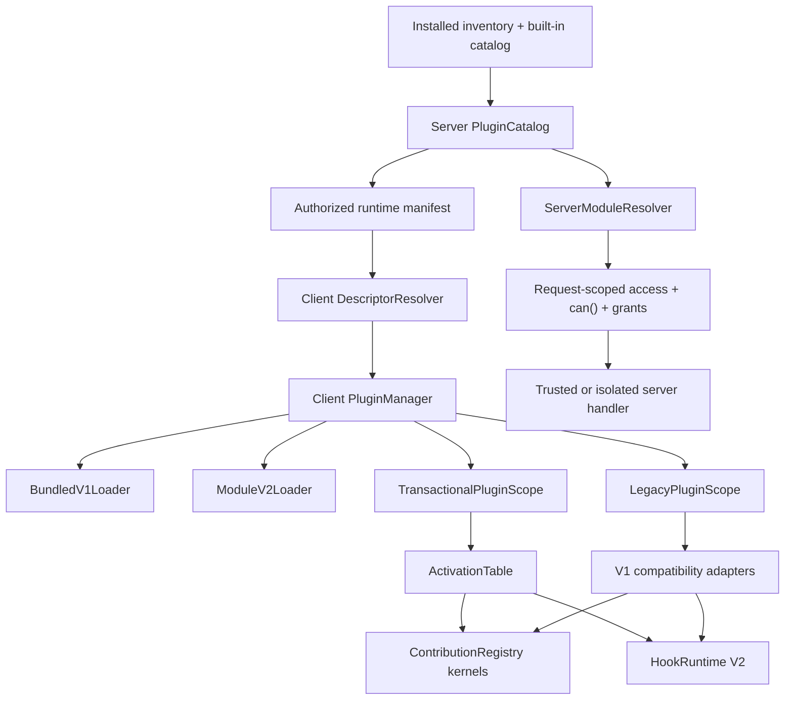

# Design

## Overview

Plugin Runtime V2 is a strangler migration around the current Nuxt and workspace plugin systems. Public V1 entrypoints remain in place and delegate to compatibility adapters. New internal ownership is introduced first, then registry and hook kernels, and only afterward the V2 manifest, SDK, post-build loader, and isolation modes.

Compatibility takes precedence over making V1 appear fully transactional. V1 workspace API registrations remain immediately visible, V1 cleanup preserves FIFO invocation and concurrent thenable settlement, and direct global imports are labeled `legacy-global-possible`. V2 SDK plugins use a separate transactional lifecycle: records are staged invisibly, validated and pre-activated, then made visible across hooks and registries through one synchronous generation-pointer swap.

The client and server have different ownership boundaries. A client `PluginManager` owns workspace-scoped UI activation. A server `PluginCatalog` resolves packages and descriptors, while a digest-keyed `ServerModuleResolver` caches trusted code globally and creates request-scoped authorized contexts. The client manager never authorizes server execution.

## Architecture



The migration path is:

```text
V1 imports / Nuxt auto-imports / register(api)
                    |
                    v
        exact compatibility facades
                    |
                    v
      legacy profiles over new kernels

V2 package -> SDK context -> hidden stage -> validate/pre-activate
           -> one active-generation swap -> visible contributions/hooks
```

### Components

| Component | One responsibility | Requirements |
|---|---|---|
| Compatibility Ledger | Record and gate every observable V1 contract by surface | R1, R9 |
| Generated bundled catalog | Bind V1 plugin IDs/module keys to the executable host build | R1, R2, R7 |
| Server `PluginCatalog` | Resolve installed artifacts and authorized desired descriptors | R2, R6, R7 |
| Client `DescriptorResolver` | Validate manifest response and compare canonical descriptor keys | R2 |
| Client `PluginManager` | Serialize discover/start/replace/stop/retry and publish runtime status | R2, R3, R9 |
| `LegacyPluginScope` | Track mediated V1 resources while preserving immediate registration and cleanup profile | R1, R3 |
| `TransactionalPluginScope` | Stage, validate, pre-activate, publish, roll back, and dispose V2 resources | R3, R4 |
| `ActivationTable` | Atomically select the one visible managed generation for a plugin | R3, R4, R5 |
| `ContributionRegistry` | Store owned contribution records and project visible snapshots | R4 |
| Surface adapters | Preserve each registry's V1 schema, order, normalization, cache, reactivity, and API shape | R1, R4 |
| `HookRuntime V2` | Execute compatible plans, scoped callbacks, and bounded metrics behind old facades | R1, R5 |
| `BundledV1Loader` | Load host-build-captured V1 modules with existing fallbacks | R1, R7 |
| `ModuleV2Loader` | Load verified digest-addressed V2 browser module graphs | R6, R7 |
| `ServerModuleResolver` | Cache code by digest and create request-scoped authorized handler context | R2, R6, R7 |
| Package store | Retain immutable artifacts and crash-safe per-plugin active pointers | R7, R10 |
| `@or3/plugin-sdk` | Provide stable V2 contracts and conformance tooling | R6, R10 |
| Isolated runtimes | Enforce client/server grants outside the trusted host context | R8 |

## Components and Interfaces

### Descriptor and artifact identity

Bundled and runtime packages cannot share one misleading `packageDigest` requirement. A bundled module's executable bytes are tied to the host build, even if files under `extensions/plugins` later change on disk.

```ts
type Sha256 = `sha256-${string}`;

type PluginArtifactIdentity =
    | {
          kind: 'bundled-v1';
          hostBuildId: string;
          moduleKey: string;
          rebuildRequired: true;
      }
    | {
          kind: 'package-v2';
          packageDigest: Sha256;
          clientEntry?: string;
          serverRoutes: readonly ResolvedServerRoute[];
      };

interface PluginDescriptor {
    readonly id: string;
    readonly version: string;
    readonly manifestVersion: 1 | 2;
    readonly pluginApiVersion: string;
    readonly source: 'builtin' | 'extension' | 'package';
    readonly trust: 'trusted-host' | 'isolated-client' | 'isolated-server';
    readonly workspaceId: string;
    readonly policyRevision: string;
    readonly grantsRevision: string;
    readonly resolvedDependencyKeys: readonly string[];
    readonly artifact: PluginArtifactIdentity;
    readonly descriptorKey: Sha256;
}
```

`descriptorKey` is produced from canonical JSON with recursively sorted object keys and stable array rules. It covers all identity fields above. A Nuxt build step generates a bundled-plugin catalog containing `hostBuildId`, plugin ID, and exact `import.meta.glob` module key; both server catalog resolution and the client loader consume that generated source. The server supplies the resulting key and the client recomputes/verifies it before comparison. A post-build disk plugin absent from the generated catalog is therefore honestly reported as rebuild-required instead of being assigned an executable identity the client does not have.

For `bundled-v1`, `hostBuildId + moduleKey` is the executable identity. A disk manifest/version change may change desired metadata, but the manager reports `rebuild-required` rather than pretending to load new code. Same-version/new-digest hot replacement is a V2 package capability introduced with `ModuleV2Loader`, not a Milestone 3 promise.

### Runtime state machine

```ts
type PluginRuntimeStatus =
    | 'discovered'
    | 'verified'
    | 'blocked'
    | 'preparing'
    | 'activating'
    | 'active'
    | 'stopping'
    | 'failed'
    | 'quarantined';

interface PluginRuntimeRecord {
    descriptor: PluginDescriptor;
    desired: 'active' | 'inactive';
    status: PluginRuntimeStatus;
    generation: number;
    lifecycleCoverage: 'managed-v2' | 'managed-v1-api' | 'legacy-global-possible';
    loader: 'bundled-v1' | 'module-v2' | 'isolated-client';
    startedAt?: number;
    stoppedAt?: number;
    failureCount: number;
    lastError?: SerializedPluginError;
    nextRetryAt?: number;
    contributionCount: number;
    hookCount: number;
}
```

Legal transitions are implemented as pure functions and tested exhaustively. `blocked` means verification/access prevented import. `failed` means this activation attempt failed. `quarantined` is keyed to the descriptor key, so installing a different verified digest is not permanently poisoned by the prior artifact.

The manager serializes reconciles. A new desired-state revision aborts the previous generation, but only the current reconcile may publish status or visibility. Stop is idempotent. There is no mid-session kernel switch: a flag change is applied on reload before discovery.

### Lifecycle profiles

The design intentionally has two profiles.

**V1 compatibility profile**

1. Create a `LegacyPluginScope`.
2. Call `plugin.register(api)` using immediate V1 surface adapters.
3. Track handles returned by the passed API and callbacks passed to `onCleanup`.
4. If registration fails, dispose tracked resources; externally visible contributions may have existed transiently.
5. On stop, invoke cleanups in current FIFO registration order, collecting returned thenables without serializing their invocation.
6. Await `Promise.allSettled` behind an overall compatibility timeout before replacement.
7. Report `legacy-global-possible` because direct registry imports, direct hooks, timers, DOM listeners, and arbitrary side effects cannot be proven owned.

This preserves the observable order/concurrency of `createWorkspacePluginApi()` while fixing replacement overlap. A timeout produces a degraded stop; it does not deadlock all reconciliation.

**V2 transactional profile**

1. Create a hidden owner token and `TransactionalPluginScope`.
2. Run setup only against SDK services that stage records/resources.
3. Validate all staged records, grants, conflicts, settings compatibility, and dependencies.
4. Run pre-activation callbacks while the previous generation remains visible.
5. Insert staged records as hidden.
6. Synchronously compare-and-swap `ActivationTable[pluginId]` from the expected old owner to the new owner.
7. Mark active, synchronously abort the old generation's mediated resources, and then await old-generation disposal.

If steps 1-5 fail, the old owner never changes. If the compare-and-swap fails because a newer reconcile won, new hidden records are removed. If a synchronous failure occurs after the swap, the pointer is restored before removal. Post-publication notifications are non-transactional health events and cannot turn a successful publication into a hidden partial rollback.

```ts
interface ActivationTable {
    current(pluginId: string): symbol | undefined;
    publish(input: {
        pluginId: string;
        expected: symbol | undefined;
        next: symbol;
    }): boolean; // synchronous CAS
}

interface TransactionalPluginScope {
    readonly owner: symbol;
    readonly signal: AbortSignal;
    readonly state: 'open' | 'prepared' | 'published' | 'disposed';
    validate(): Promise<Result<void, PluginPreparationError>>;
    preActivate(): Promise<Result<void, PluginActivationError>>;
    publish(expectedOwner?: symbol): Result<void, StaleGenerationError>;
    rollback(reason?: unknown): Promise<CleanupReport>;
    dispose(): Promise<CleanupReport>;
}
```

### Contribution kernel and surface profiles

```ts
interface ContributionRecord<T> {
    readonly id: string;
    readonly owner: symbol;
    readonly pluginId?: string;
    readonly generation?: number;
    readonly sequence: number;
    readonly visibility: 'legacy-visible' | 'managed';
    readonly value: T;
    readonly registeredAt: number;
}

interface ContributionRegistry<T, TContext = void> {
    stage(owner: symbol, values: readonly T[]): Result<void, RegistryValidationError>;
    registerLegacy(value: T): InternalRegistrationHandle;
    removeOwner(owner: symbol): number;
    get(id: string, context: TContext): T | undefined;
    snapshot(context: TContext): readonly T[];
    inspect(): readonly ContributionRecord<T>[];
    subscribe(listener: () => void): () => void;
}
```

Managed snapshots include only records whose owner is current in `ActivationTable`. Legacy records remain immediately visible. Registry storage and the reactive projection both live in the HMR-persistent global kernel; creating a new adapter must not create a new `shallowRef` over an old global `Map`.

The compatibility ledger starts with these distinct profiles:

| Surface family | Frozen behavior that adapter must retain |
|---|---|
| Shared `createRegistry` actions | Replace by ID, shallow freeze, HMR-global map, default order 200, tie by ID, exact-owner handle where currently returned |
| Sidebar pages | Client no-op on server, Zod validation, async component retry/timeout, `markRaw`, default order 200, order-only stable sort, disposer return, access filtering |
| Pane apps | Zod validation, `markRaw`, default order 200, order-only stable sort, exact-owner handle |
| Dashboard/plugins/pages | Shallow freeze, inline-page replacement, page/component caches, cache invalidation, access-policy merge, order-only stable sort, navigation state behavior |
| Editor nodes/marks/extensions | Existing stored value identity, order/ID sorting, factory/lazy-load failure handling |
| Admin pages/widgets | Default order 0, replace-in-place array position, loaded-once behavior, 50-entry async component cache |
| Client tools | Reject duplicate unless override, `RegisteredTool` return, refs/watchers, `or3.tools.enabled`, runtime hints, schema validation, timeout/result limits |
| Server tools | Existing disposer function, duplicate/override rules, request definition parity, timeout/result limits |

Facade functions retain their current declared returns. If a V1 function returns `void`, its internal handle is attached to the active compatibility scope when called through the passed API; the exported facade still returns `void`.

### Hook Runtime V2

The legacy policy is explicit:

```ts
const LEGACY_HOOK_POLICY = {
    actionMode: 'series',
    errorPolicy: 'continue',
    filterMode: 'series',
    timeoutMs: null,
    syncThenablePolicy: 'reject-and-continue',
} as const;
```

Compatibility also includes behavior not captured by that policy:

- Exact and wildcard matches are merged, then sorted by priority and global registration sequence.
- Exact `remove*` removes every matching function at the requested priority; wildcard removal preserves the frozen V1 behavior.
- `has*` continues returning `false | true | priority` according to its current arguments.
- Filter exceptions/rejected promises retain the previous filter value.
- Sync thenables record an error and do not change the filter value.
- Nested dispatch preserves the priority stack.
- Client singleton, request-local SSR, and server/admin engine lifetimes remain distinct.
- `acceptedArgs` remains accepted with its current no-op semantics.

V2 stores sorted exact arrays at registration time and a generation for wildcard records. A bounded LRU caches plans by `{kind, hookName, exactGeneration, wildcardGeneration, activationRevision}`. A publication changes only `activationRevision`; registration changes invalidate the affected exact key or wildcard generation.

New diagnostics use counters plus a 128-sample ring per configured metric series. Metric-series cardinality is capped at 2,048 with an overflow aggregate, and the plan cache defaults to 1,024 resolved plans. All three numbers are constants covered by memory tests. The old `_diagnostics` object is an adapter over these metrics: reads return bounded arrays/counters, assignment of `{}` resets the relevant legacy projection, and `callbacks()` retains its current result. New code uses immutable `diagnostics.snapshot()` and `diagnostics.reset()`.

### Dependency resolution

V2 dependencies are resolved from verified descriptors before any plugin code imports. Required dependency ranges must select exactly one eligible descriptor; optional dependency absence is recorded as a negotiated feature rather than a failure. A deterministic graph pass returns either a topological activation order or a cycle path. Reconcile prepares dependencies before dependents and stops dependents before dependencies. The resolved dependency descriptor keys are part of the dependent's descriptor key, so changing a dependency generation forces an explicit dependent reconcile instead of leaving a stale service binding.

### Package store and loaders

```text
extensions/
  plugins/                         # unchanged V1 source/build layout
  .store/<plugin-id>/<sha256>/     # immutable V2 package trees
  .active/<plugin-id>.json         # atomic current/candidate/previous pointer
  .state/<plugin-id>.json          # non-secret install/quarantine metadata
  .locks/<plugin-id>.lock          # advisory operation lock
```

The host calculates a canonical tree digest after safe extraction. Paths are normalized and sorted; symlinks, traversal, device files, duplicate normalized paths, and case-fold collisions are rejected. The digest covers path, mode class, length, and bytes. To avoid a self-referential manifest digest, `integrity.package` is omitted from the manifest's canonical digest representation; a detached expected digest supplied by the installer/signature is preferred.

Each active pointer is per plugin ID to avoid unrelated update contention. It includes schema version, current digest, optional candidate digest, previous digest, manifest digest, activation timestamp, and state compatibility. Installing an update records an immutable candidate without changing current. Verification, server dry-run, state preflight, and a designated client hidden-preparation canary run against that candidate. Only a passing candidate may be promoted. Pointer update is temp-write, flush, atomic rename, and directory flush where supported. Startup validates pointers and chooses only a complete immutable tree; partial staging directories are ignored and later garbage-collected.

Candidate promotion is atomic only for persisted package selection, not for every connected browser. Promotion acquires the plugin lock, snapshots or transactionally protects host-managed state, applies any approved migration, and swaps the pointer; a failure before the pointer swap restores state. Clients then reconcile independently. A client that cannot activate the promoted descriptor may retain its previous local generation only when API/state compatibility says that is safe, and reports a client-scoped failure. The admin UI does not call this a fleet-wide atomic activation.

`ModuleV2Loader` serves the entire validated relative module/asset graph beneath a digest-addressed same-origin URL. The packer rejects private aliases and unresolved bare imports outside a small versioned host-ABI allowlist. A build-generated host runtime facade and predeclared import map resolve that allowlist (initially `vue` and `@or3/plugin-sdk`) to chunks from the host's own Vite module graph. The manifest binds the expected host ABI/build range. A production feasibility gate must prove Vue identity/reactivity, SDK identity, component rendering, HMR-independent production loading, and CSP behavior; the loader may not fall back to bundling a second Vue copy. If the facade cannot meet the gate, arbitrary trusted-host Vue UI stays rebuild-required and post-build UI uses the isolated/declarative path instead.

The asset route sets explicit JavaScript/content MIME types, `nosniff`, CSP-compatible same-origin behavior, and immutable private caching. Access is checked before the manager chooses to import; cached bytes are not considered revocable authority.

Trusted server route modules are cached by `{pluginId, digest, handlerPath}`. Every request still performs plugin access gating and `can()` before resolving/executing the handler. The host constructs the request context; modules do not reuse workspace identity captured at import time.

### Feature flags and rollout

```ts
interface PluginRuntimeFlags {
    pluginRuntimeV2Enabled: boolean;
    pluginRuntimeV2WorkspaceIds?: readonly string[];
    pluginContributionV2Surfaces?: readonly ContributionSurfaceId[];
    hookEngineV2Enabled: boolean;
    pluginModuleLoaderV2Enabled: boolean;
    pluginIsolationEnabled: boolean;
    disableNonCorePlugins: boolean;
}
```

Flags are read before discovery. `pluginContributionV2Surfaces` is an allowlist so one migrated adapter can be rolled back without reverting every registry. A flag is never switched live after plugin code has executed.

Promotion order is fixed:

1. Contract tests only.
2. Shadow manager with V1 loader still authoritative.
3. Manager canary using only `BundledV1Loader` and V1 compatibility scope.
4. One registry surface at a time.
5. Hook engine independently.
6. V2 manifest/SDK fixtures.
7. Module loader and immutable package store.
8. Isolation modes.

No promotion combines the manager, hook engine, and module loader defaults in one release. Safe mode is a boot-time environment/config choice evaluated before non-core discovery, so it remains usable during a plugin-induced boot loop.

## Data Models

The lifecycle-first manager requires no new Dexie or sync tables. Its client status and in-session quarantine are memory state keyed by descriptor key. The server runtime manifest remains authoritative for desired load state and gains descriptor/artifact fields additively.

Milestone 7 introduces only server-local package metadata:

```ts
interface ActivePluginPointerV1 {
    schemaVersion: 1;
    pluginId: string;
    currentDigest: Sha256;
    candidateDigest?: Sha256;
    previousDigest?: Sha256;
    manifestDigest: Sha256;
    activatedAt: string;
    state: {
        schemaVersion: number;
        backwardReadableFrom: readonly number[];
        downgradeSupported: boolean;
    };
}
```

Secrets never enter pointer or status files. Reviewed grants remain in the authoritative workspace/admin settings backend and are represented in descriptors only by normalized values plus `grantsRevision`.

V2 host-managed plugin settings are namespaced by plugin ID and workspace. A migration declares source/target versions and runs inside the underlying store's transaction, or against a restorable snapshot when the store cannot transact. Disable never deletes the namespace. Uninstall data deletion is a separate explicit operation.

## Error Handling

Errors cross manager/loader/registry boundaries as structured results with stable codes. Unexpected throws are caught at the boundary and converted once.

| Failure | Behavior |
|---|---|
| Runtime manifest fetch fails | Keep the current generation, report stale desired state, retry with bounded backoff; do not unload healthy plugins from an unknown response |
| Access/enablement authoritatively revoked | Abort preparation, stop the active managed generation, retain data, and block future imports |
| Bundled metadata changes without host build | Report `rebuild-required`; do not claim a code update |
| V1 register throws | Dispose mediated immediate registrations, record possible transient exposure, keep unrelated plugins running |
| V1 cleanup throws/rejects | Continue invoking/settling all cleanups, record each error, wait only to the compatibility deadline |
| V1 cleanup times out | Abort mediated resources, mark degraded stop, avoid hot replacement when lifecycle coverage is incomplete, offer reload/safe mode |
| V2 setup/validation/pre-activation fails | Remove hidden records and resources; old visibility pointer remains unchanged |
| V2 publication loses generation CAS | Remove losing hidden records; do not modify the winner |
| V2 post-publication notification fails | Record degraded health; do not pretend an async callback can make publication atomic |
| Package digest/engine/grant/dependency check fails | Mark blocked before import with machine-readable reasons; dependency cycles include the cycle path |
| Candidate verification/dry-run/canary fails | Leave current pointer/state untouched and retain candidate diagnostics for inspection/removal |
| Pointer write/process crash | On restart accept only a complete atomic pointer to a verified immutable tree; otherwise retain/recover previous |
| Server handler import fails | Return a sanitized 5xx, attribute failure to digest/handler, preserve authorization ordering |
| State migration or downgrade preflight fails | Leave package pointer and prior generation unchanged; restore protected state if promotion began; show rollback limitation before confirmation |
| Safe mode | Skip non-core discovery before any non-core module import |

## Testing Strategy

### Compatibility qualification

- Snapshot public `.d.ts` exports and generated Nuxt auto-import declarations. Treat removed paths, narrower inputs, or changed V1 returns as failures (R1.AC1-R1.AC2).
- Compile every repository example plus immutable fixtures derived from every maintained external V1 plugin. Fixtures cover explicit imports and Nuxt auto-import usage (R1.AC10, R9.AC6).
- Build a compatibility ledger per surface before its adapter exists. Golden tests capture values, object identity/freeze behavior, defaults, validation, duplicate replacement, order/ties, number/timing of reactive notifications, SSR no-op, HMR persistence, cache invalidation, access gating, and preference keys (R1.AC5, R4.AC4, R4.AC8).
- Run differential tests against fresh V1 and V2-adapter instances in test processes. Production never dual-executes callbacks (R5.AC7).
- Preserve `_diagnostics`, removal asymmetries, `has*`, nested priority, sync thenables, filter-error prior values, and once behavior in a dedicated hook conformance suite (R1.AC3-R1.AC7, R5.AC9).

### Lifecycle and state-machine tests

- Property-test legal transitions, idempotent stop, retry/quarantine keying, and generation CAS (R2, R3).
- Fault-inject manifest races at fetch/import/register/validate/pre-activate/publish/cleanup and assert stale generations publish nothing (R2.AC7, R3.AC8).
- Verify V1 FIFO invocation with concurrently settling promises and V2 sequential LIFO cleanup separately (R3.AC4, R3.AC6).
- Verify a V1 failure removes mediated records but is labeled non-atomic; verify V2 failure never changes the visible owner (R3.AC3, R3.AC5, R4.AC2).
- Exercise built-in/extension same-ID replacement, extension removal, unrelated-plugin failure isolation, policy/grant changes, and workspace switch (R1.AC9, R2).

### Integration and production tests

- Run `bun run test` and `bun run type-check` for each milestone.
- Run `bun run build` with SSR plugin features enabled and `bun run generate:static` with them disabled before promotion (R1.AC8, R7.AC9).
- Use a real production build to install, enable, load, update, disable, and roll back one bundled V1 fixture and one V2 package fixture (R7).
- In that production build, assert that allowed host ABI imports resolve through the generated facade/import map, Vue/SDK identity is compatible with the host graph, and CSP permits no broader source than designed (R7.AC11).
- Exercise full relative client import graphs/assets, MIME/CSP behavior, bad paths, symlinks, case collisions, missing files, and private aliases (R7.AC2-R7.AC4).
- Kill the process after extract, verify, pointer temp-write, rename, state preflight, and activation; recovery must select a complete known-good state (R7.AC5, R7.AC8, R10).
- Test server route authorization before import, read/write defaults, non-weakenable overrides, digest reload, and request-context separation between workspaces (R2.AC6, R6.AC7, R7.AC7).
- When isolation ships, run adversarial DOM/global/network/fs/env/resource-limit and revoked-grant cases (R8).

### Performance and memory

Milestone 0 commits benchmark fixtures and budgets for exact actions (0/1/10/100/1,000 callbacks), filter chains, 0/10/100/1,000 wildcards, single and 100-record registry commits, 100-plugin reconcile, 1,000 enable/disable cycles, and long-session diagnostics. Initial budgets are relative to the stored median on the same runner: V1 facade hot paths at or below 110% for exact/registry operations and 115% for wildcard/reconcile operations. A budget adjustment requires a reviewed benchmark record, not an inline test change.

Plan cache entries are capped at 1,024, recent timing samples at 128 per metric series, and metric-series cardinality at 2,048 with an overflow aggregate by default. Tests assert the caps after high-cardinality/long-session workloads and assert zero managed records for disabled plugins (R5.AC4, R5.AC6, R9.AC7).

## Design Decisions

1. **Preserve V1 semantics instead of forcing V2 semantics through old APIs.** V1 immediate publication and cleanup ordering are observable. Full staging and sequential LIFO cleanup are restricted to V2 SDK code.
2. **Use a single activation pointer for V2 atomicity.** Committing each registry sequentially is not atomic across surfaces. Hidden records plus one owner CAS make hooks and UI select the same generation without a distributed rollback protocol.
3. **Use discriminated artifact identity.** A bundled module is identified by host build/module key; only a verified runtime package is identified by package digest. This prevents false same-version hot-reload promises.
4. **Keep exact V1 return types and a diagnostics facade.** Adding a handle where an API declared `void`, or removing mutable `_diagnostics`, can break TypeScript and documented consumers. New capabilities use additive SDK/internal methods.
5. **Separate client activation from server code caching.** Workspace-scoped client state must not create globally cached server modules that capture one workspace's authority.
6. **Use per-plugin pointer files and locks.** Updates to unrelated plugins do not need a global `active.json` contention/failure domain.
7. **Make data compatibility part of rollback.** Immutable code alone does not make rollback safe after a settings/storage migration.
8. **Select kernels only at boot.** Live flag switching risks duplicate callbacks and mixed ownership; reload/restart is the explicit rollback boundary.
9. **Use a build-generated host ESM facade, with a kill gate.** Post-build trusted UI may externalize only a tiny host ABI resolved to the host Vite graph. If production singleton/CSP tests fail, the feature remains blocked instead of shipping a duplicate Vue runtime.

## Risks & Mitigations

| Risk | Mitigation |
|---|---|
| Unknown external V1 behavior is absent from repository tests | Build and require a maintained, immutable external compatibility corpus before default-on promotion; keep V1 facades and loaders for the full V2 line |
| Direct V1 imports and arbitrary side effects escape ownership | Preserve execution, label `legacy-global-possible`, avoid atomic/unload claims, require reload for unsafe replacement, and offer pre-discovery safe mode |
| Registry migration changes subtle Vue/UI behavior | Freeze a per-surface ledger including object identity, reactive notification counts, component/cache behavior, and migrate behind a surface allowlist |
| Package rollback restores code that cannot read migrated state | Require state compatibility metadata and preflight; snapshot/transaction migrations; disable one-click rollback without a tested down-migration |
| Browser-native V2 modules resolve a second Vue copy or incompatible SDK runtime | Require a production host-ABI facade/import-map spike and singleton identity tests before ModuleV2Loader UI work; otherwise keep trusted Vue UI rebuild-required and use isolation/declarative UI |
