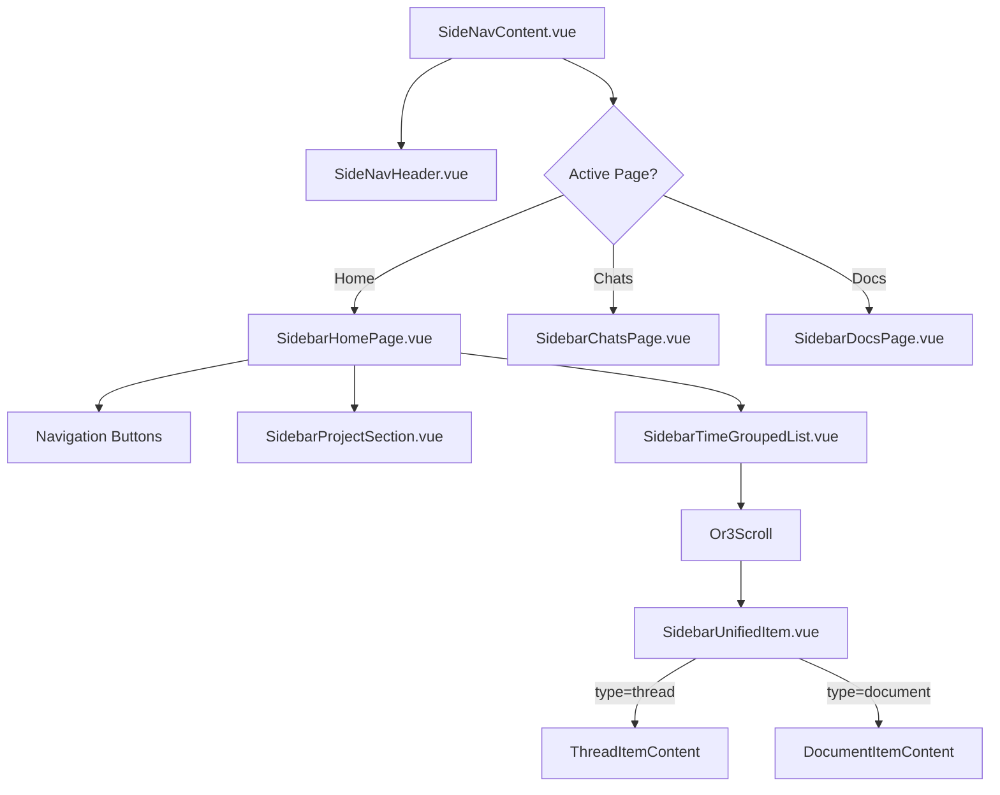

# Sidebar Homepage Rework - Technical Design

## Overview

This document details the technical implementation for the sidebar homepage rework. The primary goals are:
1. Replace `virtua` Virtualizer with `or3-scroll` for reliable virtualization
2. Implement time-based grouping of mixed threads/documents
3. Add sub-page navigation (Chats Only, Docs Only)
4. Optimize performance through pagination and lightweight data structures

---

## UI/UX Requirements

### Touch Targets
- **Minimum touch target:** 44x44px (WCAG/Apple HIG)
- Item row height: 56px (meets requirement)
- Action button: 16x16 visual, **40x40+ hit area** via padding
- Section headers: 44px height

### Mobile Layout (<280px width)
Switch to stacked layout to prevent truncation:
```
Desktop:                        Mobile:
┌─────────────────────────┐    ┌──────────────────┐
│ [icon] Title    2:14 PM │    │ [icon] Title [•] │
│        Chat      [•••]  │    │        2:14 PM   │
└─────────────────────────┘    └──────────────────┘
```

### Required States
- **Empty state:** Per-page empty message with CTA
- **Loading state:** Skeleton items during pagination
- **Search no-results:** "No results for '[query]'"
- **Active item:** Auto-scroll into view when opened externally

### Navigation Pattern
Use segmented control instead of separate buttons:
```
[ All ] [ Chats ] [ Docs ]
```

---

## Architecture

> See [architecture.md](./architecture.md) for detailed diagrams.



---

## Core Components

### 1. SidebarHomePage.vue (Modified)

**Current State:** Renders `SidebarVirtualList` with virtua Virtualizer.

**New Design:**
- Remove `SidebarVirtualList` component reference
- Add navigation buttons for "Chats" and "Docs" sub-pages
- Render `SidebarProjectSection` for projects
- Render `SidebarTimeGroupedList` for unified thread/document list

```typescript
// New structure
interface SidebarHomePageProps {
  projects: SidebarProject[];
  expandedProjects: string[];
  activeThreadIds: string[];
  activeDocumentIds: string[];
  // ...other existing props
}

// Navigation handler
function navigateToChats() {
  setActivePage('sidebar-chats');
}

function navigateToDocs() {
  setActivePage('sidebar-docs');
}
```

---

### 2. SidebarTimeGroupedList.vue (New Component)

Replaces `SidebarVirtualList` for the homepage. Uses `or3-scroll` and groups items by time.

```typescript
import { useIcon } from '~/composables/useIcon';
import { useThemeOverrides } from '~/composables/useThemeResolver';

interface TimeGroupedListProps {
  items: UnifiedSidebarItem[];
  activeThreadIds: string[];
  activeDocumentIds: string[];
}

interface UnifiedSidebarItem {
  id: string;
  type: 'thread' | 'document';
  title: string;
  updatedAt: number; // timestamp in seconds
  // Thread-specific
  forked?: boolean;
  // Document-specific  
  postType?: string;
}

// Time groups - simplified, no "recentlyOpened" (requires session tracking)
type TimeGroup = 
  | 'today'
  | 'yesterday'
  | 'earlierThisWeek'
  | 'thisMonth'
  | 'older';

function computeTimeGroup(timestamp: number): TimeGroup {
  const now = Date.now() / 1000;
  const todayStart = getStartOfDay(now);
  const yesterdayStart = todayStart - 86400;
  const weekStart = getStartOfWeek(now);
  const monthStart = getStartOfMonth(now);
  
  if (timestamp >= todayStart) return 'today';
  if (timestamp >= yesterdayStart) return 'yesterday';
  if (timestamp >= weekStart) return 'earlierThisWeek';
  if (timestamp >= monthStart) return 'thisMonth';
  return 'older';
}

// Local state - no SidebarEnvironment extension needed
const collapsedGroups = ref<Set<TimeGroup>>(new Set());

function toggleGroup(group: TimeGroup) {
  if (collapsedGroups.value.has(group)) {
    collapsedGroups.value.delete(group);
  } else {
    collapsedGroups.value.add(group);
  }
}
```

**Template Structure:**
```vue
<template>
  <div class="flex flex-col h-full">
    <Or3Scroll
      ref="scroller"
      :items="flattenedItems"
      :item-key="(item) => item.key"
      :estimate-height="56"
      :overscan="200"
      class="flex-1"
      @reachBottom="loadMore"
    >
      <template #default="{ item }">
        <!-- Section Header -->
        <SidebarGroupHeader
          v-if="item.type === 'header'"
          :label="item.label"
          :collapsed="collapsedGroups.has(item.groupKey)"
          @toggle="toggleGroup(item.groupKey)"
        />
        <!-- Unified Item -->
        <SidebarUnifiedItem
          v-else
          :item="item"
          :active="isActive(item)"
          :time-display="getTimeDisplay(item)"
          @select="handleSelect(item)"
          @rename="handleRename(item)"
          @delete="handleDelete(item)"
          @add-to-project="handleAddToProject(item)"
        />
      </template>
    </Or3Scroll>
  </div>
</template>
```

---

### 3. SidebarUnifiedItem.vue (New Component)

A single component that renders both thread and document items with consistent layout.
Follows existing patterns: `useThemeOverrides`, `useIcon`, `usePopoverKeyboard`, plugin actions.

```typescript
import { useIcon } from '~/composables/useIcon';
import { useThemeOverrides } from '~/composables/useThemeResolver';
import { usePopoverKeyboard } from '~/composables/usePopoverKeyboard';

interface UnifiedItemProps {
  item: UnifiedSidebarItem;
  active: boolean;
  timeDisplay: string; // "2:14 PM" | "Monday" | "Jan 5"
}

const { handlePopoverTriggerKey } = usePopoverKeyboard();

// Icons via useIcon (themeable)
const iconChat = useIcon('sidebar.chat');
const iconNote = useIcon('sidebar.note');
const iconMore = useIcon('ui.more');
const iconEdit = useIcon('ui.edit');
const iconTrash = useIcon('ui.trash');
const iconFolder = useIcon('sidebar.new_folder');

// Theme overrides for icon container
const iconContainerProps = computed(() => {
  const overrides = useThemeOverrides({
    component: 'div',
    context: 'sidebar',
    identifier: `sidebar.unified-item.icon.${props.item.type}`,
    isNuxtUI: false,
  });
  return {
    class: props.item.type === 'thread' ? 'bg-primary/15' : 'bg-[var(--md-secondary)]/15',
    ...overrides.value,
  };
});

// Theme overrides for action buttons (reuse existing pattern)
const actionButtonProps = computed(() => {
  const overrides = useThemeOverrides({
    component: 'button',
    context: 'sidebar',
    identifier: `sidebar.unified-item.action`,
    isNuxtUI: true,
  });
  return {
    color: 'neutral' as const,
    variant: 'popover' as const,
    size: 'sm' as const,
    ...overrides.value,
  };
});

// Plugin actions - reuse existing composables
const extraActions = computed(() => {
  return props.item.type === 'thread'
    ? useThreadHistoryActions()
    : useDocumentHistoryActions();
});
```

**Template Layout:**
```vue
<template>
  <RetroGlassBtn
    class="w-full flex items-center gap-3 px-2 py-2 group"
    :class="{ 'active-element bg-primary/25 ring-1 ring-primary/50': active }"
    @click="emit('select', item.id)"
  >
    <!-- Icon with background (themeable) -->
    <div 
      class="shrink-0 w-8 h-8 rounded-lg flex items-center justify-center"
      v-bind="iconContainerProps"
    >
      <UIcon 
        :name="item.type === 'thread' ? iconChat : iconNote" 
        class="w-4 h-4" 
      />
    </div>
    
    <!-- Content -->
    <div class="flex-1 min-w-0 flex flex-col">
      <div class="flex items-center justify-between gap-2">
        <span class="truncate font-medium">{{ item.title || 'Untitled' }}</span>
        <span class="shrink-0 text-xs opacity-60">{{ timeDisplay }}</span>
      </div>
      <div class="flex items-center justify-between gap-2">
        <span class="text-xs opacity-50 truncate">
          {{ item.type === 'thread' ? 'Chat' : (item.postType || 'Document') }}
        </span>
        <!-- Actions with keyboard accessibility -->
        <UPopover :content="{ side: 'right', align: 'start', sideOffset: 6 }">
          <span 
            class="opacity-0 group-hover:opacity-100 transition-opacity p-1"
            role="button"
            tabindex="0"
            @click.stop
            @keydown="handlePopoverTriggerKey"
            :aria-label="item.type === 'thread' ? 'Thread actions' : 'Document actions'"
          >
            <UIcon :name="iconMore" class="w-4 h-4 opacity-70" />
          </span>
          <template #content>
            <div class="p-1 w-44 space-y-1">
              <UButton v-bind="actionButtonProps" :icon="iconEdit" class="w-full"
                @click="emit('rename', item)">Rename</UButton>
              <UButton v-bind="actionButtonProps" :icon="iconFolder" class="w-full justify-start"
                @click="emit('add-to-project', item)">Add to project</UButton>
              <UButton v-bind="actionButtonProps" :icon="iconTrash" 
                class="w-full justify-start text-[var(--md-error)]"
                @click="emit('delete', item)">Delete</UButton>
              <!-- Plugin actions -->
              <template v-for="action in extraActions" :key="action.id">
                <UButton v-bind="actionButtonProps" :icon="action.icon" 
                  class="w-full justify-start"
                  @click="runExtraAction(action)">{{ action.label }}</UButton>
              </template>
            </div>
          </template>
        </UPopover>
      </div>
    </div>
  </RetroGlassBtn>
</template>
```

---

### 4. SidebarChatsPage.vue (New Page)

Dedicated page showing only chat threads.

```typescript
interface SidebarChatsPageProps extends SidebarPageProps {
  // Inherits pageId, isActive, setActivePage, resetToDefault
}

// Uses SidebarEnvironment to access threads
const env = useSidebarEnvironment();
const threads = env.getThreads();

// Time-grouped display same as homepage but threads only
const timeGroupedThreads = computed(() => 
  groupByTime(threads.value.filter(t => !t.deleted))
);
```

---

### 5. SidebarDocsPage.vue (New Page)

Dedicated page showing only documents.

```typescript
interface SidebarDocsPageProps extends SidebarPageProps {
  // Inherits pageId, isActive, setActivePage, resetToDefault
}

const env = useSidebarEnvironment();
const documents = env.getDocuments();

const timeGroupedDocs = computed(() =>
  groupByTime(documents.value.filter(d => !d.deleted))
);
```

---

### 6. SideNavHeader.vue (Modified)

Remove the filter button, adapt search behavior based on active page.

```typescript
// Current props + new
interface SideNavHeaderProps {
  sidebarQuery: string;
  activeSections: {...}; // Can be removed if filter button goes
  projects: Project[];
  activePage?: string; // NEW: to determine search scope
}

// Search handler adapts to context
const searchPlaceholder = computed(() => {
  switch (props.activePage) {
    case 'sidebar-chats': return 'Search chats...';
    case 'sidebar-docs': return 'Search documents...';
    default: return 'Search all...';
  }
});
```

---

## Data Flow & Pagination

### Paginated Loading Strategy

Local state composable - no `SidebarEnvironment` extension needed.
DB layer already validates via Zod schemas - no redundant validation.

```typescript
// usePaginatedSidebarItems.ts - local to sidebar, not global
const PAGE_SIZE = 50;

export function usePaginatedSidebarItems() {
  const items = shallowRef<UnifiedSidebarItem[]>([]);
  const hasMore = ref(true);
  const loading = ref(false);
  const cursor = ref<number | null>(null);

  async function loadMore() {
    if (loading.value || !hasMore.value) return;
    
    loading.value = true;
    try {
      const newItems = await fetchItemsBefore(cursor.value, PAGE_SIZE);
      
      if (newItems.length < PAGE_SIZE) {
        hasMore.value = false;
      }
      
      items.value = [...items.value, ...newItems];
      cursor.value = newItems[newItems.length - 1]?.updatedAt ?? null;
    } finally {
      loading.value = false;
    }
  }

  function reset() {
    items.value = [];
    hasMore.value = true;
    cursor.value = null;
  }

  return { items, hasMore, loading, loadMore, reset };
}

// Transform functions - db layer already validated, just map fields
function threadToUnified(t: Thread): UnifiedSidebarItem {
  return {
    id: t.id,
    type: 'thread',
    title: t.title || 'New Thread',
    updatedAt: t.last_message_at ?? t.updated_at,
    forked: t.forked,
  };
}

function docToUnified(d: Post): UnifiedSidebarItem {
  return {
    id: d.id,
    type: 'document',
    title: d.title,
    updatedAt: d.updated_at,
    postType: d.postType,
  };
}
```

### Or3Scroll Integration

```typescript
// In SidebarTimeGroupedList.vue - connect to Or3Scroll events
<Or3Scroll @reachBottom="loadMore" ... />
```

---

## Search Implementation

### Context-Aware Search

```typescript
interface SearchConfig {
  scope: 'all' | 'chats' | 'docs';
  query: string;
}

async function performSearch({ scope, query }: SearchConfig) {
  const results: UnifiedSidebarItem[] = [];
  
  if (scope === 'all' || scope === 'chats') {
    const threads = await searchThreadsByTitle(query);
    results.push(...threads.map(toUnifiedItem));
  }
  
  if (scope === 'all' || scope === 'docs') {
    const docs = await searchDocumentsByTitle(query);
    results.push(...docs.map(toUnifiedItem));
  }
  
  if (scope === 'all') {
    const projects = await searchProjectsByName(query);
    // Projects shown separately or mixed in
  }
  
  // Sort by relevance (title match quality + recency)
  return sortByRelevance(results, query);
}
```

---

## File Changes Summary

### New Files
| File | Purpose |
|------|---------|
| `SidebarTimeGroupedList.vue` | Main list with or3-scroll and time grouping |
| `SidebarUnifiedItem.vue` | Single component for thread/doc items |
| `SidebarGroupHeader.vue` | Collapsible section header component |
| `SidebarChatsPage.vue` | Chats-only sub-page |
| `SidebarDocsPage.vue` | Documents-only sub-page |
| `usePaginatedSidebarItems.ts` | Pagination composable |
| `sidebarTimeUtils.ts` | Time grouping utility functions |

### Modified Files
| File | Changes |
|------|---------|
| `SidebarHomePage.vue` | Add nav buttons, replace virtual list with TimeGroupedList |
| `SideNavHeader.vue` | Remove filter button, add context-aware search |
| `SideNavContent.vue` | Register new pages in page system |
| `useSidebarPages.ts` | Add page definitions for chats/docs pages |

### Deleted Files
| File | Reason |
|------|--------|
| `SidebarVirtualList.vue` | Replaced by SidebarTimeGroupedList with or3-scroll |

---

## Error Handling

```typescript
// ServiceResult pattern for database operations
interface ServiceResult<T> {
  success: boolean;
  data?: T;
  error?: string;
}

// Graceful degradation
async function loadItems(): Promise<ServiceResult<UnifiedSidebarItem[]>> {
  try {
    const items = await fetchItems();
    return { success: true, data: items };
  } catch (e) {
    console.error('Failed to load sidebar items', e);
    return { 
      success: false, 
      error: 'Failed to load items. Please try again.' 
    };
  }
}
```

---

## Testing Strategy

### Unit Tests

**SidebarTimeGroupedList.vue:**
- Correctly groups items by time period
- Handles empty item lists
- Correctly identifies active items
- Collapses/expands groups properly

**SidebarUnifiedItem.vue:**
- Renders thread icon for thread items
- Renders document icon for document items
- Shows correct time format based on group
- Shows/hides action menu on hover (desktop)

**sidebarTimeUtils.ts:**
- `computeTimeGroup()` returns correct group for various timestamps
- `formatTimeDisplay()` formats correctly per group
- Edge cases: midnight boundary, timezone handling

### Integration Tests

**SideNavContent.vue:**
- Navigation between pages works correctly
- Search adapts to active page context
- State persists correctly with KeepAlive

### Manual Verification

1. **Scroll smoothness**: Scroll rapidly through a list of 500+ items
2. **Time grouping**: Verify items appear in correct sections
3. **Navigation**: Click Chats/Docs buttons, verify correct filtering
4. **Search**: Test search on each page type
5. **Hover actions**: Verify settings button appears on hover (desktop)

---

## Performance Considerations

1. **Initial Load**: Only load first 50-100 items
2. **Scroll-based Loading**: Use `reachBottom` event from or3-scroll
3. **Lightweight Items**: Strip `content` field from documents before sidebar display
4. **Debounced Search**: 300ms debounce on search input
5. **Computed Caching**: Use `shallowRef` for large lists

---

## Migration Path

1. Keep `SidebarVirtualList` temporarily alongside new components
2. Feature flag to switch between old/new implementation
3. Once verified stable, remove old code
4. Update tests to use new component structure
