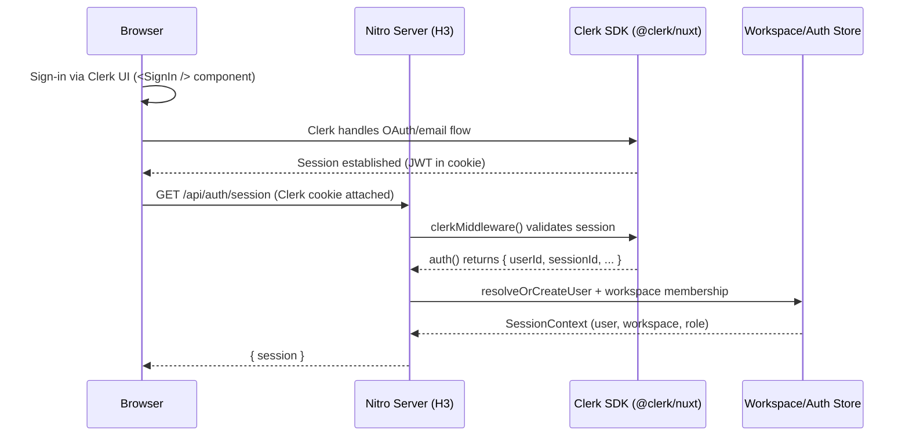

# design.md

artifact_id: 9ef61e54-46c7-43fb-a71e-0a0e3bfb2f6c
date: 2026-01-11

## Overview

This design adds an SSR-only authentication subsystem to OR3 Chat that:

-   keeps static builds fully local-first (OpenRouter PKCE continues unchanged)
-   supports "bring your own auth provider" via a small `AuthProvider` interface
-   resolves a server-side `SessionContext` containing user + workspace membership
-   centralizes authorization in `can(session, permission, resource?)` with a single hook for controlled policy extension
-   uses the selected SyncProvider backend as the canonical workspace store (Convex default)

The implementation follows existing OR3 patterns:

-   server-only capabilities live under `server/**`
-   extension points go through the typed hooks system (`useHooks()`)
-   global registries use the existing registry utilities in `app/composables/_registry.ts`
-   errors use `err()` + `reportError()` conventions (`docs/error-handling.md`)

## High-level architecture



## Server-side modules

### 1) `AuthProvider` interface

Core interface is intentionally minimal:

```ts
import type { H3Event } from 'h3';

export type ProviderUser = {
    id: string;
    email?: string;
    displayName?: string;
};

export type ProviderSession = {
    provider: string;
    user: ProviderUser;
    expiresAt: Date;
    claims?: Record<string, unknown>;
};

export interface AuthProvider {
    name: string;
    getSession(event: H3Event): Promise<ProviderSession | null>;
}
```

Notes:

-   `getSession(event)` is the single mandatory method.
-   Provider-specific "login" flows remain provider-owned; OR3 core only needs a resolved session in SSR.

### 2) Provider selection (registry + config)

Use a registry of provider factories (static, safe to keep in `globalThis`).

```ts
export type AuthProviderFactory = () => AuthProvider;

export type AuthProviderRegistryItem = {
    id: string;
    order?: number;
    create: AuthProviderFactory;
};
```

Selection rules:

-   `runtimeConfig.auth.provider` selects a provider id.
-   if no provider configured OR SSR auth disabled → return null session.
-   if provider id missing → report `ERR_AUTH` + return null.

Why a registry:

-   matches existing plugin-style registries used across the app
-   keeps swapping providers a compile-time/local change

### 3) Clerk provider (default)

Clerk provides a first-party `@clerk/nuxt` module that handles most auth complexity automatically.

**Key advantages over custom cookie management:**

-   Pre-built UI components (`<SignIn />`, `<SignUp />`, `<UserButton />`)
-   Automatic session management (no manual cookie minting)
-   Built-in `clerkMiddleware()` for server-side validation
-   SSR-safe composables (`useAuth()`, `useUser()`)
-   Generous free tier (10,000 MAU)

**Server-only provider responsibilities:**

-   Use `clerkMiddleware()` to validate requests
-   Access auth state via `event.context.auth()`
-   Return normalized `ProviderSession`

Key server-only files (proposed):

-   `server/middleware/clerk.ts` (exports `clerkMiddleware()`)
-   `server/auth/providers/clerk/clerk-auth-provider.ts` (`getSession(event)`)

**Implementation detail:**

```ts
// server/auth/providers/clerk/clerk-auth-provider.ts
import type { H3Event } from 'h3';
import type { AuthProvider, ProviderSession } from '../types';

export const clerkAuthProvider: AuthProvider = {
    name: 'clerk',

    async getSession(event: H3Event): Promise<ProviderSession | null> {
        const auth = event.context.auth?.();
        if (!auth?.userId) return null;

        // Optionally fetch full user data via clerkClient if needed
        return {
            provider: 'clerk',
            user: {
                id: auth.userId,
                // email and displayName can be fetched via clerkClient().users.getUser()
            },
            expiresAt: new Date(auth.sessionClaims?.exp * 1000 || Date.now() + 3600000),
            claims: auth.sessionClaims,
        };
    },
};
```

**Clerk middleware setup:**

```ts
// server/middleware/clerk.ts
import { clerkMiddleware } from '@clerk/nuxt/server';
export default clerkMiddleware();
```

**Nuxt config additions:**

```ts
// nuxt.config.ts
export default defineNuxtConfig({
    modules: [
        // Only include Clerk when SSR auth is enabled to preserve static builds
        ...(process.env.SSR_AUTH_ENABLED === 'true' ? ['@clerk/nuxt'] : []),
    ],
    clerk: {
        // Optional: skip auto-registration of middleware to customize
        skipServerMiddleware: false,
    },
    runtimeConfig: {
        // Server-only
        clerkSecretKey: process.env.CLERK_SECRET_KEY,
        public: {
            clerkPublishableKey: process.env.CLERK_PUBLISHABLE_KEY,
        },
    },
});
```

Static build gating:

- When SSR auth is disabled, Clerk modules are not registered.
- Server-only auth code lives under `server/**` and is not bundled into static builds.
- SSR endpoints return `{ authenticated:false }` when disabled.

### 4) Server AuthService: resolve OR3 session context

Auth in OR3 is more than provider identity: it must map to internal users, workspaces, and roles.

```ts
export type WorkspaceRole = 'owner' | 'editor';

export type SessionContext = {
    authenticated: boolean;
    provider?: string;
    providerUserId?: string;
    user?: {
        id: string;
        email?: string;
        displayName?: string;
    };
    workspace?: {
        id: string;
        name: string;
    };
    role?: WorkspaceRole;
    expiresAt?: string;
};
```

Resolution algorithm (server):

1. If SSR auth disabled → return `{ authenticated:false }`.
2. Resolve `ProviderSession` via selected provider.
3. Look up internal user by `(provider, providerUserId)`.
4. If missing, create internal user + account link.
5. Ensure a default workspace exists and membership exists:
    - create workspace
    - create membership (owner)
6. Select active workspace (initially: user's first workspace).
7. Return `SessionContext`.

Per-request caching:

-   cache resolved `SessionContext` on the H3 event context to avoid multiple provider calls.

### 5) Server-side persistence model

Auth/workspace data must be server-persisted in SSR deployments. Keep it provider-agnostic by defining a small store interface and offering a default SyncProvider-backed implementation (Convex default).

Avoid duplication:
- Only one canonical store should exist for users/workspaces.
- Other systems (sync, storage, admin) must read from the same store via `AuthWorkspaceStore`.

Store interface (proposed):

```ts
export interface AuthWorkspaceStore {
    getOrCreateUser(input: {
        provider: string;
        providerUserId: string;
        email?: string;
        displayName?: string;
    }): Promise<{ userId: string }>;

    getOrCreateDefaultWorkspace(
        userId: string
    ): Promise<{ workspaceId: string }>;

    getWorkspaceRole(input: {
        userId: string;
        workspaceId: string;
    }): Promise<WorkspaceRole>;

    listUserWorkspaces(
        userId: string
    ): Promise<Array<{ id: string; name: string; role: WorkspaceRole }>>;
}
```

Default provider schema (aligned with sync wire schema; Convex example):

-   `users(email, display_name, created_at)`
-   `auth_accounts(user_id, provider, provider_user_id, created_at)`
-   `workspaces(name, owner_user_id, created_at)`
-   `workspace_members(workspace_id, user_id, role, created_at)`

Rationale:

-   keeps provider identity separate from internal user
-   supports future multi-provider linking
-   keeps workspace membership explicit (required for `can()`)
-   keeps auth and sync on a shared source of truth

## Provider token minting (backend access)

Direct sync providers (Convex, Firebase, Firestore) often require client-side auth tokens. Clerk supports JWT templates that can mint backend-specific tokens.

Proposed interface:

```ts
export interface AuthTokenBroker {
    getProviderToken(input: {
        providerId: string;   // 'convex' | 'supabase' | 'firebase'
        template?: string;    // optional Clerk JWT template name
    }): Promise<string | null>;
}
```

Notes:
- For Clerk, `getProviderToken()` maps to `getToken({ template })`.
- If a provider token is unavailable, the SyncProvider should fall back to gateway mode or return a clear error.
- Sync/Storage providers consume the broker to attach tokens for direct access.

## Authorization design (`can()`)

### Permission model

Keep permissions string-based for flexibility; map roles to permissions centrally.

```ts
export type Permission =
    | 'workspace.read'
    | 'workspace.write'
    | 'workspace.settings.manage'
    | 'users.manage'
    | 'plugins.manage'
    | 'admin.access';
```

Role mapping (initial):

-   `owner`: all permissions
-   `editor`: `workspace.read`, `workspace.write`

### Decision object

`can()` returns a structured decision for auditability.

```ts
export type AccessDecision = {
    allowed: boolean;
    permission: Permission;
    reason?: 'unauthenticated' | 'forbidden' | 'unknown-permission';
    userId?: string;
    workspaceId?: string;
    role?: WorkspaceRole;
    resource?: { kind: string; id?: string };
};
```

### Controlled extension hook

Add one filter hook: `auth.access:filter:decision`.

-   Inputs: `(decision, context)`
-   Output: `decision`
-   Constraint: plugin may only restrict (true → false), never grant.

Proposed hook typing in `app/core/hooks/hook-types.ts`:

```ts
'auth.access:filter:decision': [AccessDecision, { session: SessionContext | null }]
```

Enforcement (core):

1. compute `baseDecision` from role+permission
2. call hooks.applyFilters(...) to allow transforms
3. clamp: `final.allowed = base.allowed && filtered.allowed`

This guarantees no filter can grant access.

## Client-side API

### `useSession()` composable

Client reads the server session via an internal API endpoint OR directly via Clerk's composables.

**Option A: Use Clerk's built-in composables (recommended)**

```ts
// app/composables/auth/useSession.ts
import { useAuth, useUser } from '@clerk/nuxt';

export function useSession() {
    const { isSignedIn, isLoaded, userId, sessionId } = useAuth();
    const { user } = useUser();

    return {
        isSignedIn,
        isLoaded,
        userId,
        sessionId,
        user,
    };
}
```

**Option B: Custom session endpoint for workspace context**

For workspace-specific context not available from Clerk directly:

-   `server/api/auth/session.get.ts` returns `{ session: SessionContext | null }`
-   `app/composables/auth/useSessionContext.ts` uses `useRequestFetch()` on server, `$fetch` on client

Nuxt 4 supports `useRequestEvent()` and `useRequestFetch()` for SSR-safe fetching.

### Clerk UI components

Clerk provides pre-built Vue components for auth flows:

```vue
<template>
    <div>
        <!-- Sign in/up buttons -->
        <SignInButton v-if="!isSignedIn" />
        <UserButton v-else />

        <!-- Full sign-in page -->
        <SignIn v-if="showSignIn" />
    </div>
</template>

<script setup>
import { SignIn, SignInButton, UserButton } from '@clerk/vue';
import { useAuth } from '@clerk/nuxt';

const { isSignedIn } = useAuth();
</script>
```

Static build compatibility:

-   Clerk modules should be loaded only when SSR auth is enabled or when building an SSR target.
-   OpenRouter PKCE remains the default auth for LLM access in static builds.

## Hook type additions

Add to `CoreHookPayloadMap` in `app/core/hooks/hook-types.ts`:

-   `auth.access:filter:decision`: `(decision, ctx)` filter

Optional (recommended, but not required by the prompt):

-   `auth.user:action:created`: emitted on first-time user creation
-   `auth.workspace:action:created`: emitted on first-time workspace creation

These are actions (observability), not policy hooks.

## Error handling

Use existing conventions:

-   create typed errors via `err('ERR_AUTH', ...)` with `tags: { domain:'auth', stage:'...' }`
-   use `createError({ statusCode, statusMessage })` for API responses
-   never log or return cookie values, ID tokens, or session contents

## Testing strategy

### Unit tests

-   `can()` role/permission matrix
-   "cannot grant" invariant for the `auth.access:filter:decision` hook
-   provider selection logic (missing provider, disabled mode)

### Integration tests

-   session endpoint returns null when disabled
-   session endpoint returns resolved `SessionContext` using a fake provider + fake store

### Provider tests (Clerk)

-   `getSession(event)` returns null without valid auth context
-   invalid/expired session → null

Clerk SDK should be mocked in unit tests to keep them deterministic.
