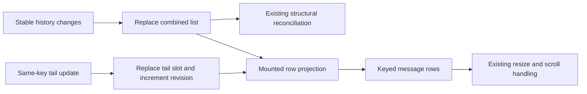

# Design

## Overview

Add an optional `rowContentRevision` number to `Or3Scroll`. Chat replaces its existing tail slot and increments this value together. The scroller reads it only when deriving mounted row content; structural reconciliation continues to depend on `items` and the existing mutation mode.

## Architecture



- **Chat projection** — owns the combined list and revision (`ChatContainer.vue`; R1, R2).
- **Scroller content contract** — invalidates the mounted slice independently of list structure (`../or3-vsc/src/lib/components/Or3Scroll.vue` and `types.ts`; R1–R3).
- **Existing scroll/measurement handling** — reacts to actual row size changes while preserving scroll ownership (R3).
- **Package integration and regression harnesses** — verify chat consumes the built contract and renders through it (R1–R3).

## Components and Interfaces

Extend the existing generic props interface and component defaults:

```ts
interface Or3ScrollProps<T> {
    // Existing props remain unchanged.
    rowContentRevision?: number; // Default 0; changes invalidate row content only.
}
```

In the scroller, make `visibleItems` explicitly depend on `props.rowContentRevision` before slicing the existing render window. Do not add the revision to the structural watcher, key-map construction, `contentKey`, or component/row keys. Normal ResizeObserver handling measures actual height changes; no per-update `reset()` or `refreshMeasurements()` call.

In chat, retain `allMessages` as a shallow ref and add a per-container revision ref. Extend the existing fast-path guard to require the same stable snapshot, expected list length, and same effective tail key (`id || stream_id || ''`). For that path, assign `allMessages.value[stable.length] = mergedTail`, then increment the revision and bind it to the scroller. Keep both operations synchronous so the next render sees the new object. A revision is required even when text length or row height does not change.

Every other path keeps the existing full assignment: initial load, tail insertion/removal, changed tail key, stable/workflow projection replacement, and history deduplication. Preserve the current id-or-stream_id deduplication before considering the fast path. Do not mutate the stable source array when there is no separate tail. Update the source comment to describe both update paths accurately.

Keep the revision local to each mounted chat container; it is not a thread epoch or message identifier. Preserve existing tab/thread `contentKey` handling. Same-key offscreen content remains in `items` and is read when that row enters the render window. Preserve attachment rendering and the existing range-based media prefetch controller; do not introduce a history scan on revision changes.

## Data Models

N/A. One transient numeric ref per chat container; no persistent schema changes.

## Error Handling

No new fallible I/O or error API. If the fast-path invariants do not hold, use the existing full projection assignment. A package lacking the prop fails integration qualification: retain the current copying implementation until the built dependency supports the contract. Do not add a runtime compatibility adapter.

## Testing Strategy

- **Scroller unit/component tests (R1, R2, R3):** extend existing suites in `../or3-vsc/src/lib/components/__tests__/`. Mount with a shallow list, replace a same-key object, increment revision, and assert updated DOM with the same row instance and array. Include same-length text, offscreen updates, empty list, and both mutation modes. Spy on production structural work to ensure revision-only updates do not reconcile keys or reset measurements. Retain existing no-revision cases.
- **Chat component integration (R1, R2):** extend `app/components/chat/__tests__/ChatContainer.test.ts` with real reactive chat refs and real `Or3Scroll` for the relevant cases; replace the unconditional scroller mock or isolate its use to unrelated tests. Assert rendered slot content as well as array/stable-row identity. Cover text/reasoning/status/tool/attachment updates and the R2 transition cases. Do not reproduce the projection algorithm inside a test stub.
- **Browser canary (R2, R3):** extend `tests/e2e/fixtures/Or3ScrollCanary.vue` to exercise a shallow list plus same-slot updates and revision. The current timer copies history and cannot verify the fix. Extend `tests/e2e/or3-scroll-canary.spec.ts` to assert live DOM changes, bottom following, browsing/edit suspension, offscreen remounts, and thread resets with the real package. Exercise chat's `append-prepend` mode while retaining existing arbitrary-mutation coverage.
- **Bounded-work check (R1):** use fixed viewport and overscan with 100 and 10,000 stable rows, then apply a fixed sequence of tail updates. Assert unchanged combined-array identity, stable-row identities, no structural sync on content revisions, and item access/projection work bounded by the render window. Count after setup; avoid timing thresholds or a new benchmark framework. Height updates may still incur normal virtualizer work; the O(1)/O(W) claim concerns list projection.
- **Commands:** in the scroller repository run its affected component suites with `bunx vitest run ... --reporter=dot`, then `bun run build` and `bun run lint`. In chat run `bunx vitest run --project=core-app app/components/chat/__tests__/ChatContainer.test.ts --reporter=dot`, `bun run test:e2e:scroll`, `bun run type-check`, targeted `bun run lint:changed <changed-source-files>`, and `bun run build` after the dependency upgrade. Run these during implementation, not for these planning-only files.

## Design Decisions

- **One revision prop:** a bounded mounted-slice refresh is sufficient to remove history-sized copies. A keyed reactive store adds ownership and cleanup machinery without being necessary for this change.
- **Keep structural updates explicit:** key/count/order changes and history projection replacements use array assignment. In-place mutation alone and `triggerRef(allMessages)` do not establish a child dependency and would repeat the documented stale-row bug.
- **Preserve measurement and scroll behavior:** content revisions invalidate content, not measurements or content epochs. Real size changes use the established observer path.
- **Upgrade in dependency order:** modify and build `or3-vsc`, validate its built artifact with chat, then pin a released compatible `or3-scroll` version and update `bun.lock` before shipping the chat optimization. The sibling source is ahead of the installed package in other areas; review the dependency diff rather than assuming identical versions imply identical contents. Do not patch `node_modules` as the solution.

## Risks & Mitigations

1. **A forgotten revision leaves stale content:** keep slot assignment and increment in the same guarded branch; assert real rendered text, including same-length replacements.
2. **Revision invalidation triggers history work:** isolate it to mounted content and verify key reconciliation is not invoked by revision-only changes.
3. **Identity transitions duplicate or retain a tail:** preserve deduplication and use the slow path for changed keys, history, and tail presence; cover terminal and thread-switch transitions.
4. **Rows update but scrolling regresses:** use the existing browser canary for height growth and user-owned scrolling, with actual content updates.
5. **Chat tests a different package than it ships:** test rebuilt exports and the final pinned dependency; keep the chat optimization and dependency bump together.
