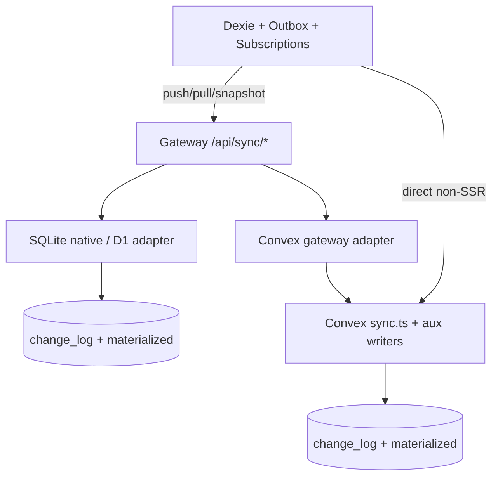

# Design

## Overview

Hardening stays inside the existing protocol: Dexie outbox → provider push → contiguous `server_version` change log → pull/snapshot → conflict resolver. Defects are concentrated in three seams: (1) providers that do not implement the shared contract (SQLite notifications, LWW, idempotency, D1 atomicity; Convex server writers and GC), (2) the gateway admission path (unbounded body, all-or-nothing validation, success-only rate limit), and (3) the client engine (outbox `applied` handling, snapshot reapply, circuit breaker probes, HookBridge lifecycle, workflow catalog hydration).

The smallest complete fix is to treat the shared schemas/revision helpers as the single source of truth and make every writer, pull, and client recovery path obey them.

## Architecture



| Component | Responsibility | Requirements |
| --- | --- | --- |
| `NotificationScopeGuard` | Bind and filter `notifications.user_id` on SQLite push/pull/snapshot | R1 |
| `ServerAuthoredSyncWriter` | UUID `op_id`, version, change_log, stamps for Convex non-push mutations | R2, R3, R15 |
| `SnapshotEligibility` | Ignore candidates without `serverVersion` or above watermark | R3 |
| `WorkspacePurge` | Delete remaining tenant sync tables on Convex workspace delete | R3 |
| `SnapshotRecovery` | Start outbox after snapshot; reapply durable non-terminal ops | R4 |
| `AppliedReconciler` | Honor `applied: false` with winning payload | R5 |
| `PushAdmission` | Bounded body, auth, per-op validation, admission rate limit | R6, R14 |
| `OutboxPacker` | Pack by count and 2 MiB; split on whole-request failure | R6 |
| `PullRetentionContract` | `oldestRetainedVersion` + `requiresSnapshot` | R7 |
| `WorkflowCatalogHydrator` | Snapshot then incremental pull | R8 |
| `IdempotencyFingerprint` | Workspace + fingerprint compare on SQLite/D1 | R9 |
| `D1AtomicPush` | Unique `change_log` insert without `OR IGNORE` | R10 |
| `SharedLww` | SQLite uses `incomingRevisionWins`; tombstone + orphan check | R11 |
| `DirectModeBootstrap` | Core starts for non-SSR Convex; subscribe advances cursor | R12 |
| `CircuitBreakerProbe` | Read-only `canRetry`; paired begin/record | R13 |
| `ConvexHistoryGc` | Cron + paginated gateway GC + admin reachability | R16 |
| `ReplaySideEffects` | Do not default `applied` true on idempotent replay | R17 |
| `HookBridgeLifecycle` | Unsubscribe Dexie hooks on stop | R18 |
| `SyncDocs` | Public docs + docmap | R20 |

## Components and Interfaces

### Shared pull contract (additive)

```ts
interface PullResponse {
    changes: SyncChange[];
    nextCursor: number;
    hasMore: boolean;
    oldestRetainedVersion: number;
    requiresSnapshot: boolean;
}
```

`requiresSnapshot === (cursor < oldestRetainedVersion)`. Zod `PullResponseSchema` gains both fields as required numbers/booleans so providers cannot omit them. Core, gateway, SQLite, and Convex ship in one change set.

### NotificationScopeGuard (SQLite)

Reuse Convex semantics:

- Push: if `tableName === 'notifications'`, resolve `session.user.id`; force `payload.user_id`; reject owner mismatch and deletes of missing/foreign rows.
- Pull: after reading `change_log`, drop notification changes whose payload `user_id` is missing or not the caller (same as `isChangeVisibleToUser`). Cursor still advances over the raw window’s last `server_version` so filtering cannot stall (Convex already does this).
- Snapshot SQL: add `AND (json_extract(data_json, '$.user_id') = ?)` for `s_notifications` live rows; omit foreign tombstones.

`resolveSessionUserId` already exists on the adapter; make it mandatory for notification tables.

### ServerAuthoredSyncWriter (Convex)

Extract one internal helper used by `notifications.create`, `notifications.markRead`, storage `file_meta` mutations, and `admin.setWorkspaceSetting`:

```ts
async function applyServerAuthoredOp(
    ctx: MutationCtx,
    workspaceId: Id<'workspaces'>,
    op: {
        table: 'notifications' | 'file_meta' | 'kv';
        operation: 'put' | 'delete';
        pk: string;
        payload?: Record<string, unknown>;
    }
): Promise<void>
```

Rules: `op_id = crypto.randomUUID()`, `device_id = 'server'`, `clock = nowSec()`, `hlc` derived from clock + op_id prefix, `allocateServerVersion`, insert `change_log`, apply LWW to the materialized table (or call existing `applyOpToTable`). Do not invent prefixed op ids.

`notifications.create` already has a UUID `id`; that id is the row pk, not necessarily `op_id`. Use a fresh UUID for `op_id` so create vs later markRead remain distinct idempotency keys.

Public `sync.push` `validateSyncOperation` adds UUID format (shared regex / length already exists in Zod — duplicate a small `isUuid` helper in the Convex template to avoid importing Zod into Convex). Run stamp validation before `allocateServerVersions`.

### SnapshotEligibility

Change `resolveSnapshotWinner` to skip candidates where `typeof serverVersion !== 'number'` **or** `serverVersion > highWatermark`. Unversioned auxiliary rows become invisible to snapshots until R3 writers stamp them.

### SnapshotRecovery + AppliedReconciler (client)

1. `startSyncEngine`: construct HookBridge, SubscriptionManager, GcManager first; start OutboxManager only after `subscriptionManager.start()` resolves (snapshot/bootstrap complete). Crash recovery of `in_flight` stays inside OutboxManager.start/flush.
2. `reapplyPendingOps`: query statuses `pending | in_flight | retry_wait | failed_retryable` (and legacy `syncing`). Sort by `createdAt`. Apply payloads inside the sync-suppressed transaction after snapshot replacement.
3. Outbox result handling:
   - `success && applied !== false`: current delete path.
   - `success && applied === false`: require `payload` or `operation === 'delete'`; write winner via HookBridge-suppressed transaction; delete outbox row; `unmarkRecentOpId` for that pk so a later winner echo can apply.
   - `success && applied === false && payload missing`: `handleFailedOp` retryable, do not delete.

SQLite push result construction must set `applied` from the LWW boolean already computed in native apply. D1 uses `meta.changes` plus revision compare; if the ON CONFLICT WHERE clause writes 0 rows, `applied: false` and attach current materialized JSON as `payload`.

### PushAdmission + OutboxPacker

Gateway `push.post.ts` / `pull.post.ts`:

1. `readLimitedJsonBody` with push ceiling `MAX_SYNC_PUSH_BATCH_BYTES` and pull ceiling a small constant (4 KiB is enough for PullRequest).
2. Session + `requireCan`.
3. `checkSyncRateLimit` + `recordSyncRequest` immediately (admission).
4. Parse batch. For each op, table-schema `safeParse`; invalid ops become result entries `{ success: false, errorCode: 'VALIDATION_ERROR' }`; valid ops go to `adapter.push`. Merge result arrays in input order.
5. Adapter still sees only valid ops; `getPushResultContractError` must allow mixed success.

Outbox packer: iterate due ops, add while `count < maxBatchSize` and `jsonByteLength(batch) <= MAX_SYNC_PUSH_BATCH_BYTES`. On thrown 400/413 after admission changes, binary-split remaining in-flight batch down to one op.

### IdempotencyFingerprint + D1AtomicPush

Native existing-op lookup selects fingerprint columns, not only `op_id, server_version`. Compare with `operationFingerprint`. D1: same lookup; change `INSERT OR IGNORE INTO change_log` to `INSERT INTO change_log`. Unique violation fails the D1 batch (counter statement rolls back). Caller retries; second pass hits fingerprint match.

### SharedLww

Replace `incomingWinsLww(clock, hlc)` with `incomingRevisionWins({ clock, hlc, opId }, existing)`. Tombstone `ON CONFLICT` WHERE uses `compareSyncRevision` encoded as clock/hlc/op_id (add `hlc` to the conflict predicate; it already has `hlc` columns). Before inserting a new materialized row, `SELECT` tombstone for `(workspace, table, pk)` and skip resurrection when the tombstone wins.

### DirectModeBootstrap

Core plugin gate becomes:

- SSR on + sync on → register gateway, start engine (current).
- SSR off + sync on + active provider `mode === 'direct'` → do not return early; start engine with the provider plugin’s registration.
- SSR on → Convex provider plugin still skips direct registration (avoid token loops).

`createConvexSyncProvider.subscribe`: keep `let cursor` mutable. After a valid page, set `cursor = max(cursor, last serverVersion)` and resubscribe, **or** call `onChanges` even for empty filtered pages so SubscriptionManager can advance. Prefer resubscribe with the new cursor because Convex `onUpdate` args are fixed at watch time. Always invoke a completion path so filtered-empty pages do not freeze.

### CircuitBreakerProbe

```ts
canRetry(): boolean  // read-only
beginProbe(): boolean // sets probeInFlight in half-open
recordSuccess()/recordFailure() // clear probeInFlight
```

Outbox: if `!canRetry()` return; if empty pending after scan, return without `beginProbe`. If work exists, `beginProbe()` then push, then record. Subscription bootstrap/rescan: `beginProbe` around the network attempt; `finally` record failure if neither success nor failure was recorded.

### ConvexHistoryGc + ReplaySideEffects + HookBridgeLifecycle

- `crons.ts`: periodic `internal.sync.runWorkspaceGc` that actually pages `gcChangeLog` / `gcTombstones` (replace the no-op compatibility handler or add `runAllWorkspacesGc`).
- Gateway adapter loops `hasMore` with `nextCursor`.
- Webhook loop: `applied: resultItem.applied === true` (no `?? true`). Treat `wasExisting === true` as skip.
- HookBridge: store Dexie unsubscribe fns from `table.hook(...)` return values; `stop()` calls them and sets `hooksInstalled = false`.

### WorkflowCatalogHydrator

If adapter has `snapshot`, page it for `tables: ['posts']`, materialize into the cache map, set `cursor = highWatermark`, then existing pull loop. If snapshot is absent, keep pull-from-zero only for adapters that cannot GC (should not occur for sqlite/convex).

## Data Models

No new Dexie or SQL tables. Notification ownership continues to live in `data_json.user_id` / Convex `notifications.user_id`.

Additive pull fields only. Optional push result `applied` + `payload` already exist on `PushResultItemSchema`; SQLite must populate them.

Convex `change_log.op_id` stays a string; writers persist UUIDs. Unique index on SQLite `change_log.op_id` is already global — fingerprint compare is required because uniqueness is not workspace-scoped.

## Error Handling

| Failure | Behavior |
| --- | --- |
| Notification owner mismatch | Per-op `UNAUTHORIZED` / `Forbidden: notification owner mismatch`; batch continues |
| Prefixed/non-UUID `op_id` from clients | Per-op `VALIDATION_ERROR` before version allocation |
| Fingerprint conflict | Per-op `CONFLICT`; no silent success |
| D1 unique `op_id` race | Batch abort + retry → idempotent hit |
| `applied: false` without payload | Retryable outbox error, row retained |
| `requiresSnapshot` | Client snapshot recovery; no cursor jump |
| Whole-body oversize | HTTP 413 from `readLimitedJsonBody` |
| Mixed invalid ops | HTTP 200 mixed results |
| Half-open probe throw | `recordFailure` in `finally` |
| Direct watch schema fail | `recordFailure`; do not advance cursor |

## Testing Strategy

- **Unit (or3-chat):** outbox `applied: false` with/without payload; packer byte ceiling; circuit breaker begin/record; HookBridge unsubscribe; pull schema new fields; push route per-op validation + admission record; workflow catalog snapshot-first.
- **Unit (sqlite):** two-user notification pull/push/snapshot; fingerprint mismatch; LWW opId tie; orphan tombstone blocks put; native `applied` flag. D1 tests: unique conflict does not increment leftover versions (simulate sequential retry if true concurrency is hard).
- **Unit (convex):** `notifications.create` op_id UUID parses with `ChangeStampSchema`; markRead/storage/admin KV insert change_log; `resolveSnapshotWinner` drops unversioned rows; workspace delete removes notifications; gateway webhook skip on replay; subscribe cursor rollover; `validateSyncOperation` UUID; gc pagination loop.
- **Contract:** `verifySyncContract` already expects opId tie-break; wire SQLite production LWW into that adapter so it cannot pass via a test-only comparator.
- **No e2e Playwright** unless a named `test:e2e:*` harness already covers sync; prefer vitest.

## Design Decisions

1. **Keep UUID `op_id` rather than allowing `server:*`.** Relaxing the schema would hide other malformed stamps and break the audit’s verified 502. Server writers can emit UUIDs with one-line changes.
2. **Filter notifications in SQLite at pull/snapshot time rather than dual change logs.** Matches Convex; cursor still tracks the unfiltered window so holes do not stall.
3. **Force `applied` on SQLite results instead of making the client treat missing as true.** Missing `applied` stays “applied” only for backward compatibility during mixed-version deploys; new SQLite/Convex builds always send the flag. Client rule: `applied === false` is the only reconcile path; `undefined` keeps today’s delete-outbox behavior so old servers do not deadlock.
4. **Per-op gateway validation rather than only client split.** Convex push already isolates per op; the HTTP gateway was the all-or-nothing layer. Client split remains a backstop for 413/400 on the whole body.
5. **D1 `INSERT` not locking.** D1 has no `BEGIN IMMEDIATE`. Unique constraint + atomic batch rollback is the isolation tool already in schema.
6. **Direct mode stays, and is gated off under SSR.** The comment in the Convex provider plugin is correct; the bug is the core plugin requiring SSR even when a direct provider exists.
7. **In-process rate limit on admission, not a new Redis limiter.** Fixes the “record after success / 20k ops” bug. Cross-process enforcement is a later operator concern.

## Risks & Mitigations

1. **Dirty `or3-chat` tree.** Mitigate: dedicated branch; stage only sync/planning/doc paths; never commit admin-update files.
2. **Notification filter vs cursor math.** Empty filtered pages with `hasMore: true` must still advance `nextCursor` (Convex pattern). Tests with interleaved other-user notifications.
3. **Outbox start-after-snapshot can delay first push.** Acceptable; crash recovery still resets `in_flight`. Tests that local writes during snapshot remain queued, not flushed against empty tables.
4. **Convex template vs published `dist/`.** Rebuild `or3-provider-convex` after template edits; note in tasks.
5. **Existing `server:notif:*` rows in production Convex logs.** New pulls of old rows still 502. Add a one-time skip or rewrite in `pull` mapping: if `op_id` is not a UUID, substitute a deterministic UUID v5 (or drop/skip that change and set `requiresSnapshot` if it would be delivered). Prefer skip-with-cursor-advance for malformed historical rows so one old notification cannot poison the page. Document as migration behavior under R2.
