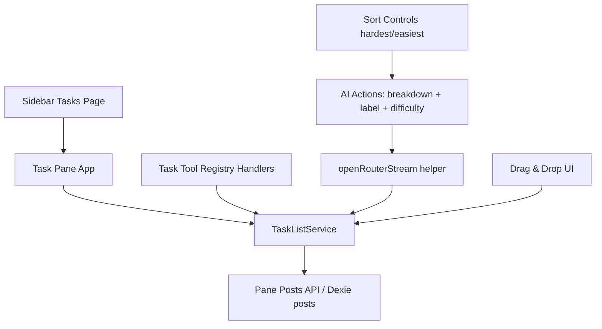

# design.md

## Overview
This design introduces a production Task/Todo pane app for OR3 using existing extension surfaces:
- pane registration (`usePaneApps`)
- sidebar registration (`registerSidebarPage`)
- local persistence (Dexie `posts` via pane posts API)
- AI tool control (`useToolRegistry`)

The design stays local-first and client-first. No new server route is required for task CRUD.  
AI features use existing OpenRouter client/server-route fallback helpers.

## Current-State Findings (Research)
1. OR3 already ships an example todo pane plugin (`custom-pane-todo-example.client.ts`) with posts persistence and sidebar integration.
2. Tool registration APIs already exist and are plugin-friendly (`useToolRegistry`, `defineTool`).
3. Tool handlers return strings and validate required arguments automatically in registry execution paths.
4. `posts.meta` already supports JSON payloads, making it suitable for structured task/subtask arrays.
5. Existing docs and APIs support custom pane apps + post-backed records without new schema migrations.

## Architecture



## Planned Module Layout

```text
app/plugins/tasks-pane.client.ts
app/plugins/tasks/components/TaskPane.vue
app/plugins/tasks/components/TaskSidebarPage.vue
app/plugins/tasks/components/TaskItemCard.vue
app/plugins/tasks/composables/useTaskListService.ts
app/plugins/tasks/composables/useTaskAiActions.ts
app/plugins/tasks/tooling/registerTaskTools.ts
app/plugins/tasks/tooling/taskToolDefs.ts
app/plugins/tasks/utils/extractJson.ts
app/plugins/tasks/__tests__/*
```

## Data Model

### Storage Strategy
- One post per task list (`postType = 'or3-task-list'`).
- `post.meta` stores full list state (`tasks[]` with nested `subtasks[]`).
- `post.title` stores list name (required by schema).

### Type Contracts

```ts
type TaskLabel = 'work' | 'home' | 'health' | 'uncategorized';
type TaskStatus = 'todo' | 'doing' | 'done';
type SortMode = 'manual' | 'hardest' | 'easiest';
type LabelSource = 'ai' | 'manual';

interface TaskSubtask {
  id: string;
  title: string;
  done: boolean;
  order: number;
  created_at: number;
  updated_at: number;
}

interface TaskItem {
  id: string;
  title: string;
  notes: string;
  status: TaskStatus;
  order: number;
  due_at: number | null;
  label: TaskLabel;
  label_source: LabelSource;
  difficulty_score: number | null; // 1-10
  difficulty_reason: string | null;
  subtasks: TaskSubtask[];
  created_at: number;
  updated_at: number;
}

interface TaskListMetaV1 {
  schema_version: 1;
  sort_mode: SortMode;
  tasks: TaskItem[];
  last_ai_analysis_at: number | null;
}
```

## Core Services

### TaskListService (single source of write logic)

```ts
interface TaskListService {
  loadList(listId: string): Promise<TaskListMetaV1>;
  addTask(listId: string, input: { title: string; notes?: string; due_at?: number | null }): Promise<TaskItem>;
  updateTask(listId: string, taskId: string, patch: Partial<TaskItem>): Promise<TaskItem>;
  removeTask(listId: string, taskId: string): Promise<void>;

  addSubtask(listId: string, taskId: string, title: string): Promise<TaskSubtask>;
  removeSubtask(listId: string, taskId: string, subtaskId: string): Promise<void>;

  reorderTasks(listId: string, orderedTaskIds: string[]): Promise<void>;
  rescheduleTask(listId: string, taskId: string, dueAt: number | null): Promise<void>;

  sortByDifficulty(listId: string, mode: 'hardest' | 'easiest'): Promise<void>;
}
```

Rules:
- All mutation paths update timestamps and preserve stable ids.
- Reorder writes occur as one meta update to avoid partial states.
- Tie-break sorting: previous `order`, then `created_at`.

## AI Services

### 1. One-click Breakdown
- Input: task title (+ optional notes/context).
- Output: strict JSON `{ "steps": string[] }`.
- Default: 5 steps.
- Parse flow: extract JSON object -> validate with zod -> dedupe/trim -> create subtasks.

### 2. Auto-label
- Classify to `work|home|health|uncategorized`.
- Runs on create/title update unless `label_source === 'manual'`.

### 3. Difficulty analysis
- Analyze all tasks and return per-task score + reason.
- Output JSON shape:

```ts
{
  ratings: Array<{ task_id: string; score: number; reason: string }>
}
```

- If AI fails: fallback deterministic heuristic scoring (length + keyword weights + subtask count).

### AI transport
- Use `openRouterStream` helper and accumulate text.
- Follow existing SSR rule: if SSR auth mode has no client key, rely on `/api/openrouter/stream` path.
- No new auth/storage semantics introduced.

## Tool Registry Integration

Register client tools in plugin init (`runtime: 'client'`):

1. `or3_tasks_add_item`
2. `or3_tasks_remove_item`
3. `or3_tasks_update_item`
4. `or3_tasks_reorganize`
5. `or3_tasks_create_subtask`
6. `or3_tasks_remove_subtask`
7. `or3_tasks_sort_by_difficulty`

Optional convenience tool:
8. `or3_tasks_break_down_task`

Handler pattern:
- Parse/validate args (registry does required-field validation; handler performs deeper checks).
- Call `TaskListService`.
- Return a concise JSON string result with ids + status.

## UI/UX Design

### Sidebar page
- Shows task lists and quick actions:
  - open list
  - create list
  - quick filter by label/status

### Pane layout
- Header:
  - list title
  - sort controls (`Manual`, `Hardest`, `Easiest`)
  - "Analyze Difficulty" action
- Composer:
  - quick add input
  - optional due date
- Task cards:
  - drag handle
  - status checkbox
  - label chip
  - due date chip
  - "Break this down" button
  - expandable subtasks

Visual direction:
- Use Nuxt UI (`UCard`, `UButton`, `UInput`, `UForm`) plus existing retro classes/tokens.
- No new styling framework or random CSS variable system.
- Mobile-safe stacked layout for narrow widths.

## Error Handling

1. AI parse failure:
   - keep current task data untouched
   - toast with retry action
2. Tool arg mismatch:
   - return structured error string; no mutation
3. Missing list/task ids:
   - return not-found errors; no mutation
4. Persistence write failure:
   - show UI error, preserve in-memory state from last successful load

## Security and Boundaries

- Client-only plugin registration and UI logic.
- No server SDK imports in client modules.
- No secrets logged.
- No storage of API keys outside existing auth/KV model.

## Testing Strategy

### Unit
- TaskListService CRUD/subtasks/reorder/reschedule invariants
- Sort stability and fallback heuristic
- Label inference and manual-override behavior
- AI JSON extraction/validation

### Integration
- Pane + sidebar open flow and default list creation
- Tool invocation mutates Dexie-backed list correctly
- "Break this down" creates 5 subtasks and preserves prior data on failure

### Component
- Drag reorder updates persisted order
- Hardest/easiest toggles update list order and UI state
- Accessibility checks for drag handle labels and icon-only actions

### E2E (follow-up)
- Prompt-driven tool call from chat updates visible tasks in pane
- Multi-pane open/switch keeps correct list record binding
