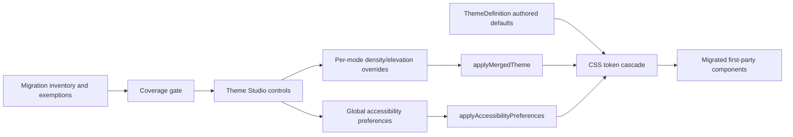

# Design

## Overview

The migration introduces four constrained token families without immediately
exposing them in Theme Studio. Each family first gains a typed contract,
runtime application, and consumer migration; its editor control is added only
after the coverage gate in R6 is met. Density and elevation remain aesthetic,
per-color-mode overrides in `UserThemeOverrides`. Focus thickness and motion
are stored as global accessibility preferences so they cannot change when the
user switches light/dark mode.

## Architecture



### Components

- **Theme token contract** (`app/theme/_shared/types.ts`, validation, and CSS
  generation): owns optional author-facing density and elevation defaults and
  documents CSS fallbacks. Serves R1, R2, R5, R7.
- **Per-mode appearance overrides** (`UserThemeOverrides` and
  `applyMergedTheme`): owns validated density and elevation selections for the
  current light/dark profile. Serves R1, R2, R5, R6.
- **Global accessibility preferences** (new focused composable under
  `app/core/theme/`): owns focus thickness and motion preference in one
  mode-independent localStorage record. Serves R3, R4, R6.
- **Token consumer migration** (existing components, theme configs, and theme
  styles): replaces hardcoded values deliberately, retaining the original
  value as the local CSS fallback. Serves R1-R5.
- **Migration inventory** (`planning` artifact during migration, promoted to a
  checked script only if manual auditing proves insufficient): records every
  consumer, selected tier, exemption, and verification status. Serves R6, R7.
- **Theme Studio controls** (Density/Elevation under Advanced or Shape;
  Focus/Motion under Accessibility): writes constrained values only after the
  coverage gate passes. Serves R2-R6.

## Components and Interfaces

### Persisted enums

```ts
export type DensityPreset =
    | 'theme'
    | 'compact'
    | 'comfortable'
    | 'spacious';

export type ElevationPreset =
    | 'theme'
    | 'flat'
    | 'subtle'
    | 'expressive';

export type MotionPreference = 'system' | 'reduced';

export interface UserThemeOverrides {
    density?: {
        enabled?: boolean;
        preset?: DensityPreset;
    };
    elevation?: {
        enabled?: boolean;
        preset?: ElevationPreset;
    };
}

export interface UserThemeAccessibilityPreferences {
    focusRingWidthPx: number; // clamped 1-4
    motion: MotionPreference;
}
```

The aesthetic objects retain an enabled flag so saved values survive temporary
disablement. Accessibility preferences are always effective and use safe
defaults (`2px`, `system`) rather than an enabled flag.

### Token families

```css
/* Density: components keep their current value as the final fallback. */
--app-control-height-small
--app-control-height-medium
--app-control-height-large
--app-space-control
--app-space-section

/* Focus: color is theme-authored and width is user-accessible. */
--app-focus-ring-width
--app-focus-ring-offset
--md-focus-ring /* falls back to --md-primary */

/* Motion */
--app-motion-duration-fast
--app-motion-duration-medium
--app-motion-duration-slow
--app-motion-easing-standard

/* Elevation */
--app-elevation-low
--app-elevation-medium
--app-elevation-high
```

Each consumer uses a fallback that matches its current declaration, for
example `min-height: var(--app-control-height-medium, 36px)` or
`box-shadow: var(--app-elevation-medium, 0 2px 8px rgb(0 0 0 / 8%))`. This
preserves existing themes until they or a user explicitly set the new token.

### Density preset application

One pure mapping function returns the five density values for each enum. The
runtime applies only known values to the root element. Mobile/coarse-pointer
CSS wraps interactive height tokens with `max(44px, var(...))`; component
exceptions such as icon glyph size remain local and are not density tokens.

### Focus and motion application

`useThemeAccessibilityPreferences` loads one versioned localStorage record,
validates it, and applies root variables plus `data-motion="system|reduced"`.
The System mode uses a media query to substitute Reduced duration tokens when
the OS requests reduced motion. Reduced mode stops decorative loops and uses
short state transitions; functional progress retains a still visual state or
textual status. A global Off mode is deferred until every functional animation
has a verified non-motion replacement.

### Elevation preset application

One pure preset mapper supplies low/medium/high shadow stacks derived from
`--md-shadow`. Flat returns `none` for all tiers. Theme default removes inline
override variables so the theme/local component fallback wins.

## Data Models

No database schema is required.

- Existing keys `or3:user-theme-overrides:light` and
  `or3:user-theme-overrides:dark` gain optional density and elevation objects.
- New key `or3:user-theme-accessibility` stores a versioned object containing
  focus thickness and motion preference.
- Missing or malformed global data resolves to `{ focusRingWidthPx: 2,
  motion: 'system' }` and is rewritten only after the next user change.

## Error Handling

- Unknown enums are rejected at the setter and load boundaries; the active
  theme or safe accessibility default remains effective.
- Numeric focus values are clamped to 1-4 before reaching CSS.
- localStorage parse or write failures follow the existing override-store
  behavior: parsing falls back safely, quota errors produce a user-visible
  storage warning, and runtime styling remains usable for the session.
- A missing theme token is not an error; the consumer's exact pre-migration CSS
  value is the fallback.
- A consumer that cannot safely use a shared token is recorded as an exemption
  instead of being force-migrated.

## Testing Strategy

- **Unit:** preset mapping, enum rejection, focus clamping, legacy/missing
  storage, CSS-variable apply/remove behavior, and OS reduced-motion resolution
  (R1-R5, R7.AC2).
- **Component:** representative input, button, menu, dialog, toolbar, and
  navigation components resolve the correct tier and retain 44px mobile targets
  (R2-R5).
- **Integration:** switching themes and light/dark modes preserves global
  accessibility settings while density/elevation follow the selected mode
  (R2.AC4, R3.AC4, R4.AC4, R5.AC3).
- **End-to-end:** Playwright matrix for Blank, Retro, and Cyberpunk in light and
  dark at desktop and mobile widths; capture computed styles rather than relying
  only on screenshots (R7.AC3).
- **Static audit:** targeted `rg` inventory of hardcoded heights/gaps,
  focus widths, durations, and shadows, with every remainder classified before
  controls ship (R6.AC1, R7.AC1).

## Design Decisions

### Presets instead of raw density or shadow sliders

Raw spacing and shadow strings create invalid combinations and overwhelm the
editor. Four named choices per family are bounded, testable, and easy to remove
or revise.

### Accessibility settings are global

Storing focus and motion in light/dark profiles could silently reduce
accessibility when color mode changes. A separate small record is preferable to
duplicating and synchronizing values across both profiles.

### Preserve local values as CSS fallbacks

Immediately replacing hundreds of distinct declarations with one global value
would flatten theme character. The selected design adds a shared override seam
while preserving each component's current authored fallback until a preset or
theme opts in.

### Coverage gate before editor exposure

The previous editor problem came from controls that affected only a subset of
the application. A measurable 90% first-party migration threshold prevents the
same failure while allowing documented specialty exceptions.

### No generic token framework

Each family gets a small typed mapper and explicit CSS variables. A dynamic
token registry would add indirection without a current need.

## Risks & Mitigations

- **Risk:** Density changes cause clipped text or broken toolbars.
  **Mitigation:** migrate by component family, retain minimum-content sizing,
  and test longest localized labels plus mobile widths.
- **Risk:** Flat elevation removes the only visible boundary. **Mitigation:**
  require semantic border tokens on elevated components before marking them
  migrated.
- **Risk:** Reduced motion hides progress. **Mitigation:** inventory functional
  animations separately and provide static/progress-text alternatives. Do not
  add a global Off mode in the initial release.
- **Risk:** Theme-specific overrides outrank root tokens. **Mitigation:** verify
  computed styles for all shipped themes and place token consumption at the
  final authored declaration rather than adding broad `!important` rules.
- **Risk:** The migration becomes an indiscriminate search-and-replace.
  **Mitigation:** require a per-consumer tier decision, explicit exemption, and
  component-level verification in the inventory.
