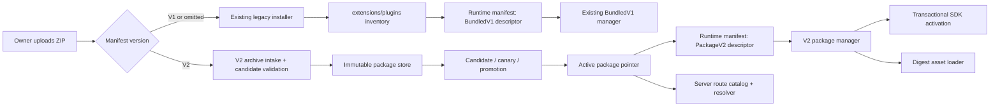

# Design

## Overview

Add V2 as an additive package lane. V1 continues to use `extensions/plugins`, `installExtensionFromZip`, the bundled catalog, and `BundledV1PluginManager`; no V1 module, manifest, or plugin API is interpreted as V2. A V2 archive is identified by `manifestVersion: 2`, staged in the existing immutable package store, explicitly promoted through its pointer, resolved into the existing `PackageV2PluginDescriptor`, and activated by a new V2-only manager.

The initial production profile supports server-only V2 packages in an SSR deployment. Client V2 activation is wired but remains blocked per descriptor unless its declared trust profile has passed the production ABI/CSP gate. This produces a usable, reversible end-to-end path while keeping the currently unproven trusted-host UI profile unavailable rather than pretending it works.

## Architecture



### Components

- `PluginArchiveIntake`: Dispatches a ZIP to the unchanged legacy installer or the V2 candidate workflow only after safe archive inspection. Serves R1, R2.
- `V2PackageOperations`: Thin server composition layer over `ImmutablePluginPackageStore`, `PluginPackageCandidateService`, candidate canary, pointer, promotion, and lifecycle services. Serves R2, R5.
- `SelectedPluginDescriptorResolver`: Adds selected V2 packages to the existing runtime-manifest response, while retaining the current V1 resolver verbatim. Serves R1, R3, R5.
- `PackageV2WorkspaceManager`: Reconciles only `PackageV2PluginDescriptor`s, loads allowed client modules, creates the SDK context, and owns `TransactionalPluginScope` cleanup. Serves R4, R5.
- `WorkspacePluginRuntimeCoordinator`: Fetches the union runtime manifest and sends V1 descriptors to the existing V1 manager and V2 descriptors to the V2 manager. It owns session/HMR stop ordering but does not alter either manager's loader semantics. Serves R1, R3, R4.
- `V2RuntimeObservability`: Adds selected-digest/generation/outcome details to existing runtime records and the Runtime Inspector. Serves R5.

## Components and Interfaces

### 1. Archive dispatch

Keep `POST /api/admin/extensions/install` as the UI-facing upload API so existing clients do not need a migration. After the existing auth, rate-limit, and archive-size checks, inspect only the manifest and dispatch by its exact version:

```ts
type PluginInstallOutcome =
  | { readonly kind: 'legacy-installed'; readonly manifest: Or3ExtensionManifestV1; readonly restartRequired: true }
  | { readonly kind: 'v2-candidate-prepared'; readonly pluginId: string; readonly packageDigest: Sha256; readonly candidateStatus: 'ready' | 'blocked'; readonly restartRequired: false };

async function installPluginArchive(input: {
  archive: Buffer;
  force: boolean;
  actorId: string;
}): Promise<PluginInstallOutcome>;
```

`manifestVersion` omitted or `1` calls the existing `installExtensionFromZip` unchanged. A V2 archive is extracted to a request-scoped, validated temporary directory using the same ZIP limits/path checks, then passed to `PluginPackageCandidateService.prepare`. The temporary directory is always deleted after candidate preparation. `force` has no V2 pointer-replacement meaning: a candidate is always a new immutable digest, so promotion remains explicit.

Before accepting V2, `PluginArchiveIntake` checks for an existing legacy plugin with the same ID and returns `plugin-id-conflicts-with-legacy-extension`. This prevents two managers from owning one plugin ID. A future explicit migration command may be added later; it is not implicit in upload.

### 2. Package operations

Expose owner-only server handlers, backed by one process-local composition factory, for candidate inspection/canary, promotion, rollback, disable, and explicit deletion. Reuse the existing package services and pointer store; do not make the browser instantiate them.

```ts
interface V2PackageOperations {
  prepare(input: PreparePluginPackageCandidateInput): Promise<PreparePluginPackageCandidateResult>;
  promote(input: PromotePluginPackageInput): Promise<PromotionResult>;
  rollback(input: RollbackPluginPackageInput): Promise<PromotionResult>;
  disable(workspaceId: string, pluginId: string): Promise<void>;
}
```

Preparation validates engine range, manifest, digest, reviewed grants, dependencies, and state compatibility before the active pointer changes. Promotion is the sole operation that changes the startup-selected digest. Disable updates existing workspace enablement but deliberately keeps the pointer/package/state, matching the current lifecycle service.

### 3. Runtime-manifest union

Replace the V1-only `PluginRuntimeManifestEntry` discriminant with an additive descriptor union:

```ts
type RuntimeDescriptorEntry =
  | { readonly descriptorStatus: 'ready'; readonly descriptor: BundledV1PluginDescriptor }
  | { readonly descriptorStatus: 'ready'; readonly descriptor: PackageV2PluginDescriptor }
  | { readonly descriptorStatus: 'blocked'; readonly blockCode: V2BlockCode }
  | { readonly descriptorStatus: 'rebuild-required'; readonly rebuildRequiredReason: 'not-in-host-build' | 'entrypoint-mismatch' };
```

The resolver first reads legacy inventory exactly as today. A legacy-inventory entry that declares `manifestVersion: 2` is retained on disk but reported as `legacy-v2-reinstall-required`; it is never coerced into a V1 descriptor. The resolver separately reads active package pointers, verifies the immutable package tree, parses the V2 manifest, resolves grants/dependencies/policy for the requesting workspace, and constructs a `PackageV2PluginDescriptor` only when all gates pass. V2 descriptors are produced only when both SSR and `pluginModuleLoaderV2Enabled` are true and the workspace is inside the immutable startup canary selector. Any V2 state change is included in the opaque revision hash.

The ID conflict rule makes the two input sets disjoint. The response therefore has one descriptor per ID without changing V1 descriptor fields or their rebuild-required behavior.

### 4. Workspace coordinator and V2 manager

Retain `BundledV1PluginManager` and `createBundledV1WorkspaceManager` as they are. Introduce `PackageV2WorkspaceManager` with the same reconcile boundary pattern, but a different loader and lifecycle contract:

```ts
interface ManagedPackageV2Instance {
  setup(): Promise<void>;
  stop(reason: unknown): Promise<TransactionalCleanupReport>;
}

interface PackageV2WorkspaceManagerOptions {
  fetchDesired(signal: AbortSignal): Promise<{ descriptors: readonly PackageV2PluginDescriptor[]; revision: string }>;
  load(descriptor: PackageV2PluginDescriptor, generation: number, signal: AbortSignal): Promise<ManagedPackageV2Instance>;
}
```

`WorkspacePluginRuntimeCoordinator` is the only new replacement at the Nuxt startup entrypoint. It uses the existing V1 manager for `manifestVersion: 1` descriptors and the V2 manager for `manifestVersion: 2` descriptors. On workspace switch, HMR, and shutdown it stops V2 first, then preserves current V1 stopping behavior. It never tries V1 as a fallback for a V2 descriptor.

`PackageV2WorkspaceManager.load` uses `ModuleV2Loader` only after descriptor trust and generation checks. It validates that the exported default is an `Or3PluginDefinition`, verifies its manifest identity matches the server descriptor, creates `TransactionalPluginScope`, and passes a host-created `PluginContext` from `createHostPluginContext`. SDK contribution/hook adapters stage into that scope. The sequence is:

1. Verify descriptor, reviewed grants/features/trust and generation.
2. Import through the digest asset URL.
3. Call `setup(context)` while registrations stage in `TransactionalPluginScope`.
4. Run scope validation and pre-activation.
5. Publish once through `ActivationTable`.
6. On error or stale generation, dispose the hidden scope; on replacement/disable, dispose the published scope exactly once.

Existing `ModuleV2Loader` blocking behavior remains authoritative: static builds, loader-off, missing host ABI, and unsupported isolation modes fail before import. Trusted-host UI additionally requires the existing host-ESM facade proof to return `supported`.

### 5. Server route and asset activation

The existing package asset route and route dispatcher already know how to serve/use an active pointer when `pluginModuleLoaderV2Enabled` is true. The new runtime-manifest/promotion flow is the missing source of selected pointers. Route dispatch must additionally check that the plugin is enabled for the session workspace before it resolves a V2 handler, keeping package-wide selection separate from workspace-scoped authority.

### 6. Rollout controls and observability

Use two immutable startup decisions:

```ts
type V2PackageStartupPolicy = Readonly<{
  moduleLoaderEnabled: boolean;
  packageWorkspaceCanaryIds: readonly string[];
  ssrHost: boolean;
}>;
```

V2 package activation requires all three: SSR host, `pluginModuleLoaderV2Enabled`, and a selected workspace. Add `pluginModuleLoaderV2WorkspaceIds` / `OR3_PLUGIN_MODULE_LOADER_V2_WORKSPACE_IDS` as a separate startup-only allowlist (empty means all workspaces once explicitly enabled). Do not reuse `pluginRuntimeV2WorkspaceIds`: that setting governs the existing V1 manager canary. Runtime records/logs include descriptor key, digest, generation, trust, lifecycle status, and a stable failure code; grant contents, settings, and secrets are excluded.

## Data Models

No new database table or package registry is required. The existing immutable package tree and pointer/state files remain authoritative for package selection and lifecycle. Existing workspace settings remain authoritative for workspace enablement and reviewed grants.

One new typed manifest response state is required: `blocked` with a closed `V2BlockCode` union. It communicates gate outcomes such as `flag-off`, `outside-canary`, `static-build-unsupported`, `unreviewed-grants`, `dependency-unsatisfied`, `trust-mode-unsupported`, `legacy-id-conflict`, and `trusted-host-ui-abi-unproven` without exposing package paths or internal errors.

## Error Handling

| Failure | Behavior |
|---|---|
| Malformed/unsafe archive | Reject before package installation; preserve pointers and legacy inventory. |
| Candidate validation/review/dependency failure | Store no selected pointer; return a stable candidate block reason. |
| Promotion CAS/canary/state preflight failure | Keep the previous selected digest and state unchanged. |
| V2 module import/setup/staging failure | Dispose hidden scope; keep prior visible V2 generation; record an activation failure. |
| Generation superseded during import/setup | Abort and dispose; never publish the stale generation. |
| V2 cleanup failure | Continue all cleanups, mark degraded state, and do not claim a clean replacement. |
| V1 manager/loader failure | Preserve existing V1 error behavior; do not route it through V2 logic. |
| Flag disabled, outside package canary, or static host | Advertise V2 as blocked, never silently fall back to V1 or another trust mode. |

## Testing Strategy

- Unit: archive-version dispatch, legacy ID conflict, V2 descriptor construction, revision invalidation, startup policy, stable blocked codes, V2 exported-definition identity checks, and transactional cleanup. (R1–R5)
- Integration: temporary package archive → candidate → reviewed promotion → selected pointer → runtime manifest; V1 and V2 enabled in different IDs/workspaces; package route authorization against an enabled and disabled workspace. (R1–R5)
- Production SSR build E2E: server-only V2 fixture install/promotion/enable/route/update/rollback/disable and a concurrent V1 fixture regression path. (R6.AC1–R6.AC2)
- Failure injection: import, setup, pre-activation, publication, cleanup, candidate and pointer failures, with no stale visible generation. (R4, R6.AC4)
- Separate release gate for trusted-host UI: host ABI facade, Vue/SDK singleton identity, same-origin digest imports, and CSP in a real Nuxt build. Do not enable the client profile until it passes. (R4.AC5, R6.AC3)

## Design Decisions

1. **Parallel V1/V2 lanes, not a V1 conversion.** This is the smallest design that preserves developed plugins: V1's directory inventory and loader remain untouched, while V2 owns immutable artifacts and transactional activation. A legacy-directory V2 artifact is explicitly reported for re-upload rather than changed in place.
2. **One upload API with explicit manifest dispatch.** Keeping the endpoint avoids an admin UI/API migration, while a strict manifest-version branch prevents V2 from accidentally entering the legacy installer.
3. **Reject cross-lane ID collisions.** This is safer and simpler than precedence rules or dual execution. A later, explicit migration workflow can stop V1, promote V2, and offer a controlled rollback.
4. **Server-only V2 is the first released profile.** It exercises real archive, promotion, pointer, descriptor, authorization, and rollback flows without claiming trusted client UI is ready. Waiting to release anything until UI is proven would keep all existing V2 activation code disconnected indefinitely.
5. **Do not make the existing V1 manager generic.** A generic manager would risk changing V1 lifecycles. A V2-specific manager can reuse lifecycle primitives while preserving the implementation and observable behavior of the V1 lane.

## Risks & Mitigations

| Risk | Mitigation |
|---|---|
| V1 behavior accidentally changes while sharing the install endpoint | Lock V1 branch to current installer and response with contract tests; do not refactor its loader. |
| Package pointer applies across workspaces unexpectedly | Keep pointer selection package-wide but require existing workspace enablement and per-workspace policy/grant checks in the manifest and route dispatcher. |
| V2 client module imports a duplicate Vue or SDK runtime | Keep trusted-host UI blocked until the real host-facade production proof is green; use no automatic fallback. |
| Bad V2 update leaves a half-registered UI | Use `TransactionalPluginScope`; test every pre-publication fault and cleanup path. |
| Operators mistake a component flag for successful activation | Surface explicit runtime status/block codes and require the production E2E and a bounded workspace canary before default promotion. |
