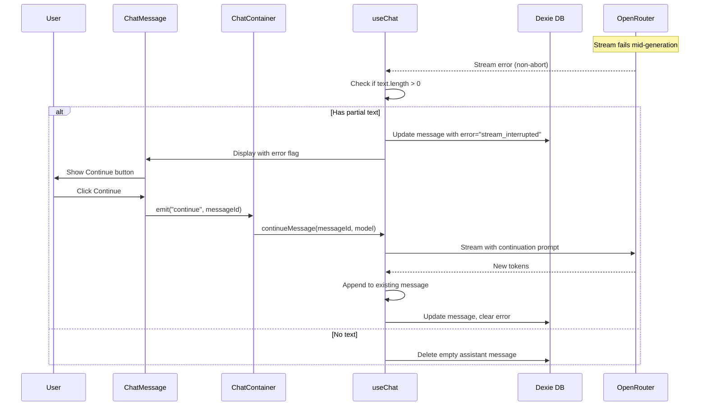

# Continue Feature - Technical Design

## Overview

This feature enables users to resume interrupted AI chat streams by preserving partial assistant responses and providing a Continue action. The design prioritizes minimal code changes by leveraging existing infrastructure (`Message.error` field, streaming pipeline, retry patterns).

## Architecture



## Component Changes

---

### useAi.ts (Composable)

#### Stream Error Handling Modification

**Location**: Lines 1321-1365 (catch block for non-abort errors)

**Current Behavior**: 
- On stream error, if `tailAssistant.value?.text` is empty, delete the assistant message
- Otherwise, just clear the pending flag

**New Behavior**:
- On stream error with `text.length > 0`: 
  - Keep the assistant message
  - Set `error: 'stream_interrupted'` on the message in DB
  - Keep `tailAssistant.value` so it remains visible
- On stream error with `text.length === 0`:
  - Delete the assistant (current behavior)

```typescript
// In the catch block (lines ~1352-1365), change:
if (!tailAssistant.value?.text && tailAssistant.value?.id) {
    // Delete empty assistant (existing behavior)
    await db.messages.delete(tailAssistant.value.id);
    // ... splice from rawMessages
    tailAssistant.value = null;
} else if (tailAssistant.value?.pending) {
    tailAssistant.value.pending = false;
}

// To:
if (!tailAssistant.value?.text && tailAssistant.value?.id) {
    // Delete empty assistant (existing behavior)
    await db.messages.delete(tailAssistant.value.id);
    // ... splice from rawMessages
    tailAssistant.value = null;
} else if (tailAssistant.value?.id && tailAssistant.value.text) {
    // Preserve partial text and mark as failed
    tailAssistant.value.pending = false;
    tailAssistant.value.error = 'stream_interrupted';
    await db.messages.update(tailAssistant.value.id, {
        error: 'stream_interrupted',
        updated_at: nowSec(),
    });
}
```

#### New continueMessage Function

**Location**: After `retryMessage` function (~line 1597)

```typescript
async function continueMessage(messageId: string, modelOverride?: string) {
    if (loading.value || !threadIdRef.value) return;
    
    // 1. Find the target assistant message
    const target = await db.messages.get(messageId);
    if (!target || target.role !== 'assistant' || target.thread_id !== threadIdRef.value) return;
    
    // 2. Get existing text content
    const existingText = deriveMessageContent({ content: target.content, data: target.data });
    if (typeof existingText !== 'string') return;
    
    // 3. Build message history for context (all messages up to and including target)
    const DexieMod = (await import('dexie')).default;
    const allMsgs = await db.messages
        .where('[thread_id+index]')
        .between([threadIdRef.value, DexieMod.minKey], [threadIdRef.value, target.index])
        .filter((m: Message) => !m.deleted)
        .toArray();
    allMsgs.sort((a, b) => (a.index || 0) - (b.index || 0));
    
    // 4. Convert to OpenRouter format, adding continuation instruction
    const orMessages = await Promise.all(allMsgs.map(/* existing conversion logic */));
    
    // Add transient continuation instruction
    orMessages.push({
        role: 'user',
        content: [{ type: 'text', text: 'Please continue your previous response from where you left off.' }],
    });
    
    // 5. Stream new content, appending to existing
    // Reuse existing streaming infrastructure but target the existing message
    loading.value = true;
    aborted.value = false;
    abortController.value = new AbortController();
    
    try {
        const stream = openRouterStream({
            apiKey: apiKey.value,
            model: modelOverride || currentModelId,
            orMessages,
            signal: abortController.value.signal,
        });
        
        // Set up tailAssistant to point to existing message
        const current = ensureUiMessage({
            ...target,
            text: existingText,
            pending: true,
            error: null,
        });
        tailAssistant.value = current;
        
        for await (const ev of stream) {
            if (ev.type === 'text') {
                current.text += ev.text;
                current.pending = false;
            }
            // Handle other event types as needed
        }
        
        // 6. Persist updated content and clear error
        await db.messages.update(messageId, {
            data: { ...target.data, content: current.text },
            error: null,
            updated_at: nowSec(),
        });
        current.error = undefined;
        
    } catch (err) {
        // On error, preserve what we have and keep error flag
        if (tailAssistant.value?.text) {
            await db.messages.update(messageId, {
                data: { ...target.data, content: tailAssistant.value.text },
                error: 'stream_interrupted',
                updated_at: nowSec(),
            });
        }
    } finally {
        loading.value = false;
        if (tailAssistant.value?.pending) tailAssistant.value.pending = false;
        abortController.value = null;
    }
}
```

#### Export Addition

Add `continueMessage` to the return object (~line 1665):

```typescript
return {
    // ... existing exports
    continueMessage,  // NEW
};
```

---

### uiMessages.ts

#### UiChatMessage Interface Extension

**Location**: Lines 43-58

```typescript
export interface UiChatMessage {
    id: string;
    role: 'user' | 'assistant' | 'system' | 'tool';
    text: string;
    file_hashes?: string[];
    reasoning_text?: string | null;
    stream_id?: string;
    pending?: boolean;
    toolCalls?: ToolCallInfo[];
    error?: string | null;  // NEW: Stream failure indicator
    // ... existing workflow fields
}
```

#### RawMessageLike Interface Extension

**Location**: Lines 15-31

```typescript
interface RawMessageLike {
    // ... existing fields
    error?: string | null;  // NEW
}
```

#### ensureUiMessage Mapping

**Location**: In `ensureUiMessage` function (~line 203), add error mapping:

```typescript
return {
    id,
    role,
    text,
    file_hashes,
    reasoning_text,
    stream_id: raw.stream_id,
    pending,
    toolCalls,
    error: raw.error ?? raw.data?.error ?? undefined,  // NEW
    isWorkflow,
    workflowState,
};
```

---

### history.ts

#### Error Field Mapping

**Location**: In `ensureThreadHistoryLoaded` (~line 28-52), ensure error is mapped:

```typescript
return {
    role: dbMsg.role as ChatMessage['role'],
    content,
    id: dbMsg.id,
    stream_id: dbMsg.stream_id ?? undefined,
    file_hashes: dbMsg.file_hashes,
    error: dbMsg.error ?? null,  // NEW
    // ... rest
};
```

---

### ChatMessage.vue

#### Continue Button Addition

**Location**: In action bar section (~lines 256-304)

```vue
<!-- After Retry button -->
<UTooltip
    v-if="showContinueButton"
    :delay-duration="500"
    text="Continue"
    :popper="{ strategy: 'fixed' }"
    :teleport="true"
>
    <UButton
        v-bind="continueButtonProps"
        @click="onContinue"
    ></UButton>
</UTooltip>
```

#### Computed Properties

```typescript
const showContinueButton = computed(() => 
    props.message.role === 'assistant' &&
    props.message.error &&
    (props.message.text?.length ?? 0) > 0
);

const continueButtonProps = computed(() => {
    const overrides = useThemeOverrides({
        component: 'button',
        context: 'message',
        identifier: 'message.continue',
        isNuxtUI: true,
    });
    return {
        icon: useIcon('chat.message.continue').value || 'heroicons:play-20-solid',
        color: 'success' as const,
        size: 'sm' as const,
        class: 'text-black dark:text-white/95 flex items-center justify-center',
        ...overrides.value,
    };
});
```

#### Event Emission

```typescript
const emit = defineEmits<{
    // ... existing
    (e: 'continue', id: string): void;  // NEW
}>();

function onContinue() {
    emit('continue', props.message.id);
}
```

---

### ChatContainer.vue

#### Event Handler Wiring

**Location**: In template (~line 41)

```vue
<LazyChatMessage
    :message="item"
    :thread-id="props.threadId"
    @retry="onRetry"
    @continue="onContinue"  <!-- NEW -->
    @branch="onBranch"
    <!-- ... -->
/>
```

#### Handler Function

**Location**: After `onRetry` (~line 620)

```typescript
function onContinue(messageId: string) {
    if (!chat.value || chat.value?.loading?.value) return;
    chat.value.continueMessage(messageId, model.value);
    nextTick(() => scroller.value?.refreshMeasurements?.());
}
```

---

## Data Model

No schema changes required. Uses existing `Message.error` field:

```typescript
// From schema.ts line 78
error: z.string().nullable().optional(),
```

**Values**:
- `null` or `undefined`: Normal message
- `'stream_interrupted'`: Stream failed with partial content

---

## Error Handling

| Scenario | Behavior |
|----------|----------|
| Stream error, no text | Delete assistant message (unchanged) |
| Stream error, has text | Preserve message, set `error='stream_interrupted'` |
| Continue success | Clear `error`, update content |
| Continue fails | Keep `error`, preserve accumulated text |
| User aborts | Unchanged from current behavior |

---

## Testing Strategy

### Unit Tests

1. **Stream error preservation**: Mock stream failure after receiving text, verify message persisted with error flag
2. **Error flag mapping**: Verify `ensureUiMessage` properly maps error from raw message
3. **Continue button visibility**: Test computed `showContinueButton` logic

### Manual Verification

1. Trigger stream interruption (e.g., network disconnect mid-stream)
2. Verify partial text is visible with Continue button
3. Click Continue and verify seamless text appending
4. Refresh page and verify failed message loads with Continue option

### Test File Update

Update `app/pages/_tests/use-ai.vue` test case `stream-error` (lines 690-730):

```typescript
// Currently expects only user message persists
// Change to expect assistant with error flag when partial text exists
```
