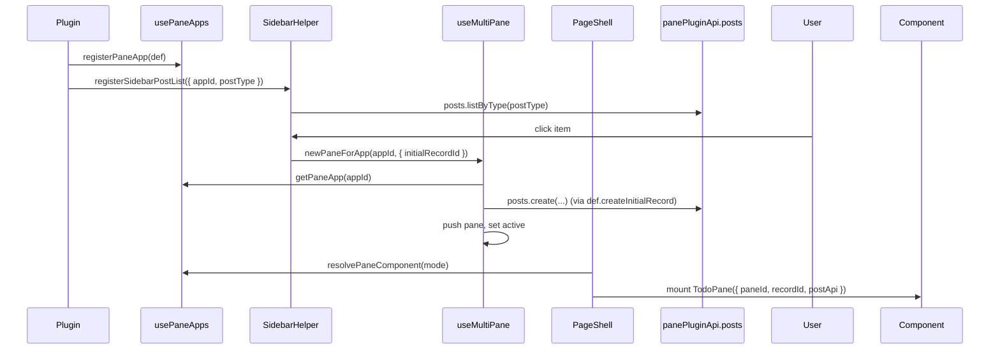

artifact_id: 5baaa868-20c0-4e47-b5fa-066eca3eee08
content_type: text/markdown

# design.md

## Overview

Custom Pane Apps (CPA) generalise the multi-pane workspace so plugins can mount arbitrary Vue components beside chat and docs while persisting data in the existing `posts` table. The design keeps the current split-pane UX, preserves URL/document/chat behaviour, and layers a thin registry + resolver on top of established patterns (`useDashboardPlugins`, `useSidebarSections`, `pane-plugin-api`).

The implementation adds ~6 small touchpoints:

1. Widen `PaneState.mode` typing (runtime stays unchanged).
2. Introduce a registry composable `usePaneApps()` that plugins use to register pane app definitions.
3. Extend `useMultiPane()` with `newPaneForApp()` and expose it via the global pane API.
4. Teach `PageShell.vue` to resolve custom pane components dynamically and pass a compact prop contract.
5. Add `posts` CRUD helpers to `pane-plugin-api.client.ts`.
6. Provide a sidebar DX helper + composable for listing posts by `postType`.

Existing chat/doc code paths continue to run exactly as before; custom panes only execute when plugins opt in.

## Key Components & Changes

### 1. PaneState Mode Generalisation

-   Update `PaneState.mode` type from `'chat' | 'doc'` to a branded string:

    ```ts
    export type PaneMode = 'chat' | 'doc' | (string & { _brand?: 'pane-mode' });
    ```

-   Keep `createEmptyPane()` defaulting to `'chat'`.
-   Update downstream TS references (`hook-types`, docs) to depend on `PaneMode`.
-   No runtime property changes; only the type needs to loosen.

### 2. Pane App Registry (`usePaneApps.ts`)

-   File: `app/composables/core/usePaneApps.ts`.
-   Structure mirrors `useDashboardPlugins`:
    -   Stores entries in `globalThis.__or3PaneAppsRegistry` (Map).
    -   Exposes `registerPaneApp`, `unregisterPaneApp`, `getPaneApp`, `listPaneApps`.
    -   Normalises components via `markRaw` to avoid Vue reactivity overhead.
    -   Keeps computed list sorted by `order ?? 200`.
-   `PaneAppDef` fields:

    ```ts
    interface PaneAppDef {
        id: string;
        label: string;
        icon?: string;
        component: Component | (() => Promise<any>);
        postType?: string;
        createInitialRecord?: (ctx: { app: PaneAppDef }) => Promise<{ id: string } | null>;
        reuseExistingPane?: (ctx: { panes: PaneState[] }) => PaneState | null; // optional phase 2, default undefined
    }
    ```

-   Initial version omits advanced lifecycle hooks—keep minimal.

### 3. Multi-pane API Extension

-   Inside `useMultiPane`:
    -   Inject registry via lazy import (`usePaneApps`).
    -   Add async `newPaneForApp(appId: string, opts?: { reuse?: boolean })`.
    -   Flow:
        1. Guard `canAddPane`.
        2. Resolve `PaneAppDef`; if missing, log dev warning and abort.
        3. Optionally reuse existing pane when `opts.reuse` and plugin-provided helper says yes (future-proof).
        4. Create pane skeleton `{ id, mode: appId, threadId: '', documentId: undefined, messages: [], validating: false }`.
        5. If `createInitialRecord` exists, await result (wrapped in try/catch). Assign returned `id` to `pane.documentId`. Capture `postType` on the pane via new optional field `appMeta?: { id: string; postType: string }`.
        6. Push pane, flip `activePaneIndex`, fire `ui.pane.open:action:after` (reuse existing hook).
    -   Export `newPaneForApp` via the returned API and the global `__or3MultiPaneApi`.
-   Add optional helper `findPaneByMode(mode, predicate?)` to simplify future reuse logic (non-public for now).

### 4. Dynamic Pane Rendering (`PageShell.vue`)

-   Replace the hard-coded `<template v-if="pane.mode === 'chat'">` ladder with:

    ```vue
    <component
        :is="resolvePaneComponent(pane)"
        v-bind="buildPaneProps(pane)"
        class="flex-1 min-h-0"
    />
    ```

-   `resolvePaneComponent`:
    -   Returns `ChatContainer` / `LazyDocumentsDocumentEditor` for built-ins.
    -   Looks up `getPaneApp(pane.mode)?.component` for others; supports async components by returning the factory.
    -   Falls back to a simple `<PaneUnknown>` stub that displays the mode and optional troubleshooting text.
-   `buildPaneProps`:
    -   Built-ins: unchanged (exact same object as before).
    -   Custom: `{ paneId: pane.id, recordId: pane.documentId ?? null, postType: getPaneApp()?.postType ?? pane.mode, postApi: panePluginApi.posts }`.
-   Keep close button / focus behaviour untouched.
-   When component factory throws, display fallback stub and console.warn in dev.

### 5. Pane Plugin API: Posts Helpers

-   Inside `pane-plugin-api.client.ts`:
    -   Add internal utility `normalizeMeta(meta: unknown): any` (mirrors DB normaliser, but parse stringified JSON for callers).
    -   Extend returned API with:

        ```ts
        posts: {
            async create(postType, data) { ... }
            async update(id, patch) { ... }
            async listByType(postType, opts?) { ... }
        }
        ```

    -   `create` uses `create.post` (existing DB helper), ensures `meta` string/object conversion.
    -   `update` reads existing row (optional), merges patch, uses `upsert.post`.
    -   `listByType` wraps a Dexie query with `.where('postType').equals(postType).filter(!deleted).reverse().sortBy('updated_at')`.
-   Extend `getActivePaneData()`:
    -   Include `recordId` for custom panes (alias of `documentId`), so consumers can detect open CPA panes.
    -   Leave doc snapshot logic untouched; skip heavy fetch for custom unless plugin API later requires.

### 6. Sidebar DX Helper

-   Create `app/composables/posts/usePostsList.ts`:
    -   Accept `postType`, optional options `{ limit?, sort? }`.
    -   Use Dexie `liveQuery` to keep `items` reactive (wrap subscription in composable to auto-clean on unmount).
    -   Expose `{ items, loading, error, refresh }`.
-   Add `app/composables/sidebar/registerSidebarPostList.ts`:
    -   Export function that builds an inline Vue component using `usePostsList`.
    -   Render list items styled with existing `SidebarListItem` (import to stay consistent).
    -   On click: call `__or3MultiPaneApi.newPaneForApp(appId)` (appId provided when registering, default to `postType`).
    -   Accept optional `emptyState` slot override or string.
-   Helper ensures plugin authors write:

    ```ts
    registerSidebarPostList({
        id: 'todo',
        label: 'Todos',
        appId: 'todo',
        postType: 'todo',
        icon: 'pixelarticons:check',
    });
    ```

-   All helpers run client-side only; guard `process.client`.

## Type & Hook Adjustments

-   Update `app/core/hooks/hook-types.ts` to use `PaneMode`.
-   For sidebar select hooks, expand `kind` to `'chat' | 'doc' | 'custom'` (optional) or keep `'chat' | 'doc'` and avoid firing the hook from CPA flows (decision: CPA helper will trigger a new hook `ui.sidebar.custom:action:open` if needed). Keep spec minimal: skip new hook for v1; simply not emit `UiSidebarSelectPayload` when launching custom apps.
-   Update public docs under `public/_documentation` and `docs/` to reflect new types.

## Data Flow: Opening a Custom Pane



## Failure Handling

-   If `createInitialRecord` throws, pane creation aborts and a toast (using existing `useToast`) is triggered; no empty pane inserted.
-   If pane component missing, render `<PaneUnknown>` so UX degrades gracefully.
-   Posts helper surfaces errors via toast (consistent with other DB helpers) and leaves list empty.
-   All new helpers guard `process.client` and no-op in SSR to avoid hydration mismatches.

## Testing Strategy

-   Unit tests:
    -   `usePaneApps` (register/overwrite/list).
    -   `newPaneForApp` (pane limit, `createInitialRecord` success/failure).
    -   `usePostsList` Dexie subscription (mock Dexie).
    -   Pane resolver ensures fallback when component missing.
-   Integration tests:
    -   Mount `PageShell` with a mock pane app, ensure component renders receiving expected props.
    -   `panePluginApi.posts` bridging real Dexie row (use test DB utilities).
-   Snapshot update: adjust existing tests that stub `PaneState.mode` unions.

## Documentation Updates

-   Extend `docs/pane-plugin-api.md` with `posts` namespace examples.
-   Add `docs/custom-pane-apps.md` (or update existing plugin docs) describing registration + sidebar helper usage.
-   Link from `docs/sidebar` and `docs/dashboard` sections to avoid duplication.

## Rollout & Backwards Compatibility

-   No migrations required. Dexie schema unchanged.
-   Feature flag optional: wrap new helper exposures behind `process.dev || runtimeConfig.features.customPaneApps` if desired (not mandatory per requirements).
-   Existing panes unaffected; if no plugins register, app behaves exactly as today.
