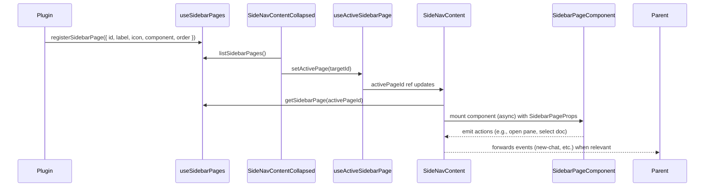

# Custom Pane Apps – Sidebar Pages (V2 Design)

## Overview

This V2 plan pivots the original Custom Pane Apps work toward a **page-based sidebar**. Instead of stacking plugin UI underneath the built-in project/chat list, `SideNavContent.vue` becomes a small router that swaps entire page components. The default page preserves the existing `SidebarVirtualList` experience, while plugins can register additional sidebar pages that mount lazily when selected. Navigation for these pages lives in the collapsed sidebar (`SideNavContentCollapsed.vue`), presenting icon buttons ordered alongside the built-in controls.

The multi-pane workspace (chat/doc/custom panes) stays intact. This change introduces a clean separation between:

- **Workspace panes** rendered inside `PageShell.vue`, managed by `useMultiPane`.
- **Sidebar pages** rendered inside `SideNavContent.vue`, managed by a new page registry.

Keeping these surfaces distinct lets plugins build richer navigation or management views without disturbing the core pane logic. Simplicity is the north star: every new abstraction mirrors existing Or3 patterns so we avoid tech debt and minimise learning overhead.

## Design Principles

1. **Prefer composition over branching.** Reusing the registry pattern (`use*Registry`) avoids special cases inside core components.
2. **Component boundaries stay clear.** `SideNavContent.vue` owns layout and event forwarding only; page components own their UI.
3. **Lazy by default.** Anything optional ships as a lazy component so baseline bundle size stays flat.
4. **Same defaults as today.** The home list behaves identically; we only extend surfaces, never break them.
5. **Nuxt-friendly.** Composables rely on `useState`, `useAsyncData`, and existing plugin bootstraps to stay SSR-safe and align with Nuxt expectations.

## Key Concepts

### Sidebar Page Registry (`useSidebarPages.ts`)

- New composable following the existing registry pattern (`usePaneApps`, `useSidebarSections`).
- Stores `SidebarPageDef` entries in `globalThis.__or3SidebarPagesRegistry`.
- Public API: `{ registerSidebarPage, unregisterSidebarPage, listSidebarPages, getSidebarPage }`.
- Definitions include:
  ```ts
  export interface SidebarPageDef {
      id: string;
      label: string;
      icon: string;
      order?: number;              // default 200
      component: Component | AsyncComponent;
      keepAlive?: boolean;         // opt-in caching
      usesDefaultHeader?: boolean; // default true for the home page
      provideContext?: (ctx: SidebarPageContext) => void;
      canActivate?: (ctx: SidebarActivateContext) => boolean | Promise<boolean>;
      onActivate?: (ctx: SidebarActivateContext) => void | Promise<void>;
      onDeactivate?: (ctx: SidebarActivateContext) => void | Promise<void>;
  }
  ```
- All non-default components are expected to be async factories (`() => import('./MyPage.vue')`). The registry wraps them via `defineAsyncComponent` to guarantee lazy mounting and uniform error handling.
- Order defaults to `200` so any custom page appears under the built-in glyphs while still letting plugin authors set a predictable sequence.
- Each registration returns an `unregister` function. Nuxt HMR calls it automatically via `import.meta.hot?.dispose`—matching existing plugin registries.

#### Minimal Implementation Sketch

```ts
const registry = useState<Map<string, SidebarPageDef>>(
    '__or3SidebarPagesRegistry',
    () => markRaw(new Map())
);

export function registerSidebarPage(def: SidebarPageDef) {
    if (!process.client) return () => {};
    const normalized = normalizeSidebarPageDef(def);
    registry.value.set(normalized.id, normalized);

    return () => {
        if (registry.value.get(normalized.id) === normalized) {
            registry.value.delete(normalized.id);
        }
    };
}
```

This mirrors our other registries, so maintenance stays trivial and predictable.

### Active Page State (`useActiveSidebarPage.ts`)

- Composable returning `{ activePageId, activePageDef, setActivePage, resetToDefault }`.
- Uses `useState('activeSidebarPage', () => 'sidebar-home')` so Nuxt handles hydration automatically.
- Persists the last page via `useLocalStorage` (or a lightweight wrapper). Write only on the client to dodge SSR warnings.
- Emits activation hooks by wrapping mutations:
  ```ts
  async function setActivePage(id: string) {
      const next = getSidebarPage(id) ?? getSidebarPage(DEFAULT_PAGE_ID);
      if (!next) return;
      if (next.canActivate && !(await next.canActivate(ctx))) return;
      await active.value?.onDeactivate?.(ctx);
      activeId.value = next.id;
      active.value = next;
      await next.onActivate?.(ctx);
      emitHook('ui.sidebar.page:action:open', { id: next.id });
  }
  ```
- The composable exposes `isCollapsed` by watching `useSidebarCollapsed()` so plugins can adjust layout.

### Default Page Extraction (`SidebarHomePage.vue`)

- Moves the current `SideNavContent` body (header + sections + `SidebarVirtualList`) into a dedicated component.
- Refactors the component to consume the new sidebar helpers instead of giant prop bags—yet it emits the same events so upstream consumers stay untouched.
- Registers itself with the page registry during Nuxt plugin init (`id = 'sidebar-home'`, icon `pixelarticons:messages-square`, label `Home`, order `0`, `usesDefaultHeader = true`).
- Keeps all styling and functionality of `SidebarVirtualList` untouched. We copy/paste the existing template, wrap it in `<template>`/`<script setup>`, and replace prop accesses (`props.projects`, etc.) with composable calls. No behavioural changes are introduced.

### Updated `SideNavContent.vue`

- Shrinks to a shell that handles three jobs:
  1. Renders `SideNavHeader` when the active page requests it.
  2. Instantiates the active page component through a resolver.
  3. Provides a shared environment so pages can pull data on demand.
- Layout stays the same: the scroll area is still `flex-1` with padding and gap classes; the bottom footer block is unchanged.
- Instead of pushing every dataset as props, the shell only passes the essentials:
  ```ts
  <component
      :is="resolvedComponent"
      :page-id="activeDef.id"
      :is-active="true"
      :set-active-page="setActivePage"
      :reset-to-default="resetToDefault"
      @sidebar-event="forwardEvent"
  />
  ```
- Immediately before rendering, the shell calls `provideSidebarEnvironment({ ... })` so the active page (and any of its children) can call helper composables to access projects, threads, documents, or workspace APIs.
- `<Suspense>` wraps the component to keep async loaders smooth. When `keepAlive` is true, the slot is wrapped with `<KeepAlive :include="cachedPageKeys">`.
- Error fallback: `<Suspense>`’s `fallback` slot renders a `SidebarPageFallback` component (small spinner + message) to keep UX consistent.

### `SideNavContentCollapsed.vue` Enhancements

- Imports `useSidebarPages()` and `useActiveSidebarPage()` to render registered page buttons beneath the existing built-in controls.
- Buttons show tooltip text (the `label`), support icons, and highlight when active using the same token classes as other nav items.
- Clicking a button runs `await setActivePage(page.id)`. If `canActivate` rejects, we show a toast via `useToast()` to avoid silent failure.
- Built-in controls remain first. We compose an array:
  ```ts
  const pageButtons = computed(() =>
      listSidebarPages()
          .filter((page) => page.id !== DEFAULT_PAGE_ID)
          .sort((a, b) => (a.order ?? 200) - (b.order ?? 200))
  );
  ```
- Accessibility mirrors existing buttons: `aria-pressed`, keyboard handlers, explicit focus ring classes.

- `registerSidebarPage` helper exported from `~/composables/sidebar/registerSidebarPage.ts` wraps `useSidebarPages` with guardrails:
  - Client-only guard.
  - Async component normalization (so plugin authors can pass either a component or a factory).
  - Automatic unregister on HMR.
  - Optional shorthand for hooking into the posts list: `registerSidebarPage.withPostsList({ ... })`.
- `useSidebarPageControls()` returns `{ pageId, isActive, setActivePage, resetToDefault }`, letting components change pages without receiving large prop bags.
- Data access flows through small helpers—`useSidebarProjects()`, `useSidebarThreads()`, `useSidebarDocuments()`, `useSidebarSections()`, `useSidebarMultiPane()`, `useSidebarPostsApi()`—each backed by the environment injection. `useSidebarMultiPane()` exposes a trimmed surface (`openApp`, `close`, `panes`, `activePaneId`), so plugin pages stay clear of the full global API. Plugins import only the pieces they need, making tests easy to mock.
- Example plugin (`custom-pane-todo-example.client.ts`) now demonstrates both:
  1. Registering the existing pane app (workspace content).
  2. Registering a sidebar page that lists todos and opens the pane when needed.
- Documentation emphasises the separation between a **sidebar page** (navigation view) and a **pane app** (workspace content). Most plugins will implement both, but they are decoupled so authors can pick only what they need.

### Lazy Loading & Lifecycle

- Page components (except default) wrap with `defineAsyncComponent` using conservative options:
  ```ts
  defineAsyncComponent({
      loader: componentFactory,
      timeout: 15_000,
      suspensible: true,
      onError(error, retry, fail, attempts) {
          if (attempts <= 2) retry();
          else fail();
      },
  });
  ```
- When a component fails to load, the shell shows `SidebarPageError` with a retry button and logs a warning in dev builds.
- `KeepAlive` is opt-in because caching every page risks leaking resources. Plugin authors enable it only when they truly need preserved state (e.g., a heavy filter UI).
- Activation hooks (`canActivate`, `onActivate`, `onDeactivate`) receive:
  ```ts
  export interface SidebarActivateContext {
      page: SidebarPageDef;
      previousPage: SidebarPageDef | null;
      isCollapsed: boolean;
      multiPane: SidebarMultiPaneApi;
      panePluginApi: PanePluginApi | null;
  }
  ```
  Hooks run sequentially and await promises so plugins can perform lightweight async checks (e.g., ensure data is seeded) without blocking the UI thread.

### Sidebar Environment & Data Helpers

- Introduce `provideSidebarEnvironment()` inside the shell which exposes a single object through Vue provide/inject. The object contains lazily evaluated getter functions so pages pull only what they need.
- Shape:
  ```ts
  export interface SidebarEnvironment {
      getMultiPane(): SidebarMultiPaneApi;
      getPanePluginApi(): PanePluginApi | null;
      getProjects(): Ref<SidebarProject[]>;
      getThreads(): Ref<ThreadListEntry[]>;
      getDocuments(): Ref<Post[]>;
      getSections(): Ref<ResolvedSidebarSections>;
      getSidebarQuery(): Ref<string>;
      setSidebarQuery(value: string): void;
  }
  ```
- Each getter wraps existing composables—`useProjectsStore`, `useThreadList`, etc.—so the environment becomes a thin adapter with memoised refs. This keeps logic in one place and avoids duplicating watchers in every page.
- Publish helper composables leveraging the environment (`useSidebarProjects()`, `useSidebarThreads()`, `useSidebarDocuments()`, `useSidebarSections()`, `useSidebarMultiPane()`, `useSidebarPostsApi()`). They simply call `inject(SidebarEnvironmentKey)` and forward to the relevant getter.
- `SidebarMultiPaneApi` is a thin adapter around `useMultiPane()` exposing only what sidebar pages need: `{ openApp, openChat, openDoc, closePane, panes, activePaneId }`. The adapter memoises the refs so repeated requests don’t add watchers.
- Testing becomes straightforward: pages can mock these helpers (`vi.mock('~/composables/sidebar/useSidebarProjects')`) without constructing large prop objects.

## Implementation Sequence

1. **Introduce registry and state.** Ship `useSidebarPages` + `useActiveSidebarPage` with unit tests before touching any component. This isolates risk and lets us develop consumers incrementally.
2. **Extract `SidebarHomePage.vue`.** Copy the current `SideNavContent` internals, then refactor it slightly to consume the new helper composables rather than raw props. Behaviour stays identical but coupling drops.
3. **Refactor `SideNavContent.vue`.** Replace the inline layout with the new shell, provide the environment, and confirm that snapshots/tests for the default page still pass.
4. **Update collapsed nav.** Render page buttons and verify interactions in both expanded and collapsed layouts.
5. **Add DX helpers.** Create convenience functions (including environment-derived helpers) and update barrel exports so plugin code reads cleanly.
6. **Refresh example plugin and docs.** Only after the base path is stable; this avoids rewriting the example twice.

Each step is shippable; we can land them gradually without breaking the app. Feature flags are unnecessary because the default page remains the same and we introduce no unstable UI until the new pages exist.

## Detailed Example: Todo Sidebar Page

```ts
// app/plugins/custom-pane-todo-example.client.ts
export default defineNuxtPlugin(async () => {
    if (!process.client) return;

    const { registerPaneApp } = usePaneApps();
    const { registerSidebarPage } = await import('~/composables/sidebar/registerSidebarPage');
    const { posts } = await usePanePluginApi();

    registerPaneApp({
        id: 'example-todo-pane',
        label: 'Todo Pane',
        icon: 'pixelarticons:checkbox',
        component: () => import('~/components/examples/TodoPane.vue'),
        postType: 'example-todo',
        order: 210,
    });

    registerSidebarPage({
        id: 'example-todo-page',
        label: 'Todos',
        icon: 'pixelarticons:list',
        order: 210,
        keepAlive: true,
        usesDefaultHeader: false,
        component: () => import('~/components/examples/TodoSidebarPage.vue'),
        provideContext(ctx) {
            ctx.expose({
                async openTodo(id: string) {
                    await ctx.multiPane.openApp('example-todo-pane', {
                        initialRecordId: id,
                    });
                },
            });
        },
        async onActivate({ multiPane }) {
            // ensure at least one pane exists when landing on the page
            if (!multiPane.panes.value.some((pane) => pane.mode === 'example-todo-pane')) {
                await multiPane.openApp('example-todo-pane');
            }
        },
    });
});
```

`TodoSidebarPage.vue` can stay tiny because the context already supplies everything:

```vue
<template>
    <div class="flex flex-col h-full gap-3 p-3">
        <header class="flex items-center gap-2">
            <UIcon name="pixelarticons:list" class="w-5 h-5" />
            <h2 class="font-medium">Todos</h2>
            <USpacer />
            <UButton size="xs" @click="createTodo">New</UButton>
            <UButton
                size="xs"
                variant="ghost"
                @click="resetToDefault()"
            >
                Home
            </UButton>
        </header>

        <UInput v-model="query" placeholder="Filter todos..." />

        <UList :items="filteredTodos" @select="openTodo">
            <template #default="{ item }">
                <span :class="{ 'line-through opacity-60': item.meta?.completed }">
                    {{ item.title }}
                </span>
            </template>
        </UList>
    </div>
</template>

<script setup lang="ts">
const { resetToDefault } = useSidebarPageControls();
const multiPane = useSidebarMultiPane();
const postsApi = useSidebarPostsApi();
const { items, refresh } = usePostsList('example-todo');

const query = ref('');
const filteredTodos = computed(() =>
    items.value.filter((todo) =>
        todo.title.toLowerCase().includes(query.value.toLowerCase())
    )
);

async function openTodo(todo) {
    await multiPane.openApp('example-todo-pane', {
        initialRecordId: todo.id,
    });
}

async function createTodo() {
    const result = await postsApi?.create({
        postType: 'example-todo',
        title: 'New todo',
        source: 'example:sidebar',
    });
    if (result?.ok) {
        await openTodo({ id: result.id });
        refresh();
    }
}
</script>
```

This example demonstrates that the combination of registry + context gives plugin authors a concise workflow without modifying core files.

## Data Flow: Switching Pages



## Simplifying Interactions

- **Search field** remains in the header. When a plugin hides the header, they take ownership of search UI.
- **Core actions** (new chat/doc/project) stay wired through `emit`. Pages that opt out of the header can expose their own controls by calling the emitted handlers directly.
- **Sidebar sections** still exist. The registry lists combine existing top/main/bottom sections with the page component. Plugin pages can reuse these arrays to show the same data with different layouts if desired.
- **Multi-pane control** flows through the context; no plugin reaches into global refs manually.

## Failure Handling

- Unknown page id → fall back to default page and warn once in dev.
- Lazy component load failure → render an error stub with retry; remain on the previous page if available.
- Activation veto (`canActivate` returns false) → keep previous page active, optionally surface a toast with reason.
- Registry misuse (duplicate id without new definition) logs a warning but overwrites to match HMR expectations.
- Context misuse (plugin tries to access `panePluginApi` during SSR) safely returns `null` because all helpers guard `process.client`.

## Performance & Reliability Notes

- Registry mutations happen rarely. Using a Map avoids Vue deep proxies and keeps `listSidebarPages()` cheap to compute.
- The shell shares a single `Suspense` boundary. This keeps hydration simple and ensures fallback UIs look consistent.
- Persisting the active page in local storage uses a debounced write to avoid excessive I/O.
- KeepAlive caches only page components that explicitly request it. We store cached IDs in a `Set` so repeated toggles do not leak memory.
- Hooks run sequentially; we guard slow hooks with `withTimeout` so a misbehaving plugin cannot freeze navigation indefinitely. On timeout, we log a warning and continue.

## Migration & Backwards Compatibility

- Existing code continues to treat the sidebar as a single component. The default page registration happens during bootstrap, so no caller code changes.
- Plugins built against the old “inline section” idea can migrate by wrapping their UI in a sidebar page component and removing custom slots from `SidebarVirtualList`.
- Because the default page uses the same props/events, diff noise stays low; we should get near-zero churn in snapshot tests.

## Testing Strategy

- **Unit tests**
  - `useSidebarPages` (register, overwrite, order sorting, async component wrapping).
  - `useActiveSidebarPage` (persistence, reset logic, activation hooks, collapsed flag).
  - `registerSidebarPage` helper (guarding client-only, HMR dispose).
  - `SideNavContentCollapsed` (renders buttons, respects ordering, handles canActivate false).
  - `SideNavContent` shell (default page render equals previous markup, keepAlive wiring).
- **Component snapshots/interaction**
  - Default page UI matches prior layout (compare rendered HTML or screenshot).
  - Switching pages toggles header visibility and mounts async component.
  - Error stub displays when loader rejects.
- **E2E/Playwright**
  - Collapsed nav button toggles between default list and plugin page.
  - Lazy loader defers network request until the button is clicked.
  - KeepAlive retains state only when requested.
- **Performance smoke**
  - Lighthouse run to confirm no regressions in bundle size.
  - Profiling to ensure page switch stays under 16ms on mid-tier devices.

## Rollout Checklist

1. Land registry + state with tests.
2. Extract and register `SidebarHomePage`.
3. Refactor shell and collapsed nav.
4. Update example plugin + docs.
5. Run E2E suite and manual QA focusing on default page parity.
6. Announce V2 plan in changelog linking to these docs.

## Documentation Updates

- Add “Sidebar Pages” section to existing plugin docs detailing registration, context helpers, and navigation icons.
- Update the todo example README demonstrating both the pane app and the sidebar page pieces.
- Note migration guidance in the current V1 docs: link to V2 plan and highlight the structural changes for plugin authors.
- Provide a cheatsheet summarising the most common functions (`registerSidebarPage`, `useSidebarPageContext`, `setActivePage`) with one-line examples.
