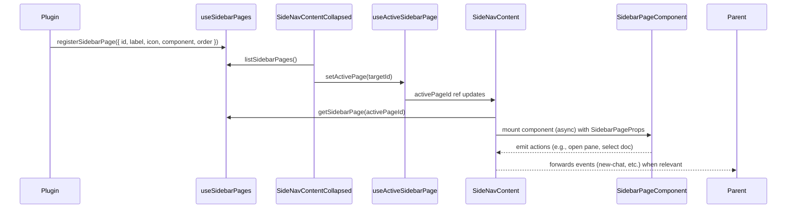

# Custom Pane Apps – Sidebar Pages (V2 Design)

## Overview

This V2 plan pivots the original Custom Pane Apps work toward a **page-based sidebar**. Instead of stacking plugin UI underneath the built-in project/chat list, `SideNavContent.vue` now acts as a router that swaps entire page components. The default page preserves the existing `SidebarVirtualList` experience, while plugins can register additional sidebar pages that mount lazily when selected. Navigation for these pages lives in the collapsed sidebar (`SideNavContentCollapsed.vue`), presenting icon buttons ordered alongside the built-in controls.

The multi-pane workspace (chat/doc/custom panes) stays intact. This update introduces a clean separation between:

- **Workspace panes** (rendered inside `PageShell.vue`, managed by `useMultiPane`) and
- **Sidebar pages** (rendered inside `SideNavContent.vue`, managed by a new page registry).

Plugins can use sidebar pages to drive richer navigation or management tools that open workspace panes as needed.

## Key Concepts

### Sidebar Page Registry (`useSidebarPages.ts`)

- New composable following the existing registry pattern (`usePaneApps`, `useSidebarSections`).
- Stores `SidebarPageDef` entries in `globalThis.__or3SidebarPagesRegistry`.
- Public API: `{ registerSidebarPage, unregisterSidebarPage, listSidebarPages, getSidebarPage }`.
- Definitions include:
  ```ts
  interface SidebarPageDef {
      id: string;
      label: string;
      icon: string;
      order?: number;             // default 200
      component: Component | AsyncComponent;
      keepAlive?: boolean;        // opt-in caching
      usesDefaultHeader?: boolean;// default true for built-in page
      provideContext?: (ctx: SidebarPageContext) => void;
      canActivate?: (ctx: SidebarActivateContext) => boolean | Promise<boolean>;
      onActivate?: (ctx: SidebarActivateContext) => void | Promise<void>;
      onDeactivate?: (ctx: SidebarActivateContext) => void | Promise<void>;
  }
  ```
- All components other than the built-in page are expected to be lazy imports (`() => import('./MyPage.vue')`); the registry wraps factories with `defineAsyncComponent` to guarantee lazy mounting.
- Default order groups plugin pages below built-in buttons while allowing deterministic ordering between plugins.

### Active Page State (`useActiveSidebarPage.ts`)

- Composable returning `{ activePageId, setActivePage, resetToDefault }`.
- Uses `useState('activeSidebarPage', ...)` (Nuxt) or Pinia store to keep state reactive across components.
- Persists the last page in `localStorage` (guarded by `process.client`) to survive reloads.
- Provides computed helpers (`isDefaultPage`, `activePageDef`).
- Exposes `watchEffect` that notifies `registerSidebarPage` callers when they become active (via `onActivate` / `onDeactivate` callbacks).

### Default Page Extraction (`SidebarHomePage.vue`)

- Moves the current `SideNavContent` body (header + sections + `SidebarVirtualList`) into a dedicated component.
- Receives the same props and emits the same events currently handled inside `SideNavContent.vue`, so existing behaviour remains intact.
- Registers itself with the page registry at app start-up (`id = 'sidebar-home'`, icon `pixelarticons:messages-square`, label `Home`, order `0`, `usesDefaultHeader = true`).
- Keeps all styling and functionality of `SidebarVirtualList` untouched.

### Updated `SideNavContent.vue`

- Becomes a lightweight shell:
  - Renders the header region conditionally (when `activePage.usesDefaultHeader` is true) and forwards events to whichever page requests them.
  - Wraps the main area in `<Suspense>` and `<KeepAlive>` depending on `SidebarPageDef.keepAlive`.
  - Calls `resolveSidebarPageComponent(activePageId)` to choose the page component.
  - Passes a unified prop bag:
    ```ts
    interface SidebarPageProps {
        id: string;
        isActive: boolean;
        setActivePage: (id: string) => void;
        resetToDefault: () => void;
        multiPaneApi: MultiPaneApi;       // from global registry
        panePluginApi: PanePluginApi | null;
        sidebarQuery: string;
        setSidebarQuery: (value: string) => void;
        sections: { top: ..., main: ..., bottom: ... };
        projects: SidebarProject[];
        threads: ThreadListEntry[];
        documents: Post[];
        emit: <K extends SidebarEvent>(event: K, payload?: PayloadMap[K]) => void;
    }
    ```
  - For the default page, props map directly to the existing inputs used by `SidebarVirtualList`. Plugin pages can opt to ignore unused fields but still have access to core actions (e.g., open a new pane through `multiPaneApi`).
- Provides injection (`SidebarPageContextKey`) so nested components can read the same context without prop drilling.

### `SideNavContentCollapsed.vue` Enhancements

- Imports `useSidebarPages()` and `useActiveSidebarPage()` to render registered page buttons beneath the existing built-in controls.
- Buttons show tooltip text (`label`), support icons from plugin definitions, and highlight when active.
- Clicking a button calls `setActivePage(page.id)` after checking `page.canActivate`.
- Respects `order` by merging built-in actions and registered pages into a single sorted list.
- Keeps keyboard accessibility: buttons expose `aria-pressed` and respond to `Enter`/`Space`.
- Default page button is always rendered first beneath the top group so users can return to the home list.

### Plugin Developer Experience

- New helper `registerSidebarPage` exported from a DX module (e.g., `~/composables/sidebar/registerSidebarPage.ts`) that wraps registry calls, enforces async components, and injects default behaviour such as:
  - Guarding `process.client`.
  - Auto-unregistering on HMR disposal.
  - Providing a page-scoped composable (`useSidebarPageContext`) for easy access to actions like `resetToDefault` or `openPane`.
- Updated example plugin (`custom-pane-todo-example.client.ts`) demonstrates registering both:
  1. The existing pane app (workspace content).
  2. A sidebar page that uses the posts list to render todos and opens panes when items are clicked.
- Documentation emphasises the separation between registering a **sidebar page** and registering a **pane app**.

### Lazy Loading & Lifecycle

- Page components (except default) are wrapped in `defineAsyncComponent` with sensible timeouts and error fallbacks.
- When a component fails to load, the shell shows a `SidebarPageError` stub with retry affordance and logs to the console in dev.
- `KeepAlive` support is opt-in to avoid leaking memory for seldom-visited pages.
- Activation hooks (`canActivate`, `onActivate`, `onDeactivate`) receive:
  ```ts
  interface SidebarActivateContext {
      page: SidebarPageDef;
      previousPage: SidebarPageDef | null;
      isCollapsed: boolean;
      multiPaneApi: MultiPaneApi;
  }
  ```

## Data Flow: Switching Pages



## Failure Handling

- Unknown page id → fall back to default page and warn once in dev.
- Lazy component load failure → render error stub with retry; remain on previous page if available.
- Activation veto (`canActivate` returns false) → keep previous page active, optionally show toast.
- Registry misuse (duplicate id without `order`) logs a warning but overwrites to match HMR expectations.

## Testing Strategy

- Unit tests:
  - `useSidebarPages` (register, overwrite, order sorting, async component wrapping).
  - `useActiveSidebarPage` (persistence, reset logic, activation hooks).
  - `SideNavContentCollapsed` (renders correct buttons, highlights active, invokes guard).
  - `SideNavContent` (default page render remains identical, plugin page lazy mounting).
- Component snapshot/interaction tests ensuring:
  - Default page UI matches prior layout (compare rendered HTML or screenshot).
  - Switching pages replaces the component and toggles header visibility.
  - Error stub displays when async import rejects.
- E2E/Playwright sanity: collapsed nav button toggles between default list and plugin page, lazy loader defers network request until first use.

## Documentation Updates

- Add “Sidebar Pages” section to the existing plugin docs detailing registration, context helpers, and navigation icons.
- Update the todo example README demonstrating both the pane app and the sidebar page pieces.
- Note migration guidance in the current V1 docs: link to V2 plan and highlight structural changes for existing plugin authors.

