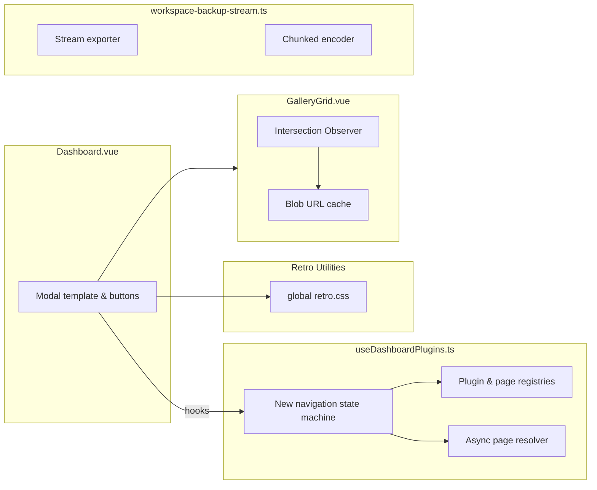

# Design: Dashboard Plugin Navigation & Performance Improvements

**artifact_id:** c8f3d36f-5e36-473d-a316-03742774fef5

## Overview

The dashboard modal must delegate navigation state, plugin lookup, and page resolution to a single composable while maintaining responsive UI rendering. Additional improvements target reusable styling, image gallery resource hygiene, and workspace backup streaming. This design introduces a dashboard navigation store layered on top of the existing plugin registry, shared CSS utilities, and performance guards around gallery and backup flows.

## Architecture

### Component Map



### Core Elements

-   **Dashboard.vue**: An adaptive modal “dumb” view that binds to navigation state and invokes composable methods for all interactions.
-   **Dashboard composable**: Maintains plugin/page registries plus a navigation state machine with typed events (`openDashboard`, `selectPlugin`, `selectPage`, `goBack`). Exposes read-only computed state used by the view.
-   **Retro CSS utilities**: A single stylesheet (e.g., `app/assets/css/retro.css`) packed with shared `.sr-only` and retro chip/input classes, imported globally.
-   **GalleryGrid.vue**: Enhanced to manage an LRU-style blob URL cache and throttle observer resets using `requestIdleCallback` or `setTimeout` fallbacks.
-   **Workspace backup stream tooling**: Adjusted to stream binary parts directly when possible and bound base64 chunk size to the documented 256 KB limit.

## Components & Interfaces

### Dashboard Navigation State

Add a navigation helper module co-located with the registry:

```ts
interface DashboardNavigationState {
    view: 'dashboard' | 'page';
    activePluginId: string | null;
    activePageId: string | null;
    loadingPage: boolean;
    error?: DashboardNavigationError;
}

interface DashboardNavigationError {
    pluginId: string;
    pageId?: string;
    message: string;
}

interface DashboardNavigationApi {
    state: Readonly<DashboardNavigationState>;
    dashboardItems: ComputedRef<DashboardPlugin[]>;
    landingPages: ComputedRef<DashboardPluginPage[]>;
    headerPluginLabel: ComputedRef<string>;
    activePageTitle: ComputedRef<string>;
    openPlugin(pluginId: string): Promise<void>;
    openPage(pluginId: string, pageId: string): Promise<void>;
    goBack(): void;
    reset(): void;
}

export function useDashboardNavigation(): DashboardNavigationApi;
```

Key behaviors:

-   `openPlugin` consults `listDashboardPluginPages`. Zero pages invokes `handler`; one page delegates to `openPage`; multiple pages switches the view to landing mode.
-   `openPage` toggles `loadingPage`, resolves the component via `resolveDashboardPluginPageComponent`, caches the `Component`, and stores the reference in state for `Dashboard.vue` to render.
-   Errors return a `DashboardNavigationError` allowing the view to show a toast or inline message.

### Retro CSS Bundle

Create `app/assets/css/retro.css` with shared utilities:

```css
.retro-chip {
    @apply inline-flex items-center gap-2 rounded-md border-2 border-[var(--md-outline-variant)] px-3 py-1 text-xs uppercase tracking-wide bg-[var(--md-surface-container)];
}

.retro-input {
    @apply w-full rounded-sm border-2 border-[var(--md-outline-variant)] bg-[var(--md-surface)] px-2 py-1 text-sm shadow-[inset_0_1px_0_rgba(255,255,255,0.08)];
}

.sr-only {
    position: absolute;
    width: 1px;
    height: 1px;
    padding: 0;
    margin: -1px;
    overflow: hidden;
    clip: rect(0, 0, 0, 0);
    white-space: nowrap;
    border: 0;
}
```

Import the file in `app/assets/css/main.css` to make classes globally available.

### Gallery Grid Enhancements

Extend the gallery component with a managed cache:

```ts
type GalleryBlobMap = Map<string, string>; // hash -> objectUrl

const objectUrlCache: GalleryBlobMap = new Map();

function ensureObjectUrl(hash: string, blob: Blob): string {
    let url = objectUrlCache.get(hash);
    if (!url) {
        url = URL.createObjectURL(blob);
        objectUrlCache.set(hash, url);
    }
    return url;
}

function pruneCache(activeHashes: Set<string>) {
    for (const [hash, url] of objectUrlCache.entries()) {
        if (!activeHashes.has(hash)) {
            URL.revokeObjectURL(url);
            objectUrlCache.delete(hash);
        }
    }
}

const scheduleObserve = createThrottle(
    () => {
        observer.disconnect();
        // re-register entries here
    },
    { delay: 50 }
);
```

### Backup Stream Refactor

Introduce streaming-friendly helpers:

```ts
async function* blobToBase64Chunks(blob: Blob, chunkSize = 128 * 1024) {
    const reader = blob.stream().getReader();
    const encoder = new TextEncoder();
    while (true) {
        const { value, done } = await reader.read();
        if (done) break;
        const chunk = base64EncodeChunk(value); // reuse typed arrays
        yield encoder.encode(chunk + '\n');
    }
}

function base64EncodeChunk(bytes: Uint8Array): string {
    let binary = '';
    for (let i = 0; i < bytes.byteLength; i++) {
        binary += String.fromCharCode(bytes[i]!);
    }
    return btoa(binary);
}
```

## Data Models

-   **Dashboard Plugin/Page**: Unchanged TypeScript interfaces already defined in the composable.
-   **Navigation State**: Introduce a `DashboardNavigationState` type stored in a Vue `reactive` object and surfaced via `readonly` wrappers to prevent external mutation.
-   **Gallery Cache**: Maintains a `Map<string, string>` keyed by asset hash.
-   **Backup Chunks**: Use `Uint8Array` for interim buffers to avoid string concatenation thrash.

## Error Handling

-   Navigation failures (missing plugin/page) throw structured errors caught by the view, which can show a toast or fallback text.
-   Gallery cache operations guard against double-revocation by checking membership before calling `URL.revokeObjectURL`.
-   Backup streaming catches encoder failures and reports progress through returned `Result` objects: `{ ok: boolean; error?: string }`.

## Testing Strategy

-   **Unit Tests**
    -   `useDashboardNavigation` covers handler invocation, single-page routing, multi-page landing flows, and error paths.
    -   Blob cache utilities verify reuse and revocation semantics.
    -   Backup chunk encoder tests ensure correct output for boundary sizes.
-   **Integration Tests**
    -   Dashboard modal render test ensures computed state drives view transitions without direct method calls.
    -   Gallery grid integration verifies throttle keeps observer calls within expected limits.
-   **End-to-End Tests**
    -   Dashboard navigation scenario (open modal → choose plugin with multi pages → back navigation).
-   **Performance Tests**
    -   Benchmark gallery observer resets against large mock datasets.
    -   Measure memory footprint during simulated workspace export of >100 MB data sets.
