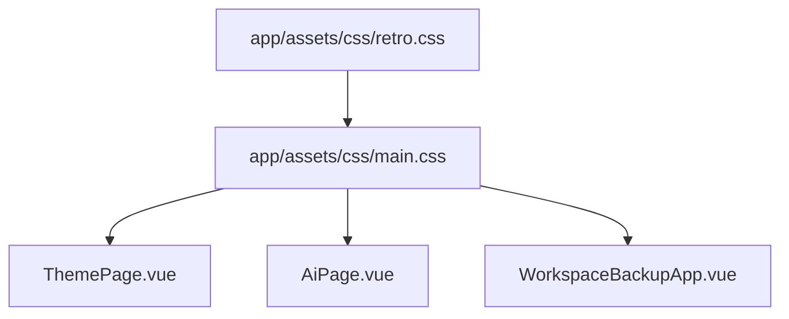

# Design: Dashboard Retro Utility Consolidation

**artifact_id:** 23df83ea-77c0-43c1-a7b3-6094e9f30a9a

## Overview

Multiple dashboard components define identical accessibility and “retro” UI styles (`.sr-only`, `.retro-chip`, `.retro-input`, `.retro-btn`, and related helpers). These scoped duplicates live in `ThemePage.vue`, `AiPage.vue`, and `WorkspaceBackupApp.vue`, leading to drift and inconsistent behavior. This design describes a shared styling module that exposes reusable classes through a single stylesheet, updates consuming components, and documents usage for future plugin authors.

## Architecture

### Component & Stylesheet Relationship



### Key Elements

-   **retro.css**: Houses the canonical definitions for `.sr-only`, `.retro-chip`, `.retro-input`, `.retro-btn`, `.retro-btn-copy`, and future retro utilities.
-   **main.css**: Imports `retro.css` once, making the classes globally available across the Nuxt app.
-   **Dashboard Components**: Remove their scoped duplicates and reference the shared classes directly. Any component-specific styling (e.g., `.section-card`, `.pattern-thumb`) remains local.
-   **Documentation**: Updated guide explaining class usage and customization guidelines for third-party dashboard plugins.

## Stylesheet Structure

```css
/* retro.css */
.sr-only {
    /* accessibility helper */
}

.retro-chip {
    /* base chip */
}
.retro-chip:hover {
    /* hover behavior */
}
.retro-chip:active {
    /* pressed behavior */
}
.retro-chip.active {
    /* active state */
}
.retro-chip:focus-visible {
    /* focus ring */
}

.retro-input {
    /* retro text input */
}
.retro-input:focus-visible {
    /* focus ring */
}
textarea.retro-input {
    /* text area adjustments */
}

.retro-btn {
    /* general retro button */
}
.retro-btn:disabled {
    /* disabled state */
}
.retro-btn:active {
    /* pressed offset */
}
.retro-btn:focus-visible {
    /* focus ring */
}

.retro-btn-copy {
    /* icon/button variant used in ThemePage */
}
.retro-btn-copy:disabled {
    /* disabled variant */
}
.retro-btn-copy:active {
    /* pressed offset */
}
.retro-btn-copy:focus-visible {
    /* focus ring */
}

@media (prefers-reduced-motion: reduce) {
    .retro-chip,
    .retro-btn,
    .retro-btn-copy,
    .retro-input {
        transition: none;
    }
}
```

## Component Updates

1. **ThemePage.vue**

    - Delete scoped definitions for `.sr-only`, `.retro-chip`, `.retro-input`, `.retro-btn`, and `.retro-btn-copy`.
    - Retain unique selectors (`.section-card`, `.pattern-thumb`, fallbacks) in a trimmed scoped block.
    - Ensure templates rely on shared classes (`class="retro-chip"`, etc.) without additional inline overrides besides necessary Tailwind utilities.

2. **AiPage.vue**

    - Remove local `.sr-only`, `.retro-chip`, `.retro-input`, `.retro-btn` definitions.
    - Keep component-specific layout styles only.

3. **WorkspaceBackupApp.vue**

    - Strip `.sr-only` duplication from scoped styles.
    - Verify other retro-like classes exist; if so, migrate them to the shared stylesheet or document why they’re unique.

4. **Search for additional duplicates**
    - Use `find`/`grep` to scan for `.sr-only`, `.retro-chip`, `.retro-input`, `.retro-btn`, `.retro-btn-copy` across `app/` after refactor to ensure no leftover definitions remain.

## Error Handling & Compatibility

-   **Tailwind compatibility**: Replace any non-standard syntax (e.g., `p-0!`) with supported variants (`!p-0`).
-   **Scoped styles**: Maintain component-specific selectors under scoped blocks to avoid leakage once retro utilities move global.
-   **Dark/light themes**: Shared utilities rely on CSS variables already defined in the app; no additional theme handling is required.

## Testing Strategy

-   **Visual regression**: Execute the existing UI regression suite (if available) or manual snapshots to confirm layout and styling remain consistent.
-   **Unit tests**: Run component tests for `ThemePage.vue` and `AiPage.vue` to ensure class bindings stay intact.
-   **Lint/format checks**: Ensure no CSS lint warnings arise from the new shared stylesheet.

## Documentation Plan

-   Update `docs/UI/dashboard-plugins.md` with a “Styling Guidelines” section that lists the available retro classes and describes when to extend them.
-   Provide examples for a simple retro button and chip using the shared classes.
