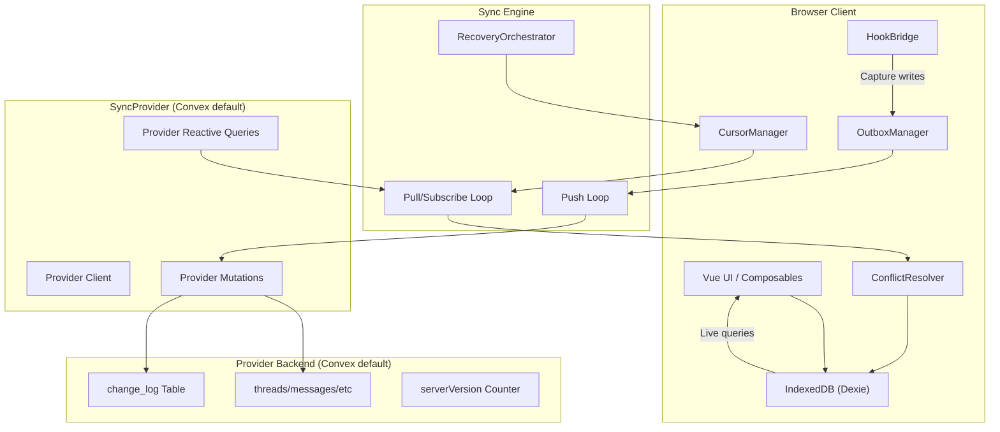

# design.md

artifact_id: e1h5i2g6-8i3d-7j7e-f2i9-6g5h7i9j0k1l
date: 2026-01-11

## Overview

This design specifies the **database synchronization layer** for OR3 Chat SSR mode. The sync layer:

- Keeps local Dexie data synchronized with a SyncProvider backend (Convex default)
- Uses a change-log with monotonic `server_version` for deterministic ordering
- Leverages provider-native reactivity for real-time updates when available (Convex default)
- Implements LWW conflict resolution using `clock` field
- Provides a provider abstraction for future backend swaps
- Stores synced records in Convex using the same snake_case wire schema as Dexie

The implementation integrates with:
- **SSR Auth System**: Workspace membership for authorization
- **Storage Layer**: References file metadata, transfers blobs separately
- **Hooks System**: Captures mutations, emits sync events

Gateway providers:
- SQL/SQLite/Postgres backends should use gateway mode with SSR endpoints.

---

## Architecture



---

## Core Components

### 1. Sync Plugin (`app/plugins/convex-sync.client.ts`)

Bootstrap sync engine on authenticated session:

```typescript
export default defineNuxtPlugin(async () => {
    // Only run on client, only when SSR auth enabled
    if (import.meta.server) return;

    const { session } = useSessionContext();
    const provider = getActiveSyncProvider();
    const tokenBroker = useAuthTokenBroker();

    watch(session, async (s) => {
        if (s?.authenticated && s.workspace) {
            const db = useWorkspaceDb(s.workspace.id); // or3-db-${workspaceId}
            if (provider.mode === 'direct' && provider.auth) {
                await tokenBroker.ensureProviderToken(provider.auth);
            }
            await syncEngine.start({
                workspaceId: s.workspace.id,
                provider,
                db,
            });
        } else {
            await syncEngine.stop();
        }
    }, { immediate: true });
});
```

### 2. SyncProvider Interface

```typescript
// app/core/sync/types.ts

export interface SyncScope {
    workspaceId: string;
    projectId?: string;
}

export interface ChangeStamp {
    deviceId: string;
    opId: string;       // UUID for idempotency
    hlc: string;        // Hybrid logical clock
    clock: number;      // Monotonic per-record revision
}

export interface PendingOp {
    id: string;
    tableName: string;
    operation: 'put' | 'delete';
    pk: string;         // Primary key
    payload?: unknown;  // Full record for put
    stamp: ChangeStamp;
    createdAt: number;
    attempts: number;
    status: 'pending' | 'syncing' | 'failed';
}

export interface SyncChange {
    serverVersion: number;
    tableName: string;
    pk: string;
    op: 'put' | 'delete';
    payload?: unknown;
    stamp: ChangeStamp;
}

export interface PullRequest {
    scope: SyncScope;
    cursor: number;     // serverVersion cursor
    limit: number;
    tables?: string[];
}

export interface PullResponse {
    changes: SyncChange[];
    nextCursor: number;
    hasMore: boolean;
}

export interface PushBatch {
    scope: SyncScope;
    ops: PendingOp[];
}

export interface PushResult {
    results: Array<{
        opId: string;
        success: boolean;
        serverVersion?: number;
        error?: string;
    }>;
    serverVersion: number;
}

export interface SyncProvider {
    id: string;
    mode: 'direct' | 'gateway';
    auth?: {
        providerId: string;
        template?: string; // JWT template name (Clerk) when direct
    };
    
    // Real-time subscription (Convex uses reactive queries)
    subscribe(
        scope: SyncScope,
        tables: string[],
        onChanges: (changes: SyncChange[]) => void
    ): Promise<() => void>;
    
    // Cursor-based pull for bootstrap/recovery
    pull(request: PullRequest): Promise<PullResponse>;
    
    // Batch push with idempotency
    push(batch: PushBatch): Promise<PushResult>;
    
    // Cleanup
    dispose(): Promise<void>;
}
```

### Data model mapping

The wire schema matches Dexie (snake_case). Mapping is only required when a backend enforces different field conventions.

Examples:
- `created_at` <-> `createdAt`
- `updated_at` <-> `updatedAt`
- `file_hashes` remains a serialized string (do not convert to arrays in transport)

### Provider modes

- **direct**: client talks to the backend directly using a provider token (JWT template), and the backend enforces workspace membership.
- **gateway**: client talks to SSR endpoints; SSR enforces `can()` and calls the backend with server credentials.

The sync engine should support both and fall back to gateway if a provider token is unavailable.

Token source:
- The sync engine obtains provider tokens via `AuthTokenBroker` (from the auth subsystem).

Cursor strategy:
- Maintain a single `server_version` cursor per workspace.
- Subscriptions should accept `cursor` and return only changes after it.
- Avoid per-table cursors when using a global change log to prevent gaps or duplication.

### 3. Example: Convex Provider Implementation

```typescript
// app/core/sync/providers/convex-sync-provider.ts

export function createConvexSyncProvider(): SyncProvider {
    const convex = useConvexClient();
    const subscriptions = new Map<string, () => void>();
    // Ensure Convex client is configured with a provider token (Clerk JWT template).
    
    return {
        id: 'convex',
        mode: 'direct',
        auth: { providerId: 'convex', template: 'convex' },
        
        async subscribe(scope, tables, onChanges) {
            // Subscribe via Convex reactive queries (exact API chosen at implementation time).
            // The provider should observe changes to the watch query results and forward
            // new change batches to onChanges.
            const unsubscribes: Array<() => void> = [];

            for (const table of tables) {
                const unsubscribe = subscribeToChanges({
                    workspaceId: scope.workspaceId,
                    tableName: table,
                    onChanges,
                });
                unsubscribes.push(unsubscribe);
            }

            return () => unsubscribes.forEach((fn) => fn());
        },
        
        async pull(request) {
            const result = await convex.query(api.sync.pull, {
                workspace_id: request.scope.workspaceId,
                cursor: request.cursor,
                limit: request.limit,
                tables: request.tables,
            });
            return result;
        },
        
        async push(batch) {
            const result = await convex.mutation(api.sync.push, {
                workspace_id: batch.scope.workspaceId,
                ops: batch.ops.map(op => ({
                    op_id: op.stamp.opId,
                    table_name: op.tableName,
                    operation: op.operation,
                    pk: op.pk,
                    payload: op.payload,
                    clock: op.stamp.clock,
                    hlc: op.stamp.hlc,
                    device_id: op.stamp.deviceId,
                })),
            });
            return result;
        },
        
        async dispose() {
            subscriptions.forEach(unsub => unsub());
            subscriptions.clear();
        },
    };
}
```

---

## Example: Convex Backend Schema

### Tables

```typescript
// convex/schema.ts

import { defineSchema, defineTable } from "convex/server";
import { v } from "convex/values";

export default defineSchema({
    // === AUTH (from auth system) ===
    users: defineTable({
        email: v.optional(v.string()),
        display_name: v.optional(v.string()),
        created_at: v.number(),
    }),
    
    authAccounts: defineTable({
        user_id: v.id("users"),
        provider: v.string(),
        provider_user_id: v.string(),
        created_at: v.number(),
    }).index("by_provider", ["provider", "provider_user_id"]),
    
    workspaces: defineTable({
        name: v.string(),
        owner_user_id: v.id("users"),
        created_at: v.number(),
    }),
    
    workspaceMembers: defineTable({
        workspace_id: v.id("workspaces"),
        user_id: v.id("users"),
        role: v.union(v.literal("owner"), v.literal("editor")),
        created_at: v.number(),
    }).index("by_workspace", ["workspace_id"])
      .index("by_user", ["user_id"]),
    
    // === CHANGE LOG (central to sync) ===
    change_log: defineTable({
        workspace_id: v.id("workspaces"),
        server_version: v.number(),      // Monotonic counter
        table_name: v.string(),
        pk: v.string(),                  // Primary key of record
        op: v.union(v.literal("put"), v.literal("delete")),
        payload: v.optional(v.any()),    // Full record for puts
        clock: v.number(),               // Record clock
        hlc: v.string(),                 // Hybrid logical clock
        device_id: v.string(),
        op_id: v.string(),               // Idempotency key
        created_at: v.number(),
    }).index("by_workspace_version", ["workspace_id", "server_version"])
      .index("by_op_id", ["op_id"]),
    
    // === SYNCED DATA TABLES ===
    threads: defineTable({
        workspace_id: v.id("workspaces"),
        id: v.string(),                  // Dexie ID
        title: v.optional(v.string()),
        status: v.string(),
        deleted: v.boolean(),
        deleted_at: v.optional(v.number()),
        pinned: v.boolean(),
        created_at: v.number(),
        updated_at: v.number(),
        last_message_at: v.optional(v.number()),
        parent_thread_id: v.optional(v.string()),
        project_id: v.optional(v.string()),
        system_prompt_id: v.optional(v.string()),
        clock: v.number(),
        anchor_message_id: v.optional(v.string()),
        anchor_index: v.optional(v.number()),
        branch_mode: v.optional(v.union(v.literal("reference"), v.literal("copy"))),
        forked: v.boolean(),
    }).index("by_workspace", ["workspace_id", "updated_at"])
      .index("by_workspace_id", ["workspace_id", "id"]),
    
    messages: defineTable({
        workspace_id: v.id("workspaces"),
        id: v.string(),
        thread_id: v.string(),
        role: v.string(),
        data: v.optional(v.any()),
        index: v.number(),
        order_key: v.string(),        // HLC-derived ordering key
        file_hashes: v.optional(v.string()),
        pending: v.optional(v.boolean()),
        deleted: v.boolean(),
        deleted_at: v.optional(v.number()),
        error: v.optional(v.string()),
        created_at: v.number(),
        updated_at: v.number(),
        clock: v.number(),
        stream_id: v.optional(v.string()),
    }).index("by_thread", ["workspace_id", "thread_id", "index", "order_key"])
      .index("by_workspace_id", ["workspace_id", "id"]),
    
    projects: defineTable({
        workspace_id: v.id("workspaces"),
        id: v.string(),
        name: v.string(),
        description: v.optional(v.string()),
        data: v.optional(v.any()),
        deleted: v.boolean(),
        deleted_at: v.optional(v.number()),
        created_at: v.number(),
        updated_at: v.number(),
        clock: v.number(),
    }).index("by_workspace", ["workspace_id", "updated_at"])
      .index("by_workspace_id", ["workspace_id", "id"]),
    
    posts: defineTable({
        workspace_id: v.id("workspaces"),
        id: v.string(),
        title: v.string(),
        content: v.string(),
        post_type: v.string(),
        meta: v.optional(v.any()),
        file_hashes: v.optional(v.string()),
        deleted: v.boolean(),
        deleted_at: v.optional(v.number()),
        created_at: v.number(),
        updated_at: v.number(),
        clock: v.number(),
    }).index("by_workspace", ["workspace_id", "updated_at"])
      .index("by_workspace_id", ["workspace_id", "id"]),
    
    file_meta: defineTable({
        workspace_id: v.id("workspaces"),
        hash: v.string(),
        name: v.string(),
        mime_type: v.string(),
        kind: v.union(v.literal("image"), v.literal("pdf")),
        size_bytes: v.number(),
        width: v.optional(v.number()),
        height: v.optional(v.number()),
        ref_count: v.number(),
        storage_id: v.optional(v.id("_storage")),
        deleted: v.boolean(),
        deleted_at: v.optional(v.number()),
        created_at: v.number(),
        updated_at: v.number(),
    }).index("by_workspace_hash", ["workspace_id", "hash"]),
    
    kv: defineTable({
        workspace_id: v.id("workspaces"),
        id: v.string(),
        name: v.string(),
        value: v.optional(v.string()),
        created_at: v.number(),
        updated_at: v.number(),
        clock: v.number(),
    }).index("by_workspace_name", ["workspace_id", "name"]),
    
    // === SERVER VERSION COUNTER ===
    server_version_counter: defineTable({
        workspace_id: v.id("workspaces"),
        value: v.number(),
    }).index("by_workspace", ["workspace_id"]),

    // === DEVICE CURSORS (for retention) ===
    device_cursors: defineTable({
        workspace_id: v.id("workspaces"),
        device_id: v.string(),
        last_seen_version: v.number(),
        updated_at: v.number(),
    }).index("by_workspace_device", ["workspace_id", "device_id"])
      .index("by_workspace_version", ["workspace_id", "last_seen_version"]),

    // === TOMBSTONES (delete tracking + retention) ===
    tombstones: defineTable({
        workspace_id: v.id("workspaces"),
        table_name: v.string(),
        pk: v.string(),
        deleted_at: v.number(),
        clock: v.number(),
        server_version: v.number(),
        created_at: v.number(),
    }).index("by_workspace_version", ["workspace_id", "server_version"])
      .index("by_workspace_table_pk", ["workspace_id", "table_name", "pk"]),
});
```

### Sync Functions

```typescript
// convex/sync.ts

import { v } from "convex/values";
import { mutation, query } from "./_generated/server";

// Get next server version (atomic increment)
async function getNextServerVersion(ctx: any, workspaceId: any): Promise<number> {
    const existing = await ctx.db
        .query("server_version_counter")
        .withIndex("by_workspace", (q: any) => q.eq("workspace_id", workspaceId))
        .first();
    
    if (existing) {
        const next = existing.value + 1;
        await ctx.db.patch(existing._id, { value: next });
        return next;
    } else {
        await ctx.db.insert("server_version_counter", {
            workspace_id: workspaceId,
            value: 1,
        });
        return 1;
    }
}

// Push batch of changes
export const push = mutation({
    args: {
        workspace_id: v.id("workspaces"),
        ops: v.array(v.object({
            op_id: v.string(),
            table_name: v.string(),
            operation: v.union(v.literal("put"), v.literal("delete")),
            pk: v.string(),
            payload: v.optional(v.any()),
            clock: v.number(),
            hlc: v.string(),
            device_id: v.string(),
        })),
    },
    handler: async (ctx, args) => {
        // Verify workspace membership
        const identity = await ctx.auth.getUserIdentity();
        if (!identity) throw new Error("Unauthorized");
        
        const results: Array<{
            opId: string;
            success: boolean;
            serverVersion?: number;
            error?: string;
        }> = [];
        
        let latestVersion = 0;
        
        for (const op of args.ops) {
            // Check for duplicate opId (idempotency)
            const existing = await ctx.db
                .query("change_log")
                .withIndex("by_op_id", (q) => q.eq("op_id", op.op_id))
                .first();
            
            if (existing) {
                results.push({
                    opId: op.op_id,
                    success: true,
                    serverVersion: existing.server_version,
                });
                continue;
            }
            
            try {
                // Get next server version
                const serverVersion = await getNextServerVersion(
                    ctx,
                    args.workspace_id
                );
                latestVersion = serverVersion;
                
                // Apply to data table
                await applyOpToTable(ctx, args.workspace_id, op);
                
                // Write to change log
                await ctx.db.insert("change_log", {
                    workspace_id: args.workspace_id,
                    server_version: serverVersion,
                    table_name: op.table_name,
                    pk: op.pk,
                    op: op.operation,
                    payload: op.payload,
                    clock: op.clock,
                    hlc: op.hlc,
                    device_id: op.device_id,
                    op_id: op.op_id,
                    created_at: Date.now(),
                });
                
                results.push({ opId: op.op_id, success: true, serverVersion });
            } catch (error) {
                results.push({
                    opId: op.op_id,
                    success: false,
                    error: String(error),
                });
            }
        }
        
        return { results, serverVersion: latestVersion };
    },
});

// Pull changes since cursor
export const pull = query({
    args: {
        workspace_id: v.id("workspaces"),
        cursor: v.number(),
        limit: v.number(),
        tables: v.optional(v.array(v.string())),
    },
    handler: async (ctx, args) => {
        let query = ctx.db
            .query("change_log")
            .withIndex("by_workspace_version", (q) =>
                q.eq("workspace_id", args.workspace_id).gt("server_version", args.cursor)
            )
            .order("asc")
            .take(args.limit + 1);
        
        const results = await query;
        const hasMore = results.length > args.limit;
        const changes = hasMore ? results.slice(0, -1) : results;
        
        const nextCursor = changes.length > 0
            ? changes[changes.length - 1].server_version
            : args.cursor;
        
        return {
            changes: changes.map(c => ({
                serverVersion: c.server_version,
                tableName: c.table_name,
                pk: c.pk,
                op: c.op,
                payload: c.payload,
                stamp: {
                    clock: c.clock,
                    hlc: c.hlc,
                    deviceId: c.device_id,
                    opId: c.op_id,
                },
            })),
            nextCursor,
            hasMore,
        };
    },
});

// Watch for changes (reactive query for subscriptions)
export const watchChanges = query({
    args: {
        workspace_id: v.id("workspaces"),
        table: v.string(),
        cursor: v.optional(v.number()),
    },
    handler: async (ctx, args) => {
        const since = args.cursor ?? 0;
        
        const changes = await ctx.db
            .query("change_log")
            .withIndex("by_workspace_version", (q) =>
                q.eq("workspace_id", args.workspace_id).gt("server_version", since)
            )
            .filter((q) => q.eq(q.field("table_name"), args.table))
            .order("asc")
            .take(100);
        
        return changes.map(c => ({
            serverVersion: c.server_version,
            tableName: c.table_name,
            pk: c.pk,
            op: c.op,
            payload: c.payload,
            stamp: {
                clock: c.clock,
                hlc: c.hlc,
                deviceId: c.device_id,
                opId: c.op_id,
            },
        }));
    },
});

// Helper to apply op to the appropriate table
async function applyOpToTable(ctx: any, workspaceId: any, op: any) {
    const tableMap: Record<string, string> = {
        threads: "threads",
        messages: "messages",
        projects: "projects",
        posts: "posts",
        file_meta: "file_meta",
        kv: "kv",
    };
    
    const tableName = tableMap[op.table_name];
    if (!tableName) return;
    
    if (op.operation === "delete") {
        // Find and soft-delete
        const existing = await ctx.db
            .query(tableName)
            .withIndex(
                tableName === "file_meta" ? "by_workspace_hash" : "by_workspace_id",
                (q: any) =>
                    tableName === "file_meta"
                        ? q.eq("workspace_id", workspaceId).eq("hash", op.pk)
                        : q.eq("workspace_id", workspaceId).eq("id", op.pk)
            )
            .first();
        
        if (existing) {
            await ctx.db.patch(existing._id, {
                deleted: true,
                deleted_at: Date.now(),
            });
        }
    } else {
        // Upsert
        const existing = await ctx.db
            .query(tableName)
            .withIndex(
                tableName === "file_meta" ? "by_workspace_hash" : "by_workspace_id",
                (q: any) =>
                    tableName === "file_meta"
                        ? q.eq("workspace_id", workspaceId).eq("hash", op.pk)
                        : q.eq("workspace_id", workspaceId).eq("id", op.pk)
            )
            .first();
        
        if (existing) {
            // LWW: only update if incoming clock >= existing
            if (op.clock >= (existing.clock ?? 0)) {
                await ctx.db.patch(existing._id, {
                    ...op.payload,
                    clock: op.clock,
                    updated_at: Date.now(),
                });
            }
        } else {
            await ctx.db.insert(tableName, {
                ...op.payload,
                workspace_id: workspaceId,
                id: op.pk,
                clock: op.clock,
                created_at: Date.now(),
                updated_at: Date.now(),
            });
        }
    }
}
```

---

## Client-Side Components

### Dexie Tables for Sync

```typescript
// Add to client.ts

export class Or3DB extends Dexie {
    // ... existing tables ...
    
    // Sync-specific tables
    pending_ops!: Table<PendingOp, string>;
    tombstones!: Table<Tombstone, string>;
    sync_state!: Table<SyncState, string>;
    sync_runs!: Table<SyncRun, string>;
    
    constructor() {
        super('or3-db');
        
        this.version(7).stores({
            // ... existing ...
            pending_ops: 'id, tableName, status, createdAt',
            tombstones: 'id, tableName, pk, deletedAt',
            sync_state: 'id, tableName',
            sync_runs: 'id, startedAt',
        });
    }
}
```

Note:
- In SSR mode, instantiate `Or3DB` per workspace (`or3-db-${workspaceId}`) and pass the instance into the sync engine.
- Add `order_key` to `messages` and include it in the compound index (`[thread_id+index+order_key]`) for deterministic ordering.

### Change log retention

To bound `change_log` growth, track the minimum `server_version` seen by active devices:

- Each device periodically updates `device_cursors.last_seen_version`.
- A backend GC job can delete `change_log` entries below the minimum cursor, subject to a retention window.

### HookBridge (Capture Mutations)

Capture must be atomic and must not loop on remote-applied writes. The capture layer should use Dexie table hooks so the outbox write runs inside the same transaction as the original write, and it should be suppressed when applying remote changes.

If a message payload is missing `order_key`, derive it from the same HLC used for the PendingOp to keep ordering deterministic.

```typescript
// app/core/sync/hook-bridge.ts

export class HookBridge {
    private deviceId: string;
    private captureEnabled = true;

    constructor(private db: Or3DB) {
        this.deviceId = this.getOrCreateDeviceId();
    }

    start() {
        const tables = ['threads', 'messages', 'projects', 'posts', 'kv', 'file_meta'];

        for (const tableName of tables) {
            this.db.table(tableName).hook('creating', (pk, obj, tx) => {
                if (!this.captureEnabled) return;
                this.enqueueOp(tx, tableName, 'put', pk, obj);
            });
            this.db.table(tableName).hook('updating', (mods, pk, obj, tx) => {
                if (!this.captureEnabled) return;
                const merged = { ...obj, ...mods };
                this.enqueueOp(tx, tableName, 'put', pk, merged);
            });
            this.db.table(tableName).hook('deleting', (pk, obj, tx) => {
                if (!this.captureEnabled) return;
                this.enqueueOp(tx, tableName, 'delete', pk, obj);
            });
        }
    }

    withRemoteSuppression<T>(fn: () => Promise<T>): Promise<T> {
        this.captureEnabled = false;
        return fn().finally(() => {
            this.captureEnabled = true;
        });
    }

    private enqueueOp(tx: Dexie.Transaction, tableName: string, operation: 'put' | 'delete', pk: string, payload: unknown) {
        const op: PendingOp = {
            id: crypto.randomUUID(),
            tableName,
            operation,
            pk,
            payload: operation === 'put' ? payload : undefined,
            stamp: {
                deviceId: this.deviceId,
                opId: crypto.randomUUID(),
                hlc: this.generateHLC(),
                clock: (payload as any)?.clock ?? 0,
            },
            createdAt: Date.now(),
            attempts: 0,
            status: 'pending',
        };

        tx.table('pending_ops').add(op);
        useHooks().doAction('sync.op:action:captured', { op });
    }
}
```

### OutboxManager (Push Loop)

```typescript
// app/core/sync/outbox-manager.ts

export class OutboxManager {
    private provider: SyncProvider;
    private scope: SyncScope;
    private flushInterval: number | null = null;
    private maxBatchSize = 50;
    private retryDelays = [250, 1000, 3000, 5000];
    
    constructor(provider: SyncProvider, scope: SyncScope) {
        this.provider = provider;
        this.scope = scope;
    }
    
    start() {
        this.flushInterval = window.setInterval(() => this.flush(), 1000);
        this.flush(); // Initial flush
    }
    
    stop() {
        if (this.flushInterval) {
            clearInterval(this.flushInterval);
            this.flushInterval = null;
        }
    }
    
    async flush() {
        const pendingOps = await db.pending_ops
            .where('status')
            .equals('pending')
            .sortBy('createdAt');

        if (!pendingOps.length) return;

        const batch = coalesceOps(pendingOps).slice(0, this.maxBatchSize);
        
        // Mark as syncing
        await db.pending_ops.bulkPut(
            batch.map(op => ({ ...op, status: 'syncing' as const }))
        );
        
        try {
            const result = await this.provider.push({
                scope: this.scope,
                ops: batch,
            });
            
            // Process results
            for (const res of result.results) {
                const op = batch.find(o => o.stamp.opId === res.opId);
                if (!op) continue;
                
                if (res.success) {
                    await db.pending_ops.delete(op.id);
                } else {
                    // Retry logic
                    const attempts = op.attempts + 1;
                    if (attempts >= this.retryDelays.length) {
                        await db.pending_ops.put({
                            ...op,
                            status: 'failed',
                            attempts,
                        });
                        useHooks().doAction('sync.error:action', {
                            op,
                            error: res.error,
                        });
                    } else {
                        await db.pending_ops.put({
                            ...op,
                            status: 'pending',
                            attempts,
                        });
                        useHooks().doAction('sync.retry:action', {
                            op,
                            attempt: attempts,
                        });
                    }
                }
            }
        } catch (error) {
            // Network error - revert to pending
            await db.pending_ops.bulkPut(
                batch.map(op => ({ ...op, status: 'pending' as const }))
            );
        }
    }
}
```

Outbox coalescing (required):
- Combine multiple pending ops for the same `{ tableName, pk }` to the latest operation before push.
- Emit `sync.queue:action:full` if pending ops exceed the configured max.

### ConflictResolver (Apply Remote Changes)

```typescript
// app/core/sync/conflict-resolver.ts

export class ConflictResolver {
    async apply(change: SyncChange): Promise<void> {
        const { tableName, pk, op, payload, stamp } = change;
        
        // Get local record
        const table = db.table(tableName);
        const local = await table.get(pk);
        
        if (op === 'delete') {
            if (local && !local.deleted) {
                // Apply tombstone
                await table.put({
                    ...local,
                    deleted: true,
                    deletedAt: Date.now(),
                });
            }
            return;
        }
        
        // Put operation - check for conflict
        if (local) {
            const localClock = local.clock ?? 0;
            const remoteClock = stamp.clock;
            
            if (remoteClock > localClock) {
                // Remote wins
                await table.put({ ...payload, id: pk });
            } else if (remoteClock === localClock) {
                // Tie-break on HLC/opId (requires storing or deriving local stamp)
                if (shouldAcceptRemote(stamp, local)) {
                    await table.put({ ...payload, id: pk });
                }
                // Emit conflict for observability
                useHooks().doAction('sync.conflict:action:detected', {
                    tableName,
                    pk,
                    local,
                    remote: payload,
                    winner: 'remote',
                });
            }
            // else: local wins, no-op
        } else {
            // New record
            await table.put({ ...payload, id: pk });
        }
    }
}
```

Message ordering note:
- When multiple devices insert messages at the same index, stabilize ordering using a stored `order_key` derived from the operation HLC and include it in sync payloads.

---

## Hook Integration

Add to `CoreHookPayloadMap`:

```typescript
// Sync lifecycle hooks
'sync.op:action:captured': [{ op: PendingOp }];
'sync.push:action:before': [{ scope: SyncScope; count: number }];
'sync.push:action:after': [{ scope: SyncScope; successCount: number; failCount: number }];
'sync.pull:action:after': [{ scope: SyncScope; count: number; cursor: number }];
'sync.conflict:action:detected': [{ tableName: string; pk: string; local: unknown; remote: unknown; winner: 'local' | 'remote' }];
'sync.error:action': [{ op: PendingOp; error: unknown }];
'sync.retry:action': [{ op: PendingOp; attempt: number }];
'sync.queue:action:full': [{ pendingCount: number; maxSize: number }];
'sync.rescan:action:starting': [{ scope: SyncScope }];
'sync.rescan:action:progress': [{ scope: SyncScope; progress: number }];
'sync.rescan:action:completed': [{ scope: SyncScope }];
'sync.stats:action': [{ pendingCount: number; cursor: number; lastSyncAt: number }];
```

---

## Testing Strategy

### Unit Tests

1. **ChangeStamp generation**: Verify HLC format, clock increment
2. **Conflict resolution**: LWW matrix testing
3. **Outbox coalescing**: Multiple updates to same record
4. **Retry backoff**: Verify exponential delays

### Integration Tests

1. **Push flow**: Capture → outbox → provider → ack → remove
2. **Pull flow**: Subscribe → receive → resolve → apply
3. **Conflict scenario**: Simulate two devices writing same record
4. **Offline recovery**: Queue ops offline, flush on reconnect

### E2E Tests

1. **Multi-device sync**: Create on device A, appears on device B
2. **Offline mode**: Edit while offline, sync when back online
3. **Rescan recovery**: Simulate cursor expiry, verify full rescan works

---

## Integration Points

### With Auth System

- Sync engine starts only when authenticated
- All operations scoped by `session.workspace.id`
- Direct providers verify workspace membership for client calls
- Gateway providers use SSR endpoints that enforce `can()` before calling backends
- Workspace membership is sourced from `AuthWorkspaceStore` (same backend as the SyncProvider)

### With Storage Layer

- `file_meta` syncs as metadata only
- `file_hashes` field in messages syncs (just references)
- Blob transfers handled separately by FileTransferQueue
- Storage provider uses same Convex backend

### With Hooks System

- HookBridge captures DB writes via existing hooks
- Sync events emitted for observability
- Plugins can react to `sync.*` hooks
